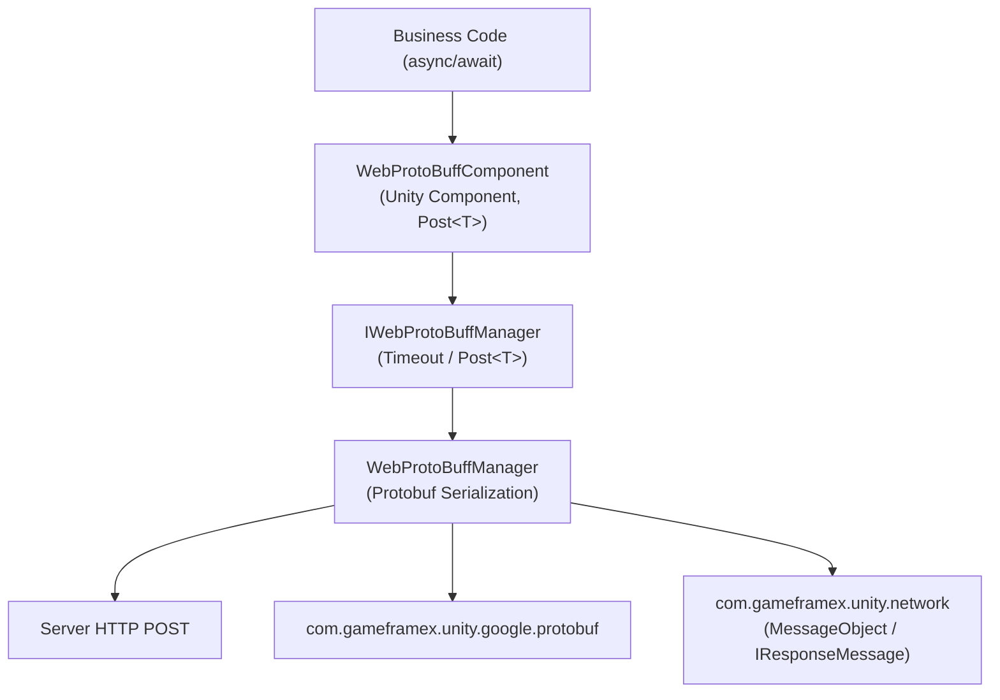

# Web ProtoBuff Component Introduction: What It Can Do for You

Web ProtoBuff is GameFrameX's HTTP Protobuf request component: it lets you send Protocol Buffer messages to a server via HTTP POST with a single line of `await`, and deserializes the response directly into the specified type `T` (which inherits from `MessageObject` and implements `IResponseMessage`). It is built on the `Task<T>` async API, supports custom timeouts, and is compatible with Unity WebGL and other native platforms.

## Quick Start

1. **Install the package**. Edit the Unity project's `Packages/manifest.json`, add `scopedRegistries` and declare the dependency:

   ```json
   {
     "scopedRegistries": [
       {
         "name": "GameFrameX",
         "url": "https://gameframex.upm.alianblank.uk",
         "scopes": [
           "com.gameframex"
         ]
       }
     ],
     "dependencies": {
       "com.gameframex.unity.web.protobuff": "1.1.3"
     }
   }
   ```

   Source: [README.zh-CN.md](https://github.com/GameFrameX/com.gameframex.unity.web.protobuff/blob/main/README.zh-CN.md#L47-L63)

   Alternatively, you can use the Git URL approach: `"com.gameframex.unity.web.protobuff": "https://github.com/gameframex/com.gameframex.unity.web.protobuff.git"`, or add it via Git URL in the Package Manager.

2. **Add the define symbol**. In Unity's **Player Settings** → **Scripting Define Symbols**, add:

   `ENABLE_GAME_FRAME_X_WEB_PROTOBUF_NETWORK`

   When this define is not enabled, the `Post<T>`-related APIs will not be compiled into the project.

3. **Attach the component and call it**. Add the **GameFrameX/Web ProtoBuff** component (`WebProtoBuffComponent`, default timeout of 5 seconds) to the GameFramework object in your scene, then send a request:

   ```csharp
   using GameFrameX.Web.ProtoBuff.Runtime;

   // Send the request and wait for the result
   LoginResponse response = await WebComponent.Post<LoginResponse>(url, request);
   ```

   Source: [README.zh-CN.md](https://github.com/GameFrameX/com.gameframex.unity.web.protobuff/blob/main/README.zh-CN.md#L108-L113)

## Core API

The request entry points and manager interface exposed by the component are as follows:

```csharp
public Task<T> Post<T>(string url, GameFrameX.Network.Runtime.MessageObject message)
    where T : GameFrameX.Network.Runtime.MessageObject, GameFrameX.Network.Runtime.IResponseMessage
```

Source: [WebProtoBuffComponent.cs](https://github.com/GameFrameX/com.gameframex.unity.web.protobuff/blob/main/Runtime/Web/WebProtoBuffComponent.cs#L105-L108)

| Name | Signature/Type | Description |
|------|-----------|------|
| `Post<T>` | `Task<T> Post<T>(string url, MessageObject message)` | Sends a Protobuf POST request and parses the response as `T`; `T` must inherit from `MessageObject` and implement `IResponseMessage`; only available when the `ENABLE_GAME_FRAME_X_WEB_PROTOBUF_NETWORK` define is set |
| `Timeout` | `float { get; set; }` | Timeout for POST requests in seconds; defaults to 5 seconds and can be configured in the Inspector |
| `WebProtoBuffComponent` | Unity component | Component menu `GameFrameX/Web ProtoBuff`; only one instance allowed per object; requires `GameFrameXWebProtoBuffCroppingHelper` |
| `IWebProtoBuffManager` | Interface | Manager interface; `WebProtoBuffComponent` internally obtains the implementation via `GameFrameworkEntry.GetModule<IWebProtoBuffManager>()` |

Source: [IWebProtoBuffManager.cs](https://github.com/GameFrameX/com.gameframex.unity.web.protobuff/blob/main/Runtime/Web/IWebProtoBuffManager.cs#L9-L29)

It has two runtime dependencies, which are resolved automatically by UPM during installation:

| Dependency Package | Version |
|--------|------|
| `com.gameframex.unity.network` | 2.6.10 |
| `com.gameframex.unity.google.protobuf` | 3.4.2 |

Source: [package.json](https://github.com/GameFrameX/com.gameframex.unity.web.protobuff/blob/main/package.json#L25-L26)

## How It Works at a Glance

The call chain is simple: you call `Post<T>` on the component, the component hands the request to the manager, and the manager handles Protobuf serialization/deserialization and the HTTP transmission.



## Common Errors

- **`Post<T>` does not exist / compilation error**: `ENABLE_GAME_FRAME_X_WEB_PROTOBUF_NETWORK` was not added to the Scripting Define Symbols. This API is controlled by the `#if ENABLE_GAME_FRAME_X_WEB_PROTOBUF_NETWORK` conditional compilation directive.
- **Generic constraint not satisfied**: `T` must both inherit from `MessageObject` and implement `IResponseMessage`, and the request message parameter must inherit from `MessageObject`.
- **Request hangs with no response for a long time**: Check the timeout value on the component's Inspector (in seconds, default 5), or adjust it via the `Timeout` property.

## Next Steps

- Official documentation: https://gameframex.doc.alianblank.com
- For specific usage of sending requests and handling responses, see the Tasks page on this site
- For version history, see [CHANGELOG.md](https://github.com/GameFrameX/com.gameframex.unity.web.protobuff/blob/main/CHANGELOG.md)
- Multilingual README: [Simplified Chinese](https://github.com/GameFrameX/com.gameframex.unity.web.protobuff/blob/main/README.zh-CN.md) · [English](https://github.com/GameFrameX/com.gameframex.unity.web.protobuff/blob/main/README.md)