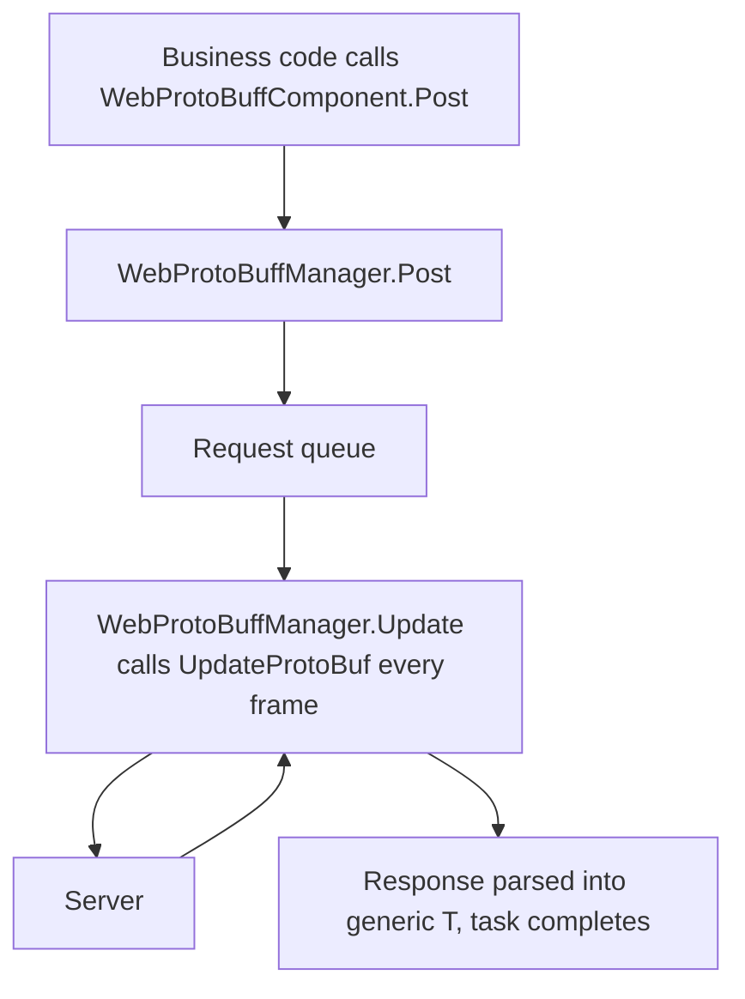

# How It Works: Component, Manager, and Request Pipeline

This page explains how `WebProtoBuffComponent` (the Unity component entry point) and `WebProtoBuffManager` (the framework module) work together to complete a Protobuf HTTP request: in `Awake`, the component retrieves the `IWebProtoBuffManager` module from `GameFrameworkEntry` and synchronizes the timeout configuration; after business code calls `Post<T>`, the manager handles the request queue and advances it in the per-frame `Update` until the response is parsed into the generic type `T`.

## Component and Manager: Responsibilities at a Glance

| Type | Role | Key Members/Notes |
|------|------|---------------|
| `WebProtoBuffComponent` | Unity scene entry component (MonoBehaviour) | `Post<T>(url, message)`, `Timeout`; attach menu `GameFrameX/Web ProtoBuff`, automatically depends on `GameFrameXWebProtoBuffCroppingHelper` |
| `IWebProtoBuffManager` | Manager interface | `Task<T> Post<T>(string url, MessageObject message)` (requires the macro `ENABLE_GAME_FRAME_X_WEB_PROTOBUF_NETWORK`), `float Timeout { get; set; }` |
| `WebProtoBuffManager` | Framework module implementation (partial class) | Sets `MaxConnectionPerServer = 8` and `Timeout = 5f` in the constructor; the per-frame `Update` calls `UpdateProtoBuf` to process the request queue; `Shutdown` calls `ShutdownProtoBuf` |

`WebProtoBuffManager` is a partial class; Protobuf-related implementations such as `UpdateProtoBuf` / `ShutdownProtoBuf` are spread across the partial files [WebProtoBuffManager.ProtoBuf.cs](https://github.com/GameFrameX/com.gameframex.unity.web.protobuff/blob/main/Runtime/Web/WebProtoBuffManager.ProtoBuf.cs) and [WebProtoBuffManager.WebProtoBufData.cs](https://github.com/GameFrameX/com.gameframex.unity.web.protobuff/blob/main/Runtime/Web/WebProtoBuffManager.WebProtoBufData.cs).

## Request Pipeline



Breakdown in execution order:

1. **Business layer calls the component**: `WebProtoBuffComponent.Post<T>(url, message)` simply forwards the parameters to `m_WebProtoBuffManager.Post<T>(url, message)`; the component itself performs no network handling. Like the interface method, this method is only compiled when the `ENABLE_GAME_FRAME_X_WEB_PROTOBUF_NETWORK` macro is defined.
2. **Manager receives the request**: `WebProtoBuffManager` implements `IWebProtoBuffManager.Post<T>`; per the interface documentation, the request message body is provided by the `message` parameter, and the response is parsed into the specified generic type `T` (constrained to `MessageObject` and implementing `IResponseMessage`).
3. **Per-frame queue driving**: The framework module's `Update(elapseSeconds, realElapseSeconds)` calls `UpdateProtoBuf` under the protection of `lock (m_StringBuilder)`; the comment explicitly states its responsibility is to "update the request processing queue".
4. **Timeout control**: When `Timeout` (in seconds) is assigned, it synchronously converts to `RequestTimeout = TimeSpan.FromSeconds(value)`, and the timeout takes effect immediately.
5. **Shutdown cleanup**: `Shutdown()` calls `ShutdownProtoBuf()` to clean up resources.

## Initialization and Lifecycle

Key actions in the component's `Awake` (read directly from the source code):

```csharp
protected override void Awake()
{
    ImplementationComponentType = Utility.Assembly.GetType(componentType);
    InterfaceComponentType = typeof(IWebProtoBuffManager);
    base.Awake();
    m_WebProtoBuffManager = GameFrameworkEntry.GetModule<IWebProtoBuffManager>();
    if (m_WebProtoBuffManager == null)
    {
        Log.Fatal("Web manager is invalid.");
        return;
    }

    m_WebProtoBuffManager.Timeout = m_Timeout;
}
```

Source: [WebProtoBuffComponent.cs](https://github.com/GameFrameX/com.gameframex.unity.web.protobuff/blob/main/Runtime/Web/WebProtoBuffComponent.cs#L77-L90)

Key points:

- The manager instance is not created by the component itself but obtained via `GameFrameworkEntry.GetModule<IWebProtoBuffManager>()`; if it cannot be retrieved, it calls `Log.Fatal("Web manager is invalid.")` and returns.
- The `m_Timeout` configured in the Inspector (default `5f`, tooltip "Timeout. Unit: seconds") is synchronized to the manager at the end of `Awake`.
- The component carries `[RequireComponent(typeof(GameFrameXWebProtoBuffCroppingHelper))]`, so the cropping helper component is added automatically when it is attached; it is also `[DisallowMultipleComponent]`, so only one can exist on the same GameObject.

## Interface Contract Quick Reference

| Member | Signature | Description |
|------|------|------|
| `Post<T>` | `Task<T> Post<T>(string url, GameFrameX.Network.Runtime.MessageObject message) where T : MessageObject, IResponseMessage` | Sends a POST request with a Protobuf message; the response is parsed into `T`; only available under the `ENABLE_GAME_FRAME_X_WEB_PROTOBUF_NETWORK` macro |
| `Timeout` | `float Timeout { get; set; }` | POST request timeout (in seconds); the component defaults to `5f` |

Original interface text, see [IWebProtoBuffManager.cs](https://github.com/GameFrameX/com.gameframex.unity.web.protobuff/blob/main/Runtime/Web/IWebProtoBuffManager.cs#L9-L29):

```csharp
public interface IWebProtoBuffManager
{
#if ENABLE_GAME_FRAME_X_WEB_PROTOBUF_NETWORK
    Task<T> Post<T>(string url, GameFrameX.Network.Runtime.MessageObject message) where T : GameFrameX.Network.Runtime.MessageObject, GameFrameX.Network.Runtime.IResponseMessage;
#endif
    float Timeout { get; set; }
}
```

Source: [IWebProtoBuffManager.cs](https://github.com/GameFrameX/com.gameframex.unity.web.protobuff/blob/main/Runtime/Web/IWebProtoBuffManager.cs#L9-L29)

`WebProtoBuffManager`'s own public configuration options:

| Member | Type/Default | Description |
|------|-------------|------|
| `MaxConnectionPerServer` | `int`, set to `8` in the constructor | Maximum number of connections per server |
| `RequestTimeout` | `TimeSpan` | Request timeout, converted from `Timeout` (in seconds) |

```csharp
public WebProtoBuffManager()
{
    MaxConnectionPerServer = 8;
    Timeout = 5f;
}
```

Source: [WebProtoBuffManager.cs](https://github.com/GameFrameX/com.gameframex.unity.web.protobuff/blob/main/Runtime/Web/WebProtoBuffManager.cs#L26-L31)

## Background

- **Component/module separation**: `WebProtoBuffComponent` only handles parameter forwarding and Inspector serialization (the timeout value); the actual queue driving happens in `WebProtoBuffManager.Update` — this is why requests can be advanced frame by frame in Unity's main loop while the business side receives an asynchronous `Task<T>` result.
- **URL assembly**: `UrlHandler(string url, Dictionary<string, string> queryString)` is responsible for appending the query parameter dictionary to the URL, with keys and values escaped via `Uri.EscapeDataString`; it reuses a single `StringBuilder(256)` to reduce GC.
- No further details of the partial implementations of `UpdateProtoBuf` / `ShutdownProtoBuf` were found in the source code (due to read budget limits and the partial files not being expanded); if needed, view [WebProtoBuffManager.ProtoBuf.cs](https://github.com/GameFrameX/com.gameframex.unity.web.protobuff/blob/main/Runtime/Web/WebProtoBuffManager.ProtoBuf.cs) directly.

## Related Links

- [WebProtoBuffComponent.cs](https://github.com/GameFrameX/com.gameframex.unity.web.protobuff/blob/main/Runtime/Web/WebProtoBuffComponent.cs) — Unity component entry point; `Awake` initialization and `Post<T>` forwarding
- [IWebProtoBuffManager.cs](https://github.com/GameFrameX/com.gameframex.unity.web.protobuff/blob/main/Runtime/Web/IWebProtoBuffManager.cs) — Manager interface contract
- [WebProtoBuffManager.cs](https://github.com/GameFrameX/com.gameframex.unity.web.protobuff/blob/main/Runtime/Web/WebProtoBuffManager.cs) — Main manager partial: timeout, per-frame `Update`, URL normalization
- [WebProtoBuffManager.ProtoBuf.cs](https://github.com/GameFrameX/com.gameframex.unity.web.protobuff/blob/main/Runtime/Web/WebProtoBuffManager.ProtoBuf.cs) — Partial implementing the Protobuf request queue
- [WebProtoBuffManager.WebProtoBufData.cs](https://github.com/GameFrameX/com.gameframex.unity.web.protobuff/blob/main/Runtime/Web/WebProtoBuffManager.WebProtoBufData.cs) — Partial containing request/response data structures
- [GameFrameXWebProtoBuffCroppingHelper.cs](https://github.com/GameFrameX/com.gameframex.unity.web.protobuff/blob/main/Runtime/GameFrameXWebProtoBuffCroppingHelper.cs) — Cropping helper class automatically required by the component
- Official documentation: https://gameframex.doc.alianblank.com/