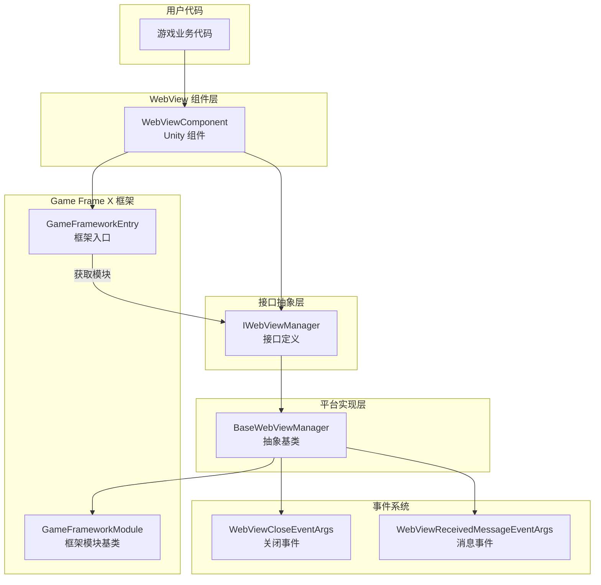
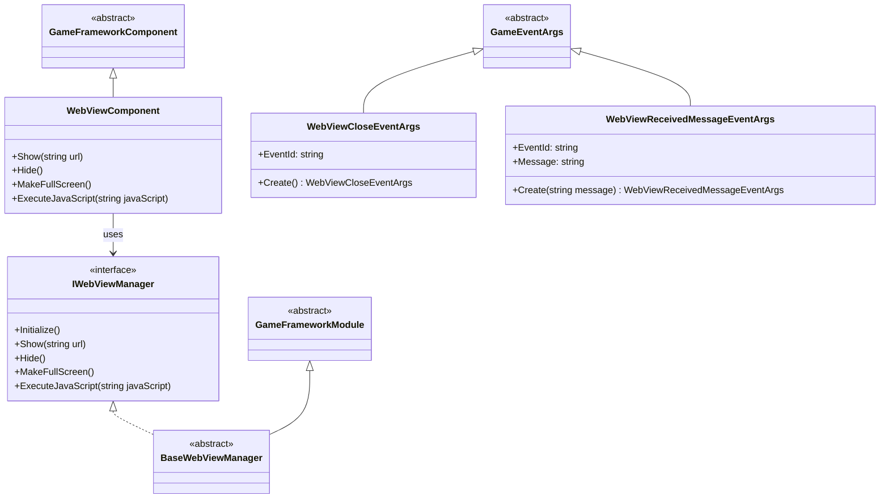
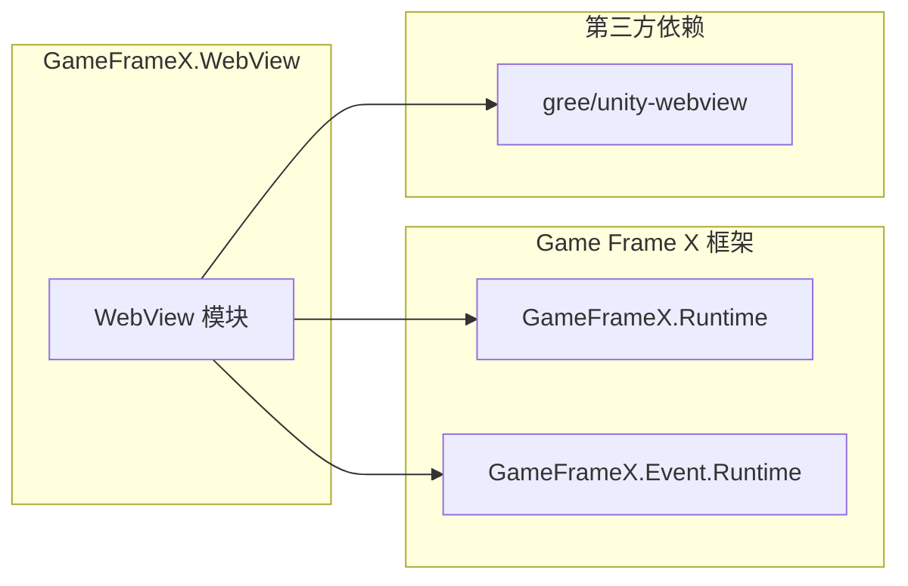

# 概述

`Game Frame X Web View` 是 Game Frame X 游戏框架的 WebView 组件，为 Unity 游戏提供嵌入式网页显示功能。该组件基于 [gree/unity-webview](https://github.com/gree/unity-webview) 进行封装，提供了更简洁的 API 和更便捷的集成方式。

## 项目简介

GameFrameX WebView 是 Game Frame X 游戏框架生态的一部分，专门用于解决 Unity 游戏内嵌入网页内容的需求。通过该组件，开发者可以：

- 在 Unity 游戏中显示外部网页内容
- 实现 C# 与 JavaScript 的双向通信
- 支持 Android 和 iOS 主流移动平台
- 与 Game Frame X 框架其他模块无缝集成

## 核心功能

| 功能 | 说明 |
|------|------|
| 网页显示 | 在 Unity 场景中嵌入并显示 Web 页面 |
| JavaScript 交互 | 支持 C# 与网页 JavaScript 代码双向调用 |
| 全屏显示 | 提供全屏模式支持 |
| 平台适配 | 自动适配 Android 和 iOS 平台 |
| 事件系统 | 提供 WebView 关闭和消息接收事件 |

## 系统架构

### 架构说明

1. **WebViewComponent**: Unity 组件层，提供面向用户的 API。开发者通过挂载此组件到 GameObject 上来使用 WebView 功能。

2. **IWebViewManager**: 接口层，定义了 WebView 管理器的标准操作，包括初始化、显示、隐藏、全屏和 JavaScript 执行等方法。

3. **BaseWebViewManager**: 抽象基类，继承自 GameFrameworkModule，提供平台相关的具体实现模板。平台实现类（如 AndroidWebViewManager、iOSWebViewManager）继承此类。

4. **GameFrameworkModule**: Game Frame X 框架的模块基类，提供模块生命周期管理和框架集成能力。

5. **事件系统**: 通过 GameFrameX 的事件系统分发 WebView 相关事件，包括关闭事件和消息接收事件。

## 模块设计

## 平台支持

| 平台 | 支持状态 | 说明 |
|------|----------|------|
| Android | ✅ 支持 | 通过 unity-webview Android 插件实现 |
| iOS | ✅ 支持 | 通过 unity-webview iOS 插件实现 |
| Windows | ⚠️ 基础支持 | 仅编辑器环境支持 |
| macOS | ⚠️ 基础支持 | 仅编辑器环境支持 |
| WebGL | ❌ 不支持 | WebGL 平台无法嵌套 WebView |

## 依赖关系

根据 `package.json` 的配置，本模块依赖以下组件：

- **GameFrameX.Runtime** (`com.gameframex.unity: 1.0.0`): 框架核心运行时
- **GameFrameX.Event.Runtime**: 框架事件系统
- **gree/unity-webview**: 底层 WebView 实现（需单独安装）

## 使用场景

GameFrameX WebView 适用于以下场景：

1. **游戏内公告**: 使用 WebView 显示游戏公告、活动页面
2. **登录验证**: 集成第三方登录或 SDK 的 Web 页面
3. **商店展示**: 在游戏内展示虚拟商品商店
4. **帮助文档**: 显示游戏帮助或教程网页
5. **社区功能**: 集成论坛或社区页面
6. **广告展示**: 显示 Web 形式的广告内容

## 相关链接

- [安装指南](./2-installation) - 详细安装步骤
- [快速入门](./3-getting-started) - 快速上手教程
- [API 参考](./4-api-reference) - 完整 API 文档
- [平台配置](./5-platforms) - Android 和 iOS 平台配置
- [事件系统](./6-events) - 事件系统详解
- [常见问题](./7-troubleshooting) - 常见问题解答
- [Game Frame X 官网](https://gameframex.doc.alianblank.com)
- [gree/unity-webview](https://github.com/gree/unity-webview)
