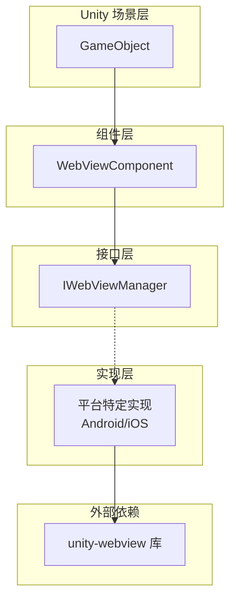
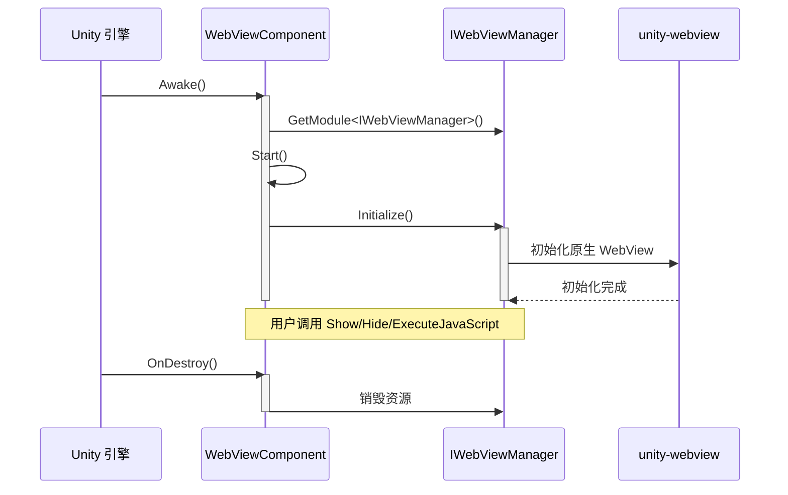

# 快速入门

本指南将帮助您快速上手 Game Frame X Web View 组件，了解如何在 Unity 项目中集成和使用 WebView 功能。

## 概述

Game Frame X Web View 是对 [gree/unity-webview](https://github.com/gree/unity-webview) 的封装，提供了更简洁的 API 和更方便的集成方式。通过本组件，您可以在 Unity 游戏中轻松嵌入 Web 页面，并实现 C# 与 JavaScript 的双向通信。

## 核心概念

在开始之前，了解以下核心组件的角色非常重要：



- **WebViewComponent**: Unity 组件，需要挂载到场景中的 GameObject 上
- **IWebViewManager**: 定义 WebView 操作的统一接口
- **平台实现**: 根据运行平台自动选择合适的实现（Android/iOS）

## 基本使用流程

### 步骤 1: 在场景中添加 WebView 组件

1. 在 Unity 编辑器中，打开您的场景
2. 创建一个新的空 GameObject（右键 → Create Empty）
3. 选中该 GameObject，点击 Inspector 面板的 "Add Component"
4. 搜索并添加 "WebView" 组件

```csharp
// 组件路径: Game Framework → WebView
// Source: [WebViewComponent.cs](https://github.com/GameFrameX/com.gameframex.unity.webview/blob/main/Runtime/WebViewComponent.cs#L10-L14)
[DisallowMultipleComponent]
[AddComponentMenu("Game Framework/WebView")]
[UnityEngine.Scripting.Preserve]
public partial class WebViewComponent : GameFrameworkComponent
{
```

### 步骤 2: 配置组件（可选）

在 Inspector 面板中，您可以配置以下选项：

| 配置项 | 类型 | 说明 |
|--------|------|------|
| Implementation Component Type | string | 平台特定的 IWebViewManager 实现类型 |

> **注意**: 默认情况下，框架会自动根据运行平台选择合适的实现，无需手动配置。

### 步骤 3: 在代码中获取并使用 WebView

以下是在代码中使用 WebViewComponent 的基本方式：

```csharp
using GameFrameX.WebView.Runtime;
using UnityEngine;

public class Example : MonoBehaviour
{
    private WebViewComponent _webView;

    void Start()
    {
        // 获取 WebViewComponent 实例
        _webView = FindObjectOfType<WebViewComponent>();
        
        if (_webView != null)
        {
            // 显示 WebView 并加载指定 URL
            _webView.Show("https://gameframex.doc.alianblank.com");
        }
    }
}
```
> Source: [README.md](https://github.com/GameFrameX/com.gameframex.unity.webview/blob/main/README.md#L31-L43)

## 常用操作示例

### 显示 Web 页面

```csharp
// 显示 WebView 并加载 URL
webView.Show("https://example.com");
```

### 隐藏 WebView

```csharp
// 隐藏 WebView（不销毁，只是不可见）
webView.Hide();
```

### 全屏显示

```csharp
// 将 WebView 设置为全屏模式
webView.MakeFullScreen();
```

### 执行 JavaScript

```csharp
// 在当前加载的 Web 页面上执行 JavaScript 代码
webView.ExecuteJavaScript("document.title = 'Hello from Unity!'");
```

```csharp
// 从 JavaScript 调用 C# 后再执行其他 JavaScript
webView.ExecuteJavaScript("Unity.call('messageFromJS');");
```

## 高级使用场景

### 场景 1: 用户登录界面

在游戏中集成第三方登录（如 Google 登录、Apple 登录）时，WebView 是常用的解决方案：

```csharp
public class LoginManager : MonoBehaviour
{
    private WebViewComponent _webView;

    void Start()
    {
        _webView = FindObjectOfType<WebViewComponent>();
    }

    public void ShowLogin(string provider)
    {
        // 显示登录页面
        string loginUrl = $"https://example.com/login?provider={provider}";
        _webView.Show(loginUrl);
    }

    public void OnLoginSuccess(string token)
    {
        // 处理登录成功
        Debug.Log($"Login successful, token: {token}");
        
        // 隐藏 WebView
        _webView.Hide();
        
        // 加载用户数据等后续操作...
    }

    public void OnLoginFailed(string error)
    {
        Debug.LogError($"Login failed: {error}");
        _webView.Hide();
    }
}
```

### 场景 2: 隐私政策与用户协议

游戏上线前需要展示隐私政策，使用 WebView 可以方便地展示 HTML 内容：

```csharp
public class PrivacyPolicyController : MonoBehaviour
{
    private WebViewComponent _webView;

    void Awake()
    {
        _webView = FindObjectOfType<WebViewComponent>();
    }

    public void ShowPrivacyPolicy()
    {
        // 加载本地 HTML 文件
        _webView.Show(Application.dataPath + "/PrivacyPolicy.html");
    }

    public void ShowTermsOfService()
    {
        // 加载在线服务条款
        _webView.Show("https://example.com/terms");
    }
}
```

### 场景 3: 游戏内浏览器

有些游戏提供内置浏览器功能，让玩家查看攻略或社区：

```csharp
public class InGameBrowser : MonoBehaviour
{
    [SerializeField] private WebViewComponent _webView;
    [SerializeField] private string _defaultUrl = "https://gameframex.doc.alianblank.com";

    void Start()
    {
        // 打开游戏官网
        _webView.Show(_defaultUrl);
    }

    public void NavigateTo(string url)
    {
        _webView.Show(url);
    }

    public void Refresh()
    {
        // 刷新当前页面
        _webView.ExecuteJavaScript("location.reload();");
    }

    public void CloseBrowser()
    {
        _webView.Hide();
    }

    public void ToggleFullScreen()
    {
        _webView.MakeFullScreen();
    }
}
```

### 场景 4: C# 与 JavaScript 双向通信

```csharp
public class JSBridgeExample : MonoBehaviour
{
    private WebViewComponent _webView;

    void Start()
    {
        _webView = FindObjectOfType<WebViewComponent>();
        
        // 注册 JavaScript 消息回调
        // 注意: 具体回调方式取决于底层 unity-webview 实现
    }

    // 调用 JavaScript 获取数据
    public void GetUserData()
    {
        string jsCode = @"
            var userData = {
                name: 'Player1',
                level: 10,
                gold: 1000
            };
            JSON.stringify(userData);
        ";
        _webView.ExecuteJavaScript(jsCode);
    }

    // 向 JavaScript 发送消息
    public void SendMessageToJS(string message)
    {
        _webView.ExecuteJavaScript($"console.log('Unity says: {message}');");
    }
}
```

## 生命周期管理



**生命周期说明：**

1. **Awake()**: 获取 IWebViewManager 实例
2. **Start()**: 调用 Initialize() 初始化 WebView
3. **用户操作**: 调用 Show/Hide/MakeFullScreen/ExecuteJavaScript
4. **OnDestroy()**: 销毁时自动释放资源

## 平台注意事项

- **Android**: 需要配置 AndroidManifest.xml 权限
- **iOS**: 需要配置 iOS 平台设置

> 具体平台配置请参阅 [平台配置](./5-platforms) 文档。

## 常见问题

1. **WebView 不显示？**
   - 检查是否正确添加了 WebViewComponent
   - 确认平台实现是否正确配置

2. **无法加载 URL？**
   - 检查网络权限是否配置
   - 确认 URL 是否有效

3. **JavaScript 执行无效？**
   - 确认 WebView 已正确初始化
   - 检查 JavaScript 语法是否正确

## 相关链接

- [概述](./1-overview) - 了解更多关于 WebView 组件的整体设计
- [安装](./2-installation) - 详细的安装指南
- [API 参考](./4-api-reference) - 完整的 API 文档
- [平台配置](./5-platforms) - Android 和 iOS 平台特定配置
- [事件系统](./6-events) - 了解事件机制
- [常见问题](./7-troubleshooting) - 常见问题与解决方案
