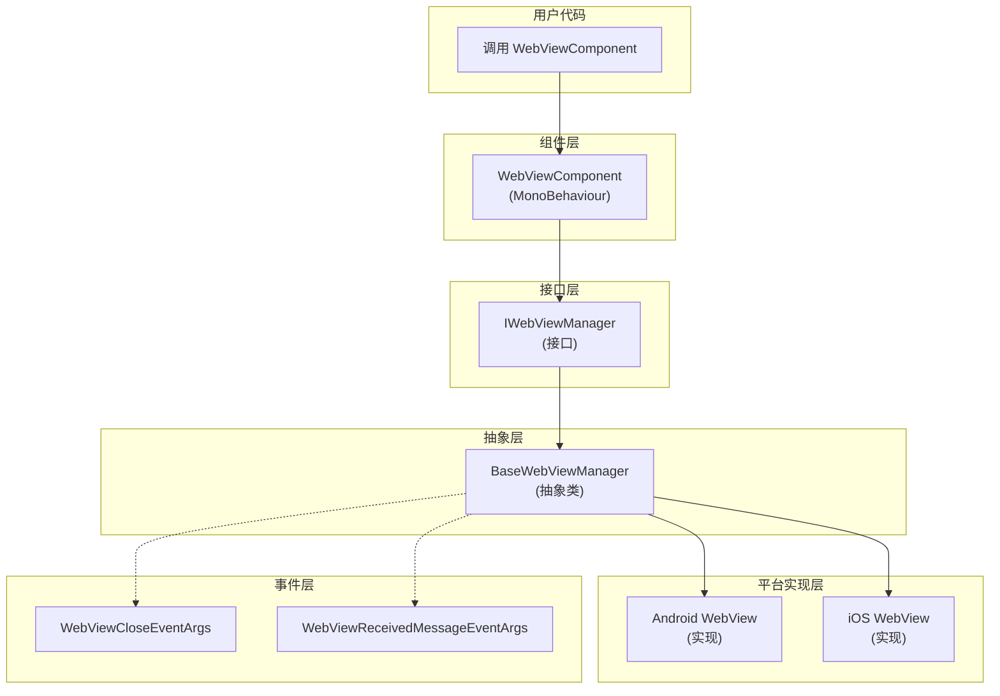

# API 参考

本文档详细介绍 GameFrameX WebView 组件的完整 API 接口，包括接口定义、组件方法、事件参数等内容。

## 概述

GameFrameX WebView 组件提供了在 Unity 游戏中嵌入和显示 Web 内容的完整解决方案。API 设计遵循 GameFrameX 框架规范，通过接口抽象实现平台无关的核心功能，由各平台具体实现（基于 gree/unity-webview）提供原生支持。

主要 API 分为以下几个部分：
- **IWebViewManager 接口** - 定义 WebView 管理的核心抽象
- **WebViewComponent 组件** - Unity 层面的用户交互入口
- **事件系统** - WebView 状态变化的通知机制
- **事件参数** - 事件携带的数据结构

## 架构



### 架构说明

1. **用户代码层**：通过 `WebViewComponent` 与系统交互
2. **组件层**：`WebViewComponent` 继承自 `GameFrameworkComponent`，是 Unity 层面的入口点
3. **接口层**：`IWebViewManager` 定义了统一的抽象接口
4. **抽象层**：`BaseWebViewManager` 提供了所有实现的公共基类
5. **平台实现层**：具体平台（Android、iOS）的 WebView 实现

## IWebViewManager 接口

`IWebViewManager` 是 WebView 功能的核心接口，定义了所有 WebView 操作的标准抽象。由框架根据运行平台自动选择合适的实现。

> Source: [IWebViewManager.cs](https://github.com/GameFrameX/com.gameframex.unity.webview/blob/main/Runtime/IWebViewManager.cs#L1-L41)

### 方法列表

| 方法 | 描述 |
|------|------|
| `Initialize()` | 初始化 WebView 系统 |
| `Show(string url)` | 显示 WebView 并加载指定 URL |
| `MakeFullScreen()` | 将 WebView 设置为全屏模式 |
| `ExecuteJavaScript(string javaScript)` | 在 WebView 中执行 JavaScript 代码 |
| `Hide()` | 隐藏 WebView |

### `Initialize(): void`

初始化 WebView 系统。此方法在组件启动时自动调用，也可以手动调用进行重新初始化。

**实现代码：**

```csharp
/// <summary>
/// 初始化
/// </summary>
void Initialize();
```

> Source: [IWebViewManager.cs](https://github.com/GameFrameX/com.gameframex.unity.webview/blob/main/Runtime/IWebViewManager.cs#L14-L17)

---

### `Show(url: string): void`

显示 WebView 并加载指定的 URL。调用此方法后，WebView 将变为可见状态并开始加载网页内容。

**参数：**
- `url` (string): 要加载的网页 URL地址，支持 http:// 和 https:// 协议

**实现代码：**

```csharp
/// <summary>
/// 显示WebView
/// </summary>
/// <param name="url">加载的url</param>
void Show(string url);
```

> Source: [IWebViewManager.cs](https://github.com/GameFrameX/com.gameframex.unity.webview/blob/main/Runtime/IWebViewManager.cs#L19-L23)

---

### `MakeFullScreen(): void`

将 WebView 设置为全屏模式。在全屏模式下，WebView 将覆盖整个屏幕区域。

**实现代码：**

```csharp
/// <summary>
/// 全屏
/// </summary>
void MakeFullScreen();
```

> Source: [IWebViewManager.cs](https://github.com/GameFrameX/com.gameframex.unity.webview/blob/main/Runtime/IWebViewManager.cs#L25-L28)

---

### `ExecuteJavaScript(javaScript: string): void`

在当前加载的 Web 页面上执行 JavaScript 代码。这使得 Unity 应用可以与 Web 页面进行双向通信。

**参数：**
- `javaScript` (string): 要执行的 JavaScript 代码字符串

**实现代码：**

```csharp
/// <summary>
/// 执行JavaScript
/// </summary>
/// <param name="javaScript">javaScript代码</param>
void ExecuteJavaScript(string javaScript);
```

> Source: [IWebViewManager.cs](https://github.com/GameFrameX/com.gameframex.unity.webview/blob/main/Runtime/IWebViewManager.cs#L30-L34)

---

### `Hide(): void`

隐藏 WebView。隐藏后 WebView 将不可见但仍然存在于内存中，可以随时通过 `Show()` 方法再次显示。

**实现代码：**

```csharp
/// <summary>
/// 隐藏
/// </summary>
void Hide();
```

> Source: [IWebViewManager.cs](https://github.com/GameFrameX/com.gameframex.unity.webview/blob/main/Runtime/IWebViewManager.cs#L36-L39)

---

## BaseWebViewManager 抽象类

`BaseWebViewManager` 是所有平台特定实现的抽象基类，继承自 `GameFrameworkModule` 并实现 `IWebViewManager` 接口。

> Source: [BaseWebViewManager.cs](https://github.com/GameFrameX/com.gameframex.unity.webview/blob/main/Runtime/BaseWebViewManager.cs#L1-L40)

### 类定义

```csharp
public abstract partial class BaseWebViewManager : GameFrameworkModule, IWebViewManager
```

> Source: [BaseWebViewManager.cs](https://github.com/GameFrameX/com.gameframex.unity.webview/blob/main/Runtime/BaseWebViewManager.cs#L11)

### 抽象方法

所有 `IWebViewManager` 接口中的方法在 `BaseWebViewManager` 中都被声明为抽象方法，由各平台实现类具体实现：

| 方法 | 签名 |
|------|------|
| Initialize | `public abstract void Initialize();` |
| Show | `public abstract void Show(string url);` |
| MakeFullScreen | `public abstract void MakeFullScreen();` |
| ExecuteJavaScript | `public abstract void ExecuteJavaScript(string javaScript);` |
| Hide | `public abstract void Hide();` |

> Source: [BaseWebViewManager.cs](https://github.com/GameFrameX/com.gameframex.unity.webview/blob/main/Runtime/BaseWebViewManager.cs#L11-L39)

---

## WebViewComponent 组件

`WebViewComponent` 是用户在 Unity 场景中直接使用的组件，继承自 `GameFrameworkComponent`。它封装了 `IWebViewManager` 的调用，提供了更友好的 Unity API。

> Source: [WebViewComponent.cs](https://github.com/GameFrameX/com.gameframex.unity.webview/blob/main/Runtime/WebViewComponent.cs#L1-L76)

### 组件特性

```csharp
[DisallowMultipleComponent]
[AddComponentMenu("Game Framework/WebView")]
[UnityEngine.Scripting.Preserve]
public partial class WebViewComponent : GameFrameworkComponent
```

- `DisallowMultipleComponent`：禁止在同一 GameObject 上添加多个实例
- `AddComponentMenu`：在 Unity 菜单中添加快捷创建入口
- `Scripting.Preserve`：确保代码在发布时不被混淆

> Source: [WebViewComponent.cs](https://github.com/GameFrameX/com.gameframex.unity.webview/blob/main/Runtime/WebViewComponent.cs#L10-L12)

### 生命周期方法

#### Awake()

组件初始化时调用，获取并配置 `IWebViewManager` 模块实例。

```csharp
protected override void Awake()
{
    ImplementationComponentType = Utility.Assembly.GetType(componentType);
    InterfaceComponentType = typeof(IWebViewManager);
    base.Awake();

    _webViewManager = GameFrameworkEntry.GetModule<IWebViewManager>();
    if (_webViewManager == null)
    {
        Log.Fatal("Web View manager is invalid.");
        return;
    }
}
```

> Source: [WebViewComponent.cs](https://github.com/GameFrameX/com.gameframex.unity.webview/blob/main/Runtime/WebViewComponent.cs#L22-L34)

#### Start()

场景启动时调用，初始化 WebView 系统。

```csharp
private void Start()
{
    _webViewManager.Initialize();
}
```

> Source: [WebViewComponent.cs](https://github.com/GameFrameX/com.gameframex.unity.webview/blob/main/Runtime/WebViewComponent.cs#L36-L39)

### 公共方法

#### `Show(url: string): void`

显示 WebView 并加载指定 URL。

```csharp
/// <summary>
/// 显示WebView
/// </summary>
/// <param name="url">加载的url</param>
public void Show(string url)
{
    _webViewManager.Show(url);
}
```

> Source: [WebViewComponent.cs](https://github.com/GameFrameX/com.gameframex.unity.webview/blob/main/Runtime/WebViewComponent.cs#L42-L49)

**使用示例：**

```csharp
var webView = FindObjectOfType<WebViewComponent>();
webView.Show("https://gameframex.doc.alianblank.com");
```

---

#### `MakeFullScreen(): void`

将 WebView 设置为全屏模式。

```csharp
/// <summary>
/// 全屏
/// </summary>
public void MakeFullScreen()
{
    _webViewManager.MakeFullScreen();
}
```

> Source: [WebViewComponent.cs](https://github.com/GameFrameX/com.gameframex.unity.webview/blob/main/Runtime/WebViewComponent.cs#L51-L57)

**使用示例：**

```csharp
var webView = FindObjectOfType<WebViewComponent>();
webView.MakeFullScreen();
```

---

#### `ExecuteJavaScript(javaScript: string): void`

在当前加载的 Web 页面上执行 JavaScript 代码。

```csharp
/// <summary>
/// 执行JavaScript
/// </summary>
/// <param name="javaScript">javaScript代码</param>
public void ExecuteJavaScript(string javaScript)
{
    _webViewManager.ExecuteJavaScript(javaScript);
}
```

> Source: [WebViewComponent.cs](https://github.com/GameFrameX/com.gameframex.unity.webview/blob/main/Runtime/WebViewComponent.cs#L59-L66)

**使用示例：**

```csharp
var webView = FindObjectOfType<WebViewComponent>();
// 调用 JavaScript 函数
webView.ExecuteJavaScript("alert('Hello from Unity!')");
// 获取 JavaScript 变量值
webView.ExecuteJavaScript("unityCallback(document.title)");
```

---

#### `Hide(): void`

隐藏 WebView。

```csharp
/// <summary>
/// 隐藏
/// </summary>
public void Hide()
{
    _webViewManager.Hide();
}
```

> Source: [WebViewComponent.cs](https://github.com/GameFrameX/com.gameframex.unity.webview/blob/main/Runtime/WebViewComponent.cs#L68-L74)

**使用示例：**

```csharp
var webView = FindObjectOfType<WebViewComponent>();
webView.Hide();
```

---

## 事件系统

GameFrameX WebView 组件提供了完善的事件系统，用于通知 WebView 状态变化。

### WebViewCloseEventArgs

当 WebView 关闭时触发的事件参数。

> Source: [WebViewCloseEventArgs.cs](https://github.com/GameFrameX/com.gameframex.unity.webview/blob/main/Runtime/EventArgs/WebViewCloseEventArgs.cs#L1-L42)

#### 属性

| 属性 | 类型 | 描述 |
|------|------|------|
| EventId | string | 事件唯一标识符：`GameFrameX.WebView.Runtime.WebViewCloseEventArgs` |
| Id | string | 获取事件标识符（实现 GameEventArgs） |

#### 方法

| 方法 | 返回类型 | 描述 |
|------|----------|------|
| Create() | `static WebViewCloseEventArgs` | 从对象池获取或创建新的事件实例 |
| Clear() | `void` | 清理事件数据（实现 GameEventArgs） |

#### 使用示例

```csharp
// 订阅事件
EventComponent eventComponent = GameEntry.GetComponent<EventComponent>();
eventComponent.Subscribe(WebViewCloseEventArgs.EventId, OnWebViewClosed);

// 事件处理方法
private void OnWebViewClosed(object sender, GameEventArgs e)
{
    // WebView 已关闭，进行相应处理
}
```

---

### WebViewReceivedMessageEventArgs

当从 WebView 收到消息时触发的事件参数。此事件用于实现 Unity 与 Web 页面的双向通信。

> Source: [WebViewReceivedMessageEventArgs.cs](https://github.com/GameFrameX/com.gameframex.unity.webview/blob/main/Runtime/EventArgs/WebViewReceivedMessageEventArgs.cs#L1-L42)

#### 属性

| 属性 | 类型 | 描述 |
|------|------|------|
| EventId | string | 事件唯一标识符：`GameFrameX.WebView.Runtime.WebViewReceivedMessageEventArgs` |
| Message | string | 从 WebView 收到的消息内容 |
| Id | string | 获取事件标识符（实现 GameEventArgs） |

#### 方法

| 方法 | 返回类型 | 描述 |
|------|----------|------|
| Create(string message) | `static WebViewReceivedMessageEventArgs` | 创建带有消息内容的事件实例 |
| Clear() | `void` | 清理事件数据（实现 GameEventArgs） |

#### 使用示例

```csharp
// 订阅事件
EventComponent eventComponent = GameEntry.GetComponent<EventComponent>();
eventComponent.Subscribe(WebViewReceivedMessageEventArgs.EventId, OnMessageReceived);

// 事件处理方法
private void OnMessageReceived(object sender, GameEventArgs e)
{
    var args = e as WebViewReceivedMessageEventArgs;
    Debug.Log($"Received message from WebView: {args.Message}");
}

// 在 JavaScript 端，可以通过以下方式发送消息到 Unity
// unityWebView.postMessage('message from JS');
```

---

## 完整使用示例

以下是一个完整的 WebView 使用示例，展示了如何初始化、显示、执行 JavaScript 以及处理事件：

```csharp
using GameFrameX.WebView.Runtime;
using GameFrameX.Runtime;
using UnityEngine;

public class WebViewExample : MonoBehaviour
{
    private WebViewComponent _webView;

    private void Start()
    {
        // 获取 WebViewComponent 实例
        _webView = FindObjectOfType<WebViewComponent>();
        
        if (_webView != null)
        {
            // 订阅关闭事件
            var eventComponent = GameEntry.GetComponent<EventComponent>();
            eventComponent.Subscribe(WebViewCloseEventArgs.EventId, OnWebViewClosed);
            
            // 订阅消息接收事件
            eventComponent.Subscribe(WebViewReceivedMessageEventArgs.EventId, OnMessageReceived);
        }
    }

    public void ShowWebView()
    {
        // 显示 WebView 并加载 URL
        _webView.Show("https://gameframex.doc.alianblank.com");
    }

    public void MakeWebViewFullScreen()
    {
        // 设置为全屏
        _webView.MakeFullScreen();
    }

    public void ExecuteJs()
    {
        // 执行 JavaScript
        _webView.ExecuteJavaScript("document.title");
    }

    public void HideWebView()
    {
        // 隐藏 WebView
        _webView.Hide();
    }

    private void OnWebViewClosed(object sender, GameEventArgs e)
    {
        Debug.Log("WebView has been closed");
    }

    private void OnMessageReceived(object sender, GameEventArgs e)
    {
        var args = e as WebViewReceivedMessageEventArgs;
        Debug.Log($"Message received: {args.Message}");
    }

    private void OnDestroy()
    {
        // 取消订阅事件
        if (_webView != null)
        {
            var eventComponent = GameEntry.GetComponent<EventComponent>();
            if (eventComponent != null)
            {
                eventComponent.Unsubscribe(WebViewCloseEventArgs.EventId, OnWebViewClosed);
                eventComponent.Unsubscribe(WebViewReceivedMessageEventArgs.EventId, OnMessageReceived);
            }
        }
    }
}
```

> Sources:
> - [WebViewComponent.cs](https://github.com/GameFrameX/com.gameframex.unity.webview/blob/main/Runtime/WebViewComponent.cs#L1-L76)
> - [WebViewCloseEventArgs.cs](https://github.com/GameFrameX/com.gameframex.unity.webview/blob/main/Runtime/EventArgs/WebViewCloseEventArgs.cs#L1-L42)
> - [WebViewReceivedMessageEventArgs.cs](https://github.com/GameFrameX/com.gameframex.unity.webview/blob/main/Runtime/EventArgs/WebViewReceivedMessageEventArgs.cs#L1-L42)

---

## Unity-JavaScript 通信

### 从 Unity 调用 JavaScript

使用 `ExecuteJavaScript` 方法可以在 WebView 中执行任意 JavaScript 代码：

```csharp
webView.ExecuteJavaScript("alert('Hello from Unity!');");
webView.ExecuteJavaScript("document.getElementById('myButton').click();");
webView.ExecuteJavaScript("JSON.stringify({name: 'test', value: 123});");
```

### 从 JavaScript 调用 Unity

WebView 支持从 JavaScript 向 Unity 发送消息。在 HTML 页面中可以使用 `unityWebView.postMessage()` 方法：

```javascript
// 发送消息到 Unity
unityWebView.postMessage('Hello Unity!');

// 发送 JSON 数据
unityWebView.postMessage(JSON.stringify({action: 'update', score: 100}));
```

> 注意：JavaScript 到 Unity 的通信需要在平台特定的 WebView 实现中启用，详细信息请参考 [平台配置](./5-platforms) 文档。

---

## 相关链接

- [概述](./1-overview) - WebView 组件简介和功能概述
- [快速入门](./3-getting-started) - 快速开始使用 WebView
- [平台配置](./5-platforms) - Android 和 iOS 平台特定配置
- [事件系统](./6-events) - 详细的事件系统说明
- [常见问题](./7-troubleshooting) - 常见问题排查指南
