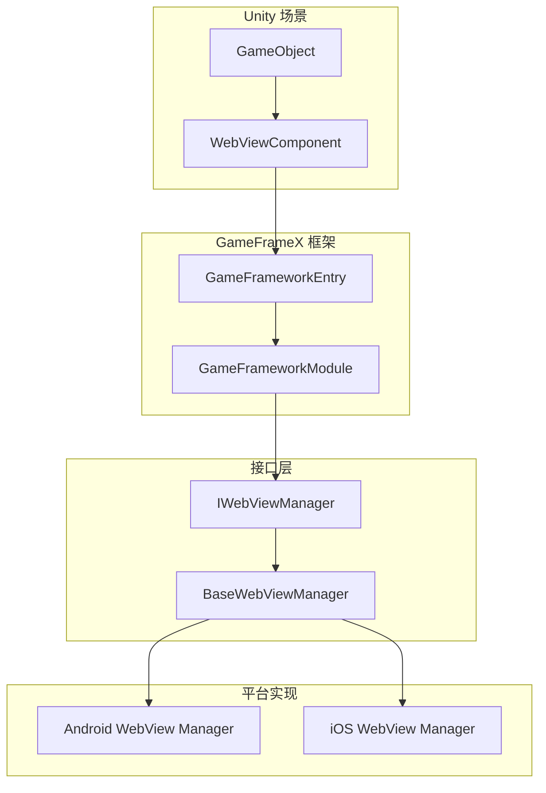
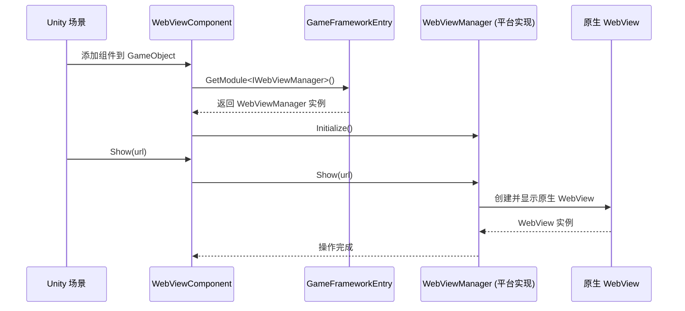

# 常见问题

本文档收集了使用 GameFrameX WebView 组件时可能遇到的常见问题及其解决方案。

## Overview

GameFrameX WebView 组件是一个 Unity WebView 封装库，基于 [gree/unity-webview](https://github.com/gree/unity-webview) 实现。该组件采用接口设计模式，通过 `IWebViewManager` 接口提供跨平台的 WebView 功能。

> **注意**：本包仅提供 WebView 的接口定义和 Unity 组件，具体的平台实现（如 Android/iOS WebView）需要额外安装对应的实现包。

## 常见问题与解决方案

### 问题 1：WebView 不显示

#### 症状
添加 WebViewComponent 到场景后，调用 `Show(url)` 方法但 WebView 没有显示。

#### 可能原因
1. 平台实现包未安装
2. WebViewManager 未正确初始化
3. URL 格式不正确

#### 解决方案
```csharp
// 确保正确获取 WebViewComponent 实例
var webView = FindObjectOfType<WebViewComponent>();
if (webView != null)
{
    // 使用有效的 HTTPS URL
    webView.Show("https://gameframex.doc.alianblank.com");
}
else
{
    Debug.LogError("WebViewComponent 未在场景中找到！");
}
```

> Source: [WebViewComponent.cs](https://github.com/GameFrameX/com.gameframex.unity.webview/blob/main/Runtime/WebViewComponent.cs#L36-L49)

---

### 问题 2：Fatal: Web View manager is invalid

#### 症状
运行时控制台输出 `Log.Fatal("Web View manager is invalid.")` 错误。

#### 可能原因
1. **核心依赖包未安装**：本组件依赖 `com.gameframex.unity` 包
2. **平台实现包缺失**：没有安装对应平台的 WebView 实现包
3. **模块注册失败**：WebViewManager 模块未正确注册到框架

#### 解决方案

1. **安装核心依赖包**：
   ```
   通过 Unity Package Manager 添加：https://github.com/gameframex/com.gameframex.unity.git
   ```

2. **安装平台实现包**：根据目标平台安装对应的 WebView 实现包（如果存在）

3. **检查模块注册**：确保在游戏启动时正确初始化了 GameFrameX 框架

---

### 问题 3：iOS/Android 平台 WebView 空白

#### 症状
在 iOS 或 Android 平台上 WebView 显示为空白，页面无法加载。

#### 可能原因
1. 网络权限未配置
2. HTTPS 证书问题
3. 平台特定配置缺失

#### 解决方案

**对于 iOS**：
- 在 `Info.plist` 中添加网络权限：
```xml
<key>NSAppTransportSecurity</key>
<dict>
    <key>NSAllowsArbitraryLoads</key>
    <true/>
</dict>
```

**对于 Android**：
- 确保在 `AndroidManifest.xml` 中添加了 Internet 权限：
```xml
<uses-permission android:name="android.permission.INTERNET" />
```

---

### 问题 4：JavaScript 交互无响应

#### 症状
调用 `ExecuteJavaScript()` 方法后，JavaScript 代码没有执行或没有效果。

#### 可能原因
1. WebView 未完全加载
2. JavaScript 代码语法错误
3. 调用时机过早

#### 解决方案
```csharp
// 建议在 WebView 加载完成后再执行 JavaScript
// 可以通过订阅事件来监听加载完成状态
var webView = FindObjectOfType<WebViewComponent>();
webView.Show("https://example.com");

// 延迟执行 JavaScript，确保页面已加载
Invoke(nameof(ExecuteCustomJavaScript), 2.0f);

void ExecuteCustomJavaScript()
{
    webView.ExecuteJavaScript("console.log('Hello from Unity!');");
}
```

> Source: [WebViewComponent.cs](https://github.com/GameFrameX/com.gameframex.unity.webview/blob/main/Runtime/WebViewComponent.cs#L59-L66)

---

### 问题 5：WebView 全屏显示异常

#### 症状
调用 `MakeFullScreen()` 方法后，WebView 显示位置或大小不正确。

#### 解决方案
```csharp
var webView = FindObjectOfType<WebViewComponent>();
webView.Show("https://example.com");
// 等待页面加载完成后，再设置为全屏
Invoke(nameof(MakeFullScreen), 1.0f);

void MakeFullScreen()
{
    webView.MakeFullScreen();
}
```

> Source: [WebViewComponent.cs](https://github.com/GameFrameX/com.gameframex.unity.webview/blob/main/Runtime/WebViewComponent.cs#L54-L57)

---

### 问题 6：多个 WebView 实例冲突

#### 症状
场景中有多个 WebViewComponent 时，出现显示混乱或事件错乱。

#### 解决方案
- 建议场景中只保留一个 WebViewComponent 实例
- 使用单例模式管理 WebView：
```csharp
public class WebViewManager : MonoBehaviour
{
    private static WebViewManager _instance;
    public static WebViewManager Instance => _instance;
    
    private WebViewComponent _webView;
    
    private void Awake()
    {
        _instance = this;
        _webView = GetComponent<WebViewComponent>();
    }
    
    public void ShowWebView(string url)
    {
        _webView.Show(url);
    }
}
```

---

### 问题 7：Unity 编辑器中无法测试

#### 症状
在 Unity 编辑器模式下运行，WebView 不显示或报错。

#### 原因说明
WebView 功能需要在真机或对应平台的模拟器上测试，Unity 编辑器本身不支持原生 WebView 显示。

#### 解决方案
- 将项目构建到目标平台（iOS/Android）进行测试
- 使用平台相关的模拟器

---

## 诊断步骤

### 基础诊断流程

```mermaid
flowchart TD
    Start([开始诊断]) --> Step1{控制台有错误?}
    Step1 -->|是| Step2{错误信息为"Web View manager is invalid"?}
    Step1 -->|否| Step3{检查代码调用}
    
    Step2 -->|是| Step4[检查核心依赖包]
    Step2 -->|否| Step5[根据具体错误排查]
    
    Step4 --> Step6{依赖包已安装?}
    Step6 -->|否| Step7[安装 com.gameframex.unity]
    Step6 -->|是| Step8[检查平台实现包]
    
    Step7 --> Step9[重新构建项目]
    Step8 --> Step9
    Step9 --> End1([结束])
    
    Step3 --> Step10{URL 有效?}
    Step10 -->|否| Step11[使用有效 HTTPS URL]
    Step10 -->|是| Step12[检查平台权限配置]
    
    Step5 --> End1
    Step11 --> End1
    Step12 --> End1
```

### 调试检查清单

| 检查项 | 操作方法 |
|--------|----------|
| 核心包依赖 | 检查 Package Manager 中是否安装 `com.gameframex.unity` |
| 场景配置 | 确认 GameObject 上正确添加了 WebViewComponent |
| 代码调用 | 确认在 Start() 或之后调用 Show() 方法 |
| URL 有效性 | 确认使用有效的 HTTPS URL |
| 平台权限 | 检查各平台的权限配置文件 |
| 事件监听 | 添加事件监听查看是否有错误事件触发 |

---

## 架构说明

### 组件关系



### 工作流程



---

## 相关链接

- [概述](./1-overview) - WebView 组件概述与功能介绍
- [安装](./2-installation) - 详细安装指南
- [快速入门](./3-getting-started) - 快速开始使用 WebView
- [API 参考](./4-api-reference) - 完整的 API 方法说明
- [平台配置](./5-platforms) - 各平台特定配置说明
- [事件系统](./6-events) - WebView 事件系统详解
- [GameFrameX 核心框架](https://github.com/GameFrameX/com.gameframex.unity) - 核心框架仓库
- [gree/unity-webview](https://github.com/gree/unity-webview) - 原始 WebView 插件
