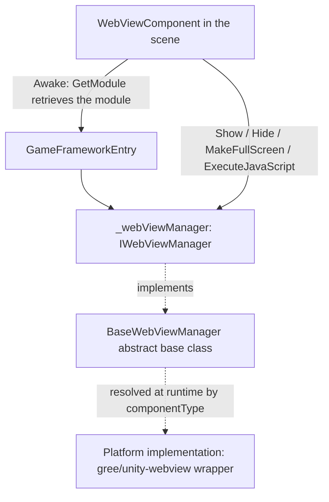

# How It Works: How the Component Drives the WebView

`WebViewComponent` is a GameFrameworkComponent shell attached to the scene. In `Awake`, it obtains the manager via `GameFrameworkEntry.GetModule<IWebViewManager>()` and forwards `Show` / `Hide` / `MakeFullScreen` / `ExecuteJavaScript` to it. This package only defines the interface (`IWebViewManager`), the abstract base class (`BaseWebViewManager`), and the component shell; the concrete platform implementation is a wrapper around [gree/unity-webview](https://github.com/gree/unity-webview), resolved and assembled at runtime based on `componentType`.

## Component Layering

| Layer | Actual Type | File | Responsibility |
|----|----------|----------|------|
| Component shell | `WebViewComponent : GameFrameworkComponent` | `Runtime/WebViewComponent.cs` | Unity scene entry point, responsible for assembling the module and forwarding calls |
| Interface | `IWebViewManager` | `Runtime/IWebViewManager.cs` | Defines the five methods `Initialize` / `Show` / `MakeFullScreen` / `ExecuteJavaScript` / `Hide` |
| Abstract base class | `BaseWebViewManager : GameFrameworkModule, IWebViewManager` | `Runtime/BaseWebViewManager.cs` | Base class for platform implementations; all five methods are `abstract` |
| Concrete implementation | Resolved at runtime via `componentType` (not in this repository) | — | Platform Web View capability based on gree/unity-webview |

## Call Chain



## Startup Sequence

1. `Awake` sets the implementation type and interface type, then retrieves the module from `GameFrameworkEntry`; if retrieval fails, it logs a Fatal message and abandons further initialization:

```csharp
protected override void Awake()
{
    ImplementationComponentType = Utility.Assembly.GetType(componentType);
    InterfaceComponentType = typeof(IWebViewManager);
    base.Awake();
    if (!IsRuntimeComponentReady)
    {
        return;
    }

    _webViewManager = GameFrameworkEntry.GetModule<IWebViewManager>();
    if (_webViewManager == null)
    {
        Log.Fatal("Web View manager is invalid.");
        return;
    }
}
```

Source: [WebViewComponent.cs](https://github.com/GameFrameX/com.gameframex.unity.webview/blob/main/Runtime/WebViewComponent.cs#L22-L38)

2. `Start` calls `_webViewManager.Initialize()` once to complete the manager initialization; if `Awake` failed to obtain the module, it returns directly:

```csharp
private void Start()
{
    if (_webViewManager == null)
    {
        return;
    }

    _webViewManager.Initialize();
}
```

Source: [WebViewComponent.cs](https://github.com/GameFrameX/com.gameframex.unity.webview/blob/main/Runtime/WebViewComponent.cs#L40-L48)

## How the Public API Is Forwarded

The component's four public methods are all one-line forwards and contain no platform logic:

```csharp
public void Show(string url)
{
    _webViewManager.Show(url);
}

public void MakeFullScreen()
{
    _webViewManager.MakeFullScreen();
}

public void ExecuteJavaScript(string javaScript)
{
    _webViewManager.ExecuteJavaScript(javaScript);
}

public void Hide()
{
    _webViewManager.Hide();
}
```

Source: [WebViewComponent.cs](https://github.com/GameFrameX/com.gameframex.unity.webview/blob/main/Runtime/WebViewComponent.cs#L51-L83)

The manager-side contract (`BaseWebViewManager` declares them as `abstract`, implemented by platform subclasses):

```csharp
public interface IWebViewManager
{
    void Initialize();
    void Show(string url);
    void MakeFullScreen();
    void ExecuteJavaScript(string javaScript);
    void Hide();
}
```

Source: [IWebViewManager.cs](https://github.com/GameFrameX/com.gameframex.unity.webview/blob/main/Runtime/IWebViewManager.cs#L12-L40)

## How User Code Reaches the Component

Following the usage provided in the README, place `WebViewComponent` in the scene and call it directly:

```csharp
using GameFrameX.WebView.Runtime;
using UnityEngine;

public class Example : MonoBehaviour
{
    void Start()
    {
        var webView = FindObjectOfType<WebViewComponent>();
        webView.Show("https://gameframex.doc.alianblank.com");
    }
}
```

Source: [README.zh-CN.md](https://github.com/GameFrameX/com.gameframex.unity.webview/blob/main/README.zh-CN.md#L102-L116)

## Source File Quick Reference

| File | Description |
|------|------|
| [WebViewComponent.cs](https://github.com/GameFrameX/com.gameframex.unity.webview/blob/main/Runtime/WebViewComponent.cs) | Component shell: assembles the module, initializes, and forwards the four public methods; `[DisallowMultipleComponent]` + `[AddComponentMenu("Game Framework/WebView")]` |
| [IWebViewManager.cs](https://github.com/GameFrameX/com.gameframex.unity.webview/blob/main/Runtime/IWebViewManager.cs) | Manager interface, the contract for the five methods |
| [BaseWebViewManager.cs](https://github.com/GameFrameX/com.gameframex.unity.webview/blob/main/Runtime/BaseWebViewManager.cs) | Abstract base class, inherits `GameFrameworkModule` and implements the interface |
| [WebViewComponentInspector.cs](https://github.com/GameFrameX/com.gameframex.unity.webview/blob/main/Editor/WebViewComponentInspector.cs) | Component Inspector under the Editor directory (its implementation is not covered on this page) |
| [WebViewCloseEventArgs.cs](https://github.com/GameFrameX/com.gameframex.unity.webview/blob/main/Runtime/EventArgs/WebViewCloseEventArgs.cs) / [WebViewReceivedMessageEventArgs.cs](https://github.com/GameFrameX/com.gameframex.unity.webview/blob/main/Runtime/EventArgs/WebViewReceivedMessageEventArgs.cs) | Close / message-received event argument definitions under Runtime/EventArgs (see the source code for field details) |
| [GameFrameXWebViewCroppingHelper.cs](https://github.com/GameFrameX/com.gameframex.unity.webview/blob/main/Runtime/GameFrameXWebViewCroppingHelper.cs) | Cropping helper class under the Runtime directory (its implementation is not covered on this page) |

## Related Links

- [README.zh-CN.md](https://github.com/GameFrameX/com.gameframex.unity.webview/blob/main/README.zh-CN.md) — Installation instructions, usage examples, and dependency notes (depends on `com.gameframex.unity` 1.0.0)
- [Game Frame X official documentation](https://gameframex.doc.alianblank.com)
- [gree/unity-webview](https://github.com/gree/unity-webview) — The underlying Web View implementation wrapped by this component, supporting Android and iOS