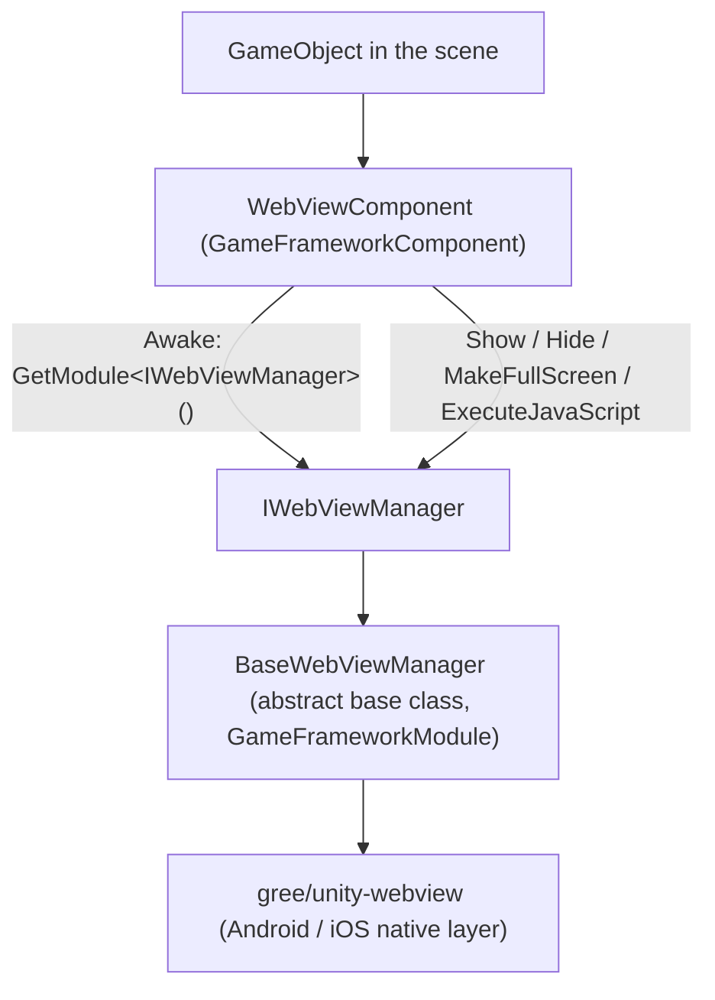

# Project Overview: Unity Embedded Web Component

Game Frame X Web View is a Unity embedded web component under the Game Frame X framework. It wraps [gree/unity-webview](https://github.com/gree/unity-webview), letting you display web pages and execute JavaScript in Android / iOS games with a single component, and integrate into the framework's module system through the unified interface `IWebViewManager`.

## Quick Start

### 1. Install the Package

Choose either method to add `com.gameframex.unity.webview` to your Unity project:

**Option A: scoped registry (recommended)** — Edit `Packages/manifest.json`:

```json
{
  "scopedRegistries": [
    {
      "name": "GameFrameX",
      "url": "https://gameframex.upm.alianblank.uk",
      "scopes": [
        "com.gameframex"
      ]
    }
  ],
  "dependencies": {
    "com.gameframex.unity.webview": "1.0.0"
  }
}
```

**Option B: Git URL** — Add it directly to the `dependencies` section of `manifest.json`:

```json
{
  "dependencies": {
    "com.gameframex.unity.webview": "https://github.com/gameframex/com.gameframex.unity.webview.git"
  }
}
```

Source: [README.md](https://github.com/GameFrameX/com.gameframex.unity.webview/blob/main/README.md#L43-L70)

Alternatively, in Unity's **Package Manager**, use **Add package from git URL** and enter `https://github.com/gameframex/com.gameframex.unity.webview.git`, or clone the repository directly into the `Packages` directory to load it automatically.

> Dependency: `com.gameframex.unity` 1.0.0 must also be available (see [README.md](https://github.com/GameFrameX/com.gameframex.unity.webview/blob/main/README.md#L126-L131)).

### 2. Attach the Component

Add `WebViewComponent` to the GameFramework GameObject (or any GameObject) in the scene via **Add Component → Game Framework → WebView**. The component automatically completes manager initialization in `Start`:

```csharp
private void Start()
{
    if (_webViewManager == null)
    {
        return;
    }

    _webViewManager.Initialize();
}
```

Source: [WebViewComponent.cs](https://github.com/GameFrameX/com.gameframex.unity.webview/blob/main/Runtime/WebViewComponent.cs#L40-L48)

### 3. Display a Web Page

```csharp
using GameFrameX.WebView.Runtime;
using UnityEngine;

public class Example : MonoBehaviour
{
    void Start()
    {
        var webView = FindObjectOfType<WebViewComponent>();
        webView.Show("https://gameframex.doc.alianblank.com");
    }
}
```

Source: [README.md](https://github.com/GameFrameX/com.gameframex.unity.webview/blob/main/README.md#L102-L116)

### 4. Common API Overview

| Name | Signature | Description |
|------|------|------|
| Display Web Page | `Show(string url)` | Shows the WebView and loads the specified URL |
| Hide | `Hide()` | Hides the WebView |
| Full Screen | `MakeFullScreen()` | Sets the WebView to full screen |
| Execute Script | `ExecuteJavaScript(string javaScript)` | Executes JavaScript code in the web page |

All of the above are public methods on `WebViewComponent` that directly forward to the `IWebViewManager` implementation (see [WebViewComponent.cs](https://github.com/GameFrameX/com.gameframex.unity.webview/blob/main/Runtime/WebViewComponent.cs#L51-L83) and [IWebViewManager.cs](https://github.com/GameFrameX/com.gameframex.unity.webview/blob/main/Runtime/IWebViewManager.cs#L12-L40)).

## How It Works at a Glance

The component layering is simple: the `WebViewComponent` in the scene (inheriting from `GameFrameworkComponent`) only does forwarding; the actual behavior is performed by the manager implementing `IWebViewManager` (`BaseWebViewManager` is the abstract base class), while the underlying native WebView rendering is handled by the wrapped gree/unity-webview.



Key call chain (verified against source code):

1. `WebViewComponent.Awake()` obtains the module instance via `GameFrameworkEntry.GetModule<IWebViewManager>()`, and calls `Log.Fatal("Web View manager is invalid.")` on failure ([WebViewComponent.cs](https://github.com/GameFrameX/com.gameframex.unity.webview/blob/main/Runtime/WebViewComponent.cs#L22-L38)).
2. `Start()` calls `_webViewManager.Initialize()` to complete initialization ([WebViewComponent.cs](https://github.com/GameFrameX/com.gameframex.unity.webview/blob/main/Runtime/WebViewComponent.cs#L40-L48)).
3. `BaseWebViewManager` declares `Initialize / Show / MakeFullScreen / ExecuteJavaScript / Hide` as abstract methods ([BaseWebViewManager.cs](https://github.com/GameFrameX/com.gameframex.unity.webview/blob/main/Runtime/BaseWebViewManager.cs#L11-L39)).

The repository also includes the `WebViewCloseEventArgs` and `WebViewReceivedMessageEventArgs` event args under `Runtime/EventArgs/`, as well as the `Editor/WebViewComponentInspector.cs` custom Inspector and the `GameFrameXWebViewCroppingHelper.cs` cropping helper class, used for message callbacks and editor extensions.

## Next Steps

- Usage details and documentation site: [Game Frame X Documentation](https://gameframex.doc.alianblank.com) ([README.md](https://github.com/GameFrameX/com.gameframex.unity.webview/blob/main/README.md#L132-L134))
- Complete interface signatures: [IWebViewManager.cs](https://github.com/GameFrameX/com.gameframex.unity.webview/blob/main/Runtime/IWebViewManager.cs#L12-L40)
- Component lifecycle and forwarding implementation: [WebViewComponent.cs](https://github.com/GameFrameX/com.gameframex.unity.webview/blob/main/Runtime/WebViewComponent.cs#L13-L84)
- Abstract base class extension points: [BaseWebViewManager.cs](https://github.com/GameFrameX/com.gameframex.unity.webview/blob/main/Runtime/BaseWebViewManager.cs#L11-L39)
- Version history: [CHANGELOG.md](https://github.com/GameFrameX/com.gameframex.unity.webview/blob/main/CHANGELOG.md) and [Releases](https://github.com/GameFrameX/gameframex/com.gameframex.unity.webview/releases)