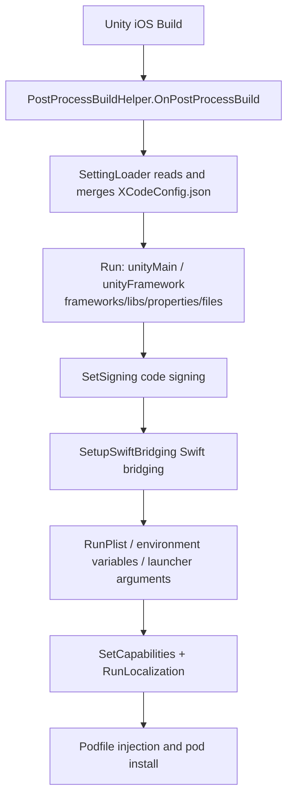

# Xcode Build Configuration Package Overview

The GameFrameX Xcode configuration package (com.gameframex.unity.xcode) lets you automate all Xcode project setup after an iOS build with a single `XCodeConfig.json`: Info.plist, system frameworks/libraries, Build Settings, Capabilities, localization, CocoaPods, code signing, Swift bridging, and more—all without manually modifying the Xcode project. After Unity builds for the iOS platform, it runs automatically via the `PostProcessBuild` callback, making it suitable for both local and CI automated builds.

## Quick Start

### 1. Install the Package

Edit your Unity project's `Packages/manifest.json` to add a scoped registry and declare the dependency (current version `1.11.1`):

```json
{
  "scopedRegistries": [
    {
      "name": "GameFrameX",
      "url": "https://gameframex.upm.alianblank.uk",
      "scopes": [
        "com.gameframex"
      ]
    }
  ],
  "dependencies": {
    "com.gameframex.unity.xcode": "1.11.1"
  }
}
```

Source: [README.zh-CN.md](https://github.com/GameFrameX/com.gameframex.unity.xcode/blob/main/README.zh-CN.md#L49-L63)

Alternatively, you can skip creating a registry and add the Git URL `https://github.com/gameframex/com.gameframex.unity.xcode.git` directly under `dependencies`, add it via Package Manager's `Git URL` option, or download the repository and place it in the `Packages` directory.

### 2. Create the Configuration File

Create a `XCodeConfig.json` in your project—the filename is fixed, and it can be placed anywhere in the project. Multiple files can coexist (automatically merged recursively in depth), and `XCodeConfig.{渠道名}.json` channel-specific configurations are merged last as overrides.

```json
{
  "swiftBridging": true,
  "signing": {},
  "plist": {},
  "environmentVariables": {},
  "launcherArgs": [],
  "podSource": [],
  "podfile": "",
  "podInstall": true,
  "localizations": [],
  "capabilities": {},
  "unityFramework": {},
  "unityMain": {}
}
```

Source: [README.zh-CN.md](https://github.com/GameFrameX/com.gameframex.unity.xcode/blob/main/README.zh-CN.md#L81-L96)

| Field | Type | Description |
| :--- | :--- | :--- |
| `swiftBridging` | bool | Automatic Swift bridging header generation (default `true`) |
| `signing` | object | Code signing: Team ID, Bundle ID, signing identity, provisioning profile |
| `plist` | object | Info.plist key-value pairs; values support string/boolean/integer/array/dictionary and are written recursively |
| `environmentVariables` | object | XcScheme environment variables |
| `launcherArgs` | string[] | XcScheme launcher arguments |
| `podSource` | string[] | CocoaPods source URLs, replacing the Podfile's default source |
| `podfile` | string | Custom Podfile path (takes precedence over the `pods` field) |
| `podInstall` | bool | Automatically run `pod install` after the Podfile is processed (default `true`) |
| `localizations` | array | Automatically generate `.lproj/InfoPlist.strings` |
| `capabilities` | object | 13 capabilities including In-App Purchase, Game Center, Push Notifications, Sign In with Apple, etc. |
| `unityFramework` | object | UnityFramework target configuration |
| `unityMain` | object | Unity-iPhone (main) target configuration |

### 3. Write the Most Common Configuration

`unityMain` / `unityFramework` share the same structure: `libs` uses `+`/`-` to add/remove system libraries, `frameworks` adds/removes frameworks, and `properties` uses `=`/`+`/`-` to set, append, and remove Build Settings:

```json
{
  "unityMain": {
    "libs": {
      "+": ["libz.tbd", "libicucore.tbd"],
      "-": ["libstdc++.tbd"]
    },
    "frameworks": {
      "+": ["WebKit.framework", "UserNotifications.framework"],
      "-": []
    },
    "properties": {
      "=": { "ENABLE_BITCODE": "NO" },
      "+": { "OTHER_CFLAGS": ["-flag1", "-flag2"] },
      "-": { "UNUSED_FLAG": [""] }
    }
  },
  "signing": {
    "teamId": "XXXXXXXXXX",
    "bundleId": "com.company.app",
    "codeSignIdentity": "Apple Development",
    "codeSignStyle": "Automatic",
    "provisioningProfileSpecifier": ""
  }
}
```

Sources: [README.zh-CN.md](https://github.com/GameFrameX/com.gameframex.unity.xcode/blob/main/README.zh-CN.md#L133-L140) · [README.zh-CN.md](https://github.com/GameFrameX/com.gameframex.unity.xcode/blob/main/README.zh-CN.md#L245-L255)

### 4. Build for iOS and Verify

Run an iOS platform build in Unity. When the build finishes, the package's `PostProcessBuildHelper.OnPostProcessBuild` (`[PostProcessBuild(888)]`) runs automatically: if no configuration file is found, it outputs `未找到任何 XCodeConfig 相关配置文件, 跳过设置`; on success, it outputs `[MergeConfig] 正在合并配置: {路径}` for each file, followed in order by `[PBXProject] 正在应用最终合并配置...` and `[OtherSettings] 正在应用最终合并配置...`. Seeing these logs in the Console means the configuration has been written into the Xcode project:

```csharp
[PostProcessBuild(888)]
public static void OnPostProcessBuild(BuildTarget target, string path)
{
    if (target != BuildTarget.iOS)
    {
        return;
    }
    // Read the configuration files
    var jsonPaths = SettingLoader.LoadSettingsData("XCodeConfig.json");
    // If no matching files were found, return directly
    if (jsonPaths.Count == 0)
    {
        LogHelper.Error("未找到任何 XCodeConfig 相关配置文件, 跳过设置");
        return;
    }
```

Source: [Editor/PostProcessBuildHelper.cs](https://github.com/GameFrameX/com.gameframex.unity.xcode/blob/main/Editor/PostProcessBuildHelper.cs#L14-L31)

## How It Works at a Glance

The entire flow is driven by `OnPostProcessBuild`: merge configurations → write PBXProject → write plist/scheme/capabilities/localization → process the Podfile.



Two-phase processing: `unityMain`/`unityFramework`/`signing`/`swiftBridging` are written and saved to `project.pbxproj` first; then Plist, environment variables, launcher arguments, Capabilities, localization, and the Podfile are applied in the second phase. Capabilities are written to disk independently by `ProjectCapabilityManager`, so the project file is re-read before continuing to ensure those modifications are not overwritten:

```csharp
// Save the PBXProject
File.WriteAllText(projectPath, project.WriteToString());
// Second phase: apply other configurations (Plist, Env, Args, Pod, Capabilities)
LogHelper.Log("[OtherSettings] 正在应用最终合并配置...");
```

Source: [Editor/PostProcessBuildHelper.cs](https://github.com/GameFrameX/com.gameframex.unity.xcode/blob/main/Editor/PostProcessBuildHelper.cs#L103-L107)

Configuration merge priority is: channel configuration (`XCodeConfig.{channel}.json`) > regular `XCodeConfig.json` > empty. Multiple regular files are deep-merged sequentially in scan order. The package's implementation is split into multiple partial files by functionality, making it easy to read the source code as needed.

## Common Errors

| Symptom | Cause | Fix |
|------|------|------|
| Console reports `未找到任何 XCodeConfig 相关配置文件, 跳过设置` | The configuration file is not named `XCodeConfig.json` or is not inside the project | Verify the filename and location; channel files must be named `XCodeConfig.{渠道名}.json` |
| A configuration item has no effect | Multiple `XCodeConfig.json` files exist, or a channel file overrides it | Later merges override values with the same keys; check the order of the files in the `[MergeConfig]` merge logs |
| `folders` copy error | The destination folder already exists in the Xcode project (`folders` does not overwrite) | Use `files` to copy individual files instead, or clear the build output directory first |
| A dialog pops up for Swift mixed-language builds on CI | Swift bridging is not enabled | Keep `swiftBridging: true` (the default), which automatically creates the bridging header and sets `SWIFT_VERSION` to `5.0` |

## Next Steps

- For all configuration file fields and the syntax of each sub-item, see the "Configuration File Structure" section of the repository's [README.zh-CN.md](https://github.com/GameFrameX/com.gameframex.unity.xcode/blob/main/README.zh-CN.md#L75-L484).
- See [CHANGELOG.md](https://github.com/GameFrameX/com.gameframex.unity.xcode/blob/main/CHANGELOG.md) for the version history.
- Source code entry points: `Editor/PostProcessBuildHelper.cs` (main flow), `Editor/PostProcessBuildHelper.BuildProperties.cs` (Build Settings), `Editor/PostProcessBuildHelper.Capabilities.cs` (Capabilities), `Editor/PostProcessBuildHelper.File.cs` (file copying).
- For official documentation and community groups, see [README.zh-CN.md](https://github.com/GameFrameX/com.gameframex.unity.xcode/blob/main/README.zh-CN.md#L16).