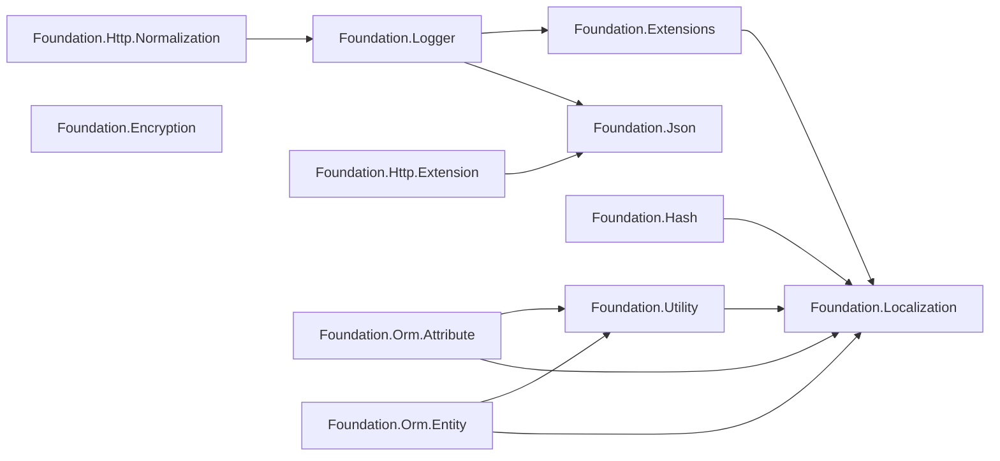

# Package Overview and Dependencies

GameFrameX.Foundation is a collection of .NET class libraries split by responsibility. Each subdirectory is an independent NuGet package, and the packages are linked together via `ProjectReference`. This page provides an inventory of all packages, the dependency directions, and guidance on which package to start integrating with.

## Package List

Each top-level folder under the repository root corresponds to a NuGet package. All packages uniformly use the version number defined in `../Version.props` and are strong-named via `../gameframex.key.snk`.

| Package Name | Primary Responsibility | Key Third-Party Dependencies |
|------|----------|----------------|
| GameFrameX.Foundation.Encryption | Encryption/decryption (AES, RSA, etc.) | — |
| GameFrameX.Foundation.Extensions | Collection of common extension methods | Localization |
| GameFrameX.Foundation.Hash | Hash algorithms (xxHash, BCrypt, BouncyCastle) | Standart.Hash.xxHash 4.0.5、BouncyCastle.Cryptography 2.7.0、BCrypt.Net-Next.StrongName 4.2.1 |
| GameFrameX.Foundation.Http.Extension | Unified HTTP client interface (GET/POST) | Json |
| GameFrameX.Foundation.Http.Normalization | HTTP request/response normalization | Logger |
| GameFrameX.Foundation.Json | Unified JSON serialization/deserialization interface | — |
| GameFrameX.Foundation.Localization | Multilingual localization abstraction | Microsoft.Extensions.Localization.Abstractions 10.0.11 |
| GameFrameX.Foundation.Logger | Serilog structured logging with Loki and MongoDB support | MongoDB.Driver 3.11.0、Serilog.AspNetCore 10.0.0、Serilog.Sinks.Grafana.Loki 9.0.2、Serilog.Sinks.MongoDB 7.2.0 |
| GameFrameX.Foundation.Options | Configuration options extensions | — |
| GameFrameX.Foundation.Orm.Attribute | ORM entity attributes (Attribute) | Utility、Localization |
| GameFrameX.Foundation.Orm.Entity | ORM entity base classes | Utility、Localization |
| GameFrameX.Foundation.Utility | General utility classes | Localization |

Source: [GameFrameX.Foundation.Http.Extension.csproj](https://github.com/GameFrameX/GameFrameX.Foundation/blob/main/GameFrameX.Foundation.Http.Extension/GameFrameX.Foundation.Http.Extension.csproj#L24-L26),[GameFrameX.Foundation.Json.csproj](https://github.com/GameFrameX/GameFrameX.Foundation/blob/main/GameFrameX.Foundation.Json/GameFrameX.Foundation.Json.csproj#L1-L26),[GameFrameX.Foundation.Hash.csproj](https://github.com/GameFrameX/GameFrameX.Foundation/blob/main/GameFrameX.Foundation.Hash/GameFrameX.Foundation.Hash.csproj#L14-L33),[GameFrameX.Foundation.Localization.csproj](https://github.com/GameFrameX/GameFrameX.Foundation/blob/main/GameFrameX.Foundation.Localization/GameFrameX.Foundation.Localization.csproj#L29-L32),[GameFrameX.Foundation.Logger.csproj](https://github.com/GameFrameX/GameFrameX.Foundation/blob/main/GameFrameX.Foundation.Logger/GameFrameX.Foundation.Logger.csproj#L26-L36)

## Dependency Diagram



Source: [GameFrameX.Foundation.Extensions.csproj](https://github.com/GameFrameX/GameFrameX.Foundation/blob/main/GameFrameX.Foundation.Extensions/GameFrameX.Foundation.Extensions.csproj#L15-L17),[GameFrameX.Foundation.Hash.csproj](https://github.com/GameFrameX/GameFrameX.Foundation/blob/main/GameFrameX.Foundation.Hash/GameFrameX.Foundation.Hash.csproj#L14-L16),[GameFrameX.Foundation.Utility.csproj](https://github.com/GameFrameX/GameFrameX.Foundation/blob/main/GameFrameX.Foundation.Utility/GameFrameX.Foundation.Utility.csproj#L15-L17),[GameFrameX.Foundation.Orm.Entity.csproj](https://github.com/GameFrameX/GameFrameX.Foundation/blob/main/GameFrameX.Foundation.Orm.Entity/GameFrameX.Foundation.Orm.Entity.csproj#L23-L32),[GameFrameX.Foundation.Logger.csproj](https://github.com/GameFrameX/GameFrameX.Foundation/blob/main/GameFrameX.Foundation.Logger/GameFrameX.Foundation.Logger.csproj#L34-L36),[GameFrameX.Foundation.Http.Extension.csproj](https://github.com/GameFrameX/GameFrameX.Foundation/blob/main/GameFrameX.Foundation.Http.Extension/GameFrameX.Foundation.Http.Extension.csproj#L24-L26),[GameFrameX.Foundation.Http.Normalization.csproj](https://github.com/GameFrameX/GameFrameX.Foundation/blob/main/GameFrameX.Foundation.Http.Normalization/GameFrameX.Foundation.Http.Normalization.csproj#L23-L25)

## Quick Start

1. **Identify the features you need and only reference the corresponding packages** — avoid pulling in all Foundation packages. For example, if you only need JSON serialization, reference only `GameFrameX.Foundation.Json`.
2. **If you use extension methods, utility classes, ORM, etc., you will transitively depend on Localization** — `Microsoft.Extensions.Localization.Abstractions 10.0.11` will be pulled in accordingly, and you need to register localization services in DI.
3. **If you use the Logger package** — in addition to the main Serilog package, MongoDB.Driver 3.11.0 will also be introduced; make sure the MongoDB driver version does not conflict with the one used on the business side.
4. **If you use the Hash package** — three third-party libraries (xxHash, BouncyCastle, BCrypt) will be introduced at once; you can trim unused `using` directives as needed.
5. **Using strong-named assemblies** — all packages are signed with `gameframex.key.snk`; consumer projects must allow the use of strong names or be consistent with the project's own signing.

## How to Choose an Entry Package

| Scenario | Recommended Package |
|------|--------|
| JSON read/write only | GameFrameX.Foundation.Json |
| HTTP calls only | GameFrameX.Foundation.Http.Extension |
| Structured logging + remote aggregation | GameFrameX.Foundation.Logger |
| Password/data hashing | GameFrameX.Foundation.Hash |
| Encryption/decryption | GameFrameX.Foundation.Encryption |
| ORM entities and attributes | GameFrameX.Foundation.Orm.Entity + GameFrameX.Foundation.Orm.Attribute |
| Configuration options extensions | GameFrameX.Foundation.Options |

## Version and Signing

All packages share a single version number file:

```xml
<Import Project="../Version.props" Label="Version number definition"/>
<AssemblyOriginatorKeyFile>../gameframex.key.snk</AssemblyOriginatorKeyFile>
```

Source: [GameFrameX.Foundation.Http.Extension.csproj](https://github.com/GameFrameX/GameFrameX.Foundation/blob/main/GameFrameX.Foundation.Http.Extension/GameFrameX.Foundation.Http.Extension.csproj#L1-L7)

To upgrade the version, you only need to modify `Version.props` once; each package automatically picks up the latest version number at build time.

## Related Links

- For localization, see "Localization"
- For logging, see "Logger"
- For JSON and HTTP, see "Http.Extension"