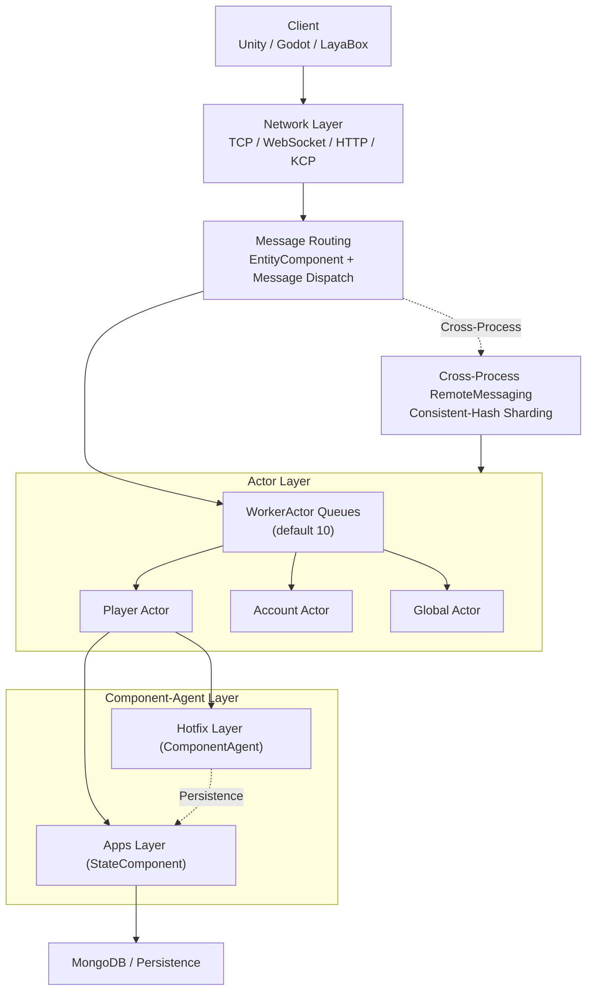

# Architecture Overview: Actor Model and Multi-Process Topology

GameFrameX organizes the runtime units of a game server around the Actor model. Actors collaborate through message passing rather than shared state; multiple game processes route messages via a consistent ActorId encoding and ActorType segmentation, forming a horizontally scalable multi-process topology.

## Quick Start

1. Launch the `GameFrameX.Server.Start` main process. It loads two assemblies: `GameFrameX.Apps` (persistent state layer) and `GameFrameX.Hotfix` (hot-reloadable business layer).
2. Clients connect to the network layer via any of TCP / WebSocket / HTTP / KCP. Messages are routed to the corresponding Actor handler.
3. The server calculates which process an Actor lives in based on its ActorId. For cross-process delivery, it uses `RemoteMessaging`; for in-process delivery, it dispatches to the `WorkerActor` queue.

```csharp
// Obtain a player component agent through ActorId (typical in-process usage)
var agent = await ActorManager.GetComponentAgent<PlayerComponentAgent>(actorId);

[Actor.cs#L38-L100](https://github.com/GameFrameX/GameFrameX.Server.Source/blob/main/GameFrameX.Core/Actors/Actor.cs#L38-L100)
```

## How It Works

GameFrameX encapsulates "game entities" as `IActor` and "pending messages" as `IWorkerActor`, achieving lock-free serialization with TPL DataFlow. Across processes, consistent-hash sharding is applied using the high-order segments of `ActorId` (`ActorType` + process / data-center identifier).



- **Actor = State Container**: `IActor` owns `Id`, `Type`, `ScheduleIdSet`, and `WorkerActor`. Messages within an Actor are processed serially by its exclusive `WorkerActor`, requiring no locks. See [IActor.cs](https://github.com/GameFrameX/GameFrameX.Server.Source/blob/main/GameFrameX.Core/Abstractions/IActor.cs#L38-L100).
- **WorkerActor = Message Pump**: Built on TPL DataFlow, it transforms inbound messages into serializable task items that execute in order. By default, `ActorManager` starts 10 `WorkerActor` instances as shards. See [ActorManager.cs](https://github.com/GameFrameX/GameFrameX.Server.Source/blob/main/GameFrameX.Core/Actors/ActorManager.cs#L53-L100).
- **In-Process vs. Cross-Process**: `ActorManager` maintains a local-process Actor table using `ConcurrentDictionary<long, Actor>`. For cross-process communication, the target process is located via `RemoteMessaging` + consistent hashing.
- **Type Segmentation**: `ActorType` is encoded as a `ushort`. Values less than `Separator` denote "single-instance global types", while values greater than `Separator` denote "multi-instance types" (e.g., players, guilds). The ActorId is formed by combining a snowflake ID with the ActorType, ensuring uniqueness. See [ActorType.cs](https://github.com/GameFrameX/GameFrameX.Server.Source/blob/main/GameFrameX.Apps/ActorType.cs#L38-L60).

## Next Steps

- For internals of a specific Actor, see `GameFrameX.Core/Actors/Actor.cs`.
- For cross-process message sending and receiving, see `GameFrameX.NetWork.Abstractions` and `NetWorkSenderFactory`.
- For ActorId encoding and the snowflake algorithm, see `GameFrameX.Utility/ActorIdGenerator.cs`.
- For component agents and the hot-update boundary, see the "Component-Agent Layer and Hot Reload" page.

## Related Links

- [IActor.cs](https://github.com/GameFrameX/GameFrameX.Server.Source/blob/main/GameFrameX.Core/Abstractions/IActor.cs#L38-L100)
- [IWorkerActor.cs](https://github.com/GameFrameX/GameFrameX.Server.Source/blob/main/GameFrameX.Core/Abstractions/IWorkerActor.cs)
- [ActorManager.cs](https://github.com/GameFrameX/GameFrameX.Server.Source/blob/main/GameFrameX.Core/Actors/ActorManager.cs#L53-L100)
- [Actor.cs](https://github.com/GameFrameX/GameFrameX.Server.Source/blob/main/GameFrameX.Core/Actors/Actor.cs)
- [WorkActor.cs](https://github.com/GameFrameX/GameFrameX.Server.Source/blob/main/GameFrameX.Core/Actors/Impl/WorkActor.cs)
- [ActorType.cs](https://github.com/GameFrameX/GameFrameX.Server.Source/blob/main/GameFrameX.Apps/ActorType.cs#L38-L60)
- [ActorIdGenerator.cs](https://github.com/GameFrameX/GameFrameX.Server.Source/blob/main/GameFrameX.Utility/ActorIdGenerator.cs)
- [NetWorkSenderFactory.cs](https://github.com/GameFrameX/GameFrameX.Server.Source/blob/main/GameFrameX.NetWork/NetWorkSenderFactory.cs)