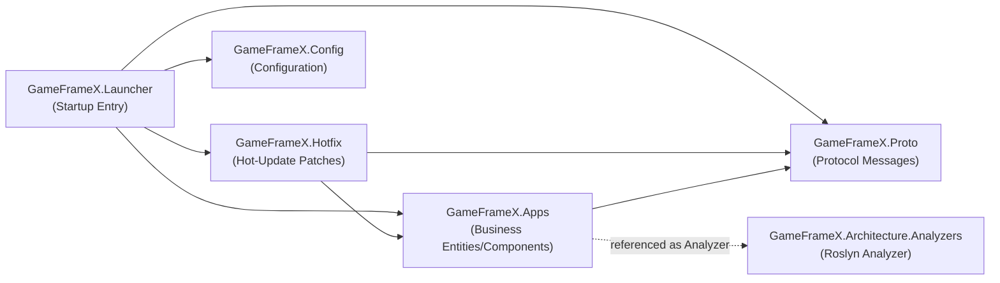

# Project Structure and Layering (Apps / Hotfix / Proto / Config) Overview

The GameFrameX.Server solution splits the server project into four single-responsibility C# class libraries (plus Launcher, Analyzers, and Hotfix.Tests), allowing "protocol → business logic → hot-update patches → config loading → startup entry" to be maintained independently. The overview below shows what each project contains and who references whom.

## Quick Start

Open `Server.sln`, and you will see the following projects (all located in the repository root):

| Project | csproj Path | Target Framework | Main Responsibility |
|---------|-------------|------------------|---------------------|
| `GameFrameX.Launcher` | [GameFrameX.Launcher/GameFrameX.Launcher.csproj](https://github.com/GameFrameX/GameFrameX.Server/blob/main/GameFrameX.Launcher/GameFrameX.Launcher.csproj) | — (TBD) | Program startup entry point |
| `GameFrameX.Hotfix` | [GameFrameX.Hotfix/GameFrameX.Hotfix.csproj](https://github.com/GameFrameX/GameFrameX.Server/blob/main/GameFrameX.Hotfix/GameFrameX.Hotfix.csproj) | — (TBD) | Hot-update business logic patches |
| `GameFrameX.Config` | [GameFrameX.Config/GameFrameX.Config.csproj](https://github.com/GameFrameX/GameFrameX.Server/blob/main/GameFrameX.Config/GameFrameX.Config.csproj) | — (TBD) | Runtime configuration items |
| `GameFrameX.Proto` | [GameFrameX.Proto/GameFrameX.Proto.csproj](https://github.com/GameFrameX/GameFrameX.Server/blob/main/GameFrameX.Proto/GameFrameX.Proto.csproj) | — (TBD) | Network protocol / message definitions |
| `GameFrameX.Apps` | [GameFrameX.Apps/GameFrameX.Apps.csproj](https://github.com/GameFrameX/GameFrameX.Server/blob/main/GameFrameX.Apps/GameFrameX.Apps.csproj) | `net10.0` | Business entities, components, states (see reference relationship examples below) |
| `GameFrameX.Architecture.Analyzers` | [GameFrameX.Architecture.Analyzers/GameFrameX.Architecture.Analyzers.csproj](https://github.com/GameFrameX/GameFrameX.Server/blob/main/GameFrameX.Architecture.Analyzers/GameFrameX.Architecture.Analyzers.csproj) | — (TBD) | Compile-time architecture constraint analyzer (referenced by other projects as a Roslyn Analyzer) |
| `GameFrameX.Hotfix.Tests` | [GameFrameX.Hotfix.Tests/GameFrameX.Hotfix.Tests.csproj](https://github.com/GameFrameX/GameFrameX.Server/blob/main/GameFrameX.Hotfix.Tests/GameFrameX.Hotfix.Tests.csproj) | — (TBD) | Unit tests for the Hotfix layer |

> The "TBD" entries in the table indicate that the specific content of those csproj files was not read directly this time; refer to the actual csproj files for specific information.

To get the entire project "up and running", execute the following in the repository root:

```bash
# Restore and build the entire solution
dotnet restore Server.sln
dotnet build  Server.sln -c Debug
```

## How It Works Overview

The four core projects form a one-way dependency chain at compile time via `ProjectReference`, avoiding circular references:



The dependency direction has only one main line (Launcher → Hotfix/Apps → Proto); Config hangs separately on the Launcher side, and the Analyzer is attached to Apps as a compile-time constraint and does not participate in the runtime call chain.

### Responsibilities of Each Layer

- **Proto (Protocol Layer)**: The `GameFrameX.Proto` project centrally stores message structure definitions for client-server and server-server communication, referenced jointly by Apps, Hotfix, and Launcher, ensuring the entire project uses the same protocol contract.
- **Apps (Business Implementation Layer)**: The `GameFrameX.Apps` project carries business entities (Entity), components (Component), states (State), and domain events (EventArgs) such as accounts, players, and game rooms. Its csproj directly references Proto:

  ```xml
  <ProjectReference Include="..\GameFrameX.Proto\GameFrameX.Proto.csproj" />
  <ProjectReference Include="..\GameFrameX.Architecture.Analyzers\GameFrameX.Architecture.Analyzers.csproj"
                    OutputItemType="Analyzer" ReferenceOutputAssembly="false" />
  ```

  `OutputItemType="Analyzer"` indicates that this reference is a **compile-time Roslyn analyzer**; it does not participate in runtime dependencies and only performs architecture rule checks on the code under Apps during `dotnet build`.

  Source: [GameFrameX.Apps/GameFrameX.Apps.csproj#L10-L11](https://github.com/GameFrameX/GameFrameX.Server/blob/main/GameFrameX.Apps/GameFrameX.Apps.csproj#L10-L11)

- **Hotfix (Hot-Update Layer)**: `GameFrameX.Hotfix` depends on Apps and Proto, carrying business patches that can be hot-replaced at runtime; `GameFrameX.Hotfix.Tests` provides unit tests for it.
- **Config (Configuration Layer)**: `GameFrameX.Config` centrally manages the reading and validation of configuration items such as server startup, connections, and databases.
- **Launcher (Startup Entry)**: `GameFrameX.Launcher` is the executable entry point of the solution (listed in `.sln` as `Project("{9A19103F-16F7-4668-BE54-9A1E7A4F7556}")`, i.e., an SDK-style executable project); it initializes Config at startup, loads Proto, and registers patches with Hotfix.
- **Architecture.Analyzers (Architecture Constraints)**: `GameFrameX.Architecture.Analyzers` is referenced by Apps as a Roslyn Analyzer, enforcing at compile time that code must be organized according to the established layering, preventing business logic from being written in the wrong layer.

### Solution Composition (verified item by item from `Server.sln`)

The following 7 `Project(...)` lines come directly from `Server.sln` and are the "authoritative list" of project layering:

| Project GUID | Project Name |
|--------------|--------------|
| `{835335CB-D99B-4CB9-99D3-A7883306E723}` | GameFrameX.Launcher |
| `{E47F7B43-E435-4B9E-AD10-1FE0D19F45CF}` | GameFrameX.Hotfix |
| `{08B73D90-AB00-4B9D-AE3C-AB19E6D594F9}` | GameFrameX.Config |
| `{12AA7D1B-E3EB-4DC4-BEAA-0C7BC5047B0C}` | GameFrameX.Proto |
| `{EAA64025-FD7E-4E0F-92D1-AEBAC1A552BF}` | GameFrameX.Apps |
| `{B973B133-20C6-4E43-AE76-99D845F93E6E}` | GameFrameX.Architecture.Analyzers |
| `{B216586B-DCF1-4492-90E3-34F0BE57BCD9}` | GameFrameX.Hotfix.Tests |

Source: [Server.sln#L6-L26](https://github.com/GameFrameX/GameFrameX.Server/blob/main/Server.sln#L6-L26)

## Apps Project Directory Conventions

Three top-level business directories (`Account\`, `Player\`, `Server\`) are explicitly declared in `GameFrameX.Apps/GameFrameX.Apps.csproj`; business code must be placed under these directories:

```xml
<Folder Include="Account\" />
<Folder Include="Player\" />
<Folder Include="Server\" />
```

Source: [GameFrameX.Apps/GameFrameX.Apps.csproj#L15-L17](https://github.com/GameFrameX/GameFrameX.Server/blob/main/GameFrameX.Apps/GameFrameX.Apps.csproj#L15-L17)

Actual directory examples (existing files under `GameFrameX.Apps/`, which can serve as references for future coding):

| Top-Level Directory | Example Files |
|---------------------|---------------|
| `Account/` | [Login/Component/LoginComponent.cs](https://github.com/GameFrameX/GameFrameX.Server/blob/main/GameFrameX.Apps/Account/Login/Component/LoginComponent.cs), [Login/Entity/LoginState.cs](https://github.com/GameFrameX/GameFrameX.Server/blob/main/GameFrameX.Apps/Account/Login/Entity/LoginState.cs) |
| `Game/` | [RockPaperScissors/Component/RockPaperScissorsGameComponent.cs](https://github.com/GameFrameX/GameFrameX.Server/blob/main/GameFrameX.Apps/Game/RockPaperScissors/Component/RockPaperScissorsGameComponent.cs), [Room/Component/RoomComponent.cs](https://github.com/GameFrameX/GameFrameX.Server/blob/main/GameFrameX.Apps/Game/Room/Component/RoomComponent.cs) |
| `Common/Event/` | [EventAttribute.cs](https://github.com/GameFrameX/GameFrameX.Server/blob/main/GameFrameX.Apps/Common/Event/EventAttribute.cs), [EventId.cs](https://github.com/GameFrameX/GameFrameX.Server/blob/main/GameFrameX.Apps/Common/Event/EventId.cs) |
| `Common/EventData/` | [AttributeChangedEventArgs.cs](https://github.com/GameFrameX/GameFrameX.Server/blob/main/GameFrameX.Apps/Common/EventData/AttributeChangedEventArgs.cs), [PlayerSendItemEventArgs.cs](https://github.com/GameFrameX/GameFrameX.Server/blob/main/GameFrameX.Apps/Common/EventData/PlayerSendItemEventArgs.cs) |
| `Common/Session/` | [Session.cs](https://github.com/GameFrameX/GameFrameX.Server/blob/main/GameFrameX.Apps/Common/Session/Session.cs), [SessionManager.cs](https://github.com/GameFrameX/GameFrameX.Server/blob/main/GameFrameX.Apps/Common/Session/SessionManager.cs) |
| Root directory | [AppsHandler.cs](https://github.com/GameFrameX/GameFrameX.Server/blob/main/GameFrameX.Apps/AppsHandler.cs), [ActorType.cs](https://github.com/GameFrameX/GameFrameX.Server/blob/main/GameFrameX.Apps/ActorType.cs), [BsonClassMapHelper.cs](https://github.com/GameFrameX/GameFrameX.Server/blob/main/GameFrameX.Apps/BsonClassMapHelper.cs), [CacheStateTypeManager.cs](https://github.com/GameFrameX/GameFrameX.Server/blob/main/GameFrameX.Apps/CacheStateTypeManager.cs) |

> The files in the table were all obtained by scanning `GameFrameX.Apps/**/*.cs` via `ListFiles`; the `Player/` and `Server/` directories are declared in the csproj, but their files were not listed directly this time.

## Next Steps

- To add business logic under `Account/`, `Player/`, or `Server/`, see "How to Add a New Business Module in the Apps Layer" (TBD).
- To add protocol messages, see "Proto Protocol Message Definition Guidelines" (TBD).
- To add hot-updatable patches to Hotfix, see "Hotfix Hot-Update Writing Guide" (TBD).
- To add configuration items, see "Config Loading and Validation" (TBD).
- To start the entire server, see "Launcher Startup Process" (TBD).