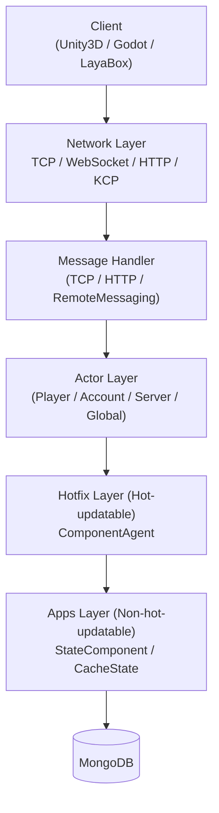

# Overview

GameFrameX Server is a high-performance, cross-platform game server framework built on C# .NET 10.0. It adopts the Actor model with lock-free message queues, supports hot-update mechanisms, and is designed for multiplayer online games. It can interface with multiple clients such as Unity3D, Godot, and LayaBox.

## Quick Start

### Environment Requirements

- [.NET 10.0 SDK](https://dotnet.microsoft.com/download/dotnet/10.0) (.NET 8/9 is not supported)
- MongoDB 4.x+
- Visual Studio 2022 or JetBrains Rider

### Startup Process

1. Start MongoDB:

```bash
docker run -d -p 27017:27017 --name mongo mongo:8.2
```

Source: [README.zh-CN.md](https://github.com/GameFrameX/GameFrameX.Server.Source/blob/main/README.zh-CN.md#L192-L199)

2. Restore and build the project:

```bash
dotnet restore
dotnet build
```

Source: [README.zh-CN.md](https://github.com/GameFrameX/GameFrameX.Server.Source/blob/main/README.zh-CN.md#L182-L189)

3. Start the server (taking the Game type as an example):

```bash
dotnet run --project GameFrameX.Launcher -- \
    --ServerType=Game \
    --ServerId=1000 \
    --OuterPort=29100 \
    --HttpPort=28080 \
    --DataBaseUrl=mongodb://127.0.0.1:27017 \
    --DataBaseName=gameframex
```

Source: [README.zh-CN.md](https://github.com/GameFrameX/GameFrameX.Server.Source/blob/main/README.zh-CN.md#L201-L210)

4. Verify startup: visit `http://localhost:28080/game/api/health` to check the health status, and check the console logs to confirm that the `Actor` and listening ports are initialized successfully.

Source: [README.zh-CN.md](https://github.com/GameFrameX/GameFrameX.Server.Source/blob/main/README.zh-CN.md#L212-L214)

## How It Works at a Glance

GameFrameX Server consists of four layers: the network layer receives client messages, the Actor layer performs lock-free serial processing based on TPL DataFlow, the business logic is implemented by the hot-updatable Hotfix layer, and the state data is managed by the non-hot-updatable Apps layer and written to MongoDB through batch persistence.



Source: [README.zh-CN.md](https://github.com/GameFrameX/GameFrameX.Server.Source/blob/main/README.zh-CN.md#L92-L127)

### Core Features

| Category | Capabilities |
|------|------|
| Concurrency Model | Actor model + fully asynchronous async/await, zero-lock design, batch persistence, Snowflake ID |
| Hot Update | Zero-downtime loading of new assemblies, separation of state and logic, 10-minute grace period for unloading old assemblies, HTTP-based version specification |
| Network Protocols | TCP (SuperSocket), WebSocket, HTTP/HTTPS (Kestrel + Swagger), KCP (experimental), cross-process RemoteMessaging |
| Database | MongoDB primary database, with health state machine, connection pool, OpenTelemetry metrics |
| Observability | OpenTelemetry Metrics/Tracing/Logging, Prometheus export, Serilog console/file/Loki output |

Source: [README.zh-CN.md](https://github.com/GameFrameX/GameFrameX.Server.Source/blob/main/README.zh-CN.md#L50-L89)

### Project Structure

```
Server/
├── GameFrameX.Launcher/              # Application entry point
├── GameFrameX.StartUp/               # Startup orchestration and initialization
├── GameFrameX.Core/                  # Core framework (Actor, Component, Event, Hot-update management)
├── GameFrameX.Apps/                  # State data layer (non-hot-updatable)
├── GameFrameX.Hotfix/                # Business logic layer (hot-updatable)
├── GameFrameX.Config/                # Game configuration tables (LuBan generated)
├── GameFrameX.NetWork/               # Network core (message objects, senders, WebSocket)
├── GameFrameX.NetWork.HTTP/          # HTTP server (Swagger, Kestrel)
├── GameFrameX.NetWork.Kcp/           # KCP protocol support
├── GameFrameX.NetWork.RemoteMessaging/ # Cross-process remote messaging (circuit breaker, consistent hashing)
├── GameFrameX.DataBase.Mongo/        # MongoDB implementation
├── GameFrameX.Monitor/               # OpenTelemetry + Prometheus integration
├── GameFrameX.Utility/               # Utility collection (logging, compression, object pool, Mapster)
├── GameFrameX.AppHost/               # .NET Aspire application host
└── Tests/GameFrameX.Tests/           # xUnit test suite
```

Source: [README.zh-CN.md](https://github.com/GameFrameX/GameFrameX.Server.Source/blob/main/README.zh-CN.md#L131-L162)

## What's Next

- Want to get it running first: Follow the "Quick Start" above to complete clone → build → startup.
- Want to know the default values of each configuration item: See the "Configuration Reference" (listed by dimensions such as `--ServerType` / `--OuterPort` / `--DataBaseUrl`).
- Want to write your first business Handler: See "How to Implement a Business Handler" (examples based on `ComponentAgent` + `StateComponent`).
- Errors after startup: See "What to Do When Startup Fails" (including common symptoms such as MongoDB connection issues, port conflicts, Actor timeouts).
- Want to learn about Actors and Components: See "Core Concepts: Actor / Component / Proxy".