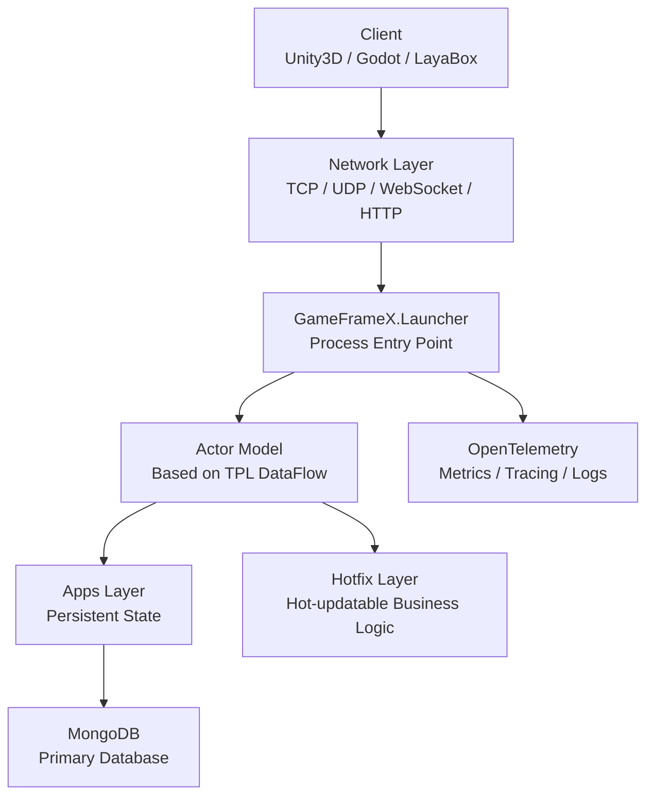

# Quick Start: Set Up Your First Game Server

Follow the steps on this page to bring up GameFrameX Server locally and run a game server process that can listen on TCP / HTTP / WebSocket. Verify successful startup through the health check endpoint. The framework is based on .NET 10.0, uses the Actor model, and connects to MongoDB by default for state persistence.

## Prerequisites

| Dependency | Version | Description |
|------|------|------|
| .NET SDK | 10.0 | The framework targets .NET 10.0; download from the [dotnet official site](https://dotnet.microsoft.com/download/dotnet/10.0) |
| MongoDB | 4.x and above | Primary database, used for state persistence; local default `mongodb://127.0.0.1:27017` |
| Docker (optional) | Latest | Use the `docker-compose.yml` in the repository root to start with one click if you don't want to install MongoDB |
| IDE | Any | Rider / VS 2022 (17.10+) / VS Code all work |

## Quick Start

### 1. Get the Source Code

```bash
git clone https://github.com/GameFrameX/GameFrameX.Server.Source.git
cd GameFrameX.Server.Source
```

### 2. Prepare the Database (Choose One)

**Method A: Use the Docker Compose Included in the Repository**

```bash
docker-compose up -d mongodb
```

**Method B: Start MongoDB Yourself**, making sure it listens on `127.0.0.1:27017`.

### 3. Build the Solution

```bash
dotnet build GameFrameX.Launcher -c Debug
```

### 4. Start the Server

Minimal startup command (`Launcher` is the process entry point):

```bash
dotnet run --project GameFrameX.Launcher -- \
    --ServerType=Game \
    --ServerId=1000 \
    --OuterPort=29100 \
    --HttpPort=28080 \
    --DataBaseUrl=mongodb://127.0.0.1:27017 \
    --DataBaseName=gameframex
```

All configuration items are passed via `--Key=Value` command-line arguments, defined in `StartupOptions`. Common items are listed in the table below:

| Configuration Item | Required | Default | Description |
|--------|----------|--------|------|
| `ServerType` | Yes | None | Server type, such as `Game`, `Social` |
| `ServerId` | Yes | None | Unique server identifier ID |
| `DataBaseUrl` | Yes | None | MongoDB connection string |
| `DataBaseName` | Yes | None | Database name |
| `OuterPort` | No | `29100` | TCP port for clients |
| `HttpPort` | No | `8080` | HTTP / health check port |
| `IsEnableHttp` | No | `true` | Whether to enable the HTTP service |
| `HttpIsDevelopment` | No | `false` | Development mode (enables Swagger) |
| `IsEnableWebSocket` | No | `false` | Whether to enable WebSocket |

### 5. Verify Startup

After starting, do two things to confirm the service is running normally:

1. **Health Check Endpoint** (default API root path is `/game/api/`):
   ```bash
   curl http://localhost:28080/game/api/health
   ```
2. **Check the Console Logs**, when you see something like `Server started, listening on 0.0.0.0:29100` it means startup was successful.

## How It Works at a Glance



- **Launcher**: Process entry point, receives command-line arguments, starts the network layer and Actor container.
- **Apps Layer**: Defines `StateComponent` and `BaseCacheState`, responsible for state persistence, cannot be hot-updated.
- **Hotfix Layer**: Implements `StateComponentAgent`, holds business logic, supports runtime hot updates.
- **Actor Model**: Lock-free high concurrency, internal state is accessed serially through message queues.
- **Network Layer**: TCP (based on SuperSocket), WebSocket, HTTP/Kestrel multi-protocol in parallel.

## Write a Minimal Login Component

The core pattern of the framework is **state-logic separation**. Below is a login example demonstrating the complete chain.

**1. State (Apps Layer, Not Hot-updatable)**

`GameFrameX.Apps/Account/Login/Entity/LoginState.cs` already exists, with fields including account, Token, login time, etc.

**2. Component (Apps Layer, Not Hot-updatable)**

```csharp
public class LoginComponent : StateComponent<LoginState>
{
    protected override async Task OnInit()
    {
        await base.OnInit();
        // Initialize component state
    }
}
```

**3. Business Logic (Hotfix Layer, Hot-updatable)**

`GameFrameX.Hotfix/Logic/Account/Login/ReqLoginHandler.cs` already exists, serving as an HTTP / message handler that calls `LoginComponent` to write the Token.

**4. Cross-Layer Call**

```csharp
// Get the component agent through ActorManager
var loginAgent = await ActorManager.GetComponentAgent<LoginComponentAgent>(actorId);
var result = await loginAgent.Login(account, password);
```

For the complete business development workflow and component agent pattern, see the "Business Logic Development" chapter; for the Hotfix assembly replacement mechanism, see the "Hot Update Mechanism" chapter.

## Next Steps

- **Full Configuration Reference**: See "Configuration Reference" — all `--Key=Value` parameters, defaults, and examples.
- **Business Development**: See "How to Write an Actor Component" — state, component, and agent trio.
- **Hot Update**: See "How to Hot-Update Business Logic" — zero-downtime Hotfix assembly replacement.
- **Docker Deployment**: See "Docker Deployment" — root directory `docker-compose.yml` / `docker-compose.multi.yml` multi-process orchestration.
- **Monitoring**: See "Monitoring and Observability" — Prometheus, Grafana Loki, OpenTelemetry integration.