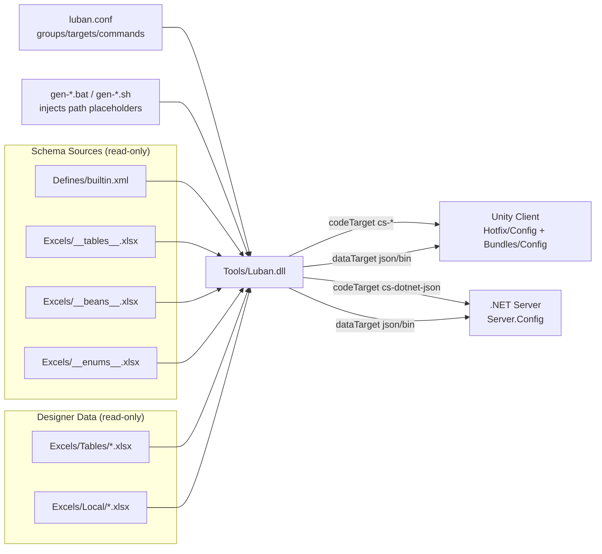

# How the Config Tool Works

GameFrameX.Config is a configuration table tool based on [Luban](https://github.com/GameFrameX/luban): it reads the Excel workbooks under `Excels/` (data tables + localization tables + advanced definition tables), combines them with the configuration in `Defines/builtin.xml` and `luban.conf`, and generates everything in one pass into C# code and data files that can be loaded directly on both the client and server sides.

## One-Sentence Workflow

Run the `gen-*.bat` or `gen-*.sh` script → the tool reads `luban.conf` → invokes `Tools/Luban.dll` one by one according to the commands in the `targets` list → outputs files under `Hotfix/Config/Generate/` (code) and `Bundles/Config/` (data) in the Unity project, while also producing the server version under `Server.Config/`.

## Configuration-Driven: `luban.conf` Determines What to Generate

`luban.conf` is the tool's "central configuration"; all behavior originates from here. Source: [luban.conf](https://github.com/GameFrameX/GameFrameX.Config/blob/main/luban.conf)

| Field | Meaning | Example |
|------|------|------|
| `groups` | Marker groups, `c` = client, `s` = server | `"names": ["c"]`, ``"names": ["s"]` |
| `schemaFiles` | Sources of data schema definitions (including field types, enums, beans, table skeletons) | `Defines`, `Excels/__tables__.xlsx`, `Excels/__beans__.xlsx`, `Excels/__enums__.xlsx` |
| `dataDir` | Directory where the business data resides | `Excels` |
| `targets` | The set of targets to produce in a single generation (each target has its own namespace, manager, groups) | `server`, `client`, `all` |
| `commands` | The actual command lines passed to Luban; each target corresponds to multiple commands (different formats such as json / bin) | `--target server --dataTarget json --codeTarget cs-dotnet-json …` |
| `toolPath` | Path to the Luban tool dll | `/../Config/Tools/Luban.dll` |
| `UNITY_ASSETS_PATH` / `SERVER_PATH` | Placeholders for the client and server project locations, expanded within the commands | Injected by the run script |

Each entry in `commands` uses the placeholders `%UNITY_ASSETS_PATH%` and `%SERVER_PATH%` to determine which project directory the code and data are written to.

## Three Layers of Data: Behavior / Schema / Data

The tool divides its work into three layers of sources:

1. **Behavior layer** (`luban.conf`): determines generation formats, targets, and namespaces.
2. **Schema layer** (`Defines/builtin.xml` + `Excels/__*__.xlsx`): defines field types, enums, structs, and table skeletons.
3. **Data layer** (`Excels/Tables/*.xlsx`, `Excels/Local/*.xlsx`): the actual data filled in by designers.

Source example — `Defines/builtin.xml` maps the same "coordinate" to Unity types for the client and .NET types for the server:

```xml
<bean name="vec3" valueType="1" sep="," group="*">
    <var name="x" type="float"/>
    <var name="y" type="float"/>
    <var name="z" type="float"/>
    <mapper target="client" codeTarget="cs-bin,cs-simple-json">
        <option name="type" value="UnityEngine.Vector3"/>
        <option name="constructor" value="ExternalTypeUtil.NewVector3"/>
    </mapper>
    <mapper target="server" codeTarget="cs-bin,cs-dotnet-json">
        <option name="type" value="System.Numerics.Vector3"/>
        <option name="constructor" value="ExternalTypeUtil.NewVector3"/>
    </mapper>
</bean>
```

Source: [Defines/builtin.xml](https://github.com/GameFrameX/GameFrameX.Config/blob/main/Defines/builtin.xml#L14-L26)

In other words: designers use a single Excel file, and the tool automatically outputs code for the corresponding language/engine per target; there is no need to write separate versions for the client and the server.

## Three Types of Generation Targets

Source: [luban.conf](https://github.com/GameFrameX/GameFrameX.Config/blob/main/luban.conf#L35-L60)

| Target Name | `topModule` (Namespace) | `manager` | When Enabled |
|--------|-----------------------|-----------|----------|
| `server` | `GameFrameX.Config` | `TablesComponent` | Server-side code/data, groups = `s` |
| `client` | `Hotfix.Config` | `TablesComponent` | Unity client code/data, groups = `c` |
| `all` | `cfg` | `Tables` | Generic export, groups = `c,s` |

Each command in the `commands` list can independently switch the `dataTarget` (`json` or `bin`), the `codeTarget` (`cs-dotnet-json` / `cs-simple-json` / `cs-bin`), and `validationFailAsError`.

## Steps of a Complete Generation

1. Designers fill in `Excels/Tables/*.xlsx` and `Excels/Local/*.xlsx` (naming follows `letter-EnglishName-ChineseName`).
2. Run `gen-client-json.bat / .sh` (or `gen-server-bin.bat / .sh`, etc.) from the repository root; the script internally injects `UNITY_ASSETS_PATH` and `SERVER_PATH` into the placeholders.
3. The tool reads `luban.conf` and launches `Tools/Luban.dll` in the order of `commands`, one command per target.
4. Luban parses the schema files (`Defines/`, `__tables__.xlsx`, `__beans__.xlsx`, `__enums__.xlsx`) and validates them one by one against the `Excels/` data.
5. C# source code is generated according to `codeTarget` into `%UNITY_ASSETS_PATH%/Hotfix/Config/Generate/` or `%SERVER_PATH%/Server.Config/Config/`.
6. Data files are generated according to `dataTarget` into `Bundles/Config/` (packaged into the first bundle at runtime) or `Server.Config/Json/` (read by the server).
7. Once the terminal reports success and the files are in place, you can directly call `tables.TbXxx.Get(id)` in the project.

## Architecture Diagram



## Design Intent (Background)

- **Configuration as the center**: `luban.conf` externalizes everything — "who generates, where to generate, and in what format" — into JSON; to add a new target or switch between json/bin, no changes to the tool itself are required.
- **One set of data, used by both sides**: In `Defines/builtin.xml`, the same bean is mapped to Unity and .NET types via `<mapper target="client" ...>` and `<mapper target="server" ...>` respectively, allowing the Unity client and the server to share the same set of business tables.
- **Group merging**: Files with the same English table name (e.g., `D-ItemConfig-道具表-1001.xlsx` and `D-ItemConfig-道具表-2001.xlsx`) are merged into a single table, making it easy to split large tables as needed.

## Related Links

- [Defines/builtin.xml](https://github.com/GameFrameX/GameFrameX.Config/blob/main/Defines/builtin.xml)
- [luban.conf](https://github.com/GameFrameX/GameFrameX.Config/blob/main/luban.conf)
- [README.zh-CN.md](https://github.com/GameFrameX/GameFrameX.Config/blob/main/README.zh-CN.md)
- Upstream tool [GameFrameX/luban](https://github.com/GameFrameX/luban)