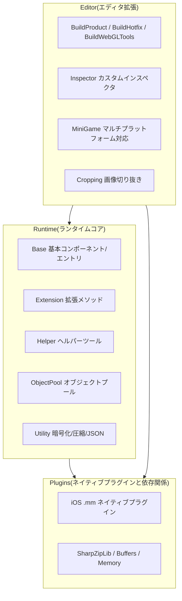

# フレームワーク三層構造の概要

GameFrameX は、独立系ゲーム開発者向けの Unity フレームワークであり、**Runtime / Plugins / Editor** の三層モジュールアーキテクチャを採用しています。三層間の役割は明確で、相互に連携しています:Runtime は実行時の中核機能を提供し、Plugins はネイティブプラットフォーム機能とサードパーティ依存関係を提供し、Editor はエディタ拡張とビルドパイプラインを提供します。このページでは、一つの図と一つの表で全体像を素早く把握できるようにします。

## 動作原理の概要



## 三層の役割早見表

| 層 | ディレクトリ | 主要ファイル | 主な役割 |
|----|------|----------|----------|
| **Runtime** | `Runtime/` | [GameEntry.cs](/Runtime/Base/GameEntry.cs#L46-L60)、[GameFrameworkComponent.cs](/Runtime/Base/GameFrameworkComponent.cs#L43-L45) | フレームワークエントリ、コンポーネント管理、イベントプール、参照プール、オブジェクトプール、変数システム、暗号化圧縮、JSON、拡張メソッド、ヘルパーツール |
| **Plugins** | `Plugins/` | [GameFrameX.mm](/Plugins/iOS/GameFrameX/GameFrameX.mm)、`ICSharpCode.SharpZipLib.dll`、`System.Memory.dll` | iOS ネイティブ機能、ZIP 圧縮ライブラリ、.NET メモリとランタイムサポート |
| **Editor** | `Editor/` | (上記フロー参照) | ビルドパイプライン、Inspector 拡張、マルチプラットフォーム対応、画像切り抜きツール |

## 次に進む

- Runtime 内部の Base / Extension / Helper / Utility などのサブモジュールの役割分担を知りたい場合は、《Runtime モジュール詳解》を参照してください。
- Plugins の iOS ネイティブプラグインと DLL 依存関係を知りたい場合は、《Plugins モジュール詳解》を参照してください。
- Editor のビルドパイプライン、ミニゲームのマルチプラットフォーム対応、Inspector 拡張を知りたい場合は、《Editor モジュール詳解》を参照してください。
- ゼロから最小構成のプロジェクトを動かしたい場合は、《クイックスタート》を参照してください。

## Runtime 層(ランタイムコア)

Runtime はフレームワークの全 C# コードであり、ディレクトリは役割に応じて 7 つのサブモジュールに分けられています。

| サブモジュール | 主要内容 | 説明 |
|--------|----------|------|
| **Base** | [GameEntry.cs](/Runtime/Base/GameEntry.cs#L46-L56)、[GameFrameworkComponent.cs](/Runtime/Base/GameFrameworkComponent.cs#L43-L45)、`EventPool/`、`ReferencePool/`、`TaskPool/`、`Variable/` | フレームワークエントリとコンポーネント基底クラス、イベントプール、参照プール、タスクプール、バインド可能変数、シングルトン |
| **Extension** | `BinaryExtension`、`StringExtensions`、`CollectionExtensions`、`UnityEngine.Transform` 拡張など | 汎用と Unity 型の拡張メソッド |
| **Helper** | `ApplicationHelper`、`FileHelper`、`PathHelper`、`MathHelper`、`TimerHelper`、`ZipHelper` など | アプリケーション、ファイル、パス、数学、タイマー、圧縮などのランタイムヘルパー |
| **ObjectPool** | [ObjectPoolComponent.cs](/Runtime/ObjectPool/ObjectPoolComponent.cs) | `GameFrameworkComponent` のサブクラス。オブジェクト再利用とメモリ最適化を担当 |
| **Property** | `BindableProperty` | MVVM スタイルのバインド可能プロパティ |
| **ReferencePool** | `ReferencePoolComponent` | 参照型オブジェクトプール。GC 圧力を軽減 |
| **Utility** | `Utility.Encryption`(AES/RSA/DSA)、`Utility.Compression`、`Utility.Json`、`Utility.Hash`(MD5/SHA1/HMAC)、`Utility.Verifier`(CRC32/CRC64) | 暗号化、圧縮、JSON、ハッシュ、検証などの純粋静的ツール |

エントリ型の例:

```csharp
using GameFrameX.Runtime;

// フレームワークエントリ。ゲームフレームワークコンポーネントへの統一アクセスポイントを提供
public static class GameEntry { /* ... */ }

// GameEntry にアタッチされるすべてのコンポーネントはこの基底クラスを継承する
public abstract class GameFrameworkComponent : MonoBehaviour { /* ... */ }
```

ソース: [GameEntry.cs](/Runtime/Base/GameEntry.cs#L46-L60), [GameFrameworkComponent.cs](/Runtime/Base/GameFrameworkComponent.cs#L43-L45)

## Plugins 層(ネイティブプラグインと依存関係)

Plugins 層には、Unity C# 層で完結できないもののみが含まれます:ネイティブプラットフォームプラグインとサードパーティ .NET DLL。

| サブモジュール | ファイル | 説明 |
|--------|------|------|
| **iOS プラグイン** | [GameFrameX.mm](/Plugins/iOS/GameFrameX/GameFrameX.mm)、`GameFrameXTrackingAuthorization.mm` | iOS ネイティブ機能(例: ATT 追跡権限) |
| **圧縮ライブラリ** | `ICSharpCode.SharpZipLib.dll` | ZIP 圧縮/解凍。`Utility.Compression` から呼び出される |
| **メモリとバッファ** | `System.Buffers.dll`、`System.Memory.dll`、`System.IO.Pipelines.dll` | 高性能メモリと IO パイプライン |
| **ランタイムサポート** | `Microsoft.NET.StringTools.dll`、`System.Runtime.CompilerServices.Unsafe.dll` | 文字列最適化とアンセーフコードサポート |

## Editor 層(エディタ拡張)

Editor 層は Unity エディタ内でのみ有効であり、ビルドパイプラインと開発補助を提供します。

| サブモジュール | 主要ファイル | 説明 |
|--------|----------|------|
| **BuildProduct** | `BuildProductHelper`、`BuildPostProcessHelper`、`IBuilderPreHookHandler`、`IBuilderPostHookHandler` | 汎用ビルドヘルパーとビルド前後のフック |
| **BuildHotfix** | `BuildHotfixHelper`、`HotFixAssemblyDefinitionHelper` | HybridCLR ホットアップデートアセンブリビルド |
| **BuildWebGLTools** | `BuildWebGLToolsWithHybridCLR` | WebGL プラットフォーム + HybridCLR 連携ビルド |
| **MiniGame** | [MiniGameDefineSymbolHelper.WeChat.cs](/Editor/MiniGame/DomesticMiniGames/MiniGameDefineSymbolHelper.WeChat.cs) など 21 個のプラットフォームマクロ定義 | WeChat、Alipay、Douyin、Kuaishou、Baidu、Jingdong、Meituan、Taobao などのプラットフォームをワンクリック切替 |
| **Inspector** | `BaseComponentInspector`、`ObjectPoolComponentInspector`、`ReferencePoolComponentInspector` | カスタムインスペクタパネル。実行時にプールの状態を観察可能 |
| **Cropping** | `CroppingWindow` | 画像切り抜きツール |
| **InspectorLockShortcut** | `InspectorLockShortcut` | Inspector ロックのショートカット |

ビルドフックの使用例(擬似コード、実際のシグネチャはソースファイルを参照):

```csharp
using GameFrameX.Editor;

public sealed class MyPreBuildHook : IBuilderPreHookHandler
{
    public void OnBeforeBuild(BuildContext ctx) { /* ... */ }
}
```