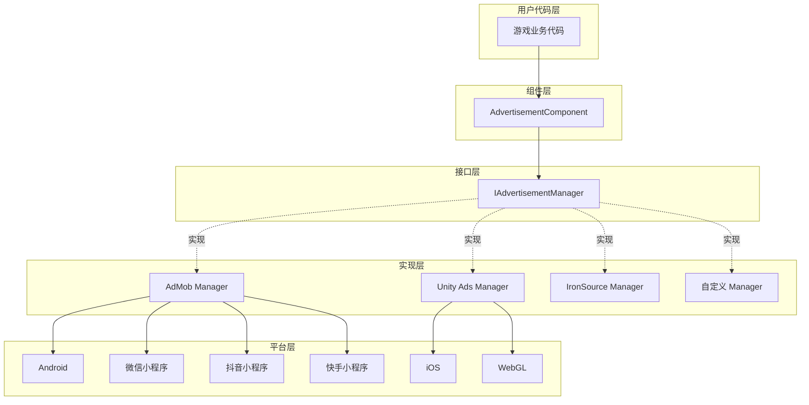
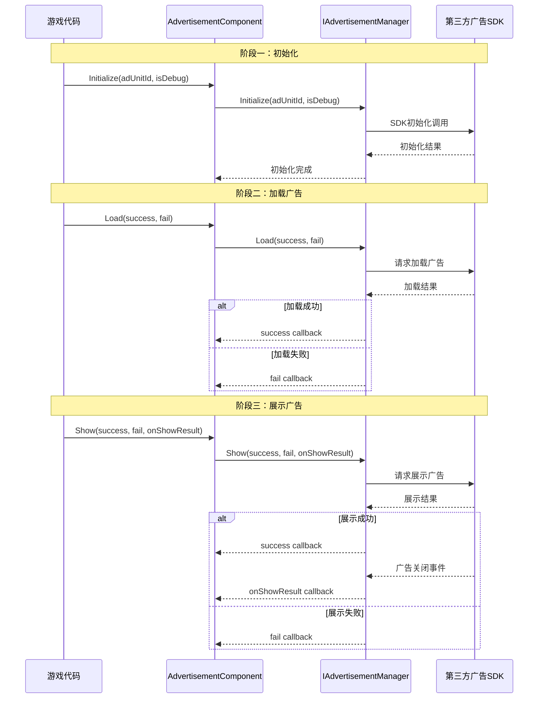

# 概要

Game Frame X Advertisement 是 Game Frame X フレームワーク的広告コンポーネント，为 Unity プロジェクト提供統一された的広告機能抽象層。该コンポーネント采用ストラテジーパターン設計，使開発者能够轻松集成各种広告 SDK（如 AdMob、Unity Ads、IronSource 等），而无需変更コア业务コード。

## プロジェクト紹介

`com.gameframex.unity.advertisement` 是 Game Frame X フレームワーク的コアモジュール之一，专门用于解决 Unity プロジェクト中広告集成的複雑性。该コンポーネント提供します一套標準化的広告操作インターフェース，開発者只需编写一次広告呼び出しコード，つまり可在不同的広告プラットフォーム之间切换。

该コンポーネントサポート Unity 2017.1 及更高バージョン，当前最新バージョン为 1.4.0。采用 Apache License 2.0 开源许可证，允许在商业和非商业プロジェクト中免费使用。

## アーキテクチャ設計

该コンポーネント采用分层アーキテクチャ設計，将広告业务逻辑与具体プラットフォーム実装分离。这种設計遵循了依存関係逆転の原則，上层モジュール（AdvertisementComponent）依赖于抽象インターフェース（IAdvertisementManager），而不关心具体実装细节。

## コアコンポーネント

该コンポーネントパッケージ含四个コア类，它们各自承担不同的职责，协同完成広告機能的完全なカプセル化。

### AdvertisementComponent

 AdvertisementComponent 是ユーザー直接交互的主な入口，它継承自 GameFrameworkComponent，は Unity MonoBehaviour コンポーネント。開発者〜する必要があります将此コンポーネント追加到シーン中的任意 GameObject 上，次に通过コード呼び出し其メソッド来ロード和表示広告。

> Source: [AdvertisementComponent.cs](https://cnb.cool/GameFrameX/com.gameframex.unity.advertisement/blob/main/Runtime/Advertisement/AdvertisementComponent.cs#L1-L169)

该コンポーネント的コア职责含みます：根据当前运行プラットフォーム自动选择对应的広告ユニット ID、在 Unity ライフサイクル中初期化広告マネージャー、および提供 Load、Show、Play 三个主なメソッド供业务コード呼び出し。

### IAdvertisementManager

 IAdvertisementManager 是広告マネージャー的コアインターフェース，定義了所有広告操作的標準メソッド。任何具体的広告 SDK 実装都〜しなければなりません実装此インターフェース，从而保证不同広告プラットフォーム之间的行为一致性。

> Source: [IAdvertisementManager.cs](https://cnb.cool/GameFrameX/com.gameframex.unity.advertisement/blob/main/Runtime/Advertisement/IAdvertisementManager.cs#L1-L55)

该インターフェース定義了四个コアメソッド：Initialize 用于初期化広告マネージャー，SetExtraData 用于設定额外パラメータ，Load 用于预ロード広告，Show 用于表示広告。インターフェース設計采用了コールバックモード，通过 Action デリゲート処理异步操作的成功、失敗和結果コールバック。

### BaseAdvertisementManager

 BaseAdvertisementManager は抽象基底クラス，継承自 GameFrameworkModule 并実装了 IAdvertisementManager インターフェース。它为開発者提供します一个作成自定義広告マネージャー的起点，カプセル化了汎用的コールバック処理逻辑。

> Source: [BaseAdvertisementManager.cs](https://cnb.cool/GameFrameX/com.gameframex.unity.advertisement/blob/main/Runtime/Advertisement/BaseAdvertisementManager.cs#L1-L109)

该基底クラス定義了四个受保护的コールバックプロパティ：OnShowResult、OnLoadSuccess、OnLoadFail，分别对应広告表示結果、広告読み込み成功和広告読み込み失敗的情况。サブクラス〜できます这些コールバックプロパティ来トリガー相应的业务逻辑。

### AdvertisementComponentInspector

 AdvertisementComponentInspector 是 Unity エディタ的自定義检视パネル，継承自 ComponentTypeComponentInspector。它为 AdvertisementComponent 提供します使いやすい的图形化設定界面，開発者〜できます在 Inspector ウィンドウ中直接設定各プラットフォーム的広告ユニット ID。

> Source: [AdvertisementComponentInspector.cs](https://cnb.cool/GameFrameX/com.gameframex.unity.advertisement/blob/main/Editor/Inspector/AdvertisementComponentInspector.cs#L1-L72)

这个エディタ集成大大簡素化了設定フロー，開発者无需编写コードつまり可完成広告ユニット ID 的設定。

## ワークフロー

広告的標準工作フロー分为三个主なフェーズ：初期化、ロード和表示。这个フロー設計遵循了最佳实践，確認してください広告能够平稳ロード并及时表示。

初期化フェーズ在 AdvertisementComponent 的 Start メソッド中自动执行，使用 Inspector 中設定的広告ユニット ID。ロードフェーズ是可选的，但お勧め在表示広告前预先呼び出し Load メソッド，以减少ユーザー等待时间。表示フェーズ通过 Show メソッドトリガー，表示完成后会通过 onShowResult コールバック通知開発者広告是否被完全な視聴，这对于リワード動画広告尤为重要な。

## プラットフォームサポート

该コンポーネントサポート多种プラットフォーム和リリース目标，能够满足不同游戏プロジェクト的リリース需求。

| プラットフォーム | 設定フィールド | 説明 |
|------|----------|------|
| Android | m_adUnitIdAndroid | Google Play 和其他 Android 应用商店 |
| iOS | m_adUnitIdiOS | Apple App Store |
| WebGL | m_adUnitIdWebGL | 標準 WebGL リリース |
| WeChatミニゲーム | m_adUnitIdWebGLWeChat | WeChatミニゲームプラットフォーム |
| DouYinミニゲーム | m_adUnitIdWebGLDouYin | DouYinミニゲームプラットフォーム |
| KuaiShouミニゲーム | m_adUnitIdWebGLKuaiShou | KuaiShouミニゲームプラットフォーム |

コンポーネント会根据コンパイル时的プラットフォーム宏自动选择对应的広告ユニット ID。開発者〜する必要があります在对应プラットフォーム的リリース設定中設定正确的コンパイル宏，例えば ENABLE_WECHAT_MINI_GAME、ENABLE_DOUYIN_MINI_GAME、ENABLE_KUAISHOU_MINI_GAME 等。

## リワード動画サポート

该コンポーネント特别最適化了リワード動画広告的サポート，这是移动游戏中最常见的变现方法之一。リワード動画允许プレイヤー主动选择視聴広告以取得游戏内報酬，这种広告形式具有较高的ユーザー接受度和转化率。

リワード動画的コアフロー是：プレイヤートリガー視聴広告的动作 -> 広告表示 -> プレイヤー完全な視聴或中途閉じる -> コールバック通知開発者是否〜すべき发放報酬。onShowResult コールバック的布尔值パラメータ指示広告是否被完全な視聴：true 表示ユーザー視聴了完全な的広告，〜すべき发放報酬；false 表示ユーザー跳过了広告或因其他原因未完全な視聴，不〜すべき发放報酬。

这种設計確認してください了報酬发放的公平性，防止プレイヤー通过閉じる広告或使用其他方法跳过広告而取得不应得的報酬。

## 設計理念

该コンポーネント的設計遵循了几个コア原则，以確認してください其易用性、可拡張性和可靠性。

まず是開放閉鎖の原則，系统对拡張开放、对変更閉じる。当〜する必要がありますサポート新的広告プラットフォーム时，只需作成新的 IAdvertisementManager 実装类，无需変更现有コード。这种設計使得追加広告プラットフォーム变得シンプル可控，不会影响现有機能的稳定性。

其次是依存関係逆転の原則，高层モジュール不〜すべき依赖于低层モジュール，两者都〜すべき依赖于抽象。AdvertisementComponent 依赖于 IAdvertisementManager インターフェース，而不关心具体是哪个広告プラットフォーム的実装。这使得〜できます在不変更业务コード的情况下切换広告プラットフォーム。

最後に是単一責任の原則，每个类都有明确的职责边界。AdvertisementComponent 负责与 Unity ライフサイクル集成和分发呼び出し，IAdvertisementManager 定義インターフェース契约，具体実装类负责与各自的 SDK 交互。这种分离使得コード更容易理解和维护。

## 応用シナリオ

该コンポーネント適しています各种〜する必要があります広告变现的 Unity 游戏プロジェクト，特别是那些〜する必要がありますリリース到多个プラットフォーム的プロジェクト。通过統一された的インターフェース抽象，開発者〜できます一次性编写広告逻辑コード，次に根据〜する必要があります选择不同的広告プラットフォーム実装。

对于〜する必要があります在多个小程序プラットフォームリリース的プロジェクト，该コンポーネント的跨プラットフォーム広告ユニット ID 設定機能尤为重要な。開発者〜できます分别为微信、抖音、快手等プラットフォーム設定不同的広告ユニット，无需変更コードつまり可実装多プラットフォームリリース。

## 関連リンク

- [インストールガイド](./2-installation) - 理解する如何在プロジェクト中インストール和設定コンポーネント
- [快速开始](./3-getting-started) - 快速上手使用広告機能
- [コアコンセプト](./4-core-concepts) - 深入理解するコンポーネント的設計原理
- [プラットフォーム設定](./5-platforms) - 各プラットフォーム的詳細設定説明
- [API リファレンス](./6-api-reference) - 完全な的インターフェースドキュメント
- [常见問題](./7-troubleshooting) - 常见問題解答

## アップデート履歴

当前バージョン为 1.4.0，该バージョン为KuaiShouミニゲームプラットフォーム追加了 WebGL 広告ユニット ID サポート。コンポーネント持续迭代アップデート，每次アップデート都会带来新的プラットフォームサポート、機能增强和エラー修复。

> Source: [CHANGELOG.md](https://cnb.cool/GameFrameX/com.gameframex.unity.advertisement/blob/main/CHANGELOG.md#L1-L70)
