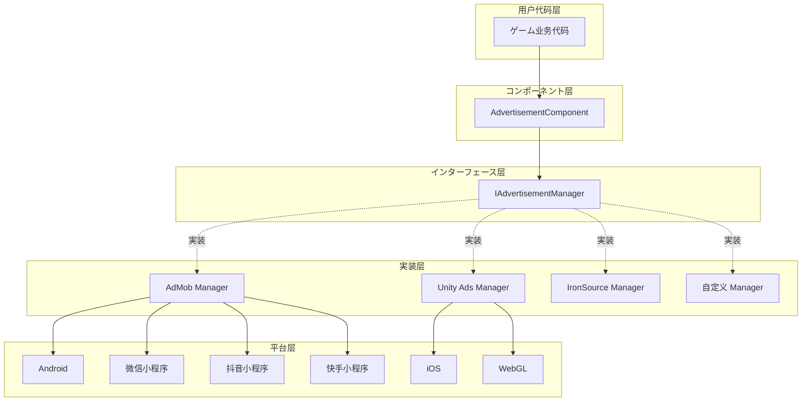
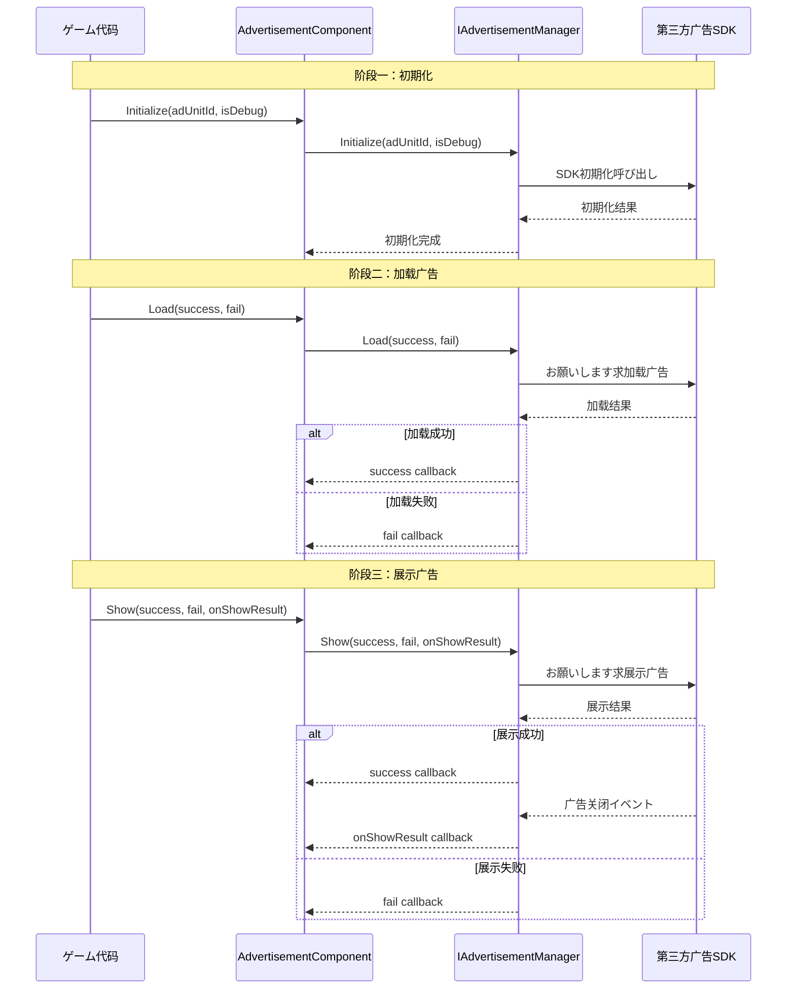

# 概要

Game Frame X Advertisement 是 Game Frame X フレームワーク的广告コンポーネント，为 Unity プロジェクト提供统一的广告機能抽象层。该コンポーネント采用策略模式设计，使開発者能够轻松集成各种广告 SDK（如 AdMob、Unity Ads、IronSource 等），而无需修改コア业务代码。

## プロジェクト简介

`com.gameframex.unity.advertisement` 是 Game Frame X フレームワーク的コア模块之一，专门に使用解决 Unity プロジェクト中广告集成的复杂性。该コンポーネント提供します一套标准化的广告操作インターフェース，開発者只需编写一次广告呼び出し代码，即可在不同的广告平台之间切换。

该コンポーネントサポート Unity 2017.1 及更高版本，当前最新版本为 1.4.0。采用 Apache License 2.0 开源许可证，允许在商业和非商业プロジェクト中免费使用。

## アーキテクチャ設計

该コンポーネント采用分层アーキテクチャ設計，将广告业务逻辑与具体平台実装分离。这种设计遵循了依赖倒置原则，上层模块（AdvertisementComponent）依赖于抽象インターフェース（IAdvertisementManager），而不关心具体実装细节。

## コアコンポーネント

该コンポーネント包含四个コアクラス，它们各自承担不同的职责，协同完成广告機能的完整封装。

### AdvertisementComponent

 AdvertisementComponent 是用户直接交互的主要エントリーポイント，它を継承 GameFrameworkComponent，は Unity MonoBehaviour コンポーネント。開発者必要将此コンポーネント添加到シーン中的任意 GameObject 上，然后を通じて代码呼び出し其メソッド来加载和展示广告。

> Source: [AdvertisementComponent.cs](https://cnb.cool/GameFrameX/com.gameframex.unity.advertisement/blob/main/Runtime/Advertisement/AdvertisementComponent.cs#L1-L169)

该コンポーネント的コア职责包括：に基づいて当前运行平台自动选择对应的广告位 ID、在 Unity 生命周期中初期化广告管理器、以及提供 Load、Show、Play 三个主要メソッド供业务代码呼び出し。

### IAdvertisementManager

 IAdvertisementManager 是广告管理器的コアインターフェース，定义了所有广告操作的标准メソッド。任何具体的广告 SDK 実装都必須実装此インターフェース，从而保证不同广告平台之间的行为一致性。

> Source: [IAdvertisementManager.cs](https://cnb.cool/GameFrameX/com.gameframex.unity.advertisement/blob/main/Runtime/Advertisement/IAdvertisementManager.cs#L1-L55)

该インターフェース定义了四个コアメソッド：Initialize に使用初期化广告管理器，SetExtraData に使用設定额外参数，Load に使用预加载广告，Show に使用展示广告。インターフェース设计采用了回调模式，を通じて Action 委托处理异步操作的成功、失败和结果回调。

### BaseAdvertisementManager

 BaseAdvertisementManager は抽象基底クラス，を継承 GameFrameworkModule 并実装了 IAdvertisementManager インターフェース。它为開発者提供します一个作成自定义广告管理器的起点，封装了通用的回调处理逻辑。

> Source: [BaseAdvertisementManager.cs](https://cnb.cool/GameFrameX/com.gameframex.unity.advertisement/blob/main/Runtime/Advertisement/BaseAdvertisementManager.cs#L1-L109)

该基クラス定义了四个受保护的回调プロパティ：OnShowResult、OnLoadSuccess、OnLoadFail，分别对应广告展示结果、广告加载成功和广告加载失败的情况。サブクラス可能这些回调プロパティ来触发相应的业务逻辑。

### AdvertisementComponentInspector

 AdvertisementComponentInspector 是 Unity 编辑器的自定义インスペクターパネル，を継承 ComponentTypeComponentInspector。它为 AdvertisementComponent 提供します友好的图形化配置界面，開発者可能在 Inspector 窗口中直接設定各平台的广告位 ID。

> Source: [AdvertisementComponentInspector.cs](https://cnb.cool/GameFrameX/com.gameframex.unity.advertisement/blob/main/Editor/Inspector/AdvertisementComponentInspector.cs#L1-L72)

这个编辑器集成大大简化了配置フロー，開発者无需编写代码即可完成广告位 ID 的設定。

## 工作フロー

广告的标准工作フロー分为三个主要阶段：初期化、加载和展示。这个フロー设计遵循了最佳实践，确保广告能够平稳加载并及时展示。

初期化阶段在 AdvertisementComponent 的 Start メソッド中自动执行，使用 Inspector 中配置的广告位 ID。加载阶段是可选的，但建议在展示广告前预先呼び出し Load メソッド，以减少用户等待时间。展示阶段を通じて Show メソッド触发，展示完成后会を通じて onShowResult 回调通知開発者广告是否被完整观看，这对于激励视频广告尤为重要。

## プラットフォーム対応

该コンポーネントサポート多种平台和发布目标，能够满足不同ゲームプロジェクト的发布需求。

| 平台 | 配置字段 | 説明 |
|------|----------|------|
| Android | m_adUnitIdAndroid | Google Play 和其他 Android 应用商店 |
| iOS | m_adUnitIdiOS | Apple App Store |
| WebGL | m_adUnitIdWebGL | 标准 WebGL 发布 |
| 微信小程序 | m_adUnitIdWebGLWeChat | 微信小ゲーム平台 |
| 抖音小程序 | m_adUnitIdWebGLDouYin | 抖音小ゲーム平台 |
| 快手小程序 | m_adUnitIdWebGLKuaiShou | 快手小ゲーム平台 |

コンポーネント会に基づいて编译时的平台宏自动选择对应的广告位 ID。開発者必要在对应平台的发布設定中配置正确的编译宏，例如 ENABLE_WECHAT_MINI_GAME、ENABLE_DOUYIN_MINI_GAME、ENABLE_KUAISHOU_MINI_GAME 等。

## 激励视频サポート

该コンポーネント特别优化了激励视频广告的サポート，这是移动ゲーム中最常见的变现方法之一。激励视频允许玩家主动选择观看广告以取得ゲーム内奖励，这种广告形式具有较高的用户接受度和转化率。

激励视频的コアフロー是：玩家触发观看广告的动作 -> 广告展示 -> 玩家完整观看或中途关闭 -> 回调通知開発者是否べき发放奖励。onShowResult 回调的布尔值参数指示广告是否被完整观看：true 表示用户观看了完整的广告，べき发放奖励；false 表示用户跳过了广告或因其他原因未完整观看，不べき发放奖励。

这种设计确保了奖励发放的公平性，防止玩家を通じて关闭广告或使用其他方法跳过广告而取得不应得的奖励。

## 设计理念

该コンポーネント的设计遵循了几个コア原则，以确保其易用性、可扩展性和可靠性。

首先是开闭原则，系统对扩展开放、对修改关闭。当必要サポート新的广告平台时，只需作成新的 IAdvertisementManager 実装クラス，无需修改现有代码。这种设计使得添加广告平台变得简单可控，不会影响现有機能的稳定性。

其次是依赖倒置原则，高层模块不べき依赖于低层模块，两者都べき依赖于抽象。AdvertisementComponent 依赖于 IAdvertisementManager インターフェース，而不关心具体是哪个广告平台的実装。这使得可能在不修改业务代码的情况下切换广告平台。

最后是单一职责原则，每个クラス都有明确的职责边界。AdvertisementComponent 负责与 Unity 生命周期集成和分发呼び出し，IAdvertisementManager 定义インターフェース契约，具体実装クラス负责与各自的 SDK 交互。这种分离使得代码更容易理解和维护。

## 应用シーン

该コンポーネント适に使用各种必要广告变现的 Unity ゲームプロジェクト，特别是那些必要发布到多个平台的プロジェクト。を通じて统一的インターフェース抽象，開発者可能一次性编写广告逻辑代码，然后に基づいて必要选择不同的广告平台実装。

对于必要在多个小程序平台发布的プロジェクト，该コンポーネント的跨平台广告位 ID 配置機能尤为重要。開発者可能分别为微信、抖音、快手等平台配置不同的广告位，无需修改代码即可実装多平台发布。

## 関連リンク

- [安装指南](./2-installation) - 了解如何在プロジェクト中安装和配置コンポーネント
- [快速开始](./3-getting-started) - 快速上手使用广告機能
- [コア概念](./4-core-concepts) - 深入了解コンポーネント的设计原理
- [平台配置](./5-platforms) - 各平台的详细配置説明
- [API 参考](./6-api-reference) - 完整的インターフェース文档
- [常见问题](./7-troubleshooting) - 常见问题解答

## 更新日志

当前版本为 1.4.0，该版本为快手小ゲーム平台添加了 WebGL 广告位 ID サポート。コンポーネント持续迭代更新，每次更新都会带来新的平台サポート、機能增强和错误修复。

> Source: [CHANGELOG.md](https://cnb.cool/GameFrameX/com.gameframex.unity.advertisement/blob/main/CHANGELOG.md#L1-L70)
