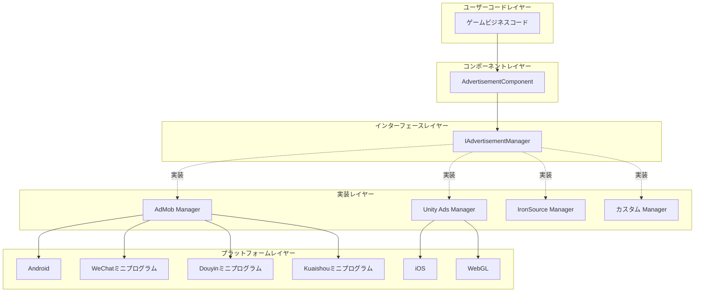
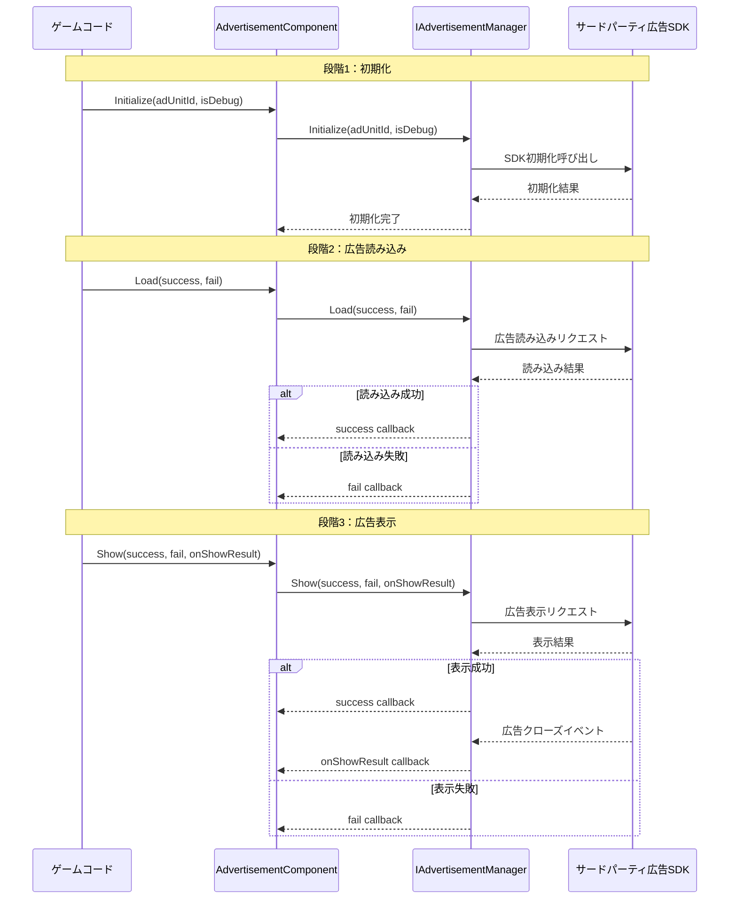

# 概要

Game Frame X Advertisement は、Game Frame X フレームワーク的广告コンポーネントであり、Unity プロジェクトに統一された広告機能の抽象化レイヤーを提供します。このコンポーネントはストラテジーパターン 采用しており、開発者が AdMob、Unity Ads、IronSource などのさまざまな広告 SDK を容易に追加でき、コアとなるビジネスコードを修改する必要がありません。

## プロジェクト紹介

`com.gameframex.unity.advertisement` は Game Frame X フレームワークのコアモジュールの1つであり、Unity プロジェクトにおける広告統合の複雑性を解決するために特別に設計されています。このコンポーネントは標準化された広告操作インターフェースを提供し、開発者は1回だけ広告呼び出しコードを記述すれば、異なる広告プラットフォーム間を切り替えられます。

このコンポーネントは Unity 2017.1 以降をサポートしており、現在の最新バージョンは 1.4.0 です。Apache License 2.0 オープンソースライセンスを採用しており、商用・非商用プロジェクトで無料で使用できます。

## アーキテクチャ設計

このコンポーネントは階層化アーキテクチャ設計を採用しており、広告ビジネスロジックと具体的なプラットフォーム実装を分離しています。この設計は依存性逆転の原則遵循しており、上位モジュール（AdvertisementComponent）は抽象化インターフェース（IAdvertisementManager）に依存し、具体的な実装詳細を気にしません。

## コアコンポーネント

このコンポーネントには4つのコアクラスが含まれ、それぞれ異なる責任を負い、協力して広告機能の完全なカプセル化を実現します。

### AdvertisementComponent

 AdvertisementComponent はユーザーが直接やり取りする主要なエントリーポイントであり、GameFrameworkComponent を継承する Unity MonoBehaviour コンポーネントです。開発者はこのコンポーネントをシーン内の任意の GameObject に追加し、コードを通じてそのメソッドを呼び出して広告を読み込み・表示します。

> Source: [AdvertisementComponent.cs](https://cnb.cool/GameFrameX/com.gameframex.unity.advertisement/blob/main/Runtime/Advertisement/AdvertisementComponent.cs#L1-L169)

このコンポーネントのコアとなる責任には、現在の実行プラットフォームに基づいて対応する広告ユニット ID を自動的に選択すること、Unity ライフサイクルで広告マネージャーを初期化すること、Load、Show、Play の3つの主要なメソッドをビジネスコードに提供することが含まれます。

### IAdvertisementManager

 IAdvertisementManager は広告マネージャーのコアとなるインターフェースであり、すべての広告操作の標準メソッドを定義します。個々の具体的な広告 SDK 実装はすべてこのインターフェースを実装する必要があり、異なる広告プラットフォーム間の動作の一貫性を保証します。

> Source: [IAdvertisementManager.cs](https://cnb.cool/GameFrameX/com.gameframex.unity.advertisement/blob/main/Runtime/Advertisement/IAdvertisementManager.cs#L1-L55)

このインターフェースは4つのコアメソッドを定義しています：Initialize は広告マネージャーの初期化に使用、SetExtraData は追加パラメータの設定に使用、Load は広告のプリロードに使用、Show は広告の表示に使用。インターフェース設計はコールバックパターンを采用しており、Action  делегатを通じて非同期操作の成功、失敗、結果コールバックを処理します。

### BaseAdvertisementManager

 BaseAdvertisementManager は抽象化ベースクラスであり、GameFrameworkModule を継承し IAdvertisementManager インターフェースを実装します。開発者にカスタム広告マネージャーを作成するための開始点を提供し、一般的なコールバック処理ロジックをカプセル化します。

> Source: [BaseAdvertisementManager.cs](https://cnb.cool/GameFrameX/com.gameframex.unity.advertisement/blob/main/Runtime/Advertisement/BaseAdvertisementManager.cs#L1-L109)

このベースクラスは4つの保護されたコールバックプロパティを定義しています：OnShowResult、OnLoadSuccess、OnLoadFail は、それぞれ広告表示結果、広告読み込み成功、広告読み込み失敗的情况に対応します。サブクラスはこれらのコールバックプロパティを使用して対応するビジネスロジックをトリガーできます。

### AdvertisementComponentInspector

 AdvertisementComponentInspector は Unity エディターのカスタムインスペクターパネルであり、ComponentTypeComponentInspector を継承します。AdvertisementComponent にユーザーフレンドリーなグラフィカル設定インターフェースを提供し、開発者は Inspector ウィンドウで各プラットフォームの広告ユニット ID を直接設定できます。

> Source: [AdvertisementComponentInspector.cs](https://cnb.cool/GameFrameX/com.gameframex.unity.advertisement/blob/main/Editor/Inspector/AdvertisementComponentInspector.cs#L1-L72)

このエディター統合により設定流程が大幅に簡素化され、開発者はコードを作成せずに広告ユニット ID の設定を完了できます。

## ワークフロー

広告の標準ワークフローは3つの主要な段階に分けられます：初期化、読み込み、表示。この流れの設計はベストプラクティスを遵循し、广告がスムーズに読み込まれ適時に表示されることを保証します。

初期化段階は AdvertisementComponent の Start メソッドで自動実行され、Inspector で設定された広告ユニット ID を使用します。読み込み段階は任意ですが、広告を表示する前に Load メソッドを事前に呼び出すことを推奨し、ユーザーの待機時間を短縮します。表示段階は Show メソッドでトリガーされ、表示完了後に onShowResult コールバックを通じて開発者に広告が完全に視聴されたかどうかを通知します。これはリワード動画広告にとって特に重要です。

## プラットフォームサポート

このコンポーネントは複数のプラットフォームと公開ターゲットをサポートしており、異なるゲームプロジェクトの公開ニーズを満たすことができます。

| プラットフォーム | 設定フィールド | 説明 |
|------|----------|------|
| Android | m_adUnitIdAndroid | Google Play およびその他の Android アプリストア |
| iOS | m_adUnitIdiOS | Apple App Store |
| WebGL | m_adUnitIdWebGL | 標準 WebGL 公開 |
| WeChatミニプログラム | m_adUnitIdWebGLWeChat | WeChat小ゲームプラットフォーム |
| Douyinミニプログラム | m_adUnitIdWebGLDouYin | Douyin小ゲームプラットフォーム |
| Kuaishouミニプログラム | m_adUnitIdWebGLKuaiShou | Kuaishou小ゲームプラットフォーム |

コンポーネントはコンパイル時のプラットフォームマクロに基づいて対応する広告ユニット ID を自動的に選択します。開発者は対応するプラットフォームの公開設定で正しいコンパイルマクロを設定する必要があります（例：ENABLE_WECHAT_MINI_GAME、ENABLE_DOUYIN_MINI_GAME、ENABLE_KUAISHOU_MINI_GAME など）。

## リワード動画サポート

このコンポーネントはリワード動画広告のサポートを特に最適化しており、これはモバイルゲームで最も一般的な収益化方法の1つです。リワード動画によりプレイヤーは能動的に広告を視聴してゲーム内報酬を得ることを選択でき、この広告形式は高いユーザー受容度とコンバージョン率を持っています。

リワード動画のコアプロセスは以下の通りです：プレイヤーが広告視聴アクションをトリガー -> 広告表示 -> プレイヤーが完全に視聴または途中で閉じる -> コールバックで開発者に報酬发放是否を通知。onShowResult コールバックのブール値パラメータは広告が完全に視聴されたかどうかを示します：true はユーザーが広告を完全に視聴し、報酬を发放すべきことを意味します；false はユーザーが広告をスキップ或者其他理由で完全に視聴せず、報酬を发放すべきではないことを意味します。

この設計は報酬发放の公平性を保証し、プレイヤーが広告を閉じる或者其他方法で広告をスキップして不应得の報酬を得ることを防ぎます。

## 設計理念

このコンポーネントの設計は、易用性、拡張性、信頼性を保証するためにいくつかのコア原則を遵循しています。

最初はオープン・クローズドの原則であり、システムが拡張に開かれ、修改に閉じられます。新しい広告プラットフォームをサポートする必要がある場合、新しい IAdvertisementManager 実装クラスを作成するだけでよく、既存のコードを修改する必要はありません。この設計により、广告プラットフォームの追加がシンプルでコントロール可能になり、既存の機能の安定性に影響を与えません。

次は依存性逆転の原則であり、上位モジュールは下位モジュールに依存すべきではなく、両方とも抽象化に依存すべきです。AdvertisementComponent は IAdvertisementManager インターフェースに依存し、具体的な広告プラットフォーム実装がどれかを気にしません。これにより、ビジネスコードを修改せずに広告プラットフォームを切り替えられます。

最後は単一責任の原則であり、各クラスには明確な責任境界があります。AdvertisementComponent は Unity ライフサイクル統合と呼び出しのディスパッチを担当し、IAdvertisementManager はインターフェースコントラクトを定義し、具体的な実装クラスはそれぞれの SDK とのやり取りを担当します。この分離により、コードが理解しにくく、メンテンナンスが容易になります。

## 適用シーン

このコンポーネントは、さまざまな広告収益化が必要な Unity ゲームプロジェクトに適しており、特に複数のプラットフォームに公開する必要があるプロジェクトに適しています。統一されたインターフェース抽象化を通じて、開発者は1回だけ広告ロジックコードを記述し、必要に応じて異なる広告プラットフォーム実装を選択できます。

複数のミニプログラムプラットフォームに公開する必要があるプロジェクトにとって、このコンポーネントのクロスプラットフォーム広告ユニット ID 設定機能は特に重要です。開発者は WeChat、Douyin、Kuaishou などのプラットフォームにそれぞれ異なる広告ユニットを設定でき、コードを修改せずにマルチプラットフォーム公開を実現できます。

## 関連リンク

- [インストールガイド](./2-installation) - プロジェクトでのコンポーネントインストールと設定方法
- [クイックスタート](./3-getting-started) - 広告機能のクイックスタート
- [コアコンセプト](./4-core-concepts) - コンポーネントの設計原理の詳細
- [プラットフォーム設定](./5-platforms) - 各プラットフォームの詳細設定説明
- [API リファレンス](./6-api-reference) - 完全なインターフェースドキュメント
- [よくある質問](./7-troubleshooting) - よくある質問への回答

## 更新ログ

現在のバージョンは 1.4.0 であり、このバージョンは Kuaishou小ゲームプラットフォームに WebGL 広告ユニット ID サポートを追加しました。コンポーネントは継続的に迭代更新されており、毎回のパージョンアップで新しいプラットフォームサポート、機能強化、エラー修正が含まれています。

> Source: [CHANGELOG.md](https://cnb.cool/GameFrameX/com.gameframex.unity.advertisement/blob/main/CHANGELOG.md#L1-L70)
