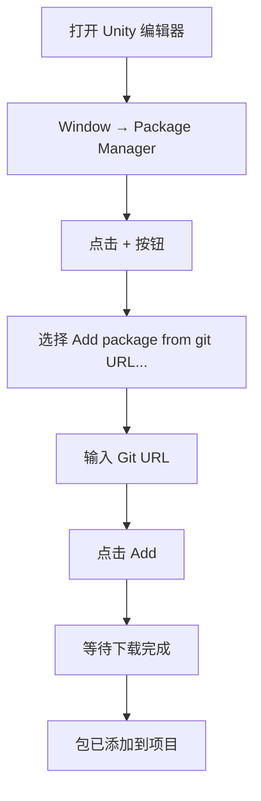
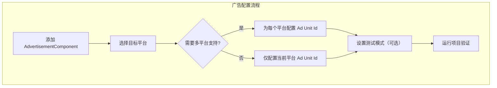

# インストールガイド

本ガイド将帮助您将 Game Frame X Advertisement コンポーネントインストール到 Unity プロジェクト中，并完成基本設定。

## 概要

Game Frame X Advertisement 是 Game Frame X フレームワーク的広告コンポーネント，提供統一された的広告機能抽象層。该コンポーネントサポート多种広告プラットフォーム，含みます AdMob、Unity Ads、IronSource 等，允许開発者在不変更コアコード的情况下切换不同的広告 SDK。

> **重要なヒント**：本コンポーネント (`com.gameframex.unity.advertisement`) 提供広告表示的抽象層和コア逻辑。您〜する必要がありますプロジェクト中パッケージ含一个具体的 `IAdvertisementManager` インターフェース実装，该実装负责与特定的広告 SDK 进行交互。

## 前提条件

在インストール本コンポーネント之前，请確認してください满足以下条件：

| 要求 | 説明 |
|------|------|
| Unity バージョン | 2017.1 或更高バージョン |
| Game Frame X コア | 〜する必要があります已インストール GameFrameX.Runtime 和 GameFrameX.Event.Runtime |
| 広告 SDK | 〜する必要があります集成具体的広告プラットフォーム SDK（如 AdMob、Unity Ads 等） |

## インストール手順

### 方法一：通过 Unity Package Manager インストール（推奨）

1. 打开 Unity エディタ
2. 选择メニュー `Window` → `Package Manager`
3. 在 Package Manager ウィンドウ中，点击左上角的 `+` ボタン
4. 选择 `Add package from git URL...`
5. 输入以下 Git URL：
   ```
   https://github.com/GameFrameX/com.gameframex.unity.advertisement.git
   ```
6. 点击 `Add` ボタン开始インストール
7. 等待 Package Manager 下载并导入パッケージ



### 方法二：通过 npm/cnpm インストール

もし您的网络環境访问 GitHub 较慢，〜できます使用 CNPM 镜像：

1. 在 `Packages/manifest.json` ファイル中追加依赖：
   ```json
   {
     "dependencies": {
       "com.gameframex.unity.advertisement": "https://npm.cnb.cool/GameFrameX/com.gameframex.unity.advertisement.git"
     }
   }
   ```
2. 保存ファイル后，Unity 会自动下载并导入パッケージ

### 方法三：手动インストール

1. 从 GitHub リポジトリ克隆或下载ソースコード：
   ```
   https://github.com/GameFrameX/com.gameframex.unity.advertisement.git
   ```
2. 将下载的ファイル夹复制到 Unity プロジェクト的 `Packages` ディレクトリ下
3. 重命名ファイル夹为 `com.gameframex.unity.advertisement`
4. 重新打开 Unity エディタ

## 依存関係の設定

本コンポーネント依赖以下 Game Frame X モジュール，〜する必要があります確認してください这些モジュール已正确インストール：

```json
// GameFrameX.Advertisement.Runtime.asmdef
{
    "references": [
        "GameFrameX.Runtime",
        "GameFrameX.Event.Runtime"
    ]
}
```

### インストール Game Frame X コアモジュール

もし尚未インストール Game Frame X コアモジュール，请按以下ステップインストール：

1. 在 Package Manager 中追加 GameFrameX コアパッケージ：
   ```
   https://github.com/GameFrameX/com.gameframex.unity.runtime.git
   ```

## シーン設定

### 追加 AdvertisementComponent

1. 在 Unity エディタ中，打开〜する必要があります集成広告的シーン
2. 在 Hierarchy パネル中，右键点击并选择 `Create Empty` 作成一个空 GameObject
3. 选择该 GameObject，在 Inspector パネル中点击 `Add Component`
4. 検索并追加 `Advertisement Component`（或 `GameFrameX/Advertisement`）
5. コンポーネント已追加到シーン中

```csharp
// 也可以通过代码方式添加组件
using GameFrameX.Advertisement.Runtime;
using UnityEngine;

public class AdSetup : MonoBehaviour
{
    void Start()
    {
        // 确保场景中有 AdvertisementComponent
        var adComponent = GetComponent<AdvertisementComponent>();
        if (adComponent == null)
        {
            adComponent = gameObject.AddComponent<AdvertisementComponent>();
        }
    }
}
```

### 設定広告ユニット ID

在 Inspector パネル中設定各プラットフォーム的広告ユニット ID：

| プラットフォーム | フィールド名称 | 説明 |
|------|----------|------|
| Android | Ad Unit Id (Android) | Google Play プラットフォーム広告ユニット ID |
| iOS | Ad Unit Id (iOS) | Apple App Store プラットフォーム広告ユニット ID |
| WebGL | Ad Unit Id (WebGL) | 网页端広告ユニット ID |
| WeChatミニゲーム | Ad Unit Id (WebGL WeChat) | WeChatミニゲーム広告ユニット ID |
| DouYinミニゲーム | Ad Unit Id (WebGL DouYin) | DouYinミニゲーム広告ユニット ID |
| KuaiShouミニゲーム | Ad Unit Id (WebGL KuaiShou) | KuaiShouミニゲーム広告ユニット ID |

> **注意**：コンポーネント会根据当前ビルドプラットフォーム自动选择对应的広告ユニット ID。



### テストモード設定

在 Inspector パネル中，勾选 `是否是测试模式` (Debug Mode) オプション〜できます启用テスト広告，便于开发デバッグ。

```csharp
// 也可以通过代码配置测试模式
public class AdSetup : MonoBehaviour
{
    void Start()
    {
        var adComponent = GetComponent<AdvertisementComponent>();
        // 手动初始化，第二个参数为是否启用调试模式
        adComponent.Initialize("your-ad-unit-id", true);
    }
}
```

## 広告マネージャー実装

### 実装 IAdvertisementManager インターフェース

本コンポーネント〜する必要があります您提供具体的 `IAdvertisementManager` インターフェース実装。以下是実装ステップ：

1. 作成一个新类，継承自 `BaseAdvertisementManager`
2. 実装所有抽象メソッド
3. 在游戏启动时登録您的実装

```csharp
using System;
using GameFrameX.Advertisement.Runtime;

public class MyAdManager : BaseAdvertisementManager
{
    public override void Initialize(string adUnitId, bool debug = false)
    {
        // 初始化广告 SDK
    }

    public override void Play(Action<bool> playResult, string customData = null)
    {
        // 播放激励视频广告
    }

    public override void Show(Action<string> success, Action<string> fail, Action<bool> onShowResult, string customData = null)
    {
        // 展示广告
    }

    public override void Load(Action<string> success, Action<string> fail, string customData = null)
    {
        // 加载广告
    }
}
```

> 詳細実装説明请参照 [コアコンセプト](../4-core-concepts) 和 [快速开始](../3-getting-started) ドキュメント。

## インストールの確認

インストール完成后，〜できます通过以下方法検証：

1. **確認パッケージ是否正确导入**：
   - 在 Unity プロジェクト中確認 `Packages/com.gameframex.unity.advertisement` ディレクトリ
   - 確認 Runtime 和 Editor ファイル夹存在

2. **確認コンパイル是否成功**：
   - 在 Unity 中打开 `Window` → `Assembly Compiler`（もしインストール了相关工具）
   - または尝试ビルドプロジェクト

3. **运行テスト**：
   - 在シーン中追加 AdvertisementComponent
   - 运行游戏，確認控制台是否有エラー情報

## よくある問題

### Q: インストール后出现コンパイルエラー

**考えられる原因**：缺少依赖的 Game Frame X コアモジュール。

**解決策**：
1. 確認已インストール GameFrameX.Runtime
2. 確認已インストール GameFrameX.Event.Runtime
3. 重新导入広告コンポーネントパッケージ

### Q: 広告ユニット ID 没有自动匹配

**考えられる原因**：プラットフォーム定義符号未正确設定。

**解決策**：
- Android：確認してください在 Build Settings 中选择了 Android プラットフォーム
- iOS：確認してください在 Build Settings 中选择了 iOS プラットフォーム
- WebGL：確認してください在 Build Settings 中选择了 WebGL プラットフォーム

### Q: 无法在 Inspector 中看到設定オプション

**考えられる原因**：Editor 脚本未正确コンパイル。

**解決策**：
1. 確認 Editor ファイル夹是否存在
2. 重新打开 Unity エディタ
3. 確認 `GameFrameX.Advertisement.Editor.asmdef` 是否存在

## 関連リンク

- [概要](../1-overview) - 理解する Game Frame X Advertisement 整体アーキテクチャ
- [快速开始](../3-getting-started) - 快速上手使用広告機能
- [コアコンセプト](../4-core-concepts) - 深入理解するコアインターフェース和実装
- [API リファレンス](../6-api-reference) - 完全な的 API ドキュメント
- [GitHub リポジトリ](https://github.com/GameFrameX/com.gameframex.unity.advertisement.git) - 官方ソースコードリポジトリ
