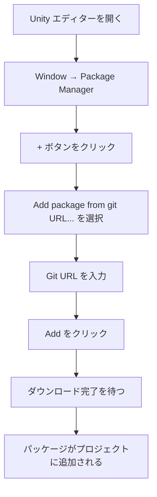
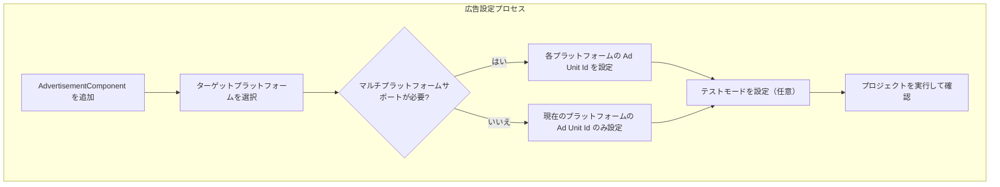

# インストールガイド

本ガイドでは、Game Frame X Advertisement コンポーネントを Unity プロジェクトにインストールし、基本的な設定を完了する方法について説明します。

## 概要

Game Frame X Advertisement は、Game Frame X フレームワークの広告コンポーネントであり、統一された広告機能の抽象化レイヤーを提供します。このコンポーネントは AdMob、Unity Ads、IronSource などの複数の広告プラットフォームをサポートしており、開発者がコアコードを編集せずに異なる広告 SDK を切り替えられるようにします。

> **重要な注意**: このコンポーネント (`com.gameframex.unity.advertisement`) は広告表示の抽象化レイヤーとコアロジックを提供します。プロジェクトには具体的な `IAdvertisementManager` インターフェースの実装を含める必要があり、この実装は特定の広告 SDK とやり取りする責務を負います。

## 前提条件

このコンポーネントをインストールする前に、以下の条件を満たしていることを確認してください：

| 要件 | 説明 |
|------|------|
| Unity バージョン | 2017.1 以降 |
| Game Frame X コア | GameFrameX.Runtime と GameFrameX.Event.Runtime がインストール済みであること |
| 広告 SDK | 具体的な広告プラットフォーム SDK（AdMob、Unity Ads など）が統合済みであること |

## インストール手順

### 方法1：Unity Package Manager を使用してインストール（推奨）

1. Unity エディターを開く
2. メニューから `Window` → `Package Manager` を選択
3. Package Manager ウィンドウで、左上の `+` ボタンをクリック
4. `Add package from git URL...` を選択
5. 以下の Git URL を入力：
   ```
   https://github.com/GameFrameX/com.gameframex.unity.advertisement.git
   ```
6. `Add` ボタンをクリックしてインストールを開始
7. Package Manager がパッケージをダウンロードしてインポートするまで待つ



### 方法2：npm/cnpm を使用してインストール

GitHub へのアクセスが遅い場合、CNPM ミラーが使用できます：

1. `Packages/manifest.json` ファイルに依存関係を追加：
   ```json
   {
     "dependencies": {
       "com.gameframex.unity.advertisement": "https://npm.cnb.cool/GameFrameX/com.gameframex.unity.advertisement.git"
     }
   }
   ```
2. ファイルを保存すると、Unity が自動的にパッケージをダウンロードしてインポートします

### 方法3：手動インストール

1. GitHub リポジトリからクローンまたはダウンロード：
   ```
   https://github.com/GameFrameX/com.gameframex.unity.advertisement.git
   ```
2. ダウンロードしたフォルダーを Unity プロジェクトの `Packages` ディレクトリにコピー
3. フォルダー名を `com.gameframex.unity.advertisement` に変更
4. Unity エディターを再度開く

## 依存関係の設定

このコンポーネントは、以下の Game Frame X モジュールに依存しており、これらのモジュールが正しくインストールされていることを確認する必要があります：

```json
// GameFrameX.Advertisement.Runtime.asmdef
{
    "references": [
        "GameFrameX.Runtime",
        "GameFrameX.Event.Runtime"
    ]
}
```

### Game Frame X コアモジュールのインストール

Game Frame X コアモジュールがまだインストールされていない場合：

1. Package Manager で GameFrameX コアパッケージを追加：
   ```
   https://github.com/GameFrameX/com.gameframex.unity.runtime.git
   ```

## シーンの設定

### AdvertisementComponent の追加

1. Unity エディターで、广告を統合する必要があるシーンを開く
2. Hierarchy パネルで、右クリックして `Create Empty` を選択して空の GameObject を作成
3. その GameObject を選択し、Inspector パネルで `Add Component` をクリック
4. `Advertisement Component`（または `GameFrameX/Advertisement`）を検索して追加
5. コンポーネントがシーンに追加されました

```csharp
// コードでコンポーネントを追加する方法
using GameFrameX.Advertisement.Runtime;
using UnityEngine;

public class AdSetup : MonoBehaviour
{
    void Start()
    {
        // シーンに AdvertisementComponent があることを確認
        var adComponent = GetComponent<AdvertisementComponent>();
        if (adComponent == null)
        {
            adComponent = gameObject.AddComponent<AdvertisementComponent>();
        }
    }
}
```

### 広告ユニット ID の設定

Inspector パネルで各プラットフォームの広告ユニット ID を設定：

| プラットフォーム | フィールド名 | 説明 |
|------|----------|------|
| Android | Ad Unit Id (Android) | Google Play プラットフォームの広告ユニット ID |
| iOS | Ad Unit Id (iOS) | Apple App Store プラットフォームの広告ユニット ID |
| WebGL | Ad Unit Id (WebGL) | Web エンドの広告ユニット ID |
| WeChatミニプログラム | Ad Unit Id (WebGL WeChat) | WeChatミニプログラムの広告ユニット ID |
| Douyinミニプログラム | Ad Unit Id (WebGL DouYin) | Douyinミニプログラムの広告ユニット ID |
| Kuaishouミニプログラム | Ad Unit Id (WebGL KuaiShou) | Kuaishouミニプログラムの広告ユニット ID |

> **注意**: コンポーネントは現在のビルドプラットフォームに基づいて対応する広告ユニット ID を自動的に選択します。



### テストモードの設定

Inspector パネルで、`テストモード是否`（Debug Mode）オプションをチェックするとテスト広告が有効になり、開発デバッグに便利です。

```csharp
// コードでテストモードを設定することもできます
public class AdSetup : MonoBehaviour
{
    void Start()
    {
        var adComponent = GetComponent<AdvertisementComponent>();
        // 手動初期化、2番目のパラメータはデバッグモードを有効にするかどうか
        adComponent.Initialize("your-ad-unit-id", true);
    }
}
```

## 広告マネージャーの実装

### IAdvertisementManager インターフェースの実装

このコンポーネントは、具体的な `IAdvertisementManager` インターフェースの実装を提供する必要があります。実装手順は次のとおりです：

1. 新しいクラスを作成し、`BaseAdvertisementManager` から継承
2. すべての抽象メソッドを実装
3. ゲームの起動時に実装を登録

```csharp
using System;
using GameFrameX.Advertisement.Runtime;

public class MyAdManager : BaseAdvertisementManager
{
    public override void Initialize(string adUnitId, bool debug = false)
    {
        // 広告 SDK の初期化ロジックを実装
    }

    public override void Play(Action<bool> playResult, string customData = null)
    {
        // リワード動画広告の再生ロジックを実装
    }

    public override void Show(Action<string> success, Action<string> fail, Action<bool> onShowResult, string customData = null)
    {
        // 広告表示ロジックを実装
    }

    public override void Load(Action<string> success, Action<string> fail, string customData = null)
    {
        // 広告読み込みロジックを実装
    }
}
```

> 詳細な実装説明は、[コアコンセプト](../4-core-concepts) と [クイックスタート](../3-getting-started) ドキュメントを参照してください。

## インストールの確認

インストールが完了したら、以下の方法で確認できます：

1. **パッケージが正しくインポートされたか確認**：
   - Unity プロジェクトで `Packages/com.gameframex.unity.advertisement` ディレクトリを確認
   - Runtime と Editor フォルダーが存在することを確認

2. **コンパイルが成功したか確認**：
   - Unity で `Window` → `Assembly Compiler` を開く（関連ツールがインストールされている場合）
   - または、プロジェクトのビルドを試みる

3. **テストを実行**：
   - シーンに AdvertisementComponent を追加
   - ゲームを実行し、コンソールにエラーがあるかどうかを確認

## よくある質問

### Q: インストール後にコンパイルエラーが発生しました

**考えられる原因**: 依存する Game Frame X コアモジュールが不足しています。

**解決策**：
1. GameFrameX.Runtime がインストールされていることを確認
2. GameFrameX.Event.Runtime がインストールされていることを確認
3. 広告コンポーネントパッケージを再インポート

### Q: 広告ユニット ID が自動マッチングしない

**考えられる原因**: プラットフォーム定義シンボルが正しく設定されていません。

**解決策**：
- Android：Build Settings で Android プラットフォームが選択されていることを確認
- iOS：Build Settings で iOS プラットフォームが選択されていることを確認
- WebGL：Build Settings で WebGL プラットフォームが選択されていることを確認

### Q: Inspector で設定オプションが表示されない

**考えられる原因**: Editor スクリプトが正しくコンパイルされていません。

**解決策**：
1. Editor フォルダーが存在するかどうかを確認
2. Unity エディターを再度開く
3. `GameFrameX.Advertisement.Editor.asmdef` が存在するかどうかを確認

## 関連リンク

- [概要](../1-overview) - Game Frame X Advertisement の全体アーキテクチャを理解
- [クイックスタート](../3-getting-started) - 広告機能のクイックスタート
- [コアコンセプト](../4-core-concepts) - コアインターフェースと実装の詳細
- [API リファレンス](../6-api-reference) - 完全な API ドキュメント
- [GitHub リポジトリ](https://github.com/GameFrameX/com.gameframex.unity.advertisement.git) - 公式ソースコードリポジトリ
