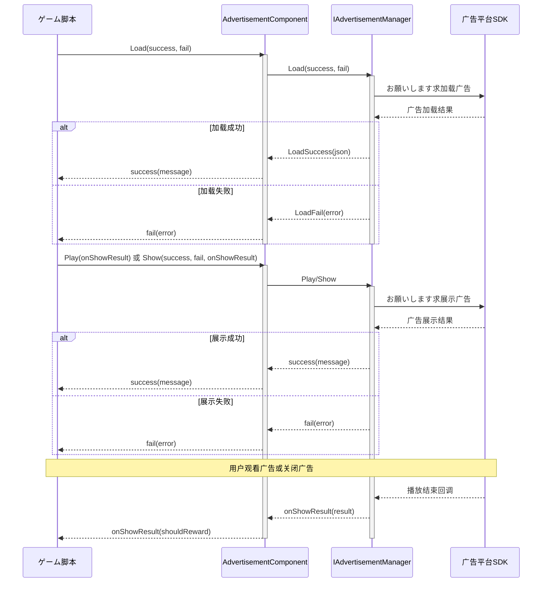

# 快速开始

本指南将帮助您快速在 Unity プロジェクト中集成广告機能。を通じて几个简单的手順，您就可能在ゲーム中展示横幅广告、插屏广告和激励视频广告。

## 概要

Game Frame X Advertisement は轻量级的广告抽象层コンポーネント，它为 Unity プロジェクト提供します统一广告インターフェース。を通じて実装 `IAdvertisementManager` インターフェース，您可能轻松集成任何广告网络（如 AdMob、Unity Ads、IronSource 等），而无需修改コア业务代码。

该コンポーネント的主要特点：
- **平台无关**：统一的 API インターフェース，サポート多平台广告展示
- **易于集成**：を通じて Unity コンポーネント方法集成，无需编写复杂代码
- **灵活扩展**：を通じてインターフェース実装轻松切换不同的广告 SDK

## アーキテクチャ概要

广告コンポーネント采用分层アーキテクチャ設計，コア层与平台実装层分离：

```mermaid
flowchart TD
    subgraph Client["客户端层"]
        GameScript[ゲーム脚本]
    end

    subgraph Component["AdvertisementComponent"]
        AdComp[广告コンポーネント]
    end

    subgraph Core["コアインターフェース层"]
        IAdMgr[IAdvertisementManager]
        BaseMgr[BaseAdvertisementManager]
    end

    subgraph Implementation["平台実装层"]
        Admob[AdMob 実装]
        UnityAds[Unity Ads 実装]
        IronSource[IronSource 実装]
    end

    GameScript --> AdComp
    AdComp --> IAdMgr
    IAdMgr <|.. BaseMgr
    BaseMgr <|-- Admob
    BaseMgr <|-- UnityAds
    BaseMgr <|-- IronSource
```

## 快速集成手順

### 手順 1：安装广告コンポーネント

首先，在 Unity プロジェクト中安装 Game Frame X Advertisement コンポーネント。详细安装説明お願いします参阅[安装指南](./2-installation)。

### 手順 2：添加广告コンポーネント到シーン

1. 在 Unity 编辑器中，选择必要添加广告的シーン
2. 在 Hierarchy 面板中，右键点击必要添加广告的 GameObject
3. 选择 **GameFrameX → Advertisement** 菜单项
4. 或者直接将 `AdvertisementComponent` 脚本拖放到 GameObject 上

```csharp
// 手動でコンポーネントを追加するメソッド
using UnityEngine;
using GameFrameX.Advertisement.Runtime;

public class GameManager : MonoBehaviour
{
    private AdvertisementComponent _adComponent;

    void Start()
    {
        // 添加广告コンポーネント到当前 GameObject
        _adComponent = gameObject.AddComponent<AdvertisementComponent>();
    }
}
```

> Source: [AdvertisementComponent.cs](https://cnb.cool/GameFrameX/com.gameframex.unity.advertisement/blob/main/Runtime/Advertisement/AdvertisementComponent.cs#L1-L169)

### 手順 3：配置广告位 ID

在 Unity Inspector 面板中配置各个平台的广告位 ID：

| 平台 | 字段名 | 説明 |
|------|--------|------|
| Android | Ad Unit Id Android | Google Play 商店版本 |
| iOS | Ad Unit Id iOS | Apple App Store 版本 |
| WebGL | Ad Unit Id WebGL | 网页版本 |
| 微信小程序 | Ad Unit Id WebGL WeChat | 微信环境 |
| 抖音小程序 | Ad Unit Id WebGL DouYin | 抖音环境 |
| 快手小程序 | Ad Unit Id WebGL KuaiShou | 快手环境 |

> Source: [AdvertisementComponent.cs](https://cnb.cool/GameFrameX/com.gameframex.unity.advertisement/blob/main/Runtime/Advertisement/AdvertisementComponent.cs#L15-L43)

### 手順 4：実装广告管理器

コンポーネント本身只提供抽象层，您必要実装具体的广告管理器。作成一个を継承 `BaseAdvertisementManager` 的クラス：

```csharp
using System;
using GameFrameX.Advertisement.Runtime;
using UnityEngine;

public class MyAdManager : BaseAdvertisementManager
{
    private string _adUnitId;
    private bool _isDebug;

    /// <summary>
    /// 初期化广告管理器
    /// </summary>
    public override void Initialize(string adUnitId, bool debug = false)
    {
        _adUnitId = adUnitId;
        _isDebug = debug;
        Debug.Log($"Ad Manager Initialized with ID: {_adUnitId}, Debug: {_isDebug}");
    }

    /// <summary>
    /// 加载广告
    /// </summary>
    public override void Load(Action<string> success, Action<string> fail, string customData = null)
    {
        // 在这里実装实际的广告加载逻辑
        // 呼び出し base.LoadSuccess(json) 或 base.LoadFail(json) 通知结果
        Debug.Log("Loading advertisement...");
        
        // 模拟加载成功
        base.LoadSuccess("{\"status\":\"loaded\"}");
    }

    /// <summary>
    /// 展示广告
    /// </summary>
    public override void Show(Action<string> success, Action<string> fail, Action<bool> onShowResult, string customData = null)
    {
        // 在这里実装实际的广告展示逻辑
        Debug.Log("Showing advertisement...");
        
        // 模拟展示成功
        success?.Invoke("{\"status\":\"shown\"}");
    }

    /// <summary>
    /// 播放激励视频广告
    /// </summary>
    public override void Play(Action<bool> playResult, string customData = null)
    {
        // 在这里実装激励视频广告的播放逻辑
        // playResult 回调参数: true = 完整观看, false = 跳过
        Debug.Log("Playing rewarded advertisement...");
        
        // 模拟完整观看
        playResult?.Invoke(true);
    }
}
```

> Source: [BaseAdvertisementManager.cs](https://cnb.cool/GameFrameX/com.gameframex.unity.advertisement/blob/main/Runtime/Advertisement/BaseAdvertisementManager.cs#L1-L108)

## 使用例

### 基本用法：加载和展示广告

```csharp
using UnityEngine;
using GameFrameX.Advertisement.Runtime;
using System;

public class RewardedAdButton : MonoBehaviour
{
    // 引用 AdvertisementComponent
    [SerializeField] private AdvertisementComponent adComponent;

    // 加载广告
    public void LoadRewardedAd()
    {
        if (adComponent == null)
        {
            adComponent = GetComponent<AdvertisementComponent>();
        }

        adComponent.Load(
            // 加载成功回调
            (message) => {
                Debug.Log($"广告加载成功: {message}");
                // 可能在这里启用"显示广告"按钮
            },
            // 加载失败回调
            (error) => {
                Debug.LogError($"广告加载失败: {error}");
            }
        );
    }

    // 展示激励视频广告
    public void ShowRewardedAd()
    {
        if (adComponent == null)
        {
            adComponent = GetComponent<AdvertisementComponent>();
        }

        adComponent.Play(
            // 广告播放结果回调
            // true = 用户完整观看广告，应发放奖励
            // false = 用户跳过广告，不发放奖励
            (shouldReward) => {
                if (shouldReward)
                {
                    Debug.Log("用户完整观看广告，发放奖励！");
                    GivePlayerReward();
                }
                else
                {
                    Debug.Log("用户跳过广告，不发放奖励");
                }
            }
        );
    }

    private void GivePlayerReward()
    {
        // 在这里実装奖励发放逻辑
        Debug.Log("奖励已发放！");
    }
}
```

> Source: [README.md](https://cnb.cool/GameFrameX/com.gameframex.unity.advertisement/blob/main/README.md#L25-L82)

### 使用 Show メソッド展示广告

除了 `Play` メソッド，还可能使用 `Show` メソッド进行更细粒度的控制：

```csharp
public void ShowInterstitialAd()
{
    adComponent.Show(
        // 展示成功回调
        (message) => {
            Debug.Log($"广告展示成功: {message}");
        },
        // 展示失败回调
        (error) => {
            Debug.LogError($"广告展示失败: {error}");
        },
        // 展示结果回调（广告关闭时呼び出し）
        (showResult) => {
            Debug.Log($"广告展示结果: {(showResult ? "完整播放" : "未完整播放")}");
            // 恢复ゲームステータス
            ResumeGame();
        }
    );
}
```

> Source: [IAdvertisementManager.cs](https://cnb.cool/GameFrameX/com.gameframex.unity.advertisement/blob/main/Runtime/Advertisement/IAdvertisementManager.cs#L36-L53)

### 設定额外数据

某些广告平台サポート在展示前設定额外的参数数据：

```csharp
// 設定额外数据
adComponent.SetExtraData("user_level", "10");
adComponent.SetExtraData("is_vip", "true");

// 然后展示广告
ShowRewardedAd();
```

> Source: [AdvertisementComponent.cs](https://cnb.cool/GameFrameX/com.gameframex.unity.advertisement/blob/main/Runtime/Advertisement/AdvertisementComponent.cs#L107-L119)

## 广告加载与展示フロー

以下フロー图展示了广告从加载到展示的完整フロー：



## 回调説明

| メソッド | 回调 | 参数 | 説明 |
|------|------|------|------|
| `Load` | success | `string message` | 广告加载成功时呼び出し，参数为成功信息 |
| `Load` | fail | `string error` | 广告加载失败时呼び出し，参数为错误信息 |
| `Show` | success | `string message` | 广告开始展示时呼び出し |
| `Show` | fail | `string error` | 广告展示失败时呼び出し（如无广告可展示） |
| `Show` | onShowResult | `bool shouldReward` | 广告关闭后呼び出し，`true` 表示完整观看 |
| `Play` | onShowResult | `bool shouldReward` | 激励视频播放结果，`true` 表示可发放奖励 |

## 平台配置

不同的发布平台必要不同的配置。お願いします参考[平台配置](./5-platforms)文档取得詳細説明：

- Android 广告位 ID 配置
- iOS 广告位 ID 配置
- WebGL 广告位 ID 配置
- 微信/抖音/快手小程序配置

## コアコンセプト

如需深入了解广告系统的コア概念和设计原理，お願いします参阅[コア概念](./4-core-concepts)文档。

## よくある質問

如果在集成过程中遇到问题，お願いします参阅[常见问题](./7-troubleshooting)文档取得解決策。

## 関連リンク

- [安装指南](./2-installation) - 详细的安装手順
- [コア概念](./4-core-concepts) - 广告系统架构和设计模式
- [平台配置](./5-platforms) - 各平台的详细配置説明
- [API 参考](./6-api-reference) - 完整的 API 文档
- [常见问题](./7-troubleshooting) - 常见问题解答
