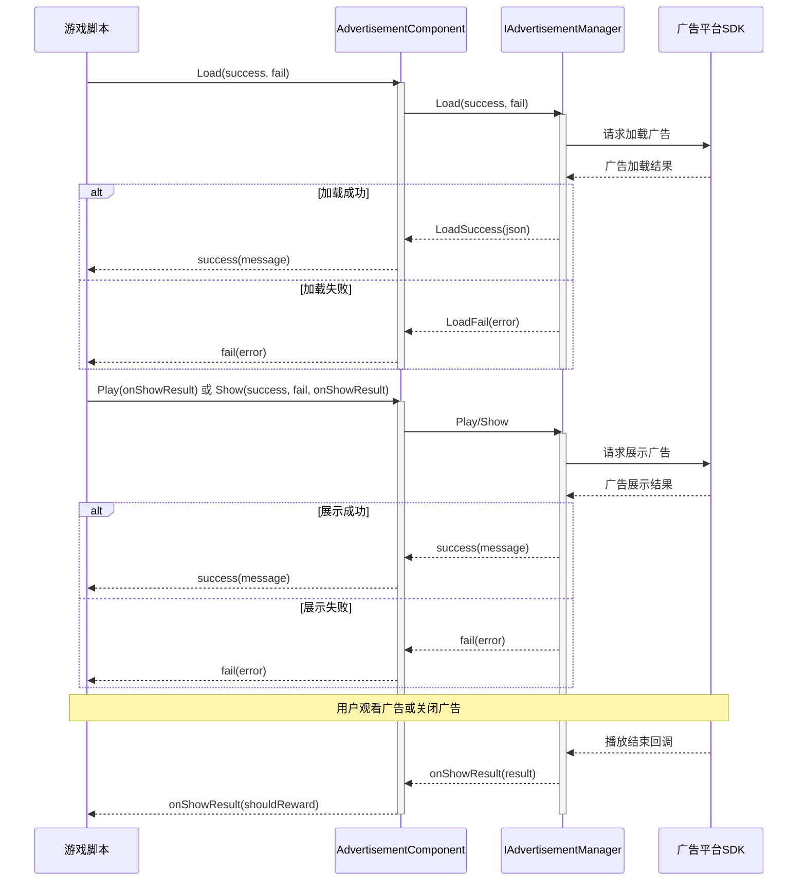

# クイックスタート

本ガイド将帮助您快速在 Unity プロジェクト中集成広告機能。通过几个シンプル的ステップ，您就〜できます在游戏中表示バナー広告、インタースティシャル広告和リワード動画広告。

## 概要

Game Frame X Advertisement は轻量级的広告抽象層コンポーネント，它为 Unity プロジェクト提供します統一された広告インターフェース。通过実装 `IAdvertisementManager` インターフェース，您〜できます轻松集成任何広告ネットワーク（如 AdMob、Unity Ads、IronSource 等），而无需変更コア业务コード。

该コンポーネント的主な特点：
- **プラットフォーム无关**：統一された的 API インターフェース，サポート多プラットフォーム広告表示
- **易于集成**：通过 Unity コンポーネント方法集成，无需编写複雑コード
- **柔軟拡張**：通过インターフェース実装轻松切换不同的広告 SDK

## アーキテクチャ概览

広告コンポーネント采用分层アーキテクチャ設計，コア层与プラットフォーム実装層分离：

```mermaid
flowchart TD
    subgraph Client["客户端层"]
        GameScript[游戏脚本]
    end

    subgraph Component["AdvertisementComponent"]
        AdComp[广告组件]
    end

    subgraph Core["核心接口层"]
        IAdMgr[IAdvertisementManager]
        BaseMgr[BaseAdvertisementManager]
    end

    subgraph Implementation["平台实现层"]
        Admob[AdMob 实现]
        UnityAds[Unity Ads 实现]
        IronSource[IronSource 实现]
    end

    GameScript --> AdComp
    AdComp --> IAdMgr
    IAdMgr <|.. BaseMgr
    BaseMgr <|-- Admob
    BaseMgr <|-- UnityAds
    BaseMgr <|-- IronSource
```

## 快速集成ステップ

### ステップ 1：インストール広告コンポーネント

まず，在 Unity プロジェクト中インストール Game Frame X Advertisement コンポーネント。詳細インストール説明请参照[インストールガイド](./2-installation)。

### ステップ 2：追加広告コンポーネント到シーン

1. 在 Unity エディタ中，选择〜する必要があります追加広告的シーン
2. 在 Hierarchy パネル中，右键点击〜する必要があります追加広告的 GameObject
3. 选择 **GameFrameX → Advertisement** メニュー项
4. または直接将 `AdvertisementComponent` 脚本拖放到 GameObject 上

```csharp
// 手动添加组件的方式
using UnityEngine;
using GameFrameX.Advertisement.Runtime;

public class GameManager : MonoBehaviour
{
    private AdvertisementComponent _adComponent;

    void Start()
    {
        // 添加广告组件到当前 GameObject
        _adComponent = gameObject.AddComponent<AdvertisementComponent>();
    }
}
```

> Source: [AdvertisementComponent.cs](https://cnb.cool/GameFrameX/com.gameframex.unity.advertisement/blob/main/Runtime/Advertisement/AdvertisementComponent.cs#L1-L169)

### ステップ 3：設定広告ユニット ID

在 Unity Inspector パネル中設定各个プラットフォーム的広告ユニット ID：

| プラットフォーム | フィールド名 | 説明 |
|------|--------|------|
| Android | Ad Unit Id Android | Google Play 商店バージョン |
| iOS | Ad Unit Id iOS | Apple App Store バージョン |
| WebGL | Ad Unit Id WebGL | 网页バージョン |
| WeChatミニゲーム | Ad Unit Id WebGL WeChat | 微信環境 |
| DouYinミニゲーム | Ad Unit Id WebGL DouYin | 抖音環境 |
| KuaiShouミニゲーム | Ad Unit Id WebGL KuaiShou | 快手環境 |

> Source: [AdvertisementComponent.cs](https://cnb.cool/GameFrameX/com.gameframex.unity.advertisement/blob/main/Runtime/Advertisement/AdvertisementComponent.cs#L15-L43)

### ステップ 4：実装広告マネージャー

コンポーネント本身只提供抽象層，您〜する必要があります実装具体的広告マネージャー。作成一个継承自 `BaseAdvertisementManager` 的类：

```csharp
using System;
using GameFrameX.Advertisement.Runtime;
using UnityEngine;

public class MyAdManager : BaseAdvertisementManager
{
    private string _adUnitId;
    private bool _isDebug;

    /// <summary>
    /// 初始化广告管理器
    /// </summary>
    public override void Initialize(string adUnitId, bool debug = false)
    {
        _adUnitId = adUnitId;
        _isDebug = debug;
        Debug.Log($"Ad Manager Initialized with ID: {_adUnitId}, Debug: {_isDebug}");
    }

    /// <summary>
    /// 加载广告
    /// </summary>
    public override void Load(Action<string> success, Action<string> fail, string customData = null)
    {
        // 在这里实现实际的广告加载逻辑
        // 调用 base.LoadSuccess(json) 或 base.LoadFail(json) 通知结果
        Debug.Log("Loading advertisement...");
        
        // 模拟加载成功
        base.LoadSuccess("{\"status\":\"loaded\"}");
    }

    /// <summary>
    /// 展示广告
    /// </summary>
    public override void Show(Action<string> success, Action<string> fail, Action<bool> onShowResult, string customData = null)
    {
        // 在这里实现实际的广告展示逻辑
        Debug.Log("Showing advertisement...");
        
        // 模拟展示成功
        success?.Invoke("{\"status\":\"shown\"}");
    }

    /// <summary>
    /// 播放激励视频广告
    /// </summary>
    public override void Play(Action<bool> playResult, string customData = null)
    {
        // 在这里实现激励视频广告的播放逻辑
        // playResult 回调参数: true = 完整观看, false = 跳过
        Debug.Log("Playing rewarded advertisement...");
        
        // 模拟完整观看
        playResult?.Invoke(true);
    }
}
```

> Source: [BaseAdvertisementManager.cs](https://cnb.cool/GameFrameX/com.gameframex.unity.advertisement/blob/main/Runtime/Advertisement/BaseAdvertisementManager.cs#L1-L108)

## 使用例

### 基本用法：ロード和表示広告

```csharp
using UnityEngine;
using GameFrameX.Advertisement.Runtime;
using System;

public class RewardedAdButton : MonoBehaviour
{
    // 引用 AdvertisementComponent
    [SerializeField] private AdvertisementComponent adComponent;

    // 加载广告
    public void LoadRewardedAd()
    {
        if (adComponent == null)
        {
            adComponent = GetComponent<AdvertisementComponent>();
        }

        adComponent.Load(
            // 加载成功回调
            (message) => {
                Debug.Log($"广告加载成功: {message}");
                // 可以在这里启用"显示广告"按钮
            },
            // 加载失败回调
            (error) => {
                Debug.LogError($"广告加载失败: {error}");
            }
        );
    }

    // 展示激励视频广告
    public void ShowRewardedAd()
    {
        if (adComponent == null)
        {
            adComponent = GetComponent<AdvertisementComponent>();
        }

        adComponent.Play(
            // 广告播放结果回调
            // true = 用户完整观看广告，应发放奖励
            // false = 用户跳过广告，不发放奖励
            (shouldReward) => {
                if (shouldReward)
                {
                    Debug.Log("用户完整观看广告，发放奖励！");
                    GivePlayerReward();
                }
                else
                {
                    Debug.Log("用户跳过广告，不发放奖励");
                }
            }
        );
    }

    private void GivePlayerReward()
    {
        // 在这里实现奖励发放逻辑
        Debug.Log("奖励已发放！");
    }
}
```

> Source: [README.md](https://cnb.cool/GameFrameX/com.gameframex.unity.advertisement/blob/main/README.md#L25-L82)

### 使用 Show メソッド表示広告

除了 `Play` メソッド，还〜できます使用 `Show` メソッド进行更细粒度的控制：

```csharp
public void ShowInterstitialAd()
{
    adComponent.Show(
        // 展示成功回调
        (message) => {
            Debug.Log($"广告展示成功: {message}");
        },
        // 展示失败回调
        (error) => {
            Debug.LogError($"广告展示失败: {error}");
        },
        // 展示结果回调（广告关闭时调用）
        (showResult) => {
            Debug.Log($"广告展示结果: {(showResult ? "完整播放" : "未完整播放")}");
            // 恢复游戏状态
            ResumeGame();
        }
    );
}
```

> Source: [IAdvertisementManager.cs](https://cnb.cool/GameFrameX/com.gameframex.unity.advertisement/blob/main/Runtime/Advertisement/IAdvertisementManager.cs#L36-L53)

### 設定额外数据

某些広告プラットフォームサポート在表示前設定额外的パラメータ数据：

```csharp
// 设置额外数据
adComponent.SetExtraData("user_level", "10");
adComponent.SetExtraData("is_vip", "true");

// 然后展示广告
ShowRewardedAd();
```

> Source: [AdvertisementComponent.cs](https://cnb.cool/GameFrameX/com.gameframex.unity.advertisement/blob/main/Runtime/Advertisement/AdvertisementComponent.cs#L107-L119)

## 広告読み込み与表示フロー

以下フロー图表示了広告从ロード到表示的完全なフロー：



## コールバック説明

| メソッド | コールバック | パラメータ | 説明 |
|------|------|------|------|
| `Load` | success | `string message` | 広告読み込み成功时呼び出し，パラメータ为成功情報 |
| `Load` | fail | `string error` | 広告読み込み失敗时呼び出し，パラメータ为エラー情報 |
| `Show` | success | `string message` | 広告开始表示时呼び出し |
| `Show` | fail | `string error` | 広告表示失敗时呼び出し（如无広告可表示） |
| `Show` | onShowResult | `bool shouldReward` | 広告閉じる后呼び出し，`true` 表示完全な視聴 |
| `Play` | onShowResult | `bool shouldReward` | リワード動画再生結果，`true` 表示可发放報酬 |

## プラットフォーム設定

不同的リリースプラットフォーム〜する必要があります不同的設定。请リファレンス[プラットフォーム設定](./5-platforms)ドキュメント取得詳細説明：

- Android 広告ユニット ID 設定
- iOS 広告ユニット ID 設定
- WebGL 広告ユニット ID 設定
- 微信/抖音/KuaiShouミニゲーム設定

## コアコンセプト

如需深入理解する広告系统的コアコンセプト和設計原理，请参照[コアコンセプト](./4-core-concepts)ドキュメント。

## よくある問題

もし在集成过程中遇到問題，请参照[常见問題](./7-troubleshooting)ドキュメント取得解決策。

## 関連リンク

- [インストールガイド](./2-installation) - 詳細的インストールステップ
- [コアコンセプト](./4-core-concepts) - 広告系统アーキテクチャ和設計モード
- [プラットフォーム設定](./5-platforms) - 各プラットフォーム的詳細設定説明
- [API リファレンス](./6-api-reference) - 完全な的 API ドキュメント
- [常见問題](./7-troubleshooting) - 常见問題解答
