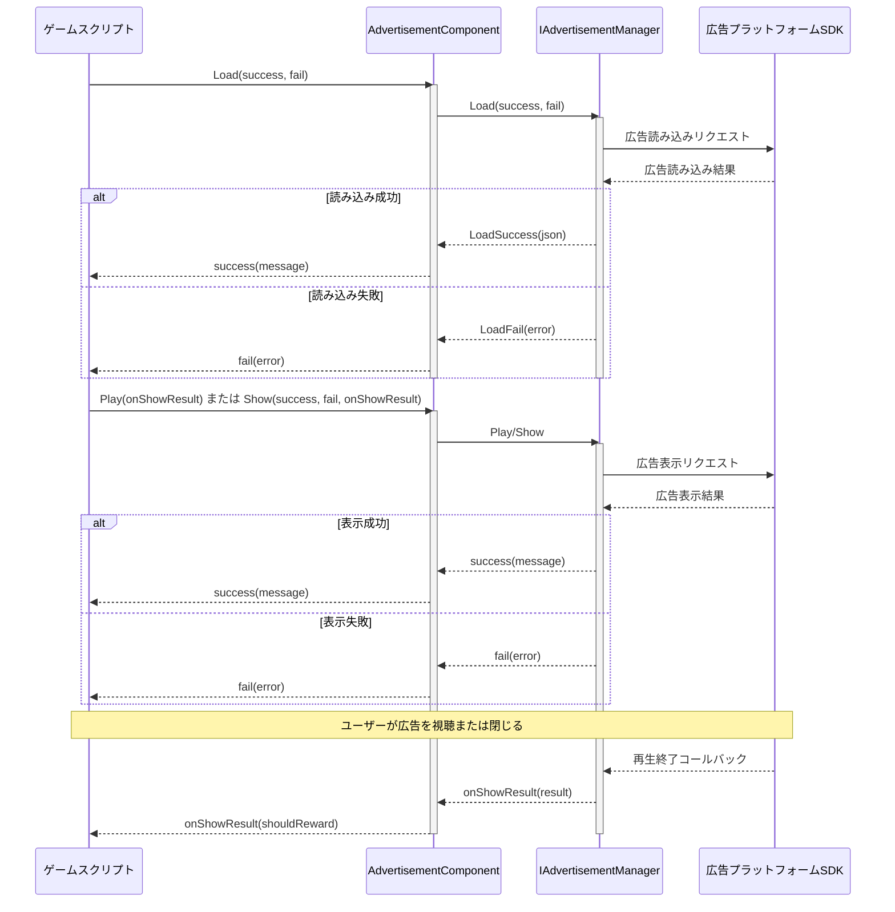

# クイックスタート

本ガイドでは、Unity プロジェクトに広告機能を迅速に統合する方法を説明します。数ステップの簡単な操作で、バナー広告、インタースティシャル広告、リワード動画をゲームで表示できるようになります。

## 概要

Game Frame X Advertisement は、Unity プロジェクトに統一された広告インターフェースを提供する軽量な広告抽象化レイヤーコンポーネントです。`IAdvertisementManager` インターフェースを実装することで、AdMob、Unity Ads、IronSource などの広告ネットワークを容易に追加でき、コアとなるビジネスコードを編集する必要がありません。

このコンポーネントの主な特徴：
- **プラットフォーム非依存**: 統一された API インターフェースでマルチプラットフォーム広告表示をサポート
- **易于統合**: Unity コンポーネントの形で統合でき、複雑なコードを記述する必要がありません
- **灵活的拡張**: インターフェース実装を通じて異なる広告 SDK を簡単に切り替え可能

## アーキテクチャ概要

広告コンポーネントは階層化アーキテクチャを採用しており、コアレイヤーとプラットフォーム実装レイヤーが分離されています：

```mermaid
flowchart TD
    subgraph Client["クライアントレイヤー"]
        GameScript[ゲームスクリプト]
    end

    subgraph Component["AdvertisementComponent"]
        AdComp[広告コンポーネント]
    end

    subgraph Core["コアインターフェースレイヤー"]
        IAdMgr[IAdvertisementManager]
        BaseMgr[BaseAdvertisementManager]
    end

    subgraph Implementation["プラットフォーム実装レイヤー"]
        Admob[AdMob 実装]
        UnityAds[Unity Ads 実装]
        IronSource[IronSource 実装]
    end

    GameScript --> AdComp
    AdComp --> IAdMgr
    IAdMgr <|.. BaseMgr
    BaseMgr <|-- Admob
    BaseMgr <|-- UnityAds
    BaseMgr <|-- IronSource
```

## クイック統合手順

### ステップ 1：広告コンポーネントをインストール

まず、Unity プロジェクトに Game Frame X Advertisement コンポーネントをインストールします。詳細なインストール説明は[インストールガイド](./2-installation)を参照してください。

### ステップ 2：広告コンポーネントをシーンに追加

1. Unity エディターで、广告を追加する必要があるシーンを選択
2. Hierarchy パネルで、广告を追加する GameObject を右クリック
3. **GameFrameX → Advertisement** メニュー項目を選択
4. または、`AdvertisementComponent` スクリプトを GameObject にドラッグ＆ドロップ

```csharp
// スクリプトでコンポーネントを追加する方法
using UnityEngine;
using GameFrameX.Advertisement.Runtime;

public class GameManager : MonoBehaviour
{
    private AdvertisementComponent _adComponent;

    void Start()
    {
        // 広告コンポーネントを現在の GameObject に追加
        _adComponent = gameObject.AddComponent<AdvertisementComponent>();
    }
}
```

> Source: [AdvertisementComponent.cs](https://cnb.cool/GameFrameX/com.gameframex.unity.advertisement/blob/main/Runtime/Advertisement/AdvertisementComponent.cs#L1-L169)

### ステップ 3：広告ユニット ID を設定

Unity Inspector パネルで各プラットフォームの広告ユニット ID を設定：

| プラットフォーム | フィールド名 | 説明 |
|------|--------|------|
| Android | Ad Unit Id Android | Google Play ストアバージョン |
| iOS | Ad Unit Id iOS | Apple App Store バージョン |
| WebGL | Ad Unit Id WebGL | Web バージョン |
| WeChatミニプログラム | Ad Unit Id WebGL WeChat | WeChat 環境 |
| Douyinミニプログラム | Ad Unit Id WebGL DouYin | Douyin 環境 |
| Kuaishouミニプログラム | Ad Unit Id WebGL KuaiShou | Kuaishou 環境 |

> Source: [AdvertisementComponent.cs](https://cnb.cool/GameFrameX/com.gameframex.unity.advertisement/blob/main/Runtime/Advertisement/AdvertisementComponent.cs#L15-L43)

### ステップ 4：広告マネージャーを実装

コンポーネント自体は抽象化レイヤーのみを提供するので、具体的な広告マネージャーを実装する必要があります。`BaseAdvertisementManager` を継承したクラスを作成します：

```csharp
using System;
using GameFrameX.Advertisement.Runtime;
using UnityEngine;

public class MyAdManager : BaseAdvertisementManager
{
    private string _adUnitId;
    private bool _isDebug;

    /// <summary>
    /// 広告マネージャーを初期化
    /// </summary>
    public override void Initialize(string adUnitId, bool debug = false)
    {
        _adUnitId = adUnitId;
        _isDebug = debug;
        Debug.Log($"Ad Manager Initialized with ID: {_adUnitId}, Debug: {_isDebug}");
    }

    /// <summary>
    /// 広告を読み込む
    /// </summary>
    public override void Load(Action<string> success, Action<string> fail, string customData = null)
    {
        // ここに実際の広告読み込みロジックを実装
        // base.LoadSuccess(json) または base.LoadFail(json) を呼び出して結果を通知
        Debug.Log("Loading advertisement...");

        // 読み込み成功をシミュレート
        base.LoadSuccess("{\"status\":\"loaded\"}");
    }

    /// <summary>
    /// 広告を表示
    /// </summary>
    public override void Show(Action<string> success, Action<string> fail, Action<bool> onShowResult, string customData = null)
    {
        // ここに実際の広告表示ロジックを実装
        Debug.Log("Showing advertisement...");

        // 表示成功をシミュレート
        success?.Invoke("{\"status\":\"shown\"}");
    }

    /// <summary>
    /// リワード動画広告を再生
    /// </summary>
    public override void Play(Action<bool> playResult, string customData = null)
    {
        // ここにリワード動画広告の再生ロジックを実装
        // playResult コールバックパラメータ: true = 完全視聴, false = スキップ
        Debug.Log("Playing rewarded advertisement...");

        // 完全視聴をシミュレート
        playResult?.Invoke(true);
    }
}
```

> Source: [BaseAdvertisementManager.cs](https://cnb.cool/GameFrameX/com.gameframex.unity.advertisement/blob/main/Runtime/Advertisement/BaseAdvertisementManager.cs#L1-L108)

## 使用例

### 基本使用法：広告の読み込みと表示

```csharp
using UnityEngine;
using GameFrameX.Advertisement.Runtime;
using System;

public class RewardedAdButton : MonoBehaviour
{
    // AdvertisementComponent を参照
    [SerializeField] private AdvertisementComponent adComponent;

    // 広告を読み込む
    public void LoadRewardedAd()
    {
        if (adComponent == null)
        {
            adComponent = GetComponent<AdvertisementComponent>();
        }

        adComponent.Load(
            // 読み込み成功コールバック
            (message) => {
                Debug.Log($"広告の読み込みに成功: {message}");
                // ここで「広告を表示」ボタンを有効にできます
            },
            // 読み込み失敗コールバック
            (error) => {
                Debug.LogError($"広告の読み込みに失敗: {error}");
            }
        );
    }

    // リワード動画広告を表示
    public void ShowRewardedAd()
    {
        if (adComponent == null)
        {
            adComponent = GetComponent<AdvertisementComponent>();
        }

        adComponent.Play(
            // 広告再生結果コールバック
            // true = ユーザーが広告を完全視聴、報酬を发放
            // false = ユーザーが広告をスキップ、報酬を发放しない
            (shouldReward) => {
                if (shouldReward)
                {
                    Debug.Log("ユーザーが広告を完全視聴、報酬を发放！");
                    GivePlayerReward();
                }
                else
                {
                    Debug.Log("ユーザーが広告をスキップ、報酬を发放しない");
                }
            }
        );
    }

    private void GivePlayerReward()
    {
        // ここに報酬发放ロジックを実装
        Debug.Log("報酬が发放されました！");
    }
}
```

> Source: [README.md](https://cnb.cool/GameFrameX/com.gameframex.unity.advertisement/blob/main/README.md#L25-L82)

### Show メソッドを使用して広告を表示

`Play` メソッド 외에도、`Show` メソッドを使用してより詳細な制御が可能です：

```csharp
public void ShowInterstitialAd()
{
    adComponent.Show(
        // 表示成功コールバック
        (message) => {
            Debug.Log($"広告の表示に成功: {message}");
        },
        // 表示失敗コールバック
        (error) => {
            Debug.LogError($"広告の表示に失敗: {error}");
        },
        // 表示結果コールバック（広告が閉じられたときに呼び出し）
        (showResult) => {
            Debug.Log($"広告表示結果: {(showResult ? "完全再生" : "未完全再生")}");
            // ゲームのステータスを再開
            ResumeGame();
        }
    );
}
```

> Source: [IAdvertisementManager.cs](https://cnb.cool/GameFrameX/com.gameframex.unity.advertisement/blob/main/Runtime/Advertisement/IAdvertisementManager.cs#L36-L53)

### 追加データの設定

一部の広告プラットフォームでは、表示前に追加パラメータデータを設定できます：

```csharp
// 追加データを設定
adComponent.SetExtraData("user_level", "10");
adComponent.SetExtraData("is_vip", "true");

// 次に広告を表示
ShowRewardedAd();
```

> Source: [AdvertisementComponent.cs](https://cnb.cool/GameFrameX/com.gameframex.unity.advertisement/blob/main/Runtime/Advertisement/AdvertisementComponent.cs#L107-L119)

## 広告の読み込みと表示プロセス

以下のフローチャートは、广告の読み込みから表示までの完全なプロセスを示しています：



## コールバックの説明

| メソッド | コールバック | パラメータ | 説明 |
|------|------|------|------|
| `Load` | success | `string message` | 広告の読み込みに成功したときに呼び出し、パラメータは成功情報 |
| `Load` | fail | `string error` | 広告の読み込みに失敗したときに呼び出し、パラメータはエラー情報 |
| `Show` | success | `string message` | 広告の表示を開始したときに呼び出し |
| `Show` | fail | `string error` | 広告の表示に失敗したときに呼び出し（表示可能な広告がない場合など） |
| `Show` | onShowResult | `bool shouldReward` | 広告が閉じられた後に呼び出し、`true` は完全視聴を示す |
| `Play` | onShowResult | `bool shouldReward` | リワード動画の再生結果、`true` は報酬を发放可能を示す |

## プラットフォーム設定

異なる公開プラットフォームには異なる設定が必要です。[プラットフォーム設定](./5-platforms)ドキュメントを参照して詳細を確認してください：

- Android 広告ユニット ID 設定
- iOS 広告ユニット ID 設定
- WebGL 広告ユニット ID 設定
- WeChat/Douyin/Kuaishou ミニプログラム設定

## コアコンセプト

広告システムのコアコンセプトと設計原理について深く理解するには、[コアコンセプト](./4-core-concepts)ドキュメントを参照してください。

## よくある質問

統合プロセス中に問題が発生した場合は、[よくある質問](./7-troubleshooting)ドキュメントを参照して解決策を確認してください。

## 関連リンク

- [インストールガイド](./2-installation) - 詳細なインストール手順
- [コアコンセプト](./4-core-concepts) - 広告システムのアーキテクチャとデザインパターン
- [プラットフォーム設定](./5-platforms) - 各プラットフォームの詳細な設定説明
- [API リファレンス](./6-api-reference) - 完全な API ドキュメント
- [よくある質問](./7-troubleshooting) - よくある質問への回答
