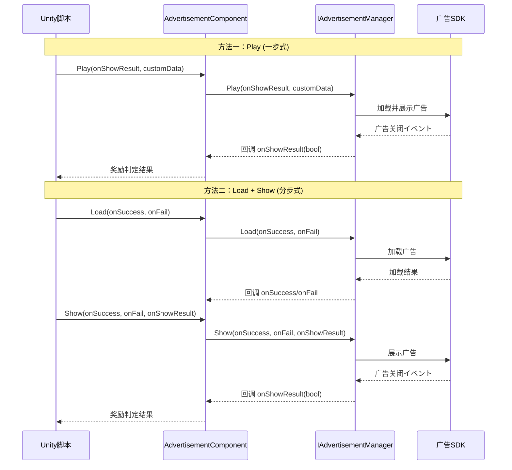

# コア概念

本文档介绍 GameFrameX 广告模块的コア架构概念、设计模式和工作原理。理解这些概念有助于更好地使用和扩展广告機能。

## 概要

GameFrameX 广告模块は基づく Unity 的广告集成フレームワーク，采用模块化アーキテクチャ設計，提供します统一的广告インターフェース抽象。该模块允许開発者以平台无关的方法実装广告機能，同时サポート针对不同平台（Android、iOS、WebGL 以及各种小程序环境）的定制化実装。

コア设计理念是将广告业务逻辑与 Unity コンポーネント生命周期解耦，を通じてインターフェース抽象和モジュラー設計，使代码更加可测试、可维护和可扩展。

## アーキテクチャ設計

```mermaid
graph TD
    subgraph Unity层["Unity コンポーネント层"]
        AC[AdvertisementComponent<br/>广告コンポーネント]
    end

    subgraph フレームワーク层["GameFrameX フレームワーク层"]
        GFC[GameFrameworkComponent<br/>フレームワークコンポーネント基クラス]
        GFE[GameFrameworkEntry<br/>フレームワークエントリーポイント]
        GFM[GameFrameworkModule<br/>フレームワーク模块基クラス]
    end

    subgraph 抽象层["抽象インターフェース层"]
        IAM[IAdvertisementManager<br/>广告管理器インターフェース]
        BAM[BaseAdvertisementManager<br/>广告管理器基クラス]
    end

    subgraph 実装层["平台実装层"]
        ADM[Platform Specific<br/>广告管理器実装]
    end

    AC -->|依赖| IAM
    AC -->|取得模块| GFE
    GFE -->|インスタンス化| GFM
    IAM <|..| BAM
    BAM -->|继承| GFM
    BAM -->|依赖| ADM
    AC -->|引用| GFC
```

### 各层职责

**Unity コンポーネント层**
- `AdvertisementComponent`：作为 Unity ゲーム对象コンポーネント，封装了广告機能的对外インターフェース
- 负责コンポーネント生命周期管理（Awake、Start）
- 处理平台特定的广告位 ID 选择

**フレームワーク层**
- `GameFrameworkComponent`：提供 Unity コンポーネント的基础機能
- `GameFrameworkEntry`：提供模块注册和取得的エントリーポイント点
- `GameFrameworkModule`：所有 GameFrameX 模块的基クラス

**抽象インターフェース层**
- `IAdvertisementManager`：定义广告管理器的抽象インターフェース，隔离业务逻辑与具体実装
- `BaseAdvertisementManager`：提供基础実装，定义回调字段和模板メソッド

**平台実装层**
- 由具体平台実装（如 Unity Ads、AdMob 等）继承 `BaseAdvertisementManager` 実装

## コアコンポーネント详解

### IAdvertisementManager インターフェース

`IAdvertisementManager` 是广告模块的コアインターフェース，定义了所有广告操作的标准契约：

```csharp
public interface IAdvertisementManager
{
    void Initialize(string adUnitId, bool isDebug = false);
    void SetExtraData(string key, string value);
    void Play(Action<bool> playResult, string customData = null);
    void Show(Action<string> success, Action<string> fail, Action<bool> onShowResult, string customData = null);
    void Load(Action<string> success, Action<string> fail, string customData = null);
}
```

> Source: [IAdvertisementManager.cs]({{file_base_url}}/Runtime/Advertisement/IAdvertisementManager.cs#L10-L54)

**インターフェース设计意图：**
- **Initialize**：初期化广告管理器，設定广告位 ID 和调试模式
- **SetExtraData**：允许在展示广告前設定额外参数，供广告 SDK 使用
- **Play**：简化的一步式广告播放メソッド（加载+展示）
- **Show**：分步式广告展示，必要先呼び出し Load
- **Load**：预加载广告リソース，提高展示成功率

### BaseAdvertisementManager 基クラス

`BaseAdvertisementManager` 是所有平台特定广告管理器的基クラス，を継承 `GameFrameworkModule`：

```csharp
public abstract class BaseAdvertisementManager : GameFrameworkModule, IAdvertisementManager
{
    protected Action<bool> OnShowResult;
    protected Action<string> OnLoadSuccess;
    protected Action<string> OnLoadFail;

    public abstract void Initialize(string adUnitId, bool debug = false);
    public abstract void Play(Action<bool> playResult, string customData = null);
    public abstract void Show(Action<string> success, Action<string> fail, Action<bool> onShowResult, string customData = null);
    public abstract void Load(Action<string> success, Action<string> fail, string customData = null);

    protected void LoadSuccess(string json);
    protected void LoadFail(string json);
}
```

> Source: [BaseAdvertisementManager.cs]({{file_base_url}}/Runtime/Advertisement/BaseAdvertisementManager.cs#L11-L108)

**基クラス设计意图：**
- 继承 `GameFrameworkModule` 使其成为フレームワーク的一部分，享受フレームワーク提供的生命周期管理
- 使用 `protected` 修饰符暴露回调字段，供サブクラス在适当时机触发
- 抽象メソッド强制サブクラス実装平台特定逻辑
- `LoadSuccess` 和 `LoadFail` 提供します加载结果的标准处理模板

### AdvertisementComponent コンポーネント

`AdvertisementComponent` 是 Unity 层面的エントリーポイントコンポーネント，を継承 `GameFrameworkComponent`：

```csharp
[DisallowMultipleComponent]
[AddComponentMenu("GameFrameX/Advertisement")]
public class AdvertisementComponent : GameFrameworkComponent
{
    [SerializeField] private string m_adUnitIdAndroid = string.Empty;
    [SerializeField] private string m_adUnitIdiOS = string.Empty;
    [SerializeField] private string m_adUnitIdWebGL = string.Empty;
    [SerializeField] private string m_adUnitIdWebGLWeChat = string.Empty;
    [SerializeField] private string m_adUnitIdWebGLDouYin = string.Empty;
    [SerializeField] private string m_adUnitIdWebGLKuaiShou = string.Empty;
    [SerializeField] private bool m_debug = false;

    public string AdUnitId { get; private set; }

    private IAdvertisementManager _advertisementManager;

    protected override void Awake() { /* ... */ }
    private void Start() { /* ... */ }
    public void Initialize(string adUnitId, bool isDebug = false) { /* ... */ }
    public void SetExtraData(string key, string value) { /* ... */ }
    public void Show(Action<string> success, Action<string> fail, Action<bool> onShowResult) { /* ... */ }
    public void Play(Action<bool> onShowResult, string customData = null) { /* ... */ }
    public void Load(Action<string> success, Action<string> fail) { /* ... */ }
}
```

> Source: [AdvertisementComponent.cs]({{file_base_url}}/Runtime/Advertisement/AdvertisementComponent.cs#L13-L168)

**コンポーネント设计意图：**
- 使用 `[DisallowMultipleComponent]` 确保シーン中只有一个广告コンポーネントインスタンス
- 使用 `[AddComponentMenu]` 方便在 Unity 编辑器中添加コンポーネント
- 序列化字段サポート在编辑器中配置不同平台的海报位 ID
- `Awake` 中を通じて `GameFrameworkEntry.GetModule<IAdvertisementManager>()` 取得模块インスタンス
- `Start` 中自动初期化广告管理器
- に基づいて运行时平台和编译条件自动选择正确的广告位 ID

## 平台选择机制

广告コンポーネントに基づいて运行时环境自动选择对应的广告位 ID，这个过程在 `Awake` メソッド中完成：

```csharp
AdUnitId =
#if UNITY_WEBGL
#if ENABLE_WECHAT_MINI_GAME
    m_adUnitIdWebGLWeChat
#elif ENABLE_DOUYIN_MINI_GAME
    m_adUnitIdWebGLDouYin
#elif ENABLE_KUAISHOU_MINI_GAME
    m_adUnitIdWebGLKuaiShou
#else
    m_adUnitIdWebGL
#endif
#elif UNITY_ANDROID
    m_adUnitIdAndroid
#elif UNITY_IOS
    m_adUnitIdiOS
#else
    string.Empty
#endif
;
```

> Source: [AdvertisementComponent.cs]({{file_base_url}}/Runtime/Advertisement/AdvertisementComponent.cs#L69-L87)

这种设计サポート以下平台：
| 平台 | 条件编译符号 | 配置字段 |
|------|-------------|---------|
| Android | `UNITY_ANDROID` | m_adUnitIdAndroid |
| iOS | `UNITY_IOS` | m_adUnitIdiOS |
| WebGL (通用) | `UNITY_WEBGL` | m_adUnitIdWebGL |
| 微信小程序 | `ENABLE_WECHAT_MINI_GAME` | m_adUnitIdWebGLWeChat |
| 抖音小程序 | `ENABLE_DOUYIN_MINI_GAME` | m_adUnitIdWebGLDouYin |
| 快手小程序 | `ENABLE_KUAISHOU_MINI_GAME` | m_adUnitIdWebGLKuaiShou |

## 广告播放フロー



### Play メソッド（推荐方法）

`Play` メソッド是最简单的广告播放方法，封装了加载和展示的完整フロー：

```csharp
public void Play(Action<bool> onShowResult, string customData = null)
{
    _advertisementManager.Play(onShowResult, customData);
}
```

> Source: [AdvertisementComponent.cs]({{file_base_url}}/Runtime/Advertisement/AdvertisementComponent.cs#L148-L151)

适に使用简单シーン，呼び出し时自动处理广告加载。

### Load + Show メソッド（精细控制）

对于必要精细控制的シーン，可能使用分步方法：

```csharp
// 第一步：预加载广告
public void Load(Action<string> success, Action<string> fail)
{
    _advertisementManager.Load(success, fail);
}

// 第二步：展示广告
public void Show(Action<string> success, Action<string> fail, Action<bool> onShowResult)
{
    _advertisementManager.Show(success, fail, onShowResult);
}
```

> Source: [AdvertisementComponent.cs]({{file_base_url}}/Runtime/Advertisement/AdvertisementComponent.cs#L133-L167)

适に使用：
- 必要在特定时机预加载广告
- 必要に基づいて加载结果做不同处理
- 必要区分加载失败和展示失败

## 回调机制

广告模块使用 C# 的 `Action` 委托実装异步回调：

| 回调クラス型 | 参数 | 用途 |
|---------|------|------|
| `Action<string> success` | 成功信息 | 操作成功时呼び出し |
| `Action<string> fail` | 失败原因 | 操作失败时呼び出し |
| `Action<bool> onShowResult` | 是否完整观看 | 广告关闭时呼び出し，true 表示应发放奖励 |

### onShowResult 回调説明

`onShowResult` 回调的布尔值含义：
- **true**：用户完整观看广告（通常必要发放奖励）
- **false**：用户跳过广告或广告播放異常（不发放奖励）

```csharp
// 使用示例
advertisementComponent.Play((shouldReward) =>
{
    if (shouldReward)
    {
        // 发放奖励
        Debug.Log("用户完整观看广告，发放奖励");
    }
    else
    {
        Debug.Log("用户跳过广告，不发放奖励");
    }
});
```

## 设计模式总结

### 1. 模板メソッド模式

`BaseAdvertisementManager` 定义了 `LoadSuccess` 和 `LoadFail` 模板メソッド，サブクラス只需呼び出し这些メソッド而不必要自行実装回调逻辑：

```csharp
protected void LoadSuccess(string json)
{
    OnLoadSuccess?.Invoke(json);
}
```

> Source: [BaseAdvertisementManager.cs]({{file_base_url}}/Runtime/Advertisement/BaseAdvertisementManager.cs#L94-L97)

### 2. 依赖注入

`AdvertisementComponent` を通じて `GameFrameworkEntry.GetModule<IAdvertisementManager>()` 取得模块インスタンス，而非自行作成：

```csharp
_advertisementManager = GameFrameworkEntry.GetModule<IAdvertisementManager>();
```

> Source: [AdvertisementComponent.cs]({{file_base_url}}/Runtime/Advertisement/AdvertisementComponent.cs#L62-L67)

这种设计允许在运行时替换不同的广告実装，便于测试和平台适配。

### 3. 策略模式

不同的广告平台実装可能替换 `IAdvertisementManager` インターフェース，只要実装相同的インターフェース即可无缝切换。

### 4. 门面模式

`AdvertisementComponent` 作为统一エントリーポイント，简化了与广告模块的交互，開発者无需关心底层実装细节。

## 扩展广告模块

要添加新的广告平台サポート，必要：

1. **作成新的广告管理器クラス**，继承 `BaseAdvertisementManager`
2. **実装所有抽象メソッド**，处理平台特定的广告逻辑
3. **注册到フレームワーク**，を通じて `GameFrameworkEntry` 注册模块
4. **在 Unity コンポーネント中配置**，設定对应平台的广告位 ID

具体実装お願いします参考 [API 参考](./6-api-reference) 和 [平台配置](./5-platforms) 文档。

## 関連リンク

- [快速开始](./3-getting-started)
- [平台配置](./5-platforms)
- [API 参考](./6-api-reference)
- [安装指南](./2-installation)
