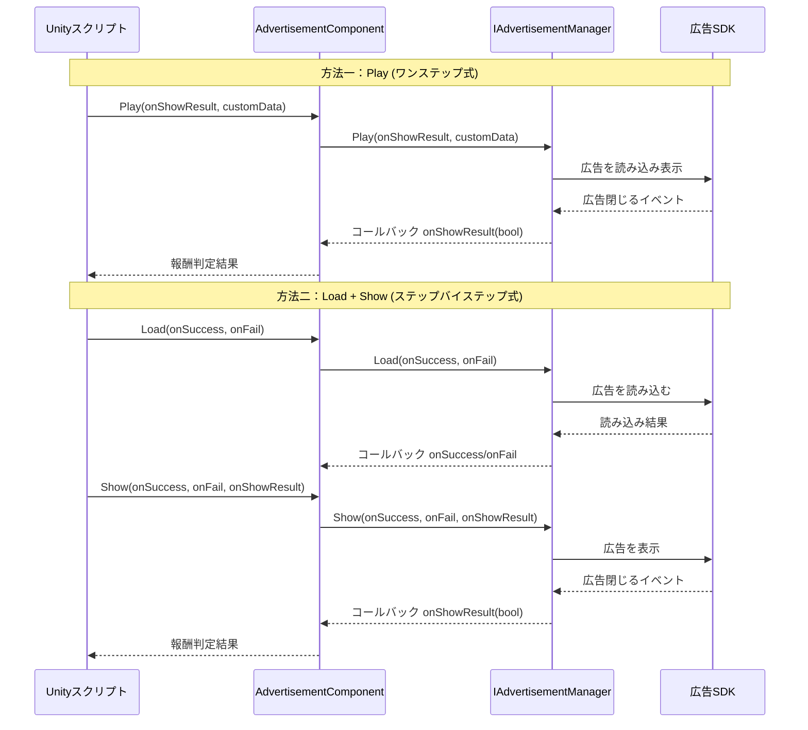

# コアコンセプト

本ドキュメントでは、GameFrameX 広告モジュールのコアアーキテクチャコンセプト、デザインパターン、動作原理について説明します。これらのコンセプトを理解することで、广告機能のより効果的な使用と拡張が可能になります。

## 概要

GameFrameX 広告モジュールは、Unity ベースの広告統合フレームワークであり、モジュール化アーキテクチャを採用して統一された広告インターフェース抽象化を提供します。このモジュールにより、開発者はプラットフォーム非依存の方法で广告機能を実装でき、Android、iOS、WebGL 以及各种ミニプログラム環境などの異なるプラットフォーム向けのカスタマイズ実装もサポートしています。

コアとなる設計理念は、广告ビジネスロジックを Unity コンポーネントライフサイクルから分離し、インターフェース抽象化とモジュール化設計により、コードをよりテスト可能、メンテンナンス可能、拡張可能にすることです。

## アーキテクチャ設計

```mermaid
graph TD
    subgraph Unity层["Unity コンポーネントレイヤー"]
        AC[AdvertisementComponent<br/>広告コンポーネント]
    end

    subgraph フレームワーク层["GameFrameX フレームワークレイヤー"]
        GFC[GameFrameworkComponent<br/>フレームワークコンポーネント基底クラス]
        GFE[GameFrameworkEntry<br/>フレームワークエントリーポイント]
        GFM[GameFrameworkModule<br/>フレームワークモジュール基底クラス]
    end

    subgraph 抽象化层["抽象化インターフェースレイヤー"]
        IAM[IAdvertisementManager<br/>広告マネージャーインターフェース]
        BAM[BaseAdvertisementManager<br/>広告マネージャ基底クラス]
    end

    subgraph 実装层["プラットフォーム実装レイヤー"]
        ADM[Platform Specific<br/>広告マネージャー実装]
    end

    AC -->|依存| IAM
    AC -->|モジュール取得| GFE
    GFE -->|インスタンス化| GFM
    IAM <|..| BAM
    BAM -->|継承| GFM
    BAM -->|依存| ADM
    AC -->|参照| GFC
```

### 各レイヤーの責任

**Unity コンポーネントレイヤー**
- `AdvertisementComponent`：Unity ゲームオブジェクトコンポーネントとして、广告機能の外部インターフェースをカプセル化
- コンポーネントライフサイクル管理（Awake、Start）を 담당
- プラットフォーム固有の広告ユニット ID 選択を処理

**フレームワークレイヤー**
- `GameFrameworkComponent`：Unity コンポーネントの基本機能を提供
- `GameFrameworkEntry`：モジュールの登録と取得のエントリーポイントを提供
- `GameFrameworkModule`：すべての GameFrameX モジュールの基底クラス

**抽象化インターフェースレイヤー**
- `IAdvertisementManager`：広告マネージャーの抽象化インターフェースを定義し、ビジネスロジックと具体的な実装を分離
- `BaseAdvertisementManager`：基本実装を提供し、コールバックフィールドとテンプレートメソッドを定義

**プラットフォーム実装レイヤー**
- 具体的なプラットフォーム実装（Unity Ads、AdMob など）が `BaseAdvertisementManager` を継承して実装

## コアコンポーネントの詳細

### IAdvertisementManager インターフェース

`IAdvertisementManager` は广告モジュールのコアインターフェースであり、すべての広告操作の標準コントラクトを定義します：

```csharp
public interface IAdvertisementManager
{
    void Initialize(string adUnitId, bool isDebug = false);
    void SetExtraData(string key, string value);
    void Play(Action<bool> playResult, string customData = null);
    void Show(Action<string> success, Action<string> fail, Action<bool> onShowResult, string customData = null);
    void Load(Action<string> success, Action<string> fail, string customData = null);
}
```

> Source: [IAdvertisementManager.cs]({{file_base_url}}/Runtime/Advertisement/IAdvertisementManager.cs#L10-L54)

**インターフェース設計の意図：**
- **Initialize**：広告マネージャーを初期化し、広告ユニット ID とデバッグモードを設定
- **SetExtraData**：広告を表示する前に追加パラメータを設定できるようにし、广告 SDK が使用可能
- **Play**：簡略化されたワンステップ広告再生メソッド（読み込み+表示）
- **Show**：ステップバイステップ広告表示、Load を先に呼び出す必要がある
- **Load**：広告リソースをプリロードし、表示成功率を向上

### BaseAdvertisementManager 基底クラス

`BaseAdvertisementManager` は、すべてのプラットフォーム固有広告マネージャーの基底クラスであり、`GameFrameworkModule` を継承します：

```csharp
public abstract class BaseAdvertisementManager : GameFrameworkModule, IAdvertisementManager
{
    protected Action<bool> OnShowResult;
    protected Action<string> OnLoadSuccess;
    protected Action<string> OnLoadFail;

    public abstract void Initialize(string adUnitId, bool debug = false);
    public abstract void Play(Action<bool> playResult, string customData = null);
    public abstract void Show(Action<string> success, Action<string> fail, Action<bool> onShowResult, string customData = null);
    public abstract void Load(Action<string> success, Action<string> fail, string customData = null);

    protected void LoadSuccess(string json);
    protected void LoadFail(string json);
}
```

> Source: [BaseAdvertisementManager.cs]({{file_base_url}}/Runtime/Advertisement/BaseAdvertisementManager.cs#L11-L108)

**基底クラス設計の意図：**
- `GameFrameworkModule` を継承することでフレームワークの一部となり、フレームワーク提供のライフサイクル管理を利用
- `protected` 修飾子を使用してコールバックフィールドをサブクラスに公開し、適切なタイミングでトリガー可能
- 抽象メソッドがサブクラスにプラットフォーム固有ロジック реализация を強制
- `LoadSuccess` と `LoadFail` が読み込み結果の標準処理テンプレートを提供

### AdvertisementComponent コンポーネント

`AdvertisementComponent` は Unity レイヤーのエントリーポイントコンポーネントであり、`GameFrameworkComponent` を継承します：

```csharp
[DisallowMultipleComponent]
[AddComponentMenu("GameFrameX/Advertisement")]
public class AdvertisementComponent : GameFrameworkComponent
{
    [SerializeField] private string m_adUnitIdAndroid = string.Empty;
    [SerializeField] private string m_adUnitIdiOS = string.Empty;
    [SerializeField] private string m_adUnitIdWebGL = string.Empty;
    [SerializeField] private string m_adUnitIdWebGLWeChat = string.Empty;
    [SerializeField] private string m_adUnitIdWebGLDouYin = string.Empty;
    [SerializeField] private string m_adUnitIdWebGLKuaiShou = string.Empty;
    [SerializeField] private bool m_debug = false;

    public string AdUnitId { get; private set; }

    private IAdvertisementManager _advertisementManager;

    protected override void Awake() { /* ... */ }
    private void Start() { /* ... */ }
    public void Initialize(string adUnitId, bool isDebug = false) { /* ... */ }
    public void SetExtraData(string key, string value) { /* ... */ }
    public void Show(Action<string> success, Action<string> fail, Action<bool> onShowResult) { /* ... */ }
    public void Play(Action<bool> onShowResult, string customData = null) { /* ... */ }
    public void Load(Action<string> success, Action<string> fail) { /* ... */ }
}
```

> Source: [AdvertisementComponent.cs]({{file_base_url}}/Runtime/Advertisement/AdvertisementComponent.cs#L13-L168)

**コンポーネント設計の意図：**
- `[DisallowMultipleComponent]` を使用してシーン内に広告コンポーネントインスタンスが1つだけであることを保証
- `[AddComponentMenu]` を使用して Unity エディターでのコンポーネント追加を便利に
- シリアル化フィールドがエディターでの異なるプラットフォームの広告ユニット ID 設定をサポート
- `Awake` で `GameFrameworkEntry.GetModule<IAdvertisementManager>()` を通じてモジュールインスタンスを取得
- `Start` で広告マネージャーを自動的に初期化
- 実行時プラットフォームとコンパイル条件に基づいて正しい広告ユニット ID を自動選択

## プラットフォーム選択メカニズム

广告コンポーネントは実行時環境に基づいて対応する広告ユニット ID を自動選択し、このプロセスは `Awake` メソッドで完了します：

```csharp
AdUnitId =
#if UNITY_WEBGL
#if ENABLE_WECHAT_MINI_GAME
    m_adUnitIdWebGLWeChat
#elif ENABLE_DOUYIN_MINI_GAME
    m_adUnitIdWebGLDouYin
#elif ENABLE_KUAISHOU_MINI_GAME
    m_adUnitIdWebGLKuaiShou
#else
    m_adUnitIdWebGL
#endif
#elif UNITY_ANDROID
    m_adUnitIdAndroid
#elif UNITY_IOS
    m_adUnitIdiOS
#else
    string.Empty
#endif
;
```

> Source: [AdvertisementComponent.cs]({{file_base_url}}/Runtime/Advertisement/AdvertisementComponent.cs#L69-L87)

この設計は次のプラットフォームをサポートします：
| プラットフォーム | 条件コンパイルシンボル | 設定フィールド |
|------|-------------|---------|
| Android | `UNITY_ANDROID` | m_adUnitIdAndroid |
| iOS | `UNITY_IOS` | m_adUnitIdiOS |
| WebGL (汎用) | `UNITY_WEBGL` | m_adUnitIdWebGL |
| WeChatミニプログラム | `ENABLE_WECHAT_MINI_GAME` | m_adUnitIdWebGLWeChat |
| Douyinミニプログラム | `ENABLE_DOUYIN_MINI_GAME` | m_adUnitIdWebGLDouYin |
| Kuaishouミニプログラム | `ENABLE_KUAISHOU_MINI_GAME` | m_adUnitIdWebGLKuaiShou |

## 広告再生プロセス



### Play メソッド（推奨方法）

`Play` メソッドは最もシンプルな広告再生方法で、読み込みと表示の完全なプロセスをカプセル化します：

```csharp
public void Play(Action<bool> onShowResult, string customData = null)
{
    _advertisementManager.Play(onShowResult, customData);
}
```

> Source: [AdvertisementComponent.cs]({{file_base_url}}/Runtime/Advertisement/AdvertisementComponent.cs#L148-L151)

シンプルなシーンに適し、呼び出し時に自動的に広告読み込みを処理します。

### Load + Show メソッド（精密制御）

精密制御が必要なシーンでは、ステップバイステップ方式を使用できます：

```csharp
// 第一歩：広告をプリロード
public void Load(Action<string> success, Action<string> fail)
{
    _advertisementManager.Load(success, fail);
}

// 第二歩：広告を表示
public void Show(Action<string> success, Action<string> fail, Action<bool> onShowResult)
{
    _advertisementManager.Show(success, fail, onShowResult);
}
```

> Source: [AdvertisementComponent.cs]({{file_base_url}}/Runtime/Advertisement/AdvertisementComponent.cs#L133-L167)

次の場合に適しています：
- 特定のタイミングで広告をプリロードする必要がある
- 読み込み結果に基づいて異なる処理を行う必要がある
- 読み込み失敗と表示失敗を区別する必要がある

## コールバックメカニズム

广告モジュールは C# の `Action`  делегатを使用して非同期コールバックを実装します：

| コールバック型 | パラメータ | 用途 |
|---------|------|------|
| `Action<string> success` | 成功情報 | 操作が成功したときに呼び出し |
| `Action<string> fail` | 失敗原因 | 操作が失敗したときに呼び出し |
| `Action<bool> onShowResult` | 完全視聴かどうか | 広告が閉じられたときに呼び出し、true は報酬を发放すべきを示す |

### onShowResult コールバックの説明

`onShowResult` コールバックのブール値の意味：
- **true**：ユーザーが広告を完全視聴（通常報酬を发放する必要がある）
- **false**：ユーザーが広告をスキップまたは広告再生に異常が発生（報酬を发放しない）

```csharp
// 使用例
advertisementComponent.Play((shouldReward) =>
{
    if (shouldReward)
    {
        // 報酬を发放
        Debug.Log("ユーザーが広告を完全視聴、報酬を发放");
    }
    else
    {
        Debug.Log("ユーザーが広告をスキップ、報酬を发放しない");
    }
});
```

## デザインパターンのまとめ

### 1. テンプレートメソッドパターン

`BaseAdvertisementManager` は `LoadSuccess` と `LoadFail` テンプレートメソッドを定義し、サブクラスはこれらのメソッドを呼び出すだけでよく、コールバックロジックを自行実装する必要がありません：

```csharp
protected void LoadSuccess(string json)
{
    OnLoadSuccess?.Invoke(json);
}
```

> Source: [BaseAdvertisementManager.cs]({{file_base_url}}/Runtime/Advertisement/BaseAdvertisementManager.cs#L94-L97)

### 2. 依存性注入

`AdvertisementComponent` は `GameFrameworkEntry.GetModule<IAdvertisementManager>()` を通じてモジュールインスタンスを取得し、而非自行作成：

```csharp
_advertisementManager = GameFrameworkEntry.GetModule<IAdvertisementManager>();
```

> Source: [AdvertisementComponent.cs]({{file_base_url}}/Runtime/Advertisement/AdvertisementComponent.cs#L62-L67)

この設計により、実行時に異なる広告実装を置き換えることができ、テストとプラットフォーム適応が容易になります。

### 3. ストラテジーパターン

異なる広告プラットフォーム実装は `IAdvertisementManager` インターフェースを置き換えることができ、同じインターフェースを実装するだけでシームレスに切り替え可能です。

### 4. ファサードパターン

`AdvertisementComponent` は統一されたエントリーポイントとして機能し、广告モジュールとのやり取りを簡素化し、開発者が下位実装の詳細を気にする必要がありません。

## 広告モジュールの拡張

新しい広告プラットフォームサポートを追加するには：

1. **新しい広告マネージャークラスを作成**し、`BaseAdvertisementManager` を継承
2. **すべての抽象メソッドを実装**し、プラットフォーム固有の広告ロジックを処理
3. **フレームワークに登録**し、`GameFrameworkEntry` を通じてモジュールを登録
4. **Unity コンポーネントで設定**し、対応プラットフォームの広告ユニット ID を設定

具体的な実装については、[API リファレンス](./6-api-reference) と [プラットフォーム設定](./5-platforms) ドキュメントを参照してください。

## 関連リンク

- [クイックスタート](./3-getting-started)
- [プラットフォーム設定](./5-platforms)
- [API リファレンス](./6-api-reference)
- [インストールガイド](./2-installation)
