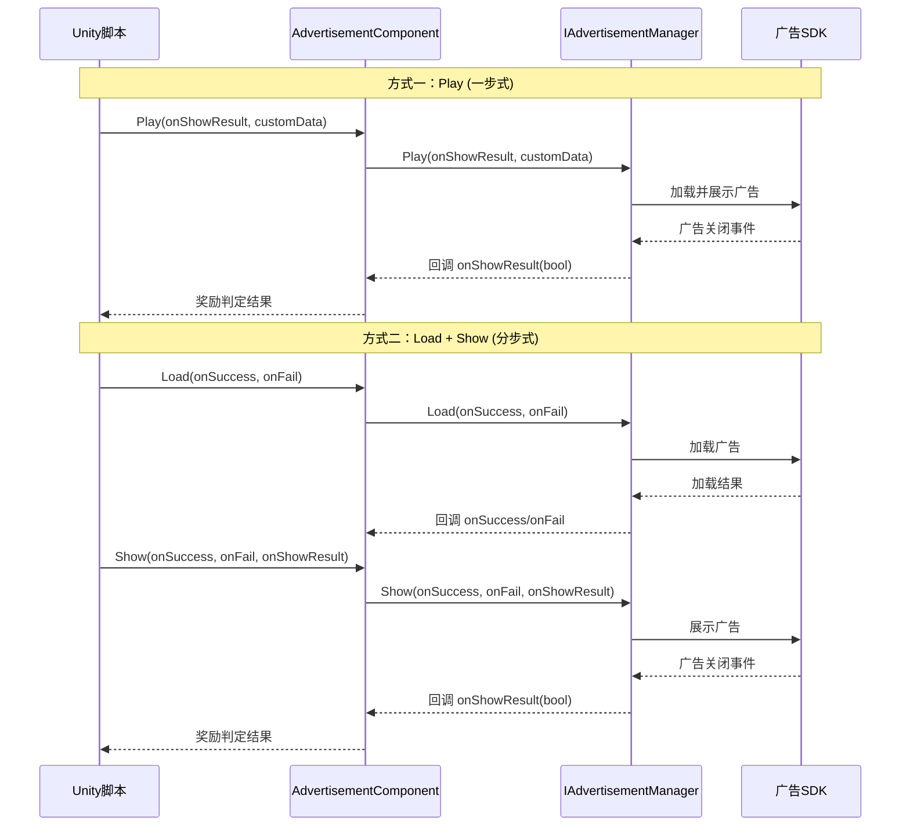

# コアコンセプト

このドキュメント介绍 GameFrameX 広告モジュール的コアアーキテクチャコンセプト、設計モード和工作原理。理解这些コンセプト有助于更好地使用和拡張広告機能。

## 概要

GameFrameX 広告モジュールは基于 Unity 的広告集成フレームワーク，采用モジュール化アーキテクチャ設計，提供します統一された的広告インターフェース抽象。该モジュール允许開発者以プラットフォーム无关的方法実装広告機能，同時にサポート针对不同プラットフォーム（Android、iOS、WebGL および各种小程序環境）的定制化実装。

コア設計理念是将広告业务逻辑与 Unity コンポーネントライフサイクル解耦，通过インターフェース抽象和モジュール化設計，使コード更加可テスト、可维护和可拡張。

## アーキテクチャ設計

```mermaid
graph TD
    subgraph Unity层["Unity 组件层"]
        AC[AdvertisementComponent<br/>广告组件]
    end

    subgraph 框架层["GameFrameX 框架层"]
        GFC[GameFrameworkComponent<br/>框架组件基类]
        GFE[GameFrameworkEntry<br/>框架入口]
        GFM[GameFrameworkModule<br/>框架模块基类]
    end

    subgraph 抽象层["抽象接口层"]
        IAM[IAdvertisementManager<br/>广告管理器接口]
        BAM[BaseAdvertisementManager<br/>广告管理器基类]
    end

    subgraph 实现层["平台实现层"]
        ADM[Platform Specific<br/>广告管理器实现]
    end

    AC -->|依赖| IAM
    AC -->|获取模块| GFE
    GFE -->|实例化| GFM
    IAM <|..| BAM
    BAM -->|继承| GFM
    BAM -->|依赖| ADM
    AC -->|引用| GFC
```

### 各层职责

**Unity コンポーネント層**
- `AdvertisementComponent`：作为 Unity 游戏对象コンポーネント，カプセル化了広告機能的对外インターフェース
- 负责コンポーネントライフサイクル管理（Awake、Start）
- 処理プラットフォーム特定的広告ユニット ID 选择

**フレームワーク層**
- `GameFrameworkComponent`：提供 Unity コンポーネント的基本機能
- `GameFrameworkEntry`：提供モジュール登録和取得的入口点
- `GameFrameworkModule`：所有 GameFrameX モジュール的基底クラス

**抽象インターフェース層**
- `IAdvertisementManager`：定義広告マネージャー的抽象インターフェース，隔离业务逻辑与具体実装
- `BaseAdvertisementManager`：提供基本実装，定義コールバックフィールド和模板メソッド

**プラットフォーム実装層**
- 由具体プラットフォーム実装（如 Unity Ads、AdMob 等）継承 `BaseAdvertisementManager` 実装

## コアコンポーネント详解

### IAdvertisementManager インターフェース

`IAdvertisementManager` 是広告モジュール的コアインターフェース，定義了所有広告操作的標準契约：

```csharp
public interface IAdvertisementManager
{
    void Initialize(string adUnitId, bool isDebug = false);
    void SetExtraData(string key, string value);
    void Play(Action<bool> playResult, string customData = null);
    void Show(Action<string> success, Action<string> fail, Action<bool> onShowResult, string customData = null);
    void Load(Action<string> success, Action<string> fail, string customData = null);
}
```

> Source: [IAdvertisementManager.cs]({{file_base_url}}/Runtime/Advertisement/IAdvertisementManager.cs#L10-L54)

**インターフェース設計意图：**
- **Initialize**：初期化広告マネージャー，設定広告ユニット ID 和デバッグモード
- **SetExtraData**：允许在表示広告前設定额外パラメータ，供広告 SDK 使用
- **Play**：簡素化的一步式広告再生メソッド（ロード+表示）
- **Show**：分步式広告表示，〜する必要があります先呼び出し Load
- **Load**：预ロード広告リソース，提高表示成功率

### BaseAdvertisementManager 基底クラス

`BaseAdvertisementManager` 是所有プラットフォーム特定広告マネージャー的基底クラス，継承自 `GameFrameworkModule`：

```csharp
public abstract class BaseAdvertisementManager : GameFrameworkModule, IAdvertisementManager
{
    protected Action<bool> OnShowResult;
    protected Action<string> OnLoadSuccess;
    protected Action<string> OnLoadFail;

    public abstract void Initialize(string adUnitId, bool debug = false);
    public abstract void Play(Action<bool> playResult, string customData = null);
    public abstract void Show(Action<string> success, Action<string> fail, Action<bool> onShowResult, string customData = null);
    public abstract void Load(Action<string> success, Action<string> fail, string customData = null);

    protected void LoadSuccess(string json);
    protected void LoadFail(string json);
}
```

> Source: [BaseAdvertisementManager.cs]({{file_base_url}}/Runtime/Advertisement/BaseAdvertisementManager.cs#L11-L108)

**基底クラス設計意图：**
- 継承 `GameFrameworkModule` 使其成为フレームワーク的一部分，享受フレームワーク提供的ライフサイクル管理
- 使用 `protected` 修饰符暴露コールバックフィールド，供サブクラス在适当时机トリガー
- 抽象メソッド强制サブクラス実装プラットフォーム特定逻辑
- `LoadSuccess` 和 `LoadFail` 提供しますロード結果的標準処理模板

### AdvertisementComponent コンポーネント

`AdvertisementComponent` 是 Unity 层面的入口コンポーネント，継承自 `GameFrameworkComponent`：

```csharp
[DisallowMultipleComponent]
[AddComponentMenu("GameFrameX/Advertisement")]
public class AdvertisementComponent : GameFrameworkComponent
{
    [SerializeField] private string m_adUnitIdAndroid = string.Empty;
    [SerializeField] private string m_adUnitIdiOS = string.Empty;
    [SerializeField] private string m_adUnitIdWebGL = string.Empty;
    [SerializeField] private string m_adUnitIdWebGLWeChat = string.Empty;
    [SerializeField] private string m_adUnitIdWebGLDouYin = string.Empty;
    [SerializeField] private string m_adUnitIdWebGLKuaiShou = string.Empty;
    [SerializeField] private bool m_debug = false;

    public string AdUnitId { get; private set; }

    private IAdvertisementManager _advertisementManager;

    protected override void Awake() { /* ... */ }
    private void Start() { /* ... */ }
    public void Initialize(string adUnitId, bool isDebug = false) { /* ... */ }
    public void SetExtraData(string key, string value) { /* ... */ }
    public void Show(Action<string> success, Action<string> fail, Action<bool> onShowResult) { /* ... */ }
    public void Play(Action<bool> onShowResult, string customData = null) { /* ... */ }
    public void Load(Action<string> success, Action<string> fail) { /* ... */ }
}
```

> Source: [AdvertisementComponent.cs]({{file_base_url}}/Runtime/Advertisement/AdvertisementComponent.cs#L13-L168)

**コンポーネント設計意图：**
- 使用 `[DisallowMultipleComponent]` 確認してくださいシーン中只有一个広告コンポーネントインスタンス
- 使用 `[AddComponentMenu]` 方便在 Unity エディタ中追加コンポーネント
- シリアライズフィールドサポート在エディタ中設定不同プラットフォーム的海报位 ID
- `Awake` 中通过 `GameFrameworkEntry.GetModule<IAdvertisementManager>()` 取得モジュールインスタンス
- `Start` 中自动初期化広告マネージャー
- 根据ランタイムプラットフォーム和コンパイル条件自动选择正确的広告ユニット ID

## プラットフォーム选择机制

広告コンポーネント根据ランタイム環境自动选择对应的広告ユニット ID，这个过程在 `Awake` メソッド中完成：

```csharp
AdUnitId =
#if UNITY_WEBGL
#if ENABLE_WECHAT_MINI_GAME
    m_adUnitIdWebGLWeChat
#elif ENABLE_DOUYIN_MINI_GAME
    m_adUnitIdWebGLDouYin
#elif ENABLE_KUAISHOU_MINI_GAME
    m_adUnitIdWebGLKuaiShou
#else
    m_adUnitIdWebGL
#endif
#elif UNITY_ANDROID
    m_adUnitIdAndroid
#elif UNITY_IOS
    m_adUnitIdiOS
#else
    string.Empty
#endif
;
```

> Source: [AdvertisementComponent.cs]({{file_base_url}}/Runtime/Advertisement/AdvertisementComponent.cs#L69-L87)

这种設計サポート以下プラットフォーム：
| プラットフォーム | 条件コンパイル符号 | 設定フィールド |
|------|-------------|---------|
| Android | `UNITY_ANDROID` | m_adUnitIdAndroid |
| iOS | `UNITY_IOS` | m_adUnitIdiOS |
| WebGL (汎用) | `UNITY_WEBGL` | m_adUnitIdWebGL |
| WeChatミニゲーム | `ENABLE_WECHAT_MINI_GAME` | m_adUnitIdWebGLWeChat |
| DouYinミニゲーム | `ENABLE_DOUYIN_MINI_GAME` | m_adUnitIdWebGLDouYin |
| KuaiShouミニゲーム | `ENABLE_KUAISHOU_MINI_GAME` | m_adUnitIdWebGLKuaiShou |

## 広告再生フロー



### Play メソッド（推奨方法）

`Play` メソッド是最シンプル的広告再生方法，カプセル化了ロード和表示的完全なフロー：

```csharp
public void Play(Action<bool> onShowResult, string customData = null)
{
    _advertisementManager.Play(onShowResult, customData);
}
```

> Source: [AdvertisementComponent.cs]({{file_base_url}}/Runtime/Advertisement/AdvertisementComponent.cs#L148-L151)

適していますシンプルシーン，呼び出し时自动処理広告読み込み。

### Load + Show メソッド（精细控制）

对于〜する必要があります精细控制的シーン，〜できます使用分步方法：

```csharp
// 第一步：预加载广告
public void Load(Action<string> success, Action<string> fail)
{
    _advertisementManager.Load(success, fail);
}

// 第二步：展示广告
public void Show(Action<string> success, Action<string> fail, Action<bool> onShowResult)
{
    _advertisementManager.Show(success, fail, onShowResult);
}
```

> Source: [AdvertisementComponent.cs]({{file_base_url}}/Runtime/Advertisement/AdvertisementComponent.cs#L133-L167)

適しています：
- 〜する必要があります在特定时机预ロード広告
- 〜する必要があります根据ロード結果做不同処理
- 〜する必要があります区分ロード失敗和表示失敗

## コールバック机制

広告モジュール使用 C# 的 `Action` デリゲート実装异步コールバック：

| コールバックタイプ | パラメータ | 用途 |
|---------|------|------|
| `Action<string> success` | 成功情報 | 操作成功时呼び出し |
| `Action<string> fail` | 失敗原因 | 操作失敗时呼び出し |
| `Action<bool> onShowResult` | 是否完全な視聴 | 広告閉じる时呼び出し，true 表示应发放報酬 |

### onShowResult コールバック説明

`onShowResult` コールバック的布尔值意味：
- **true**：ユーザー完全な視聴広告（通常〜する必要があります发放報酬）
- **false**：ユーザー跳过広告或広告再生例外（不发放報酬）

```csharp
// 使用示例
advertisementComponent.Play((shouldReward) =>
{
    if (shouldReward)
    {
        // 发放奖励
        Debug.Log("用户完整观看广告，发放奖励");
    }
    else
    {
        Debug.Log("用户跳过广告，不发放奖励");
    }
});
```

## デザインパターン总结

### 1. テンプレートメソッドパターン

`BaseAdvertisementManager` 定義了 `LoadSuccess` 和 `LoadFail` 模板メソッド，サブクラス只需呼び出し这些メソッド而不〜する必要があります自行実装コールバック逻辑：

```csharp
protected void LoadSuccess(string json)
{
    OnLoadSuccess?.Invoke(json);
}
```

> Source: [BaseAdvertisementManager.cs]({{file_base_url}}/Runtime/Advertisement/BaseAdvertisementManager.cs#L94-L97)

### 2. 依存性注入

`AdvertisementComponent` 通过 `GameFrameworkEntry.GetModule<IAdvertisementManager>()` 取得モジュールインスタンス，而非自行作成：

```csharp
_advertisementManager = GameFrameworkEntry.GetModule<IAdvertisementManager>();
```

> Source: [AdvertisementComponent.cs]({{file_base_url}}/Runtime/Advertisement/AdvertisementComponent.cs#L62-L67)

这种設計允许在ランタイム置換不同的広告実装，便于テスト和プラットフォーム适配。

### 3. ストラテジーパターン

不同的広告プラットフォーム実装〜できます置換 `IAdvertisementManager` インターフェース，只要実装相同的インターフェースつまり可无缝切换。

### 4. ファサードパターン

`AdvertisementComponent` 作为統一された入口，簡素化了与広告モジュール的交互，開発者无需关心底层実装细节。

## 拡張広告モジュール

要追加新的広告プラットフォームサポート，〜する必要があります：

1. **作成新的広告マネージャー类**，継承 `BaseAdvertisementManager`
2. **実装所有抽象メソッド**，処理プラットフォーム特定的広告逻辑
3. **登録到フレームワーク**，通过 `GameFrameworkEntry` 登録モジュール
4. **在 Unity コンポーネント中設定**，設定对应プラットフォーム的広告ユニット ID

具体実装请リファレンス [API リファレンス](./6-api-reference) 和 [プラットフォーム設定](./5-platforms) ドキュメント。

## 関連リンク

- [快速开始](./3-getting-started)
- [プラットフォーム設定](./5-platforms)
- [API リファレンス](./6-api-reference)
- [インストールガイド](./2-installation)
