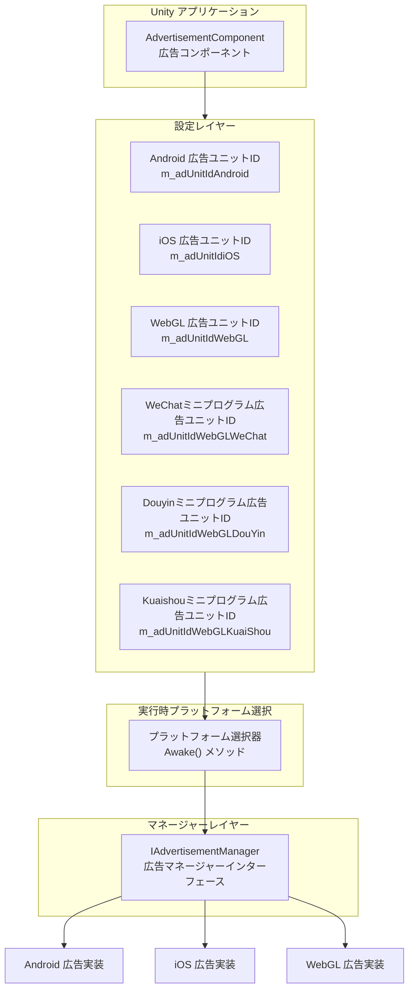

# プラットフォーム設定

本ドキュメントでは、Game Frame X 广告コンポーネントのプラットフォーム設定メカニズムについて説明し、異なる公開プラットフォームで広告ユニット ID を設定する方法を解説します。

## 概要

Game Frame X 广告コンポーネントは、プラットフォーム非依存の設計アーキテクチャを採用しており、`AdvertisementComponent` コンポーネントを通じて統一された広告インターフェースを提供します。下位層では Unity の条件付きコンパイルディレクティブを使用して異なるプラットフォームの自動適応を実装し、開発者は Inspector パネルで各プラットフォームの広告ユニット ID を設定するだけで、1回の設定でマルチプラットフォーム公開を実現できます。

> 注意：本コンポーネントは広告機能の抽象化レイヤーとコアロジックフレームのみを提供します。真の広告表示を実現するには、プロジェクトで具体的な広告 SDK（AdMob、Unity Ads、穿山甲など）を統合し、`IAdvertisementManager` インターフェースを実装する必要があります。

## サポートされているプラットフォーム

Game Frame X 广告コンポーネントは以下のプラットフォーム設定をサポートしています：

| プラットフォーム | 設定フィールド | 条件コンパイルディレクティブ | 説明 |
|------|----------|--------------|------|
| Android | `m_adUnitIdAndroid` | `UNITY_ANDROID` | Android ネイティブプラットフォーム |
| iOS | `m_adUnitIdiOS` | `UNITY_IOS` | iOS プラットフォーム |
| WebGL | `m_adUnitIdWebGL` | `UNITY_WEBGL` | 標準 WebGL プラットフォーム |
| WebGL (WeChatミニプログラム) | `m_adUnitIdWebGLWeChat` | `UNITY_WEBGL` + `ENABLE_WECHAT_MINI_GAME` | WeChat小ゲーム環境 |
| WebGL (Douyinミニプログラム) | `m_adUnitIdWebGLDouYin` | `UNITY_WEBGL` + `ENABLE_DOUYIN_MINI_GAME` | Douyin小ゲーム環境 |
| WebGL (Kuaishouミニプログラム) | `m_adUnitIdWebGLKuaiShou` | `UNITY_WEBGL` + `ENABLE_KUAISHOU_MINI_GAME` | Kuaishou小ゲーム環境 |

## アーキテクチャ設計



プラットフォーム選択ロジックは `AdvertisementComponent` の `Awake()` メソッドで実装され、現在のコンパイルプラットフォームに基づいて対応する広告ユニット ID を自動選択します：

```csharp
AdUnitId =
#if UNITY_WEBGL
#if ENABLE_WECHAT_MINI_GAME
    m_adUnitIdWebGLWeChat
#elif ENABLE_DOUYIN_MINI_GAME
    m_adUnitIdWebGLDouYin
#elif ENABLE_KUAISHOU_MINI_GAME
    m_adUnitIdWebGLKuaiShou
#else
    m_adUnitIdWebGL
#endif
#elif UNITY_ANDROID
    m_adUnitIdAndroid
#elif UNITY_IOS
    m_adUnitIdiOS
#else
    string.Empty
#endif
;
```

> Source: [AdvertisementComponent.cs](https://cnb.cool/GameFrameX/com.gameframex.unity.advertisement/blob/main/Runtime/Advertisement/AdvertisementComponent.cs#L69-L87)

## 設定プロセス

### ステップ1：コンポーネントを追加

Unity シーンで空の GameObject を作成（または既存のオブジェクトを選択）し、`AdvertisementComponent` コンポーネントを追加します：

1. Unity メニューで **GameObject** → **GameFrameX** → **Advertisement** を選択
2. または、Inspector パネルで **Add Component** をクリックし、`Advertisement` を検索して追加

### ステップ2：広告ユニット ID を設定

Inspector パネルで各プラットフォームの広告ユニット ID を設定します：

```csharp
[SerializeField] private string m_adUnitIdAndroid = string.Empty;      // Android 広告ユニットID
[SerializeField] private string m_adUnitIdiOS = string.Empty;           // iOS 広告ユニットID
[SerializeField] private string m_adUnitIdWebGL = string.Empty;         // WebGL 広告ユニットID
[SerializeField] private string m_adUnitIdWebGLWeChat = string.Empty;   // WeChatミニプログラム広告ユニットID
[SerializeField] private string m_adUnitIdWebGLDouYin = string.Empty;   // Douyinミニプログラム広告ユニットID
[SerializeField] private string m_adUnitIdWebGLKuaiShou = string.Empty;  // Kuaishouミニプログラム広告ユニットID
```

> Source: [AdvertisementComponent.cs](https://cnb.cool/GameFrameX/com.gameframex.unity.advertisement/blob/main/Runtime/Advertisement/AdvertisementComponent.cs#L15-L43)

### ステップ3：テストモードを設定（任意）

デバッグ時に広告ログを表示する必要がある場合、テストモードを有効にします：

```csharp
[SerializeField] private bool m_debug = false;  // テストモードかどうか
```

> Source: [AdvertisementComponent.cs](https://cnb.cool/GameFrameX/com.gameframex.unity.advertisement/blob/main/Runtime/Advertisement/AdvertisementComponent.cs#L48)

### ステップ4：広告マネージャーを実装

本コンポーネントは設定レイヤーを提供しますが、具体的な広告マネージャーを実装する必要があります。典型的な実装プロセスは以下の通りです：

```csharp
using GameFrameX.Advertisement.Runtime;
using GameFrameX.Runtime;
using UnityEngine;

public class MyAdvertisementManager : BaseAdvertisementManager
{
    public override void Initialize(string adUnitId, bool debug = false)
    {
        // 具体的な初期化ロジックを実装
    }

    public override void Play(Action<bool> playResult, string customData = null)
    {
        // 広告再生ロジックを実装
    }

    public override void Show(Action<string> success, Action<string> fail, Action<bool> onShowResult, string customData = null)
    {
        // 広告表示ロジックを実装
    }

    public override void Load(Action<string> success, Action<string> fail, string customData = null)
    {
        // 広告読み込みロジックを実装
    }
}
```

## Unity Editor 設定インターフェース

Game Frame X はカスタム Inspector インターフェースを提供し、開発者がエディターで広告ユニット ID を設定しやすいようにしています：

```csharp
[CustomEditor(typeof(AdvertisementComponent))]
internal sealed class AdvertisementComponentInspector : ComponentTypeComponentInspector
{
    // このカスタム Inspector で各プラットフォームの広告ユニット ID 設定フィールドを表示
}
```

> Source: [AdvertisementComponentInspector.cs](https://cnb.cool/GameFrameX/com.gameframex.unity.advertisement/blob/main/Editor/Inspector/AdvertisementComponentInspector.cs#L16-L71)

Inspector インターフェースの表示効果：

```
┌─────────────────────────────────────────────┐
│ Advertisement Component                      │
├─────────────────────────────────────────────┤
│ Debug Mode:  [ ]                              │
│                                          │
│ Android 広告ユニットID:  [________________]        │
│ IOS 広告ユニットID:      [________________]        │
│ WebGL 広告ユニットID:    [________________]         │
│ WebGL WeChat 広告ユニットID: [________________]       │
│ WebGL Douyin 広告ユニットID: [________________]       │
│ WebGL Kuaishou 広告ユニットID: [________________]       │
└─────────────────────────────────────────────┘
```

## プラットフォーム固有の説明

### Android プラットフォーム

- `UnityEngine.RuntimePlatform.Android` をコンパイルターゲットとして使用
- Google AdMob またはその他の Android 広告プラットフォームで広告ユニット ID を申請する必要がある

### iOS プラットフォーム

- `UnityEngine.RuntimePlatform.IPhonePlayer` をコンパイルターゲットとして使用
- Apple App Store ポリシーで許可されている広告プラットフォームで広告ユニット ID を申請する必要がある

### WebGL プラットフォーム

WebGL プラットフォームはコンパイルマクロ定義に基づいてさらに細分化されます：

| コンパイルマクロ | プラットフォーム | 説明 |
|--------|------|------|
| `ENABLE_WECHAT_MINI_GAME` | WeChatミニプログラム | WeChat小ゲーム環境 |
| `ENABLE_DOUYIN_MINI_GAME` | Douyinミニプログラム | Douyin小ゲーム環境 |
| `ENABLE_KUAISHOU_MINI_GAME` | Kuaishouミニプログラム | Kuaishou小ゲーム環境 |
| 上記マクロなし | 標準 WebGL | ブラウザー環境 |

> **重要な注意**：Unity ビルド設定で、ターゲットプラットフォームに応じて正しくプリプロセッサマクロを設定する必要があります。WeChat、Douyin、Kuaishou小ゲームについては、Player Settings → Other Settings → Scripting Define Symbols に、対応するマクロ定義を追加する必要があります。

## 設定の検証

設定が完了したら、以下の方法で設定が正しいかどうかを確認できます：

1. **実行時ログ**：コンポーネント初期化時に選択されたプラットフォームと広告ユニット ID が出力されます
2. **コードデバッグ**：`Awake()` メソッドで `AdUnitId` プロパティの値を確認

```csharp
// AdvertisementComponent 内
public string AdUnitId { get; private set; }

// ログ出力を使用して検証
Debug.Log($"現在のプラットフォーム広告ユニットID: {AdUnitId}");
```

## よくある質問

### Q1: あるプラットフォームの広告ユニット ID にはどのような形式を入力すればよいですか？

異なる広告プラットフォームの広告ユニット ID の形式は異なります：
- **Google AdMob**: 形式は `ca-app-pub-xxxxxx/xxxxxx`
- **Unity Ads**: 形式は数字 ID
- **穿山甲**: 形式は広告プラットフォームから提供

具体的な広告プラットフォームのドキュメントを参照して、正しい広告ユニット ID の形式を確認してください。

### Q2: 広告ユニット ID の設定は正しいが広告が表示されません

以下の点を確認してください：
1. `IAdvertisementManager` インターフェースを実装した具体的なクラスがあるかどうか確認
2. 具体的な実装クラスが Game Frame X フレームワークに正しく登録されているかどうか確認
3. 広告プラットフォームの管理画面でアプリと広告ユニットが設定されているかどうか確認
4. `m_debug` モードを有効にして詳細なログを確認

### Q3: WebGL プラットフォームをコンパイルした後広告が表示されません

WebGL プラットフォームの場合、以下を確認してください：
1. `m_adUnitIdWebGL` フィールドが正しく設定されているかどうか
2. WeChat/Douyin/Kuaishou小ゲームの場合、Player Settings に соответствующие コンパイルマクロが追加されているかどうか
3. ブラウザーコンソールに JavaScript エラーがないかどうか

## 関連リンク

- [概要](./1-overview) - 広告コンポーネントの全体アーキテクチャを理解
- [インストールガイド](./2-installation) - コンポーネントのインストール方法を参照
- [クイックスタート](./3-getting-started) - 広告機能を迅速に統合
- [コアコンセプト](./4-core-concepts) - コアコンセプトの詳細を理解
- [API リファレンス](./6-api-reference) - 完全な API インターフェースドキュメント
- [よくある質問](./7-troubleshooting) - よくある質問への回答
