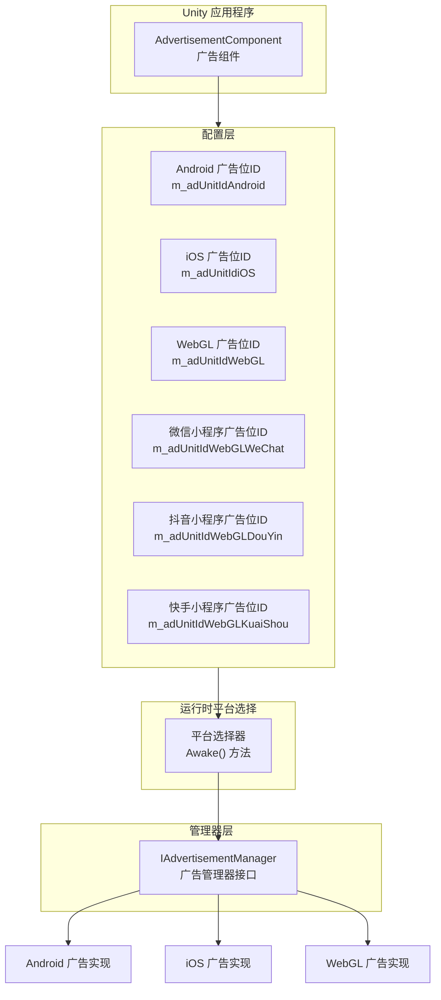

# プラットフォーム設定

このドキュメント介绍 Game Frame X 広告コンポーネント的プラットフォーム設定机制，説明如何在不同的リリースプラットフォーム上設定広告ユニット ID。

## 概要

Game Frame X 広告コンポーネント采用プラットフォーム无关的設計アーキテクチャ，通过 `AdvertisementComponent` コンポーネント提供統一された的広告インターフェース。底层通过 Unity 的条件コンパイル指令実装不同プラットフォーム自动适配，開発者只需在 Inspector パネル中設定各プラットフォーム的広告ユニット ID，つまり可実装一次設定、多プラットフォームリリース。

> 注意：本コンポーネント仅提供広告機能的抽象層和コア逻辑フレームワーク。要実装真正的広告表示，您〜する必要があります在プロジェクト中集成具体的広告 SDK（如 AdMob、Unity Ads、穿山甲等），并実装 `IAdvertisementManager` インターフェース。

## サポート的プラットフォーム

Game Frame X 広告コンポーネントサポート以下プラットフォーム設定：

| プラットフォーム | 設定フィールド | 条件コンパイル指令 | 説明 |
|------|----------|--------------|------|
| Android | `m_adUnitIdAndroid` | `UNITY_ANDROID` | Android 原生プラットフォーム |
| iOS | `m_adUnitIdiOS` | `UNITY_IOS` | iOS プラットフォーム |
| WebGL | `m_adUnitIdWebGL` | `UNITY_WEBGL` | 標準 WebGL プラットフォーム |
| WebGL (WeChatミニゲーム) | `m_adUnitIdWebGLWeChat` | `UNITY_WEBGL` + `ENABLE_WECHAT_MINI_GAME` | WeChatミニゲーム環境 |
| WebGL (DouYinミニゲーム) | `m_adUnitIdWebGLDouYin` | `UNITY_WEBGL` + `ENABLE_DOUYIN_MINI_GAME` | DouYinミニゲーム環境 |
| WebGL (KuaiShouミニゲーム) | `m_adUnitIdWebGLKuaiShou` | `UNITY_WEBGL` + `ENABLE_KUAISHOU_MINI_GAME` | KuaiShouミニゲーム環境 |

## アーキテクチャ設計



プラットフォーム选择逻辑在 `AdvertisementComponent` 的 `Awake()` メソッド中実装，根据当前コンパイルプラットフォーム自动选择对应的広告ユニット ID：

```csharp
AdUnitId =
#if UNITY_WEBGL
#if ENABLE_WECHAT_MINI_GAME
    m_adUnitIdWebGLWeChat
#elif ENABLE_DOUYIN_MINI_GAME
    m_adUnitIdWebGLDouYin
#elif ENABLE_KUAISHOU_MINI_GAME
    m_adUnitIdWebGLKuaiShou
#else
    m_adUnitIdWebGL
#endif
#elif UNITY_ANDROID
    m_adUnitIdAndroid
#elif UNITY_IOS
    m_adUnitIdiOS
#else
    string.Empty
#endif
;
```

> Source: [AdvertisementComponent.cs](https://cnb.cool/GameFrameX/com.gameframex.unity.advertisement/blob/main/Runtime/Advertisement/AdvertisementComponent.cs#L69-L87)

## 設定フロー

### ステップ1：追加コンポーネント

在 Unity シーン中作成一个空 GameObject（或选择现有对象），次に追加 `AdvertisementComponent` コンポーネント：

1. 在 Unity メニュー中选择 **GameObject** → **GameFrameX** → **Advertisement**
2. または在 Inspector パネル中点击 **Add Component**，検索并追加 `Advertisement`

### ステップ2：設定広告ユニット ID

在 Inspector パネル中設定各プラットフォーム的広告ユニット ID：

```csharp
[SerializeField] private string m_adUnitIdAndroid = string.Empty;      // Android 广告位ID
[SerializeField] private string m_adUnitIdiOS = string.Empty;           // iOS 广告位ID
[SerializeField] private string m_adUnitIdWebGL = string.Empty;         // WebGL 广告位ID
[SerializeField] private string m_adUnitIdWebGLWeChat = string.Empty;   // 微信小程序广告位ID
[SerializeField] private string m_adUnitIdWebGLDouYin = string.Empty;   // 抖音小程序广告位ID
[SerializeField] private string m_adUnitIdWebGLKuaiShou = string.Empty;  // 快手小程序广告位ID
```

> Source: [AdvertisementComponent.cs](https://cnb.cool/GameFrameX/com.gameframex.unity.advertisement/blob/main/Runtime/Advertisement/AdvertisementComponent.cs#L15-L43)

### ステップ3：設定テストモード（可选）

もし〜する必要があります在デバッグ时確認広告ログ，〜できます启用テストモード：

```csharp
[SerializeField] private bool m_debug = false;  // 是否是测试模式
```

> Source: [AdvertisementComponent.cs](https://cnb.cool/GameFrameX/com.gameframex.unity.advertisement/blob/main/Runtime/Advertisement/AdvertisementComponent.cs#L48)

### ステップ4：実装広告マネージャー

本コンポーネント提供します設定层，您还〜する必要があります実装具体的広告マネージャー。典型的実装フロー如下：

```csharp
using GameFrameX.Advertisement.Runtime;
using GameFrameX.Runtime;
using UnityEngine;

public class MyAdvertisementManager : BaseAdvertisementManager
{
    public override void Initialize(string adUnitId, bool debug = false)
    {
        // 实现具体的初始化逻辑
    }

    public override void Play(Action<bool> playResult, string customData = null)
    {
        // 实现广告播放逻辑
    }

    public override void Show(Action<string> success, Action<string> fail, Action<bool> onShowResult, string customData = null)
    {
        // 实现广告展示逻辑
    }

    public override void Load(Action<string> success, Action<string> fail, string customData = null)
    {
        // 实现广告加载逻辑
    }
}
```

## Unity Editor 設定界面

Game Frame X 提供します自定義的 Inspector 界面，方便開発者在エディタ中設定広告ユニット ID：

```csharp
[CustomEditor(typeof(AdvertisementComponent))]
internal sealed class AdvertisementComponentInspector : ComponentTypeComponentInspector
{
    // 在此自定义 Inspector 中显示各平台的广告位ID配置字段
}
```

> Source: [AdvertisementComponentInspector.cs](https://cnb.cool/GameFrameX/com.gameframex.unity.advertisement/blob/main/Editor/Inspector/AdvertisementComponentInspector.cs#L16-L71)

Inspector 界面显示效果：

```
┌─────────────────────────────────────────────┐
│ Advertisement Component                      │
├─────────────────────────────────────────────┤
│ Debug Mode:  [ ]                              │
│                                          │
│ Android 广告位ID:  [________________]        │
│ IOS 广告位ID:      [________________]        │
│ WebGL 广告位ID:    [________________]         │
│ WebGL 微信 广告位ID: [________________]       │
│ WebGL 抖音 广告位ID: [________________]       │
│ WebGL 快手 广告位ID: [________________]       │
└─────────────────────────────────────────────┘
```

## プラットフォーム固有の説明

### Android プラットフォーム

- 使用 `UnityEngine.RuntimePlatform.Android` 作为コンパイル目标
- 〜する必要があります在 Google AdMob 或其他 Android 広告プラットフォーム申请広告ユニット ID

### iOS プラットフォーム

- 使用 `UnityEngine.RuntimePlatform.IPhonePlayer` 作为コンパイル目标
- 〜する必要があります在 Apple App Store 政策允许的広告プラットフォーム申请広告ユニット ID

### WebGL プラットフォーム

WebGL プラットフォーム根据コンパイル宏定義进一步细分：

| コンパイル宏 | プラットフォーム | 説明 |
|--------|------|------|
| `ENABLE_WECHAT_MINI_GAME` | WeChatミニゲーム | WeChatミニゲーム環境 |
| `ENABLE_DOUYIN_MINI_GAME` | DouYinミニゲーム | DouYinミニゲーム環境 |
| `ENABLE_KUAISHOU_MINI_GAME` | KuaiShouミニゲーム | KuaiShouミニゲーム環境 |
| 无上述宏 | 標準 WebGL | 浏览器環境 |

> **重要なヒント**：在 Unity ビルド設定中，〜する必要があります根据目标プラットフォーム正确設定预処理器宏。对于微信、抖音、KuaiShouミニゲーム，〜する必要があります在 Player Settings → Other Settings → Scripting Define Symbols 中追加对应的宏定義。

## 設定の検証

設定完成后，〜できます通过以下方法検証設定是否正确：

1. **ランタイムログ**：コンポーネント初期化时会输出选择的プラットフォーム和広告ユニット ID
2. **コードデバッグ**：在 `Awake()` メソッド中確認 `AdUnitId` プロパティ的值

```csharp
// 在 AdvertisementComponent 中
public string AdUnitId { get; private set; }

// 使用日志输出验证
Debug.Log($"当前平台广告位ID: {AdUnitId}");
```

## よくある問題

### Q1: 某プラットフォーム的広告ユニット ID〜すべき填什么フォーマット？

不同広告プラットフォーム的広告ユニット IDフォーマット不同：
- **Google AdMob**: フォーマット如 `ca-app-pub-xxxxxx/xxxxxx`
- **Unity Ads**: フォーマット为数字ID
- **穿山甲**: フォーマット由広告プラットフォーム提供

请リファレンス具体広告プラットフォーム的ドキュメント取得正确的広告ユニット IDフォーマット。

### Q2: 広告ユニット ID設定正确但无法显示広告？

请確認以下几点：
1. 確認是否実装了 `IAdvertisementManager` インターフェース的具体类
2. 確認具体実装类已正确登録到 Game Frame X フレームワーク
3. 確認広告プラットフォーム后台是否已設定好应用和広告ユニット
4. 开启 `m_debug` モード確認詳細ログ

### Q3: WebGL プラットフォームコンパイル后広告不显示？

对于 WebGL プラットフォーム，確認してください：
1. 正确設定了 `m_adUnitIdWebGL` フィールド
2. もし是微信/抖音/KuaiShouミニゲーム，確認してください在 Player Settings 中追加了对应的コンパイル宏
3. 浏览器控制台无 JavaScript エラー

## 関連リンク

- [概要](./1-overview) - 理解する広告コンポーネント的整体アーキテクチャ
- [インストールガイド](./2-installation) - 確認コンポーネントインストールメソッド
- [快速开始](./3-getting-started) - 快速集成広告機能
- [コアコンセプト](./4-core-concepts) - 深入理解するコアコンセプト
- [API リファレンス](./6-api-reference) - 完全な的 API インターフェースドキュメント
- [常见問題](./7-troubleshooting) - 常见問題解答
