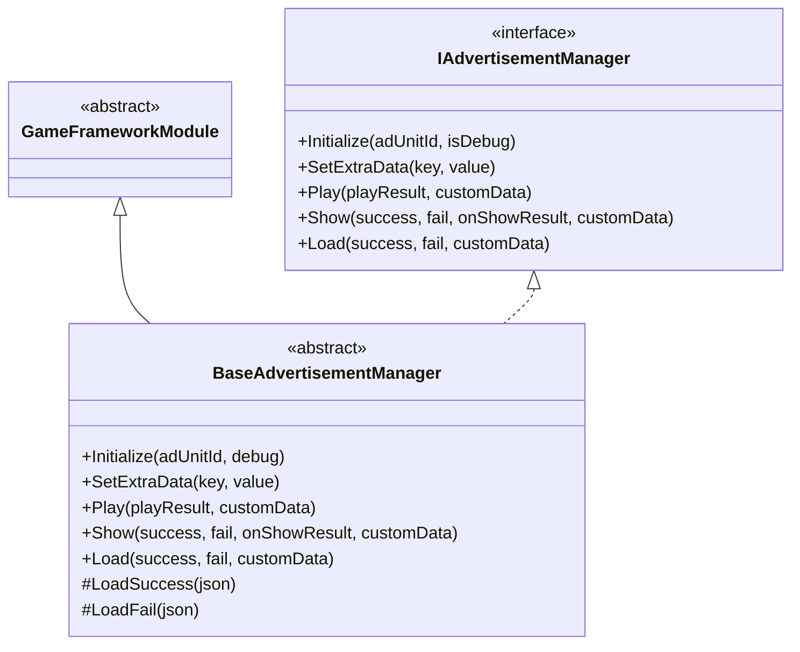
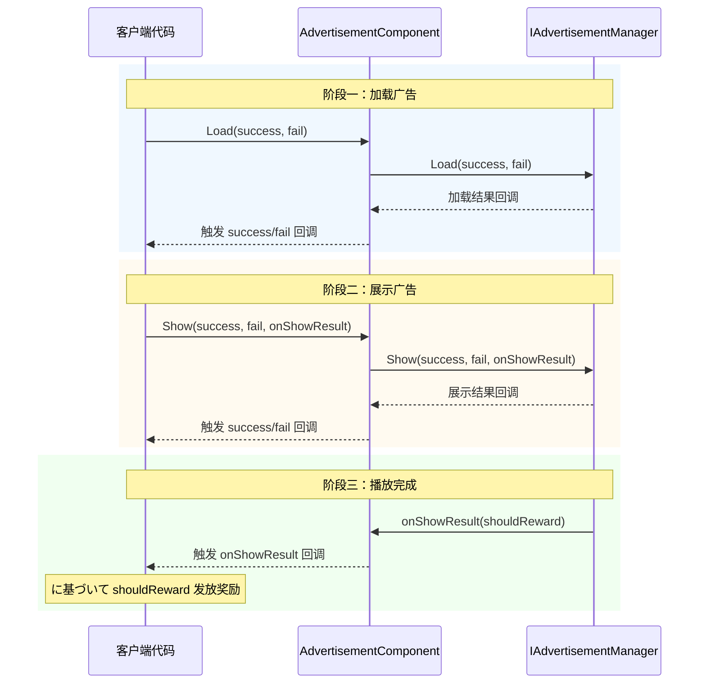

# API 参考

本节详细介绍 GameFrameX Advertisement 模块的完整 API インターフェース，涵盖インターフェース定义、抽象基底クラス以及 Unity コンポーネント的公共メソッド和プロパティ。

## 概要

 Advertisement 模块提供します一套统一的广告管理インターフェース，サポート多种广告平台（Android、iOS、WebGL、微信小ゲーム、抖音小ゲーム、快手小ゲーム）。API 设计采用策略模式，を通じて `IAdvertisementManager` インターフェース定义统一的广告操作契约，各平台実装クラス负责具体的广告 SDK 集成。

---

## IAdvertisementManager インターフェース

`IAdvertisementManager` 是广告管理的コアインターフェース，定义了所有广告操作的标准メソッド。该インターフェース采用依赖倒置原则，使上层代码与具体广告平台実装解耦。

> Source: [IAdvertisementManager.cs]({{file_base_url}}/Runtime/Advertisement/IAdvertisementManager.cs#L1-L55)

### メソッド列表

| メソッド | 説明 |
|------|------|
| `Initialize` | 初期化广告管理器 |
| `SetExtraData` | 設定额外的广告数据 |
| `Play` | 播放广告（简化版） |
| `Show` | 展示广告（完整版） |
| `Load` | 加载广告 |

---

## BaseAdvertisementManager 抽象クラス

`BaseAdvertisementManager` 是所有平台广告管理器的抽象基底クラス，を継承 `GameFrameworkModule` 并実装 `IAdvertisementManager` インターフェース。该クラス提供します部分メソッド的默认実装，并定义了サブクラス必須実装的抽象メソッド。

> Source: [BaseAdvertisementManager.cs]({{file_base_url}}/Runtime/Advertisement/BaseAdvertisementManager.cs#L1-L109)

### クラス结构



### 受保护成员

| 成员 | クラス型 | 説明 |
|------|------|------|
| `OnShowResult` | `Action<bool>` | 广告展示结果回调 |
| `OnLoadSuccess` | `Action<string>` | 广告加载成功回调 |
| `OnLoadFail` | `Action<string>` | 广告加载失败回调 |

### 生命周期メソッド

#### `Update(elapseSeconds, realElapseSeconds)`

更新メソッド，每帧呼び出し。

**声明：**
```csharp
protected override void Update(float elapseSeconds, float realElapseSeconds)
```

> Source: [BaseAdvertisementManager.cs]({{file_base_url}}/Runtime/Advertisement/BaseAdvertisementManager.cs#L18-L21)

#### `Shutdown()`

关闭时的清理メソッド，模块关闭时呼び出し。

**声明：**
```csharp
protected override void Shutdown()
```

> Source: [BaseAdvertisementManager.cs]({{file_base_url}}/Runtime/Advertisement/BaseAdvertisementManager.cs#L25-L28)

---

## AdvertisementComponent コンポーネント

`AdvertisementComponent` 是に使用 Unity シーン中的广告コンポーネント，を継承 `GameFrameworkComponent`。该コンポーネント提供します面向 Unity 编辑器的配置界面和运行时 API，是開発者在ゲーム中最常直接交互的クラス。

> Source: [AdvertisementComponent.cs]({{file_base_url}}/Runtime/Advertisement/AdvertisementComponent.cs#L1-L169)

### Unity プロパティ

在 Unity 编辑器中可配置以下プロパティ：

| プロパティ | クラス型 | 默认值 | 説明 |
|------|------|--------|------|
| `AdUnitId` | string | 空字符串 | Android 平台广告位ID |
| `m_adUnitIdiOS` | string | 空字符串 | iOS 平台广告位ID |
| `m_adUnitIdWebGL` | string | 空字符串 | WebGL 平台广告位ID |
| `m_adUnitIdWebGLWeChat` | string | 空字符串 | 微信小ゲーム广告位ID |
| `m_adUnitIdWebGLDouYin` | string | 空字符串 | 抖音小ゲーム广告位ID |
| `m_adUnitIdWebGLKuaiShou` | string | 空字符串 | 快手小ゲーム广告位ID |
| `m_debug` | bool | false | 是否开启测试模式 |

### 公共プロパティ

#### `AdUnitId`

取得当前平台对应的广告位ID。该プロパティ在 `Awake()` メソッド中に基づいて当前运行平台自动选择合适的广告位ID。

```csharp
public string AdUnitId { get; private set; }
```

> Source: [AdvertisementComponent.cs]({{file_base_url}}/Runtime/Advertisement/AdvertisementComponent.cs#L51-L53)

### 公共メソッド

#### `Initialize(adUnitId, isDebug)`

初期化广告管理器。可在运行时重新初期化广告管理器。

**声明：**
```csharp
public void Initialize(string adUnitId, bool isDebug = false)
```

**参数：**
- `adUnitId` (string): 广告位ID
- `isDebug` (bool): 是否开启测试模式，默认值为 false

**示例：**
```csharp
// 初期化广告コンポーネント
var adComponent = gameObject.GetComponent<AdvertisementComponent>();
adComponent.Initialize("your_ad_unit_id", true);
```

> Source: [AdvertisementComponent.cs]({{file_base_url}}/Runtime/Advertisement/AdvertisementComponent.cs#L101-L105)

---

#### `SetExtraData(key, value)`

設定广告额外数据。在展示广告前設定额外的参数数据，这些数据可能会被广告SDK使用。

**声明：**
```csharp
public void SetExtraData(string key, string value)
```

**参数：**
- `key` (string): 数据键
- `value` (string): 数据值

**设计意图：** 此メソッドに使用传递广告関連的上下文信息，例如用户等级、关卡进度等，广告SDK可に基づいて这些信息优化广告投放策略。

**示例：**
```csharp
// 設定用户等级信息
adComponent.SetExtraData("user_level", "10");
adComponent.SetExtraData("current_level", "5");
```

> Source: [AdvertisementComponent.cs]({{file_base_url}}/Runtime/Advertisement/AdvertisementComponent.cs#L116-L119)

---

#### `Show(success, fail, onShowResult)`

展示广告（完整版）。在呼び出し此メソッド前，必ず已经を通じて `Load` メソッド预加载了广告。

**声明：**
```csharp
public void Show(Action<string> success, Action<string> fail, Action<bool> onShowResult)
```

**参数：**
- `success` (Action\<string\>): 展示成功回调，参数为成功信息
- `fail` (Action\<string\>): 展示失败回调，参数为失败原因
- `onShowResult` (Action\<bool\>): 展示成功后广告关闭回调。参数值为 true 表示广告べき发放奖励，为 false 表示没有完整播放完广告

**设计意图：** 此メソッド提供完整的回调处理能力，适に使用必要に基づいて广告展示结果执行不同业务逻辑的シーン。

**示例：**
```csharp
// 展示插屏广告
adComponent.Show(
    success => Debug.Log($"广告展示成功: {success}"),
    fail => Debug.LogError($"广告展示失败: {fail}"),
    shouldReward =>
    {
        if (shouldReward)
        {
            // 发放奖励
            Debug.Log("用户完整观看广告，发放奖励");
        }
    }
);
```

> Source: [AdvertisementComponent.cs]({{file_base_url}}/Runtime/Advertisement/AdvertisementComponent.cs#L133-L136)

---

#### `Play(onShowResult, customData)`

播放广告（简化版）。这是 `Show` メソッド的简化版本，适合简单的广告播放シーン。

**声明：**
```csharp
public void Play(Action<bool> onShowResult, string customData = null)
```

**参数：**
- `onShowResult` (Action\<bool\>): 展示成功后广告关闭回调。参数值为 true 表示广告べき发放奖励，为 false 表示没有完整播放完广告
- `customData` (string): 自定义数据，可为空

**设计意图：** 相比 `Show` メソッド，`Play` メソッド简化了回调参数，适合快速集成和简单奖励发放シーン。

**示例：**
```csharp
// 播放激励视频广告
adComponent.Play(shouldReward =>
{
    if (shouldReward)
    {
        // 发放奖励
        Debug.Log("发放奖励金币 x 100");
    }
}, "level_5_reward");
```

> Source: [AdvertisementComponent.cs]({{file_base_url}}/Runtime/Advertisement/AdvertisementComponent.cs#L148-L151)

---

#### `Load(success, fail)`

加载广告。建议在展示广告前预先呼び出し此メソッド加载广告リソース。

**声明：**
```csharp
public void Load(Action<string> success, Action<string> fail)
```

**参数：**
- `success` (Action\<string\>): 加载成功回调，参数为成功信息
- `fail` (Action\<string\>): 加载失败回调，参数为失败原因

**设计意图：** 预加载广告可能减少用户等待时间，提升用户体验。建议在ゲーム加载界面或空闲时提前呼び出し。

**示例：**
```csharp
// 预加载广告
adComponent.Load(
    success => Debug.Log($"广告加载成功: {success}"),
    fail => Debug.LogWarning($"广告加载失败: {fail}")
);
```

> Source: [AdvertisementComponent.cs]({{file_base_url}}/Runtime/Advertisement/AdvertisementComponent.cs#L164-L167)

---

## 广告播放フロー

以下フロー图展示了完整的广告播放生命周期：



---

## 完整使用示例

以下示例展示了在ゲーム关卡完成后播放激励视频广告的完整フロー：

```csharp
using UnityEngine;
using GameFrameX.Advertisement.Runtime;

public class GameLevel : MonoBehaviour
{
    [SerializeField] private AdvertisementComponent advertisementComponent;
    
    private void OnLevelComplete()
    {
        // 检查是否有可用的广告
        if (advertisementComponent != null)
        {
            // 播放激励视频广告
            advertisementComponent.Play(shouldReward =>
            {
                if (shouldReward)
                {
                    // 发放通关奖励
                    AwardLevelRewards();
                }
                else
                {
                    Debug.Log("用户未完整观看广告，无法获得奖励");
                }
            }, $"level_{CurrentLevel}_completion");
        }
    }
    
    private void AwardLevelRewards()
    {
        Debug.Log("关卡奖励已发放！");
    }
}
```

> Sources:
> - [AdvertisementComponent.cs]({{file_base_url}}/Runtime/Advertisement/AdvertisementComponent.cs#L148-L151)
> - [IAdvertisementManager.cs]({{file_base_url}}/Runtime/Advertisement/IAdvertisementManager.cs#L28-L34)

---

## 関連リンク

- [概述](../1-overview) - 广告模块整体介绍
- [安装指南](../2-installation) - 环境配置与安装
- [快速开始](../3-getting-started) - 快速集成指南
- [コア概念](../4-core-concepts) - コアアーキテクチャ設計
- [平台配置](../5-platforms) - 各平台详细配置
- [常见问题](../7-troubleshooting) - 常见问题与解決策
