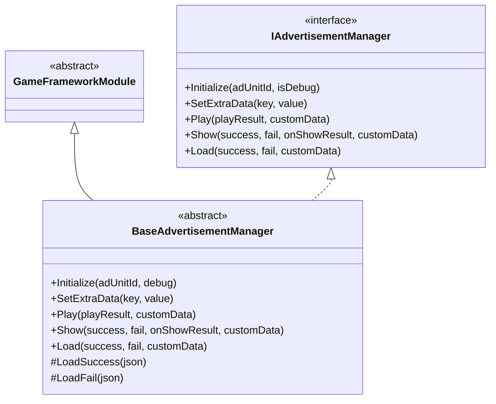
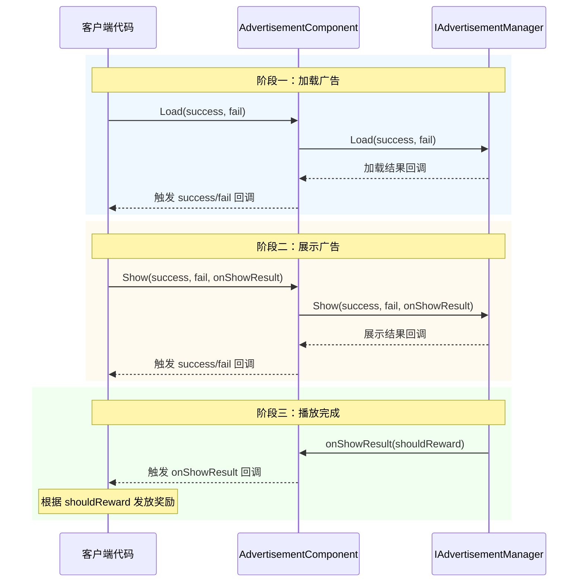

# API リファレンス

本节詳細介绍 GameFrameX Advertisement モジュール的完全な API インターフェース，涵盖インターフェース定義、抽象基底クラスおよび Unity コンポーネント的公共メソッド和プロパティ。

## 概要

 Advertisement モジュール提供します一套統一された的広告管理インターフェース，サポート多种広告プラットフォーム（Android、iOS、WebGL、WeChatミニゲーム、DouYinミニゲーム、KuaiShouミニゲーム）。API 設計采用ストラテジーパターン，通过 `IAdvertisementManager` インターフェース定義統一された的広告操作契约，各プラットフォーム実装类负责具体的広告 SDK 集成。

---

## IAdvertisementManager インターフェース

`IAdvertisementManager` 是広告管理的コアインターフェース，定義了所有広告操作的標準メソッド。该インターフェース采用依存関係逆転の原則，使上层コード与具体広告プラットフォーム実装解耦。

> Source: [IAdvertisementManager.cs]({{file_base_url}}/Runtime/Advertisement/IAdvertisementManager.cs#L1-L55)

### メソッド列表

| メソッド | 説明 |
|------|------|
| `Initialize` | 初期化広告マネージャー |
| `SetExtraData` | 設定额外的広告数据 |
| `Play` | 再生広告（簡素化版） |
| `Show` | 表示広告（完全な版） |
| `Load` | ロード広告 |

---

## BaseAdvertisementManager 抽象类

`BaseAdvertisementManager` 是所有プラットフォーム広告マネージャー的抽象基底クラス，継承自 `GameFrameworkModule` 并実装 `IAdvertisementManager` インターフェース。このクラス提供します部分メソッド的デフォルト実装，并定義了サブクラス〜しなければなりません実装的抽象メソッド。

> Source: [BaseAdvertisementManager.cs]({{file_base_url}}/Runtime/Advertisement/BaseAdvertisementManager.cs#L1-L109)

### 类结构



### 受保护成员

| 成员 | タイプ | 説明 |
|------|------|------|
| `OnShowResult` | `Action<bool>` | 広告表示結果コールバック |
| `OnLoadSuccess` | `Action<string>` | 広告読み込み成功コールバック |
| `OnLoadFail` | `Action<string>` | 広告読み込み失敗コールバック |

### ライフサイクルメソッド

#### `Update(elapseSeconds, realElapseSeconds)`

アップデートメソッド，每帧呼び出し。

**声明：**
```csharp
protected override void Update(float elapseSeconds, float realElapseSeconds)
```

> Source: [BaseAdvertisementManager.cs]({{file_base_url}}/Runtime/Advertisement/BaseAdvertisementManager.cs#L18-L21)

#### `Shutdown()`

閉じる时的清理メソッド，モジュール閉じる时呼び出し。

**声明：**
```csharp
protected override void Shutdown()
```

> Source: [BaseAdvertisementManager.cs]({{file_base_url}}/Runtime/Advertisement/BaseAdvertisementManager.cs#L25-L28)

---

## AdvertisementComponent コンポーネント

`AdvertisementComponent` 是用于 Unity シーン中的広告コンポーネント，継承自 `GameFrameworkComponent`。该コンポーネント提供します面向 Unity エディタ的設定界面和ランタイム API，是開発者在游戏中最常直接交互的类。

> Source: [AdvertisementComponent.cs]({{file_base_url}}/Runtime/Advertisement/AdvertisementComponent.cs#L1-L169)

### Unity プロパティ

在 Unity エディタ中可設定以下プロパティ：

| プロパティ | タイプ | デフォルト值 | 説明 |
|------|------|--------|------|
| `AdUnitId` | string | 空字符串 | Android プラットフォーム広告ユニット ID |
| `m_adUnitIdiOS` | string | 空字符串 | iOS プラットフォーム広告ユニット ID |
| `m_adUnitIdWebGL` | string | 空字符串 | WebGL プラットフォーム広告ユニット ID |
| `m_adUnitIdWebGLWeChat` | string | 空字符串 | WeChatミニゲーム広告ユニット ID |
| `m_adUnitIdWebGLDouYin` | string | 空字符串 | DouYinミニゲーム広告ユニット ID |
| `m_adUnitIdWebGLKuaiShou` | string | 空字符串 | KuaiShouミニゲーム広告ユニット ID |
| `m_debug` | bool | false | 是否开启テストモード |

### 公共プロパティ

#### `AdUnitId`

取得当前プラットフォーム对应的広告ユニット ID。该プロパティ在 `Awake()` メソッド中根据当前运行プラットフォーム自动选择合适的広告ユニット ID。

```csharp
public string AdUnitId { get; private set; }
```

> Source: [AdvertisementComponent.cs]({{file_base_url}}/Runtime/Advertisement/AdvertisementComponent.cs#L51-L53)

### 公共メソッド

#### `Initialize(adUnitId, isDebug)`

初期化広告マネージャー。可在ランタイム重新初期化広告マネージャー。

**声明：**
```csharp
public void Initialize(string adUnitId, bool isDebug = false)
```

**パラメータ：**
- `adUnitId` (string): 広告ユニット ID
- `isDebug` (bool): 是否开启テストモード，デフォルト值为 false

**例：**
```csharp
// 初始化广告组件
var adComponent = gameObject.GetComponent<AdvertisementComponent>();
adComponent.Initialize("your_ad_unit_id", true);
```

> Source: [AdvertisementComponent.cs]({{file_base_url}}/Runtime/Advertisement/AdvertisementComponent.cs#L101-L105)

---

#### `SetExtraData(key, value)`

設定広告额外数据。在表示広告前設定额外的パラメータ数据，这些数据〜の可能性があります会被広告 SDK使用。

**声明：**
```csharp
public void SetExtraData(string key, string value)
```

**パラメータ：**
- `key` (string): 数据键
- `value` (string): 数据值

**設計意图：** 此メソッド用于传递広告相关的上下文情報，例えばユーザー等级、关卡進捗等，広告 SDK可根据这些情報最適化広告投放策略。

**例：**
```csharp
// 设置用户等级信息
adComponent.SetExtraData("user_level", "10");
adComponent.SetExtraData("current_level", "5");
```

> Source: [AdvertisementComponent.cs]({{file_base_url}}/Runtime/Advertisement/AdvertisementComponent.cs#L116-L119)

---

#### `Show(success, fail, onShowResult)`

表示広告（完全な版）。在呼び出し此メソッド前，请確認してくださいすでに通过 `Load` メソッド预ロード了広告。

**声明：**
```csharp
public void Show(Action<string> success, Action<string> fail, Action<bool> onShowResult)
```

**パラメータ：**
- `success` (Action\<string\>): 表示成功コールバック，パラメータ为成功情報
- `fail` (Action\<string\>): 表示失敗コールバック，パラメータ为失敗原因
- `onShowResult` (Action\<bool\>): 表示成功后広告閉じるコールバック。パラメータ值为 true 表示広告〜すべき发放報酬，为 false 表示没有完全な再生完広告

**設計意图：** 此メソッド提供完全な的コールバック処理能力，適しています〜する必要があります根据広告表示結果执行不同业务逻辑的シーン。

**例：**
```csharp
// 展示插屏广告
adComponent.Show(
    success => Debug.Log($"广告展示成功: {success}"),
    fail => Debug.LogError($"广告展示失败: {fail}"),
    shouldReward =>
    {
        if (shouldReward)
        {
            // 发放奖励
            Debug.Log("用户完整观看广告，发放奖励");
        }
    }
);
```

> Source: [AdvertisementComponent.cs]({{file_base_url}}/Runtime/Advertisement/AdvertisementComponent.cs#L133-L136)

---

#### `Play(onShowResult, customData)`

再生広告（簡素化版）。这是 `Show` メソッド的簡素化バージョン，适合シンプル的広告再生シーン。

**声明：**
```csharp
public void Play(Action<bool> onShowResult, string customData = null)
```

**パラメータ：**
- `onShowResult` (Action\<bool\>): 表示成功后広告閉じるコールバック。パラメータ值为 true 表示広告〜すべき发放報酬，为 false 表示没有完全な再生完広告
- `customData` (string): 自定義数据，可为空

**設計意图：** 相比 `Show` メソッド，`Play` メソッド簡素化了コールバックパラメータ，适合快速集成和シンプル報酬发放シーン。

**例：**
```csharp
// 播放激励视频广告
adComponent.Play(shouldReward =>
{
    if (shouldReward)
    {
        // 发放奖励
        Debug.Log("发放奖励金币 x 100");
    }
}, "level_5_reward");
```

> Source: [AdvertisementComponent.cs]({{file_base_url}}/Runtime/Advertisement/AdvertisementComponent.cs#L148-L151)

---

#### `Load(success, fail)`

ロード広告。お勧め在表示広告前预先呼び出し此メソッドロード広告リソース。

**声明：**
```csharp
public void Load(Action<string> success, Action<string> fail)
```

**パラメータ：**
- `success` (Action\<string\>): ロード成功コールバック，パラメータ为成功情報
- `fail` (Action\<string\>): ロード失敗コールバック，パラメータ为失敗原因

**設計意图：** 预ロード広告〜できます减少ユーザー等待时间，提升ユーザー体验。お勧め在游戏ロード界面或空闲时提前呼び出し。

**例：**
```csharp
// 预加载广告
adComponent.Load(
    success => Debug.Log($"广告加载成功: {success}"),
    fail => Debug.LogWarning($"广告加载失败: {fail}")
);
```

> Source: [AdvertisementComponent.cs]({{file_base_url}}/Runtime/Advertisement/AdvertisementComponent.cs#L164-L167)

---

## 広告再生フロー

以下フロー图表示了完全な的広告再生ライフサイクル：



---

## 完全な使用例

以下例表示了在游戏关卡完成后再生リワード動画広告的完全なフロー：

```csharp
using UnityEngine;
using GameFrameX.Advertisement.Runtime;

public class GameLevel : MonoBehaviour
{
    [SerializeField] private AdvertisementComponent advertisementComponent;
    
    private void OnLevelComplete()
    {
        // 检查是否有可用的广告
        if (advertisementComponent != null)
        {
            // 播放激励视频广告
            advertisementComponent.Play(shouldReward =>
            {
                if (shouldReward)
                {
                    // 发放通关奖励
                    AwardLevelRewards();
                }
                else
                {
                    Debug.Log("用户未完整观看广告，无法获得奖励");
                }
            }, $"level_{CurrentLevel}_completion");
        }
    }
    
    private void AwardLevelRewards()
    {
        Debug.Log("关卡奖励已发放！");
    }
}
```

> Sources:
> - [AdvertisementComponent.cs]({{file_base_url}}/Runtime/Advertisement/AdvertisementComponent.cs#L148-L151)
> - [IAdvertisementManager.cs]({{file_base_url}}/Runtime/Advertisement/IAdvertisementManager.cs#L28-L34)

---

## 関連リンク

- [概要](../1-overview) - 広告モジュール整体介绍
- [インストールガイド](../2-installation) - 環境設定与インストール
- [快速开始](../3-getting-started) - 快速集成ガイド
- [コアコンセプト](../4-core-concepts) - コアアーキテクチャ設計
- [プラットフォーム設定](../5-platforms) - 各プラットフォーム詳細設定
- [常见問題](../7-troubleshooting) - 常见問題与解決策
