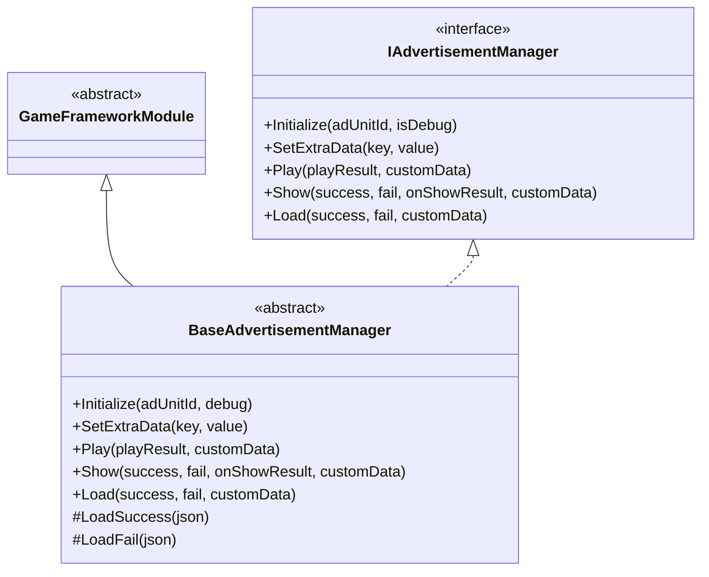
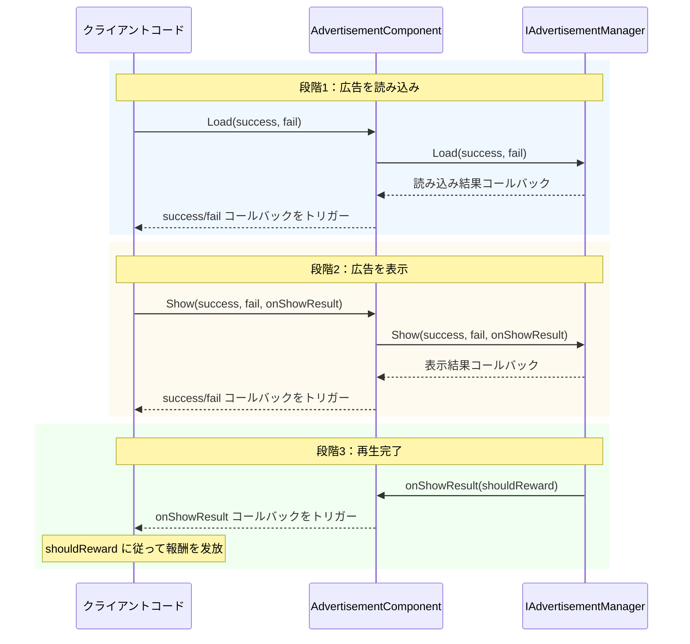

# API リファレンス

本ドキュメントでは、GameFrameX Advertisement モジュールの完全な API インターフェースを詳細に説明します。インターフェース定義、抽象基底クラス、Unity コンポーネントの public メソッドとプロパティを網羅します。

## 概要

Advertisement モジュールは、統一された広告管理インターフェース的一套を提供し、Android、iOS、WebGL、WeChat小ゲーム、Douyin小ゲーム、Kuaishou小ゲームを含む複数の広告プラットフォームをサポートします。API 設計はストラテジーパターンを采用し、`IAdvertisementManager` インターフェースを通じて統一された広告操作コントラクトを定義し、各プラットフォーム実装クラスは具体的な広告 SDK 統合を担当します。

---

## IAdvertisementManager インターフェース

`IAdvertisementManager` は広告管理のコアインターフェースであり、すべての広告操作の標準メソッドを定義します。このインターフェースは依存性逆転の原則を採用しており、上位コードと具体的な広告プラットフォーム実装の耦力を解消します。

> Source: [IAdvertisementManager.cs]({{file_base_url}}/Runtime/Advertisement/IAdvertisementManager.cs#L1-L55)

### メソッド一覧

| メソッド | 説明 |
|------|------|
| `Initialize` | 広告マネージャーを初期化 |
| `SetExtraData` | 追加の広告データを設定 |
| `Play` | 広告を再生命令（簡略版） |
| `Show` | 広告を表示（完全版） |
| `Load` | 広告を読み込み |

---

## BaseAdvertisementManager 抽象クラス

`BaseAdvertisementManager` は、すべてのプラットフォーム広告マネージャーの抽象基底クラスであり、`GameFrameworkModule` を継承し `IAdvertisementManager` インターフェースを実装します。このクラスは一部メソッドのデフォルト実装を提供し、サブクラスが実装する必要がある抽象メソッドを定義します。

> Source: [BaseAdvertisementManager.cs]({{file_base_url}}/Runtime/Advertisement/BaseAdvertisementManager.cs#L1-L109)

### クラス構造



### 保護されたメンバー

| メンバー | 型 | 説明 |
|------|------|------|
| `OnShowResult` | `Action<bool>` | 広告表示結果コールバック |
| `OnLoadSuccess` | `Action<string>` | 広告読み込み成功コールバック |
| `OnLoadFail` | `Action<string>` | 広告読み込み失敗コールバック |

### ライフサイクルメソッド

#### `Update(elapseSeconds, realElapseSeconds)`

更新メソッドで、毎フレーム呼び出されます。

**宣言：**
```csharp
protected override void Update(float elapseSeconds, float realElapseSeconds)
```

> Source: [BaseAdvertisementManager.cs]({{file_base_url}}/Runtime/Advertisement/BaseAdvertisementManager.cs#L18-L21)

#### `Shutdown()`

閉じる時のクリーンアップメソッドで、モジュールが閉じる時に呼び出されます。

**宣言：**
```csharp
protected override void Shutdown()
```

> Source: [BaseAdvertisementManager.cs]({{file_base_url}}/Runtime/Advertisement/BaseAdvertisementManager.cs#L25-L28)

---

## AdvertisementComponent コンポーネント

`AdvertisementComponent` は、Unity シーンで使用する広告コンポーネントであり、`GameFrameworkComponent` を継承します。このコンポーネントは Unity エディター向けの設定インターフェースと実行時 API を提供し、開発者がゲームで最も直接的にやり取りするクラスです。

> Source: [AdvertisementComponent.cs]({{file_base_url}}/Runtime/Advertisement/AdvertisementComponent.cs#L1-L169)

### Unity プロパティ

Unity エディターで設定可能なプロパティ：

| プロパティ | 型 | デフォルト値 | 説明 |
|------|------|--------|------|
| `AdUnitId` | string | 空文字列 | Android プラットフォーム広告ユニットID |
| `m_adUnitIdiOS` | string | 空文字列 | iOS プラットフォーム広告ユニットID |
| `m_adUnitIdWebGL` | string | 空文字列 | WebGL プラットフォーム広告ユニットID |
| `m_adUnitIdWebGLWeChat` | string | 空文字列 | WeChat小ゲーム広告ユニットID |
| `m_adUnitIdWebGLDouYin` | string | 空文字列 | Douyin小ゲーム広告ユニットID |
| `m_adUnitIdWebGLKuaiShou` | string | 空文字列 | Kuaishou小ゲーム広告ユニットID |
| `m_debug` | bool | false | テストモードを有効にするかどうか |

### public プロパティ

#### `AdUnitId`

現在のプラットフォームに対応する広告ユニット ID を取得します。このプロパティは `Awake()` メソッドで現在の実行プラットフォームに基づいて適切な広告ユニット ID を自動選択します。

```csharp
public string AdUnitId { get; private set; }
```

> Source: [AdvertisementComponent.cs]({{file_base_url}}/Runtime/Advertisement/AdvertisementComponent.cs#L51-L53)

### public メソッド

#### `Initialize(adUnitId, isDebug)`

広告マネージャーを初期化します。実行時に広告マネージャーを再初期化できます。

**宣言：**
```csharp
public void Initialize(string adUnitId, bool isDebug = false)
```

**パラメータ：**
- `adUnitId` (string): 広告ユニット ID
- `isDebug` (bool): テストモードを有効にするかどうか、デフォルト値は false

**例：**
```csharp
// 広告コンポーネントを初期化
var adComponent = gameObject.GetComponent<AdvertisementComponent>();
adComponent.Initialize("your_ad_unit_id", true);
```

> Source: [AdvertisementComponent.cs]({{file_base_url}}/Runtime/Advertisement/AdvertisementComponent.cs#L101-L105)

---

#### `SetExtraData(key, value)`

広告の追加データを設定します。広告を表示する前に追加パラメータデータを設定でき、これらのデータは広告 SDK によって使用される場合があります。

**宣言：**
```csharp
public void SetExtraData(string key, string value)
```

**パラメータ：**
- `key` (string): データキー
- `value` (string): データ値

**設計意図：** このメソッドは広告関連のコンテキスト情報（ユーザーのレベル、レベル進行など）を渡し、广告 SDK がこれらの情報に基づいて広告配信戦略を最適化できるようにします。

**例：**
```csharp
// ユーザーレベル情報を設定
adComponent.SetExtraData("user_level", "10");
adComponent.SetExtraData("current_level", "5");
```

> Source: [AdvertisementComponent.cs]({{file_base_url}}/Runtime/Advertisement/AdvertisementComponent.cs#L116-L119)

---

#### `Show(success, fail, onShowResult)`

広告を表示（完全版）。このメソッドを呼び出す前に、`Load` メソッドで広告をプリロードしていることを確認してください。

**宣言：**
```csharp
public void Show(Action<string> success, Action<string> fail, Action<bool> onShowResult)
```

**パラメータ：**
- `success` (Action\<string\>)：表示成功コールバック、パラメータは成功情報
- `fail` (Action\<string\>)：表示失敗コールバック、パラメータは失敗原因
- `onShowResult` (Action\<bool\>)：表示成功後広告閉じるコールバック。パラメータ値が true の場合、广告は報酬を发放すべきを示し、false の場合、广告は完全に再生されていません

**設計意図：** このメソッドは完全なコールバック処理能力を提供し、广告表示結果に基づいて異なるビジネスロジックを実行する必要があるシナリオに適しています。

**例：**
```csharp
// インタースティシャル広告を表示
adComponent.Show(
    success => Debug.Log($"広告の表示に成功: {success}"),
    fail => Debug.LogError($"広告の表示に失敗: {fail}"),
    shouldReward =>
    {
        if (shouldReward)
        {
            // 報酬を发放
            Debug.Log("ユーザーが広告を完全視聴、報酬を发放");
        }
    }
);
```

> Source: [AdvertisementComponent.cs]({{file_base_url}}/Runtime/Advertisement/AdvertisementComponent.cs#L133-L136)

---

#### `Play(onShowResult, customData)`

広告を再生命令（簡略版）。これは `Show` メソッドの簡略版であり、シンプルな広告再生シナリオに適しています。

**宣言：**
```csharp
public void Play(Action<bool> onShowResult, string customData = null)
```

**パラメータ：**
- `onShowResult` (Action\<bool\>)：表示成功後広告閉じるコールバック。パラメータ値が true の場合、广告は報酬を发放すべきを示し、false の場合、广告は完全に再生されていません
- `customData` (string)：カスタムデータ、空にできます

**設計意図：** `Show` メソッドと比較して、`Play` メソッドはコールバックパラメータを簡略化し、素早い統合とシンプルな報酬发放シナリオに適しています。

**例：**
```csharp
// リワード動画広告を再生命令
adComponent.Play(shouldReward =>
{
    if (shouldReward)
    {
        // 報酬を发放
        Debug.Log("報酬发放：コイン x 100");
    }
}, "level_5_reward");
```

> Source: [AdvertisementComponent.cs]({{file_base_url}}/Runtime/Advertisement/AdvertisementComponent.cs#L148-L151)

---

#### `Load(success, fail)`

広告を読み込みます。広告を表示する前にこのメソッドを呼び出して広告リソースをプリロードすることをお勧めします。

**宣言：**
```csharp
public void Load(Action<string> success, Action<string> fail)
```

**パラメータ：**
- `success` (Action\<string\>)：読み込み成功コールバック、パラメータは成功情報
- `fail` (Action\<string\>)：読み込み失敗コールバック、パラメータは失敗原因

**設計意図：** 広告をプリロードするとユーザーの待機時間が減少し、ユーザー体験が向上します。ゲームの読み込み画面またはアイドル時に事前に呼び出すことをお勧めします。

**例：**
```csharp
// 広告をプリロード
adComponent.Load(
    success => Debug.Log($"広告の読み込みに成功: {success}"),
    fail => Debug.LogWarning($"広告の読み込みに失敗: {fail}")
);
```

> Source: [AdvertisementComponent.cs]({{file_base_url}}/Runtime/Advertisement/AdvertisementComponent.cs#L164-L167)

---

## 広告再生プロセス

以下のフローチャートは、完全な広告再生ライフサイクルを示しています：



---

## 完全な使用例

以下の例は、ゲームレベル完了後にリワード動画広告を再生する完全なプロセスを示しています：

```csharp
using UnityEngine;
using GameFrameX.Advertisement.Runtime;

public class GameLevel : MonoBehaviour
{
    [SerializeField] private AdvertisementComponent advertisementComponent;

    private void OnLevelComplete()
    {
        // 利用可能な広告があるかどうかを確認
        if (advertisementComponent != null)
        {
            // リワード動画広告を再生
            advertisementComponent.Play(shouldReward =>
            {
                if (shouldReward)
                {
                    // レベルクリア報酬を发放
                    AwardLevelRewards();
                }
                else
                {
                    Debug.Log("ユーザーが広告を完全視聴していないため、報酬を獲得できません");
                }
            }, $"level_{CurrentLevel}_completion");
        }
    }

    private void AwardLevelRewards()
    {
        Debug.Log("レベル報酬が发放されました！");
    }
}
```

> Sources:
> - [AdvertisementComponent.cs]({{file_base_url}}/Runtime/Advertisement/AdvertisementComponent.cs#L148-L151)
> - [IAdvertisementManager.cs]({{file_base_url}}/Runtime/Advertisement/IAdvertisementManager.cs#L28-L34)

---

## 関連リンク

- [概要](../1-overview) - 広告モジュールの全体紹介
- [インストールガイド](../2-installation) - 環境設定とインストール
- [クイックスタート](../3-getting-started) - 迅速な統合ガイド
- [コアコンセプト](../4-core-concepts) - コアアーキテクチャ設計
- [プラットフォーム設定](../5-platforms) - 各プラットフォームの詳細設定
- [よくある質問](../7-troubleshooting) - よくある質問と解決策
