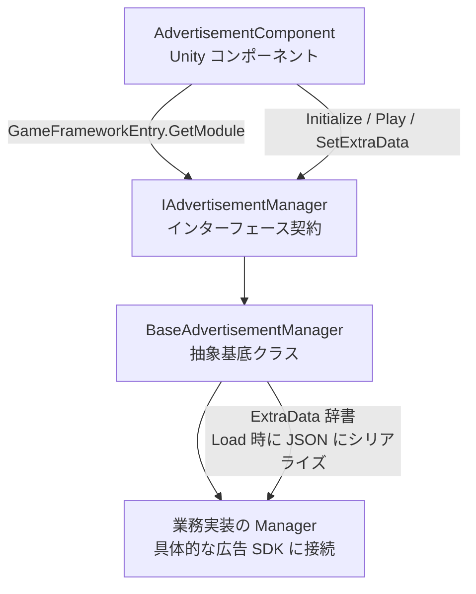

# 広告コンポーネント実行メカニズム早見表

GameFrameX の広告コンポーネントは、Unity コンポーネント + フレームワークモジュールの二層構造に基づき、広告 SDK の初期化、再生、読み込み、コールバックをすべて統一された `IAdvertisementManager` 契約に集約しています。業務側は `AdvertisementComponent` に向けて呼び出すだけです。

## クイックスタート

1. シーンに `AdvertisementComponent` をアタッチし(メニュー項目 `GameFrameX/Advertisement`)、Inspector で各プラットフォームの広告枠 ID を設定します(`m_adUnitIdAndroid` / `m_adUnitIdiOS` / `m_adUnitIdWebGL*`)。
2. Inspector の `Config` フィールドに `AdvertisementConfig` を継承した設定サブクラス(例：`DefaultAdvertisementConfig`)をドラッグ&ドロップし、`isDebug` などの拡張パラメータを保持します。
3. シーン起動後、フレームワークは現在のプラットフォームに応じて広告枠 ID を自動選択し、`Start()` で `m_config` をマネージャーに渡します。その後は業務側で `Play(AdvertisementPlayOption)` を呼び出すだけです。

```csharp
// 再生をトリガーする(推奨用法)
var option = new AdvertisementPlayOption
{
    onPlayResult = success => Debug.Log($"再生終了:{success}"),
    customData = "revive_001",
};
FindObjectOfType<AdvertisementComponent>().Play(option);
```

ソース：[AdvertisementComponent.cs](https://github.com/GameFrameX/com.gameframex.unity.advertisement/blob/main/Runtime/Advertisement/AdvertisementComponent.cs#L120-L219)

## 仕組みの早見表

広告コンポーネントは4種類のオブジェクトが協調動作します：コンポーネント層(`AdvertisementComponent`)→ インターフェース層(`IAdvertisementManager`)→ 抽象マネージャー(`BaseAdvertisementManager`)→ プラットフォーム固有実装(業務プロジェクトが `BaseAdvertisementManager` を継承して各 SDK に接続)。`Awake()` はリフレクションで実装型を解析し、`GameFrameworkEntry` からマネージャーを取り出してから、プラットフォームマクロで広告枠 ID を選択します。



要点：

- **プラットフォーム広告枠 ID の選択**：`Awake()` は `#if UNITY_WEBGL` / `UNITY_ANDROID` / `UNITY_IOS` などのマクロを通じて、WebGL では微信/抖音/快手ミニゲームのサブプラットフォームも細分化します。([AdvertisementComponent.cs#L99-L117](https://github.com/GameFrameX/com.gameframex.unity.advertisement/blob/main/Runtime/Advertisement/AdvertisementComponent.cs#L99-L117))
- **設定オブジェクト**：`AdvertisementConfig` は抽象基底クラスで、`isDebug` フィールドのみを含みます。業務側は必要に応じて派生してフィールドを追加します(例：`adUnitId`)。`BaseAdvertisementManager.Initialize(AdvertisementConfig)` は `DefaultAdvertisementConfig` を受信した場合、`adUnitId` を取り出してから旧バージョンの `Initialize(string, bool)` パスを進みます。([AdvertisementConfig.cs#L41-L53](https://github.com/GameFrameX/com.gameframex.unity.advertisement/blob/main/Runtime/Advertisement/AdvertisementConfig.cs#L41-L53),[BaseAdvertisementManager.cs#L112-L163](https://github.com/GameFrameX/com.gameframex.unity.advertisement/blob/main/Runtime/Advertisement/BaseAdvertisementManager.cs#L112-L163))
- **新旧 API 互換性**：旧バージョンの `Initialize(string, bool)` / `Show(...)` / `Play(Action<bool>, string)` / `Load(...)` は引き続き保持されていますが、`[Obsolete]` でマークされています。実装内では `_delegating` フラグによって新旧の相互再帰呼び出しを防止しています。新推奨は `Play(AdvertisementPlayOption)` を統一的に使用することです。([BaseAdvertisementManager.cs#L119-L134](https://github.com/GameFrameX/com.gameframex.unity.advertisement/blob/main/Runtime/Advertisement/BaseAdvertisementManager.cs#L119-L134))
- **拡張データのパススルー**：`SetExtraData(string, string)` は基底クラスの `ExtraData` 辞書にキーと値を書き込みます(`null` 値の場合はキーを削除)。業務実装は `Load` 段階で辞書を JSON にシリアライズして広告サーバーにパススルーでき、サーバー側のリワード付与検証に使用されます。([BaseAdvertisementManager.cs#L174-L189](https://github.com/GameFrameX/com.gameframex.unity.advertisement/blob/main/Runtime/Advertisement/BaseAdvertisementManager.cs#L174-L189))
- **コールバックスロット**：基底クラスには `OnShowResult` / `OnLoadSuccess` / `OnLoadFail` の3つのコールバックフィールドが宣言されており、業務実装は必要に応じてトリガーします。([BaseAdvertisementManager.cs#L77-L93](https://github.com/GameFrameX/com.gameframex.unity.advertisement/blob/main/Runtime/Advertisement/BaseAdvertisementManager.cs#L77-L93))

## 次に

- シーンにコンポーネントをアタッチし広告枠 ID を設定する：『広告コンポーネントの接続方法』を参照
- 具体的な SDK(Unity Ads / 穿山甲 / GroMore など)を接続する：『カスタム広告マネージャーの実装方法』を参照
- `Play(AdvertisementPlayOption)` のパラメータ仕様：『広告再生オプションリファレンス』を参照