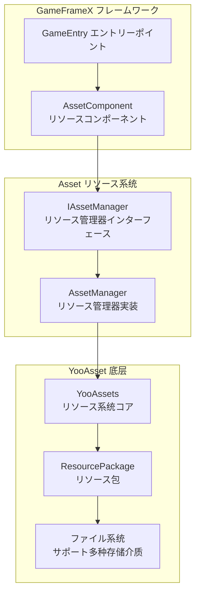
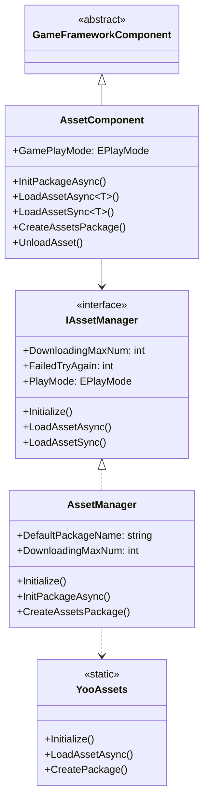
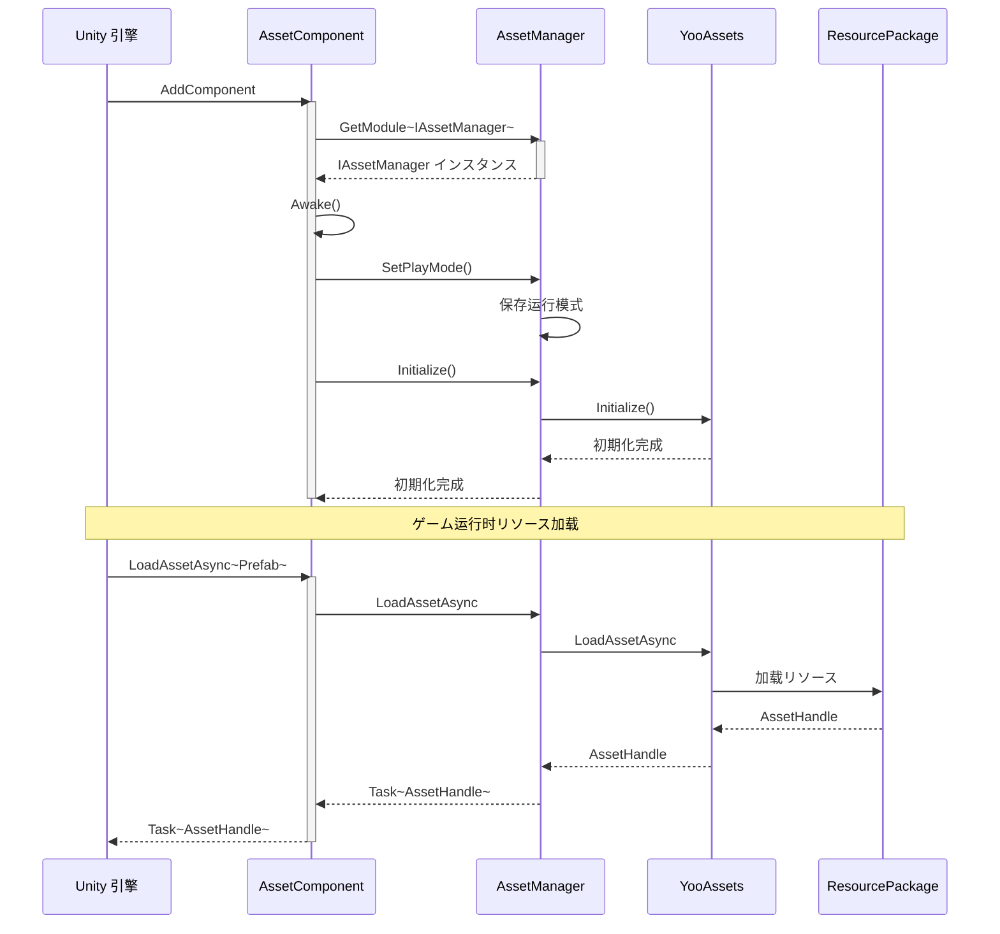
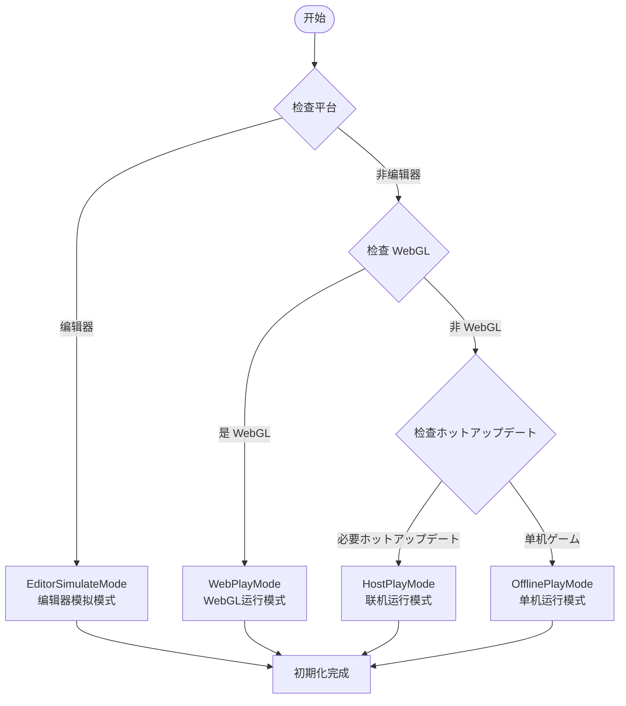

# Asset リソースコンポーネント介绍

GameFrameX 的 Asset リソースコンポーネント是 Unity ゲームリソース的统一管理解決策，基づく YooAsset 底层実装，为開発者提供します简洁、高效的リソース加载与管理インターフェース。该コンポーネントサポート多种运行模式，能够满足从开发调试到ホットアップデート生产环境的全フロー需求。

## 概要

Asset リソースコンポーネント是 GameFrameX フレームワーク的コア模块之一，专门に使用解决 Unity プロジェクト中的リソース管理问题。在ゲーム开发过程中，リソース的加载、缓存、卸载以及ホットアップデート是非常关键的环节，直接影响ゲーム的性能和用户体验。Asset コンポーネントを通じて封装 YooAsset 的强大機能，提供します一套统一、简洁且易于使用的 API，開発者无需深入了解底层実装细节，即可快速実装リソース的加载和管理。

该コンポーネント的コア设计理念是将复杂的リソース管理逻辑封装为简单的インターフェース呼び出し，同时保留足够的灵活性以满足不同プロジェクト需求。无论是简单的单机ゲーム还是必要ホットアップデート的大型商业プロジェクト，Asset コンポーネント都能够提供合适的解決策。を通じてサポート多种运行模式，開発者可能在开发阶段使用编辑器模拟模式快速迭代，在测试阶段使用单机模式进行機能验证，在生产环境中使用ホットアップデート模式実装リソース的动态更新。



## コア機能

Asset リソースコンポーネント提供します全面的リソース管理能力，涵盖了ゲーム开发中常见的所有リソース操作シーン。

### リソース加载

コンポーネントサポート同步和异步两种リソース加载方法，開発者可能に基づいて实际需求选择合适的加载メソッド。异步加载适に使用大多数シーン，能够保持ゲーム的流畅运行；同步加载则在某些特定シーン下（如リソース预加载完成后的切换）更为高效。

- **异步加载**：を通じて Task 异步模式加载リソース，サポートコルーチン和回调两种使用方法
- **同步加载**：直接返回リソース句柄，适に使用已知リソース已加载完成的シーン
- **泛型サポート**：提供强クラス型的泛型メソッド，避免クラス型转换错误
- **多种リソースクラス型**：サポート普通リソース、子リソース、原生ファイル和シーン的加载

### リソースパッケージ管理

リソース包是リソース管理的基本单位，コンポーネントサポート作成、取得、設定默认包等操作。を通じてリソース包机制，可能実装リソース的模块化管理，不同機能模块使用不同的リソース包，便于リソース的组织和更新。

```csharp
// 作成リソース包
var package = assetComponent.CreateAssetsPackage("GameplayPackage");

// 尝试取得リソース包
var existingPackage = assetComponent.TryGetAssetsPackage("GameplayPackage");

// 設定默认リソース包
assetComponent.SetDefaultAssetsPackage(existingPackage);

// 检查リソース包是否存在
if (assetComponent.HasAssetsPackage("GameplayPackage"))
{
    // リソース包存在
}
```

> Source: [AssetComponent.cs](https://github.com/GameFrameX/com.gameframex.unity.asset/blob/main/Runtime/Asset/AssetComponent.cs#L463-L510)

### リソース信息查询

コンポーネント提供します丰富的リソース信息查询機能，包括取得リソース信息、检查リソース是否存在、判断リソース是否必要ダウンロード等。这些機能对于実装リソース的按需ダウンロード和进度展示非常重要。

### リソース卸载与清理

合理的リソース管理不仅包括加载，还包括及时的卸载和清理。コンポーネント提供します多种リソース释放策略，包括指定リソース卸载、无用リソース卸载和强制清理等，帮助開発者有效控制内存使用。

## アーキテクチャ設計

Asset リソースコンポーネント采用了分层アーキテクチャ設計，每一层都有明确的职责边界，这种设计使得系统具有良好的可扩展性和可维护性。

### 分层架构



### コンポーネント交互フロー



## 运行模式

Asset コンポーネントサポート四种运行模式，每种模式适に使用不同的开发和部署シーン。运行模式决定了リソース的加载方法和来源，開発者必要に基づいてプロジェクト的具体需求选择合适的模式。

### 1. 编辑器模拟模式 (EditorSimulateMode)

编辑器模拟模式主要に使用开发阶段的快速迭代。在这种模式下，リソース直接从 Unity 编辑器的リソースファイル夹中加载，无需进行リソース打包。这种模式的优势是开发过程中修改リソース后可能立即生效，无需重新打包，大大提高了开发效率。但是必要注意的是，这种模式只能に使用编辑器环境，打包发布时必須切换到其他模式。

### 2. 单机运行模式 (OfflinePlayMode)

单机运行模式适に使用不必要ホットアップデート的单机ゲーム或ゲーム的内置リソース。在这种模式下，所有リソース都从内置ファイル系统中加载，リソース打包时会被打包到安装包中。这种模式的优势是简单可靠，ゲーム发布后不必要考虑リソース服务器的维护问题，适合于不经常更新内容的ゲーム。

### 3. 联机运行模式 (HostPlayMode)

联机运行模式是大型ゲーム最常用的模式，特别适に使用必要ホットアップデート的プロジェクト。在这种模式下，リソース分为内置リソース和远程リソース两部分。内置リソース随应用一起打包，远程リソース则从リソース服务器按需ダウンロード。这种模式サポートリソース的动态更新，ゲーム发布后仍然可能更新ゲーム内容、修复 bug 或添加新機能。コンポーネントサポート主服务器和备用服务器的配置，确保リソースダウンロード的可靠性。

### 4. WebGL 运行模式 (WebPlayMode)

WebGL 运行模式专门针对 WebGL 平台进行了优化，适に使用网页ゲーム和小程序ゲーム。这种模式考虑了 WebGL 平台的特殊限制，对リソース加载进行了专门的适配。同时サポート字节小ゲーム、微信小ゲーム和快手小ゲーム等多种平台，開発者可能に基づいて目标平台进行相应的配置。



## プラットフォーム対応

Asset リソースコンポーネント基づく YooAsset 构建，天然サポート Unity サポート的所有平台，包括但不限于 Windows、macOS、iOS、Android、WebGL，以及各种小ゲーム平台。コンポーネント在 WebGL 平台上会自动切换到 WebPlayMode，确保リソース加载的正确性。

## 快速开始

要在プロジェクト中使用 Asset リソースコンポーネント，首先必要在シーン中添加 AssetComponent：

```csharp
// 在 Unity シーン中作成空物体，添加 AssetComponent
var assetComponent = gameObject.AddComponent<AssetComponent>();
assetComponent.GamePlayMode = EPlayMode.HostPlayMode;
```

然后を通じて GameFrameX 的エントリーポイント取得コンポーネントインスタンス进行リソース加载：

```csharp
// 取得リソースコンポーネント
var assetComponent = GameEntry.GetComponent<AssetComponent>();

// 异步加载リソース
var handle = await assetComponent.LoadAssetAsync<GameObject>("Assets/Prefabs/Player.prefab");
var prefab = handle.AssetObject as GameObject;

// 使用完成后释放リソース
handle.Release();
```

> Source: [AssetComponent.cs](https://github.com/GameFrameX/com.gameframex.unity.asset/blob/main/Runtime/Asset/AssetComponent.cs#L225-L316)

## 関連リンク

- [機能特性](./1-overview.features) - 了解更多機能特性
- [安装方法](./2-installation.index) - 安装配置指南
- [快速入门指南](./3-getting-started.index) - 快速开始使用
- [アーキテクチャ設計](./4-core-concepts.architecture) - 深入了解アーキテクチャ設計
- [リソース管理器](./4-core-concepts.asset-manager) - リソース管理器详解
- [リソース加载インターフェース](./5-api-reference.loading-api) - API 参考
- [运行模式](./6-configuration.play-modes) - 运行模式配置
