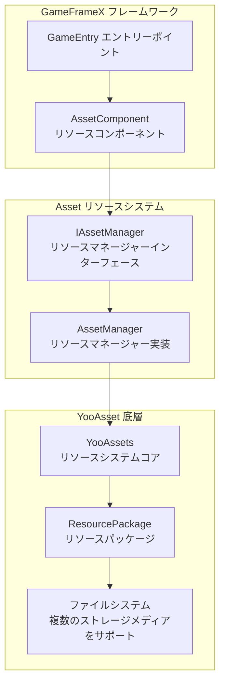
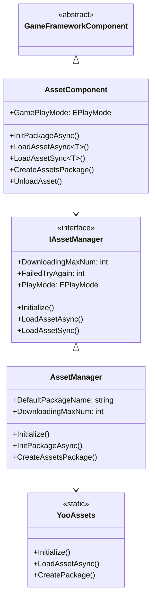
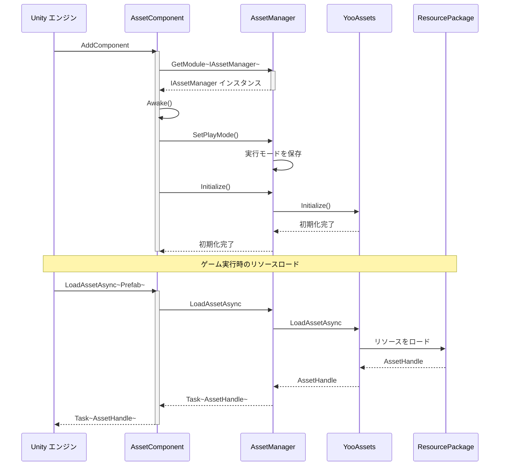
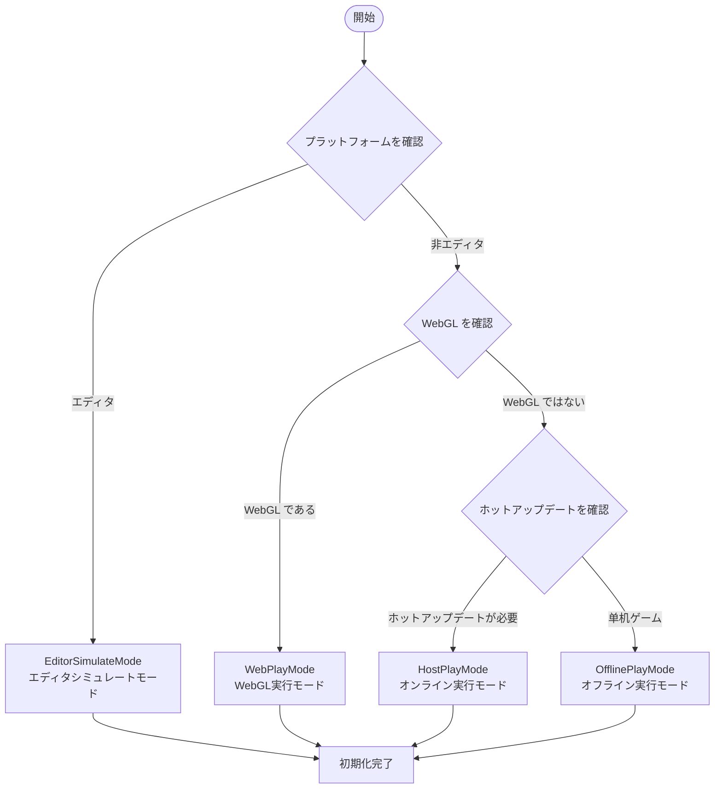

# Asset リソースコンポーネント紹介

GameFrameX の Asset リソースコンポーネントは、Unity ゲームリソースの統合管理ソリューションであり、YooAsset 底層実装に基づいて、開発者にシンプルで効率的なリソースロード与管理インターフェースを提供します。このコンポーネントは複数の実行モードをサポートし、開発デバッグからホットアップデート本番環境までの全プロセス需求を満たすことができます。

## 概要

Asset リソースコンポーネントは GameFrameX フレームワークのコアモジュールの一つであり、Unity プロジェクトにおけるリソース管理の問題を解決するために специально設計されています。ゲーム開発プロセスにおいて、リソースのロード、キャッシュ、アンロードおよびホットアップデートは非常に重要な环节であり、ゲームのパフォーマンスとユーザー体験に直結します。Asset コンポーネントは YooAsset の強力な機能を封裝し、统一されたシンプルで使いやすい API を提供し、開発者は底層実装の詳細を理解する必要もなく、リソースのロード与管理を迅速に実現できます。

このコンポーネントのコア設計理念は、複雑なリソース管理ロジックを単純なインターフェース呼び出しに封裝的同时、十分な柔軟性を保ち異なるプロジェクト需求を満たします。シンプルな单机ゲームからホットアップデートが必要な大型商業プロジェクトまで、Asset コンポーネントはすべて適切な解決策を提供できます。複数の実行モードをサポートすることで、開発者は開発フェーズでエディタシミュレートモードを使用して快速反復でき、テストフェーズで单机モードで機能検証ができ、本番環境でホットアップデートモードでリソースの動的更新を実現できます。



## コア機能

Asset リソースコンポーネントは、全方位的なリソース管理能力を提供し、ゲーム開発におけるすべてのリソース操作シーンをカバーしています。

### リソースロード

コンポーネントは同期・非同期両方のリソースロード方式をサポートし、開発者は実際の需求に応じて適切なロード方式を選択できます。非同期ロードはほとんどのシーンに適しており、ゲームの流畅な動作を維持できます。同期ロードは特定のシーン（例如リソースプレロード完了後の切り替え）においてより効率的です。

- **非同期ロード**: Task 非同期パターンを使用してリソースをロードし、协程とコールバック両方の使用方式をサポート
- **同期ロード**: リソースハンドルを直接返し既知のリソースがロード完了しているシーンに適しています
- **ジェネリックサポート**: 型安全なジェネリックメソッドを提供し、型変換エラーを回避
- **複数リソースタイプ**: 通常リソース、サブリソース、生ファイルおよびシーンのロードをサポート

### リソースパッケージ管理

リソースパッケージはリソース管理の基本単位であり、コンポーネントは作成、取得、デフォルトパッケージ設定などの操作をサポートします。リソースパッケージメカニズムにより、モジュラーリソース管理を実現でき、異なる機能モジュールは異なるリソースパッケージを使用し、リソースの組織と更新が容易になります。

```csharp
// リソースパッケージを作成
var package = assetComponent.CreateAssetsPackage("GameplayPackage");

// リソースパッケージの取得を試行
var existingPackage = assetComponent.TryGetAssetsPackage("GameplayPackage");

// デフォルトリソースパッケージを設定
assetComponent.SetDefaultAssetsPackage(existingPackage);

// リソースパッケージが存在するか確認
if (assetComponent.HasAssetsPackage("GameplayPackage"))
{
    // リソースパッケージが存在する
}
```

> Source: [AssetComponent.cs](https://github.com/GameFrameX/com.gameframex.unity.asset/blob/main/Runtime/Asset/AssetComponent.cs#L463-L510)

### リソース情報クエリ

コンポーネントは丰富なリソース情報クエリ機能を提供し、リソースのタグまたはパスに基づいてリソースのメタデータを取得できます。この情報にはリソースの依存関係、所在リソースパッケージ、ロード方式などが含まれ、より複雑なリソース管理戦略の実装に非常に役立ちます。

### リソースアンロードと清理

合理的なリソース管理には、ロードだけでなく适時のアンロードと清理も含まれます。コンポーネントは、指定リソースアンロード、未使用リソースアンロードおよび强制清理など、複数のリソース解放策略を提供し、開発者がメモリ使用量を効果的に 控制します。

## アーキテクチャ設計

Asset リソースコンポーネントは、レイヤー化アーキテクチャ設計を採用し、各レイヤーは明確な职责境界を持っています。この設計により、システム具有良好的拡張性と保守性があります。

### レイヤー化アーキテクチャ



### コンポーネントインタラクショフロー



## 実行モード

Asset コンポーネントは4種類の実行モードをサポートし、各モード是不同的开发和展開シーンに適しています。実行モードはリソースのロード方式とソースを決定し、開発者はプロジェクト具体的な需求に応じて適切なモードを選択する必要があります。

### 1. エディタシミュレートモード (EditorSimulateMode)

エディタシミュレートモードは主に開発フェーズの快速反復に使用されます。このモードでは、リソースは Unity エディタのリソースフォルダから直接ロードされ、リソースパッケージングの必要性はありません。このモードの利点は、開発プロセスでリソースを変更した後、すぐに効果が得られることであり、パッケージングをやり直す必要がないため、開発効率が大幅に向上します。ただし、このモードはエディタ環境でのみ使用でき、パッケージ化してリリースする場合は他のモードに切り替える必要があることに 注意する必要があります。

### 2. オフライン実行モード (OfflinePlayMode)

オフライン実行モードは、ホットアップデートが必要ない单机ゲームまたはゲームのビルドインリソースに適しています。このモードでは、すべてのリソースはビルドインファイルシステムからロードされ、リソースパッケージング時にアプリにパッケージされます。このモードの利点はシンプルで可靠性が高く、ゲームリリース後にリソースサーバーの maintenance問題を考慮する必要がないことで、コンテンツの更新頻度が低いゲームに適しています。

### 3. オンライン実行モード (HostPlayMode)

オンライン実行モード（Hot Update Mode）は、大型ゲームで最も一般的に使用されるモードであり、ホットアップデート機能が必要なプロジェクトに特に適しています。このモードでは、リソースはビルドインリソースとリモートリソースの2つの部分に分かれます。ビルドインリソースはアプリと一緒にパッケージされ、リモートリソースはリソースサーバーから需要的時にダウンロードされます。このモードはリソースの動的更新をサポートし、ゲームリリース後もゲームコンテンツの更新、bug の修正または新機能の追加を継続できます。コンポーネントはメインサーバーとバックアップサーバーの設定をサポートし、リソースダウンロードの信頼性を確保します。

### 4. WebGL 実行モード (WebPlayMode)

WebGL 実行モードは、WebGL プラットフォーム専用に最適化されており、Web ゲームとミニプログラムゲームに適しています。このモードは WebGL プラットフォームの special限制を考慮し、リソースロードに專門的な adapterを行いました。同時に Byte ミニゲーム、微信ミニゲーム、快手ミニゲームなど複数のプラットフォームをサポートし、開発者は目標プラットフォームに応じて corresponding設定を行うことができます。



## プラットフォームサポート

Asset リソースコンポーネントは YooAsset 上に構築され、Unity がサポートするすべてのプラットフォームをネイティブにサポートし、Windows、macOS、iOS、Android、WebGL、およびさまざまなミニゲームプラットフォームを含みます。コンポーネントは WebGL プラットフォーム上で自動的に WebPlayMode に切り替え、リソースロードの正確性を確保します。

## クイックスタート

プロジェクトで Asset リソースコンポーネントを使用するには、まずシーンに AssetComponent を追加する必要があります。

```csharp
// Unity シーンで空のゲームオブジェクトを作成し、AssetComponent を追加
var assetComponent = gameObject.AddComponent<AssetComponent>();
assetComponent.GamePlayMode = EPlayMode.HostPlayMode;
```

次に、GameFrameX のエントリーポイントを使用してコンポーネントインスタンスを取得しリソースをロードします。

```csharp
// リソースコンポーネントを取得
var assetComponent = GameEntry.GetComponent<AssetComponent>();

// 非同期でリソースをロード
var handle = await assetComponent.LoadAssetAsync<GameObject>("Assets/Prefabs/Player.prefab");
var prefab = handle.AssetObject as GameObject;

// 使用完了後にリソースを解放
handle.Release();
```

> Source: [AssetComponent.cs](https://github.com/GameFrameX/com.gameframex.unity.asset/blob/main/Runtime/Asset/AssetComponent.cs#L225-L316)

## 関連リンク

- [機能特性](./1-overview.features) - その他の機能特性について
- [インストール方式](./2-installation.index) - インストール設定ガイド
- [クイックスタート](./3-getting-started.index) - クイックスタートガイド
- [アーキテクチャ設計](./4-core-concepts.architecture) - アーキテクチャ設計の詳細
- [リソースマネージャー](./4-core-concepts.asset-manager) - リソースマネージャーの詳細
- [リソースロード API](./5-api-reference.loading-api) - API リファレンス
- [実行モード](./6-configuration.play-modes) - 実行モード設定
