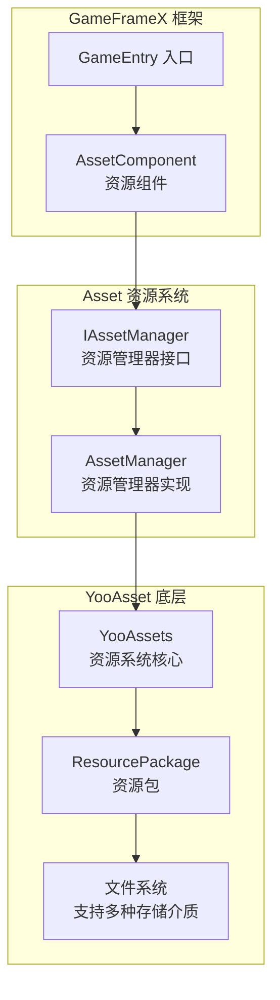
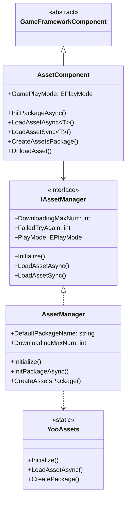
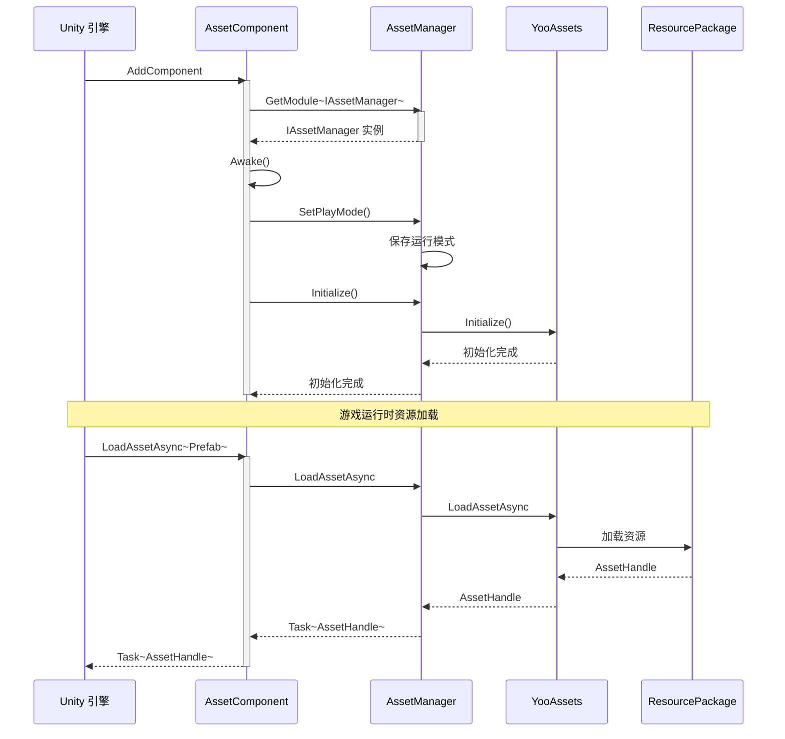
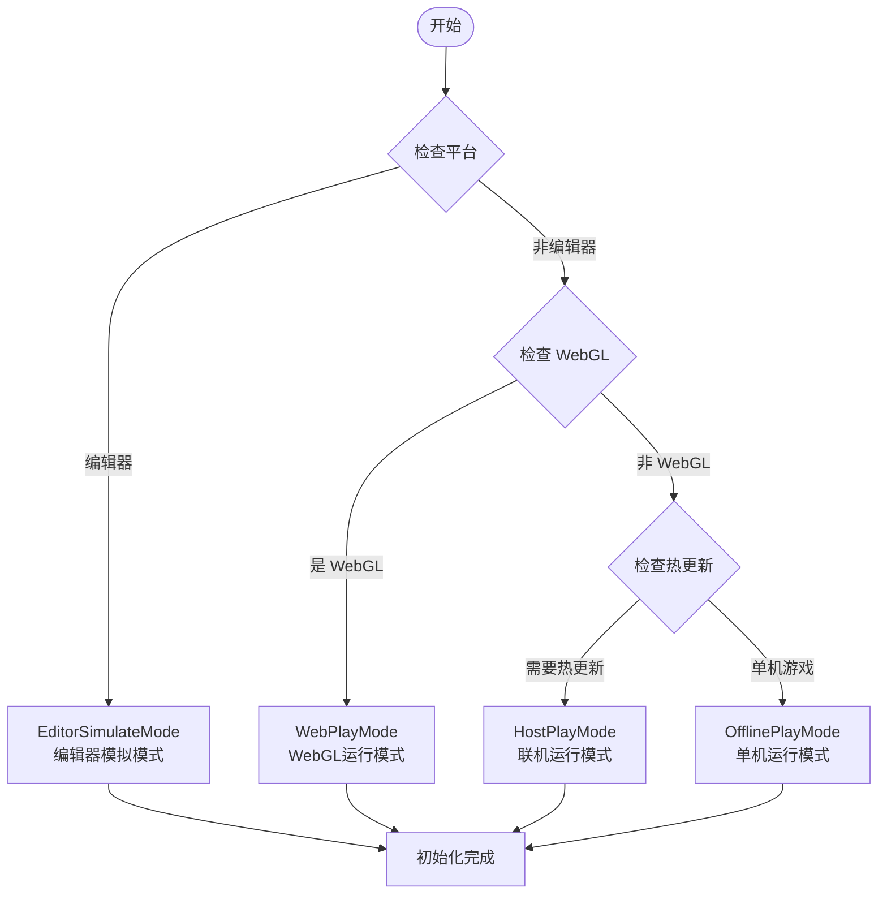

# Asset リソースコンポーネント介绍

GameFrameX 的 Asset リソースコンポーネント是 Unity 游戏リソース的統一された管理解決策，基于 YooAsset 底层実装，为開発者提供しますシンプル、効率的的リソースロード与管理インターフェース。该コンポーネントサポート多种运行モード，能够满足从开发デバッグ到ホットアップデート本番環境的全フロー需求。

## 概要

Asset リソースコンポーネント是 GameFrameX フレームワーク的コアモジュール之一，专门用于解决 Unity プロジェクト中的リソース管理問題。在游戏开发过程中，リソース的ロード、缓存、アンロードおよびホットアップデート是非常关键的环节，直接影响游戏的性能和ユーザー体验。Asset コンポーネント通过カプセル化 YooAsset 的強力機能，提供します一套統一された、シンプル且易于使用的 API，開発者无需深入理解する底层実装细节，つまり可快速実装リソース的ロード和管理。

该コンポーネント的コア設計理念是将複雑的リソース管理逻辑カプセル化为シンプル的インターフェース呼び出し，同時に保留足够的柔軟性以满足不同プロジェクト需求。无论是シンプル的オフラインゲーム还是〜する必要がありますホットアップデート的大型商业プロジェクト，Asset コンポーネント都能够提供合适的解決策。通过サポート多种运行モード，開発者〜できます在开发フェーズ使用エディタ模拟モード快速迭代，在テストフェーズ使用单机モード进行機能検証，在本番環境中使用ホットアップデートモード実装リソース的动态アップデート。



## コア機能

Asset リソースコンポーネント提供します全面的リソース管理能力，涵盖了游戏开发中常见的所有リソース操作シーン。

### リソースロード

コンポーネントサポート同步和异步两种リソースロード方法，開発者〜できます根据实际需求选择合适的ロードメソッド。非同期ロード適しています大多数シーン，能够保持游戏的流畅运行；同期ロード则在某些特定シーン下（如リソース预ロード完成后的切换）更为効率的。

- **非同期ロード**：通过 Task 异步モードロードリソース，サポート协程和コールバック两种使用方法
- **同期ロード**：直接返すリソース句柄，適しています已知リソース已ロード完成的シーン
- **ジェネリックサポート**：提供强タイプ的ジェネリックメソッド，避免タイプ转换エラー
- **多种リソースタイプ**：サポート普通リソース、サブリソース、ネイティブファイル和シーン的ロード

### リソースパッケージ管理

リソースパッケージ是リソース管理的基本单位，コンポーネントサポート作成、取得、設定デフォルトパッケージ等操作。通过リソースパッケージ机制，〜できます実装リソース的モジュール化管理，不同機能モジュール使用不同的リソースパッケージ，便于リソース的组织和アップデート。

```csharp
// 创建资源包
var package = assetComponent.CreateAssetsPackage("GameplayPackage");

// 尝试获取资源包
var existingPackage = assetComponent.TryGetAssetsPackage("GameplayPackage");

// 设置默认资源包
assetComponent.SetDefaultAssetsPackage(existingPackage);

// 检查资源包是否存在
if (assetComponent.HasAssetsPackage("GameplayPackage"))
{
    // 资源包存在
}
```

> Source: [AssetComponent.cs](https://github.com/GameFrameX/com.gameframex.unity.asset/blob/main/Runtime/Asset/AssetComponent.cs#L463-L510)

### リソース情報照会

コンポーネント提供します丰富的リソース情報查询機能，含みます取得リソース情報、確認リソース是否存在、判断リソース是否〜する必要があります下载等。这些機能对于実装リソース的按需下载和進捗表示非常重要な。

### リソースのアンロード与清理

合理的リソース管理不仅含みますロード，还含みます及时的アンロード和清理。コンポーネント提供します多种リソース解放策略，含みます指定リソースアンロード、无用リソースアンロード和强制清理等，帮助開発者有效控制内存使用。

## アーキテクチャ設計

Asset リソースコンポーネント采用了分层アーキテクチャ設計，每一层都有明确的职责边界，这种設計使得系统具有良好的可拡張性和可维护性。

### 階層型アーキテクチャ



### コンポーネント連携フロー



## 動作モード

Asset コンポーネントサポート四种运行モード，每种モード適しています不同的开发和デプロイシーン。运行モード决定了リソース的ロード方法和来源，開発者〜する必要があります根据プロジェクト的具体需求选择合适的モード。

### 1. エディタ模拟モード (EditorSimulateMode)

エディタ模拟モード主な用于开发フェーズ的快速迭代。在这种モード下，リソース直接从 Unity エディタ的リソースファイル夹中ロード，无需进行リソース打パッケージ。这种モード的优势是开发过程中変更リソース后〜できます立つまり生效，无需重新打パッケージ，大大提高了开发效率。但是注意が必要的是，这种モード只能用于エディタ環境，打パッケージリリース时〜しなければなりません切换到其他モード。

### 2. 单机运行モード (OfflinePlayMode)

单机运行モード適しています不〜する必要がありますホットアップデート的オフラインゲーム或游戏的内蔵リソース。在这种モード下，所有リソース都从内置ファイル系统中ロード，リソース打パッケージ时会被打パッケージ到インストールパッケージ中。这种モード的优势是シンプル可靠，游戏リリース后不〜する必要があります考虑リソース服务器的维护問題，适合于不经常アップデート内容的游戏。

### 3. 联机运行モード (HostPlayMode)

联机运行モード是大型游戏最常用的モード，特别適しています〜する必要がありますホットアップデート的プロジェクト。在这种モード下，リソース分为内蔵リソース和リモートリソース两部分。内蔵リソース随应用一起打パッケージ，リモートリソース则从リソース服务器按需下载。这种モードサポートリソース的动态アップデート，游戏リリース后仍然〜できますアップデート游戏内容、修复 bug 或追加新機能。コンポーネントサポート主服务器和备用服务器的設定，確認してくださいリソース下载的可靠性。

### 4. WebGL 运行モード (WebPlayMode)

WebGL 运行モード专门针对 WebGL プラットフォーム进行了最適化，適していますWeb ゲーム和小程序游戏。这种モード考虑了 WebGL プラットフォーム的特殊限制，对リソースロード进行了专门的适配。同時にサポートByteDanceミニゲーム、WeChatミニゲーム和KuaiShouミニゲーム等多种プラットフォーム，開発者〜できます根据目标プラットフォーム进行相应的設定。



## プラットフォームサポート

Asset リソースコンポーネント基于 YooAsset ビルド，天然サポート Unity サポート的所有プラットフォーム，含みます但不限于 Windows、macOS、iOS、Android、WebGL，および各种ミニゲームプラットフォーム。コンポーネント在 WebGL プラットフォーム上会自动切换到 WebPlayMode，確認してくださいリソースロード的正确性。

## クイックスタート

要在プロジェクト中使用 Asset リソースコンポーネント，まず〜する必要があります在シーン中追加 AssetComponent：

```csharp
// 在 Unity 场景中创建空物体，添加 AssetComponent
var assetComponent = gameObject.AddComponent<AssetComponent>();
assetComponent.GamePlayMode = EPlayMode.HostPlayMode;
```

次に通过 GameFrameX 的入口取得コンポーネントインスタンス进行リソースロード：

```csharp
// 获取资源组件
var assetComponent = GameEntry.GetComponent<AssetComponent>();

// 异步加载资源
var handle = await assetComponent.LoadAssetAsync<GameObject>("Assets/Prefabs/Player.prefab");
var prefab = handle.AssetObject as GameObject;

// 使用完成后释放资源
handle.Release();
```

> Source: [AssetComponent.cs](https://github.com/GameFrameX/com.gameframex.unity.asset/blob/main/Runtime/Asset/AssetComponent.cs#L225-L316)

## 関連リンク

- [機能特性](./1-overview.features) - 理解する更多機能特性
- [インストール方法](./2-installation.index) - インストール設定ガイド
- [快速入门ガイド](./3-getting-started.index) - 快速开始使用
- [アーキテクチャ設計](./4-core-concepts.architecture) - 深入理解するアーキテクチャ設計
- [リソースマネージャー](./4-core-concepts.asset-manager) - リソースマネージャー详解
- [リソースロードインターフェース](./5-api-reference.loading-api) - API リファレンス
- [运行モード](./6-configuration.play-modes) - 运行モード設定
