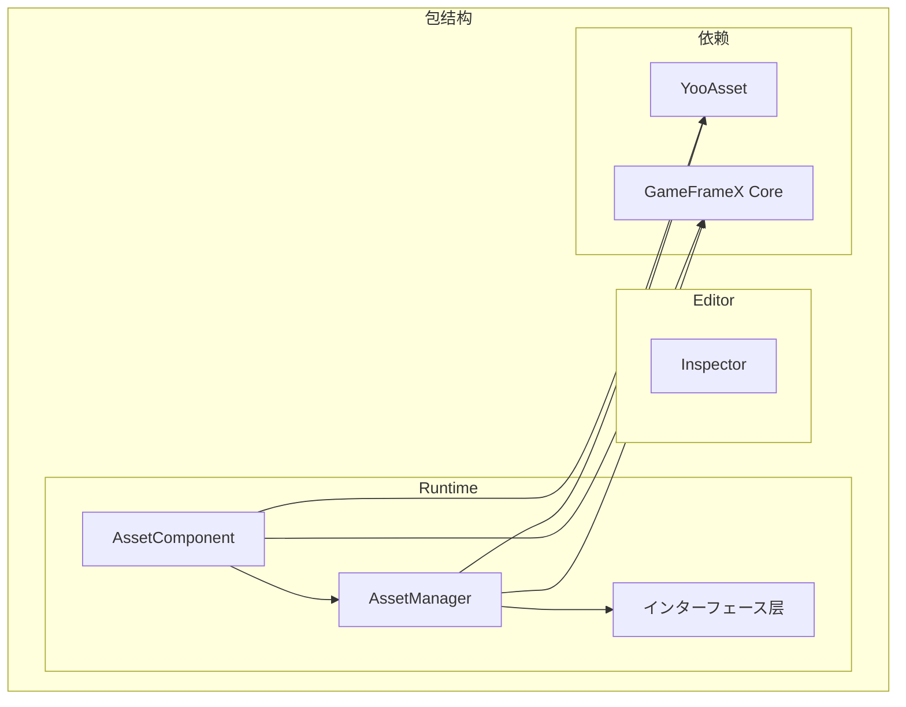

# 安装方法

GameFrameX Asset リソースコンポーネントサポート多种安装方法，以适应不同的プロジェクト工作流和开发需求。本文将详细介绍每种安装メソッド及其适用シーン。

## 概要

GameFrameX Asset リソースコンポーネント是基づく YooAsset 构建的 Unity リソース管理機能包，提供统一的リソース加载、卸载和ホットアップデートインターフェース。该コンポーネント采用 Unity Package Manager (UPM) 方法进行分发，サポート多种安装途径，開発者可に基づいてプロジェクト实际情况选择最合适的安装メソッド。

## 环境要求

| 要求项 | 最小バージョン | 説明 |
|--------|----------|------|
| Unity 版本 | 2019.4 | LTS 版本推荐 |
| パッケージ管理器 | UPM | Unity 内置 |
| 网络环境 | 必要访问 GitHub | に使用 Git URL 安装 |

## インストールメソッド

### メソッド一：を通じて manifest.json 安装

直接编辑プロジェクト的 `Packages/manifest.json` ファイル，在 `dependencies` ノードに追加包引用。这是最常用的安装方法，适合必要版本控制的团队プロジェクト。

**操作手順：**

1. 打开 Unity プロジェクトディレクトリ下的 `Packages/manifest.json` ファイル
2. 在 `dependencies` 节点中添加包引用
3. 保存ファイル后等待 Unity 自动ダウンロード并导入

```json
{
  "dependencies": {
    "com.gameframex.unity.asset": "https://github.com/GameFrameX/com.gameframex.unity.asset.git"
  }
}
```

> Source: [README.md](https://github.com/GameFrameX/com.gameframex.unity.asset/blob/main/README.md#L13-L16)

**适用シーン：**
- 团队协作プロジェクト，必要版本锁定
- CI/CD 自动化构建环境
- 必要自定义包版本的开发フロー

**注意事项：**
- 该方法会始终取得最新版本
- 如需锁定版本，可使用 `#分支名` 或 `#tag` 语法
- Git 仓库地址需保持可访问

### メソッド二：を通じて Unity Package Manager 安装

使用 Unity 编辑器内置的パッケージ管理器界面，を通じて Git URL 添加包。这种方法无需手动编辑配置ファイル，适合快速尝试和临时测试。

**操作手順：**

1. 在 Unity 编辑器中打开 `Window` → `Package Manager`
2. 点击左上角的 `+` 按钮
3. 选择 `Add package from git URL...`
4. 输入 Git 仓库地址：`https://github.com/GameFrameX/com.gameframex.unity.asset.git`
5. 点击 `Add` 等待包ダウンロード完成

```
https://github.com/GameFrameX/com.gameframex.unity.asset.git
```

> Source: [README.md](https://github.com/GameFrameX/com.gameframex.unity.asset/blob/main/README.md#L17)

**适用シーン：**
- 快速原型开发和機能测试
- 独立開発者快速上手
- 临时必要引入的機能验证

**注意事项：**
- 必要保持网络连接
- 首次安装可能必要较长时间ダウンロード依赖
- 建议测试完成后切换到方法一进行版本控制

### メソッド三：手动放置到 Packages ディレクトリ

将仓库克隆或ダウンロード后，直接放置到 Unity プロジェクト的 `Packages` ディレクトリ下。这种方法完全离线，适合网络受限的环境。

**操作手順：**

1. 克隆或ダウンロード仓库：`https://github.com/GameFrameX/com.gameframex.unity.asset.git`
2. 将仓库ファイル夹重名前を付ける `com.gameframex.unity.asset`
3. 将ファイル夹复制到 Unity プロジェクト的 `Packages` ディレクトリ下
4. Unity 会自动识别并加载包

```
YourUnityProject/
└── Packages/
    └── com.gameframex.unity.asset/
        ├── package.json
        ├── Runtime/
        └── Editor/
```

> Source: [README.md](https://github.com/GameFrameX/com.gameframex.unity.asset/blob/main/README.md#L18)

**适用シーン：**
- 网络受限或无法访问外部仓库
- 必要对包进行本地修改和调试
- 离线开发和构建环境

**注意事项：**
- 包不会自动更新，必要手动同步
- 修改后的包可能影响后续升级
- 建议保留原始包副本以便升级

## 依赖要求

GameFrameX Asset コンポーネント依赖以下包，在安装过程中会自动一并安装：

| 依赖包 | 版本 | 説明 |
|--------|------|------|
| com.gameframex.unity | 1.1.1 | GameFrameX コアフレームワーク |
| YooAsset | - | リソース管理底层実装 |
| BetterStreamingAssets | - | 流リソース访问サポート |

### YooAsset 集成

该コンポーネント基づく [YooAsset](https://github.com/yoomotion/YooAsset) 构建，提供以下コア機能：

- リソース打包与分配
- リソース加载与缓存管理
- シーン异步加载
- リソースホットアップデートサポート
- 多平台适配

> 详细 API 使用方法お願いします参考 [リソース加载インターフェース](./5-api-reference.loading-api) 文档。

## 包结构説明

インストール完了後，包ディレクトリ结构如下：

```
com.gameframex.unity.asset/
├── package.json              # 包配置ファイル
├── Runtime/                  # 运行时代码
│   ├── GameFrameX.Asset.Runtime.asmdef
│   ├── Asset/
│   │   ├── AssetComponent.cs
│   │   ├── AssetManager.cs
│   │   ├── IAssetManager.cs
│   │   └── Constant.cs
│   └── Update/
│       ├── EPatchStates.cs
│       └── EventArgs/
├── Editor/                   # 编辑器代码
│   ├── GameFrameX.Asset.Editor.asmdef
│   └── Inspector/
│       └── AssetComponentInspector.cs
└── Tests/                   # 单元测试
    └── GameFrameX.Asset.Tests.asmdef
```



## 安装验证

インストール完了後，可を通じて以下方法验证：

1. **检查 Package Manager**：在 Package Manager 窗口确认 `GameFrameX Asset` 包已显示
2. **检查程序集**：在 Project 窗口确认 `GameFrameX.Asset.Runtime` 和 `GameFrameX.Asset.Editor` 程序集已生成
3. **运行示例代码**：尝试加载リソース验证機能正常

```csharp
// 验证インストール成功的简单测试
using GameFrameX.Asset.Runtime;

public class InstallationTest : MonoBehaviour
{
    private void Start()
    {
        // 取得リソース管理器インスタンス
        var manager = AssetManager.Instance;
        Debug.Log($"Asset Manager initialized: {manager != null}");
    }
}
```

## 版本选择

| 版本格式 | 示例 | 説明 |
|----------|------|------|
| latest | - | 取得主分支最新代码 |
| 分支 | #main | 取得指定分支 |
| 标签 | #2.4.0 | 取得指定版本发布 |

建议在正式プロジェクト中锁定具体版本号，避免因自动更新导致兼容性问题。

## よくある質問

### 安装后编译报错

**原因**：缺少依赖包或 Unity 版本过低

**解決策**：
1. 确认 Unity 版本 >= 2019.4
2. 检查 `manifest.json` 中依赖是否正确添加
3. 尝试删除 `Library` ファイル夹后重新打开プロジェクト

### 无法连接到 Git 仓库

**原因**：网络问题或仓库地址变更

**解決策**：
1. 检查网络连接
2. 确认 Git 仓库地址正确
3. 尝试使用方法三手动安装

### 版本升级问题

**解決策**：
1. 备份当前プロジェクト
2. 删除旧版本包
3. 按本文档重新安装新版本
4. 检查 [CHANGELOG](./CHANGELOG.md) 了解版本变更

## 関連リンク

- [GitHub 仓库](https://github.com/GameFrameX/com.gameframex.unity.asset.git)
- [依赖要求](./2-installation.dependencies)
- [快速入门指南](./3-getting-started.index)
- [官方文档](https://gameframex.doc.alianblank.com)
