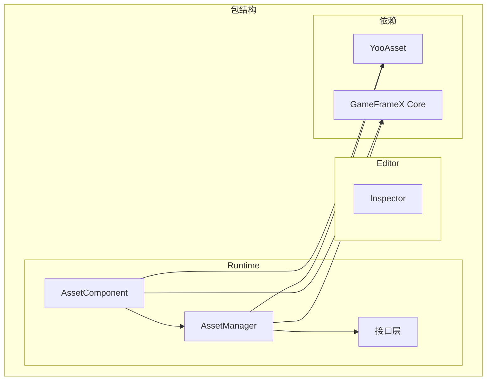

# インストールメソッド

GameFrameX Asset リソースコンポーネントサポート多种インストール方法，以适应不同的プロジェクト工作流和开发需求。本文将詳細介绍每种インストールメソッド及其适用シーン。

## 概要

GameFrameX Asset リソースコンポーネント是基于 YooAsset ビルド的 Unity リソース管理機能パッケージ，提供統一された的リソースロード、アンロード和ホットアップデートインターフェース。该コンポーネント采用 Unity Package Manager (UPM) 方法进行分发，サポート多种インストール途径，開発者可根据プロジェクト实际情况选择最合适的インストールメソッド。

## 環境要件

| 要求项 | 最低バージョン | 説明 |
|--------|----------|------|
| Unity バージョン | 2019.4 | LTS バージョン推奨 |
| パッケージマネージャー | UPM | Unity 内置 |
| 网络環境 | 〜する必要があります访问 GitHub | 用于 Git URL インストール |

## インストールメソッド

### 方法一：通过 manifest.json インストール

直接编辑プロジェクト的 `Packages/manifest.json` ファイル，在 `dependencies` 节点下追加パッケージ参照。这是最常用的インストール方法，适合〜する必要がありますバージョン控制的团队プロジェクト。

**操作ステップ：**

1. 打开 Unity プロジェクトディレクトリ下的 `Packages/manifest.json` ファイル
2. 在 `dependencies` 节点中追加パッケージ参照
3. 保存ファイル后等待 Unity 自动下载并导入

```json
{
  "dependencies": {
    "com.gameframex.unity.asset": "https://github.com/GameFrameX/com.gameframex.unity.asset.git"
  }
}
```

> Source: [README.md](https://github.com/GameFrameX/com.gameframex.unity.asset/blob/main/README.md#L13-L16)

**适用シーン：**
- 团队协作プロジェクト，〜する必要がありますバージョン锁定
- CI/CD 自动化ビルド環境
- 〜する必要があります自定義パッケージバージョン的开发フロー

**注意事项：**
- 该方法会始终取得最新バージョン
- 如需锁定バージョン，可使用 `#分支名` 或 `#tag` 语法
- Git リポジトリ地址需保持可访问

### 方法二：通过 Unity Package Manager インストール

使用 Unity エディタ内置的パッケージマネージャー界面，通过 Git URL 追加パッケージ。这种方法无需手动编辑設定ファイル，适合快速尝试和临时テスト。

**操作ステップ：**

1. 在 Unity エディタ中打开 `Window` → `Package Manager`
2. 点击左上角的 `+` ボタン
3. 选择 `Add package from git URL...`
4. 输入 Git リポジトリ地址：`https://github.com/GameFrameX/com.gameframex.unity.asset.git`
5. 点击 `Add` 等待パッケージ下载完成

```
https://github.com/GameFrameX/com.gameframex.unity.asset.git
```

> Source: [README.md](https://github.com/GameFrameX/com.gameframex.unity.asset/blob/main/README.md#L17)

**适用シーン：**
- 快速原型开发和機能テスト
- 独立開発者快速上手
- 临时〜する必要があります引入的機能検証

**注意事项：**
- 〜する必要があります保持网络连接
- 首次インストール〜の可能性があります〜する必要があります较长时间下载依赖
- お勧めテスト完成后切换到方法一进行バージョン控制

### 方法三：手动放置到 Packages ディレクトリ

将リポジトリ克隆或下载后，直接放置到 Unity プロジェクト的 `Packages` ディレクトリ下。这种方法完全离线，适合网络受限的環境。

**操作ステップ：**

1. 克隆或下载リポジトリ：`https://github.com/GameFrameX/com.gameframex.unity.asset.git`
2. 将リポジトリファイル夹重命名为 `com.gameframex.unity.asset`
3. 将ファイル夹复制到 Unity プロジェクト的 `Packages` ディレクトリ下
4. Unity 会自动识别并ロードパッケージ

```
YourUnityProject/
└── Packages/
    └── com.gameframex.unity.asset/
        ├── package.json
        ├── Runtime/
        └── Editor/
```

> Source: [README.md](https://github.com/GameFrameX/com.gameframex.unity.asset/blob/main/README.md#L18)

**适用シーン：**
- 网络受限或无法访问外部リポジトリ
- 〜する必要があります对パッケージ进行本地変更和デバッグ
- 离线开发和ビルド環境

**注意事项：**
- パッケージ不会自动アップデート，〜する必要があります手动同步
- 変更后的パッケージ〜の可能性があります影响后续升级
- お勧め保留原始パッケージ副本以便升级

## 依存要件

GameFrameX Asset コンポーネント依赖以下パッケージ，在インストール过程中会自动一并インストール：

| 依赖パッケージ | バージョン | 説明 |
|--------|------|------|
| com.gameframex.unity | 1.1.1 | GameFrameX コアフレームワーク |
| YooAsset | - | リソース管理底层実装 |
| BetterStreamingAssets | - | 流リソース访问サポート |

### YooAsset 集成

该コンポーネント基于 [YooAsset](https://github.com/yoomotion/YooAsset) ビルド，提供以下コア機能：

- リソース打パッケージ与分配
- リソースロード与缓存管理
- シーン非同期ロード
- リソースホットアップデートサポート
- 多プラットフォーム适配

> 詳細 API 使用方法请リファレンス [リソースロードインターフェース](./5-api-reference.loading-api) ドキュメント。

## パッケージ構造の説明

インストール完成后，パッケージディレクトリ结构如下：

```
com.gameframex.unity.asset/
├── package.json              # 包配置文件
├── Runtime/                  # 运行时代码
│   ├── GameFrameX.Asset.Runtime.asmdef
│   ├── Asset/
│   │   ├── AssetComponent.cs
│   │   ├── AssetManager.cs
│   │   ├── IAssetManager.cs
│   │   └── Constant.cs
│   └── Update/
│       ├── EPatchStates.cs
│       └── EventArgs/
├── Editor/                   # 编辑器代码
│   ├── GameFrameX.Asset.Editor.asmdef
│   └── Inspector/
│       └── AssetComponentInspector.cs
└── Tests/                   # 单元测试
    └── GameFrameX.Asset.Tests.asmdef
```



## インストールの確認

インストール完成后，可通过以下方法検証：

1. **確認 Package Manager**：在 Package Manager ウィンドウ確認 `GameFrameX Asset` パッケージ已显示
2. **確認アセンブリ**：在 Project ウィンドウ確認 `GameFrameX.Asset.Runtime` 和 `GameFrameX.Asset.Editor` アセンブリ已生成
3. **运行例コード**：尝试ロードリソース検証機能正常

```csharp
// 验证安装成功的简单测试
using GameFrameX.Asset.Runtime;

public class InstallationTest : MonoBehaviour
{
    private void Start()
    {
        // 获取资源管理器实例
        var manager = AssetManager.Instance;
        Debug.Log($"Asset Manager initialized: {manager != null}");
    }
}
```

## バージョンの選択

| バージョンフォーマット | 例 | 説明 |
|----------|------|------|
| latest | - | 取得主ブランチ最新コード |
| ブランチ | #main | 取得指定ブランチ |
| 标签 | #2.4.0 | 取得指定バージョンリリース |

お勧め在正式プロジェクト中锁定具体バージョン号，避免因自动アップデート导致兼容性問題。

## よくある問題

### インストール后コンパイル报错

**原因**：缺少依赖パッケージ或 Unity バージョン过低

**解決策**：
1. 確認 Unity バージョン >= 2019.4
2. 確認 `manifest.json` 中依赖是否正确追加
3. 尝试削除 `Library` ファイル夹后重新打开プロジェクト

### 无法连接到 Git リポジトリ

**原因**：网络問題或リポジトリ地址变更

**解決策**：
1. 確認网络连接
2. 確認 Git リポジトリ地址正确
3. 尝试使用方法三手动インストール

### バージョン升级問題

**解決策**：
1. 备份当前プロジェクト
2. 削除旧バージョンパッケージ
3. 按このドキュメント重新インストール新バージョン
4. 確認 [CHANGELOG](./CHANGELOG.md) 理解するバージョン变更

## 関連リンク

- [GitHub リポジトリ](https://github.com/GameFrameX/com.gameframex.unity.asset.git)
- [依赖要求](./2-installation.dependencies)
- [快速入门ガイド](./3-getting-started.index)
- [官方ドキュメント](https://gameframex.doc.alianblank.com)
