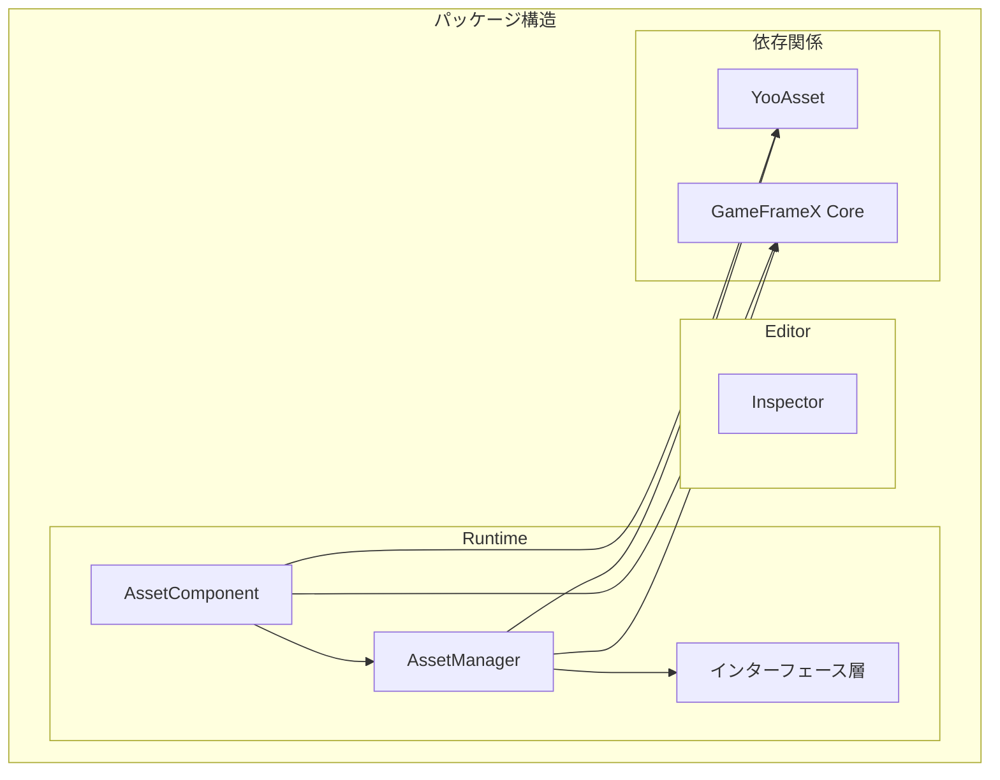

# インストール方式

GameFrameX Asset リソースコンポーネントは、さまざまなインストール方式をサポートし、異なるプロジェクトのワークフローと開発ニーズに対応します。このドキュメントでは、各インストール方法について詳しく説明します。

## 概要

GameFrameX Asset リソースコンポーネントは YooAsset 上に構築された Unity リソース管理機能パッケージであり、统一されたリソースロード、アンロードおよびホットアップデートインターフェースを提供します。このコンポーネントは Unity Package Manager (UPM)方式进行配信され、複数のインストール途径をサポートし、開発者はプロジェクトの实际情况に応じて最も適切なインストール方法を選択できます。

## 環境要件

| 要件項目 | 最小バージョン | 説明 |
|--------|----------|------|
| Unity バージョン | 2019.4 | LTS バージョンを推奨 |
| パッケージマネージャー | UPM | Unity 内蔵 |
| ネットワーク環境 | GitHub へのアクセスが必要 | Git URL インストールに使用 |

## インストール方式

### 方式1: manifest.json によるインストール

プロジェクトの `Packages/manifest.json` ファイルを直接編集し、`dependencies` ノード下にパッケージ参照を追加します。これは最も一般的に使用されるインストール方式であり、版本制御が必要なチームプロジェクトに適しています。

**操作手順:**

1. Unity プロジェクトディレクトリ下の `Packages/manifest.json` ファイルを開きます
2. `dependencies` ノードにパッケージ参照を追加します
3. ファイルを保存すると、Unity が自動的にダウンロードしてインポートします

```json
{
  "dependencies": {
    "com.gameframex.unity.asset": "https://github.com/GameFrameX/com.gameframex.unity.asset.git"
  }
}
```

> Source: [README.md](https://github.com/GameFrameX/com.gameframex.unity.asset/blob/main/README.md#L13-L16)

**適用シーン:**
- チーム協業プロジェクトでは、版本制御が必要です
- CI/CD 自動化ビルド環境
- カスタムパッケージバージョンの開発プロセスが必要です

**注意事項:**
- この方式是常に最新バージョンを取得します
- バージョンを固定する場合は、`#ブランチ名` または `#tag` 構文を使用できます
- Git リポジトリアドレスはアクセス可能な状態を保つ必要があります

### 方式2: Unity Package Manager によるインストール

Unity エディタ内置のパケージマネージャーインターフェースを使用し、Git URL からパッケージを追加します。この方式是、設定ファイルを手動で編集する必要がなく、素早く試すことや一時的なテストに適しています。

**操作手順:**

1. Unity エディタで `Window` → `Package Manager` を開きます
2. 左上隅の `+` ボタンをクリックします
3. `Add package from git URL...` を選びます
4. Git リポジトリアドレスを入力します: `https://github.com/GameFrameX/com.gameframex.unity.asset.git`
5. `Add` をクリックしてパッケージのダウンロードが完了するのを待ちます

```
https://github.com/GameFrameX/com.gameframex.unity.asset.git
```

> Source: [README.md](https://github.com/GameFrameX/com.gameframex.unity.asset/blob/main/README.md#L17)

**適用シーン:**
- 高速プロトタイプ開発と機能テスト
- 独立開発者のクイックスタート
- 一時的な機能検証

**注意事項:**
- ネットワーク接続を維持する必要があります
- 初回インストールでは依存関係のダウンロードに時間がかかる場合があります
- テスト完了後、方式1に切り替えて版本制御を行うことをお勧めします

### 方式3: Packages ディレクトリへの手動配置

リポジトリをクローンまたはダウンロード後、Unity プロジェクトの `Packages` ディレクトリに直接配置します。この方式是完全にオフラインであり、ネットワークが制限された環境に適しています。

**操作手順:**

1. リポジトリをクローンまたはダウンロードします: `https://github.com/GameFrameX/com.gameframex.unity.asset.git`
2. リポジトリフォルダの名前を `com.gameframex.unity.asset` に変更します
3. フォルダを Unity プロジェクトの `Packages` ディレクトリにコピーします
4. Unity は自動的にパッケージを識別してロードします

```
YourUnityProject/
└── Packages/
    └── com.gameframex.unity.asset/
        ├── package.json
        ├── Runtime/
        └── Editor/
```

> Source: [README.md](https://github.com/GameFrameX/com.gameframex.unity.asset/blob/main/README.md#L18)

**適用シーン:**
- ネットワークが制限されている、または外部リポジトリにアクセスできない場合
- パッケージのローカルな修正とデバッグが必要な場合
- オフライン開発とビルド環境

**注意事項:**
- パッケージは自動更新されないため、手動で同期する必要があります
- 修改後のパッケージはアップグレードに影響を与える可能性があります
- アップグレードのために元の paquete コピーを保持することをお勧めします

## 依存要件

GameFrameX Asset コンポーネントは、以下のパッケージに依存しており、インストール過程で自動的に一緒にインストールされます:

| 依存パッケージ | バージョン | 説明 |
|--------|------|------|
| com.gameframex.unity | 1.1.1 | GameFrameX コアフレームワーク |
| YooAsset | - | リソース管理の底層実装 |
| BetterStreamingAssets | - | ストリーミングリソースアクセスサポート |

### YooAsset 統合

このコンポーネントは [YooAsset](https://github.com/yoomotion/YooAsset) 上に構築されており、以下のコア機能を提供します:

- リソースのパッケージングと分配
- リソースのロードとキャッシュ管理
- シーンの非同期ロード
- リソースのホットアップデートサポート
- 複数のプラットフォームへの適応

> 詳細な API 使用方法については、[リソースロード API](./5-api-reference.loading-api) ドキュメントを参照してください。

## パッケージ構造の説明

インストール完了後、パケットディレクトリ構造は次のとおりです:

```
com.gameframex.unity.asset/
├── package.json              # パッケージ設定ファイル
├── Runtime/                  # ランタイムコード
│   ├── GameFrameX.Asset.Runtime.asmdef
│   ├── Asset/
│   │   ├── AssetComponent.cs
│   │   ├── AssetManager.cs
│   │   ├── IAssetManager.cs
│   │   └── Constant.cs
│   └── Update/
│       ├── EPatchStates.cs
│       └── EventArgs/
├── Editor/                   # エディタコード
│   ├── GameFrameX.Asset.Editor.asmdef
│   └── Inspector/
│       └── AssetComponentInspector.cs
└── Tests/                   # ユニットテスト
    └── GameFrameX.Asset.Tests.asmdef
```



## インストール検証

インストール完了後、以下の方法で検証できます:

1. **Package Manager を確認**: Package Manager ウィンドウで `GameFrameX Asset` パッケージが表示されていることを確認します
2. **アセンブリを確認**: Project ウィンドウで `GameFrameX.Asset.Runtime` と `GameFrameX.Asset.Editor` アセンブリが生成されていることを確認します
3. **サンプルコードを実行**: リソースをロードして機能が正常に動作することを確認します

```csharp
// インストール成功の簡単なテスト
using GameFrameX.Asset.Runtime;

public class InstallationTest : MonoBehaviour
{
    private void Start()
    {
        // リソースマネージャーインスタンスを取得
        var manager = AssetManager.Instance;
        Debug.Log($"Asset Manager initialized: {manager != null}");
    }
}
```

## バージョン選択

| バージョン形式 | 例 | 説明 |
|----------|------|------|
| latest | - | メインブランチの最新コードを取得 |
| ブランチ | #main | 指定ブランチを取得 |
| タグ | #2.4.0 | 指定バージョンを取得 |

正式なプロジェクトでは、具体的なバージョン番号を固定することをお勧めします。自動更新により互換性问题が発生する可能性があります。

## よくある質問

### インストール後のコンパイルエラー

**原因**: 依存パッケージが欠けているか、Unity バージョンが低すぎます

**解決策:**
1. Unity バージョンが >= 2019.4 であることを確認します
2. `manifest.json` 内の依存関係が正しく追加されていることを確認します
3. `Library` フォルダを削除してプロジェクトを開き直してみます

### Git リポジトリに接続できない

**原因**: ネットワーク問題またはリポジトリアドレスの変更

**解決策:**
1. ネットワーク接続を確認します
2. Git リポジトリアドレスが正しいことを確認します
3. 方式3の手動インストールを試みます

### バージョンアップグレードの問題

**解決策:**
1. 現在のプロジェクトをバックアップします
2. 旧バージョンのパッケージを削除します
3. このドキュメントに従って新バージョンを再インストールします
4. [CHANGELOG](./CHANGELOG.md) を確認してバージョン変更を理解します

## 関連リンク

- [GitHub リポジトリ](https://github.com/GameFrameX/com.gameframex.unity.asset.git)
- [依存要件](./2-installation.dependencies)
- [クイックスタート](./3-getting-started.index)
- [公式ドキュメント](https://gameframex.doc.alianblank.com)
