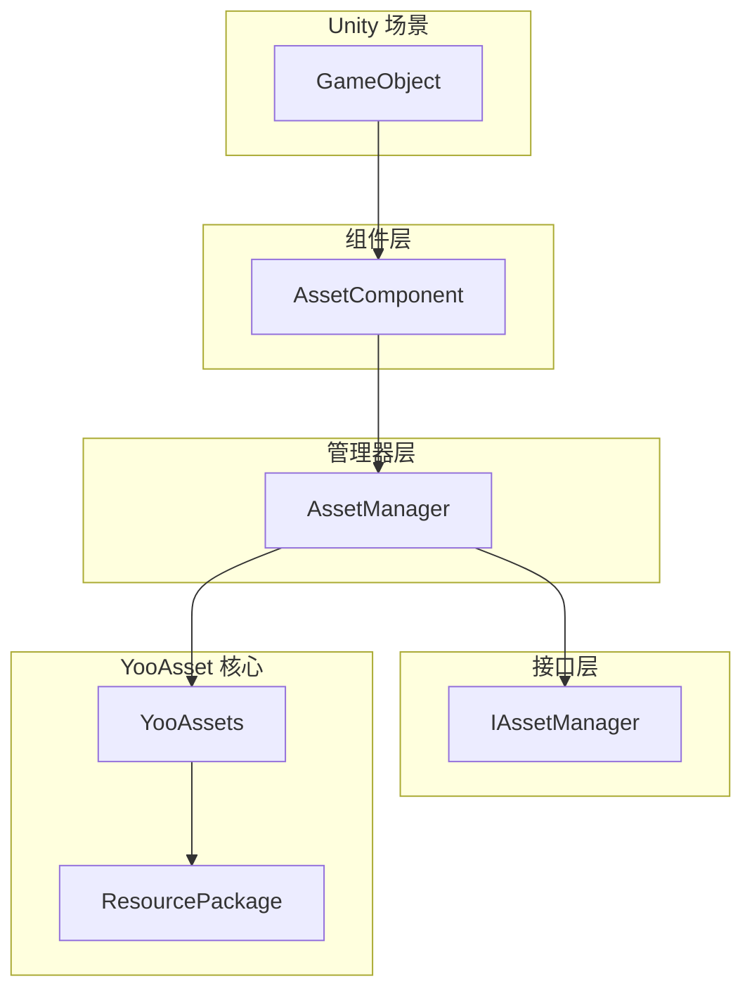
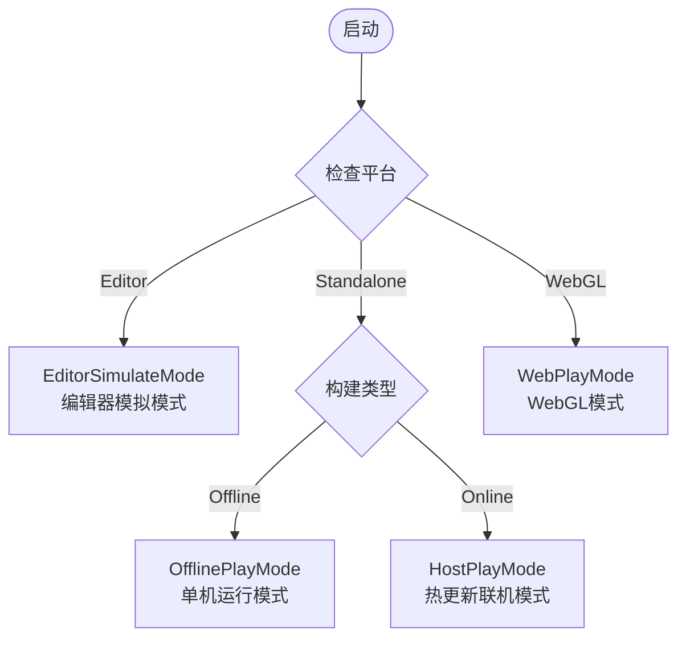

# クイックスタートガイド

このドキュメント将帮助您快速上手 GameFrameX Asset リソースコンポーネント，理解する如何在自己的 Unity プロジェクト中集成和使用该コンポーネント进行リソース管理。

## 概要

GameFrameX Asset 是基于 [YooAsset](https://yooasset.com/) ビルド的 Unity リソース管理系统。它提供します統一された的リソースロードインターフェース，サポート多种运行モード，含みますエディタ模拟モード、单机运行モード、ホットアップデート联机モード和 WebGL モード。该コンポーネント是 GameFrameX 游戏フレームワーク的コアモジュール之一，专门负责処理游戏リソース的ロード、アンロード和ホットアップデートフロー。

 Asset コンポーネント的主な設計目标是簡素化リソース管理的複雑性，让開発者能够以更シンプル的方法実装リソース的非同期ロード、同期ロード、シーン切换およびホットアップデート機能。通过カプセル化 YooAsset 的底层 API，Asset コンポーネント提供します一套更加直观易用的インターフェース，同時に保持了 YooAsset 強力的リソース管理能力。

## システムアーキテクチャ

Asset コンポーネント采用分层アーキテクチャ設計，コア由三个主な部分组成：Unity コンポーネント層、マネージャー层和インターフェース層。这种分层設計確認してください了コード的可维护性和拡張性，同時に提供します柔軟的リソース管理能力。



**各层职责説明：**

**コンポーネント層（AssetComponent）** 是 Unity 的 MonoBehaviour コンポーネント，〜する必要があります挂载到シーン中的 GameObject 上。它负责在游戏启动时初期化リソース管理系统，并根据目标プラットフォーム自动选择合适的运行モード。在 WebGL プラットフォーム上，コンポーネント会自动切换到 WebPlayMode，確認してくださいリソース能够正确从远程服务器ロード。

**マネージャー层（AssetManager）** 是リソース管理的コア実装类，継承自 GameFrameworkModule。它カプセル化了所有リソース操作，含みますリソース的ロード、アンロード、パッケージ管理和清理等。AssetManager 提供します同步和异步两套ロードインターフェース，满足不同シーン的需求。

**インターフェース層（IAssetManager）** 定義了リソース管理的標準インターフェース，確認してください了マネージャー実装的规范性。通过インターフェース抽象，〜できます方便地进行单元テスト和モジュール置換。

## コアコンセプト

### 動作モード（PlayMode）

Asset コンポーネントサポート四种运行モード，每种モード適しています不同的开发和デプロイシーン：



**EditorSimulateMode（エディタ模拟モード）** 主な用于开发フェーズ。在这种モード下，リソース直接从 Unity エディタ的リソースファイル夹中ロード，无需进行リソース打パッケージ。这种モード〜できます大幅缩短开发迭代周期，让開発者能够快速テストリソースロード機能。注意が必要的是，在非エディタ環境下ランタイム，もし設定为此モード，系统会自动切换到 HostPlayMode。

**OfflinePlayMode（单机运行モード）** 適しています不〜する必要がありますホットアップデート的オフラインゲーム或内测フェーズ。在这种モード下，所有リソース都从内置リソースパッケージ（Buildin）中ロード，不涉及リモートリソース下载。リソース打パッケージ后内置到インストールパッケージ中，プレイヤー无需联网つまり可运行游戏。

**HostPlayMode（ホットアップデート联机モード）** 是最常用的本番モード，適しています〜する必要があります持续アップデート的オンラインゲーム。リソース分为内蔵リソース和リモートリソース两部分：内蔵リソース随应用パッケージ一起分发，リモートリソース从ホットアップデート服务器按需下载。这种モードサポートリソース的动态アップデート，无需重新リリース应用つまり可アップデート游戏内容。

**WebPlayMode（WebGL モード）** 专门针对 WebGL プラットフォーム最適化。由于浏览器安全限制和ロード性能考虑，WebGL プラットフォーム〜する必要があります使用特殊的リソースロード方法。Asset コンポーネント会自动检测 WebGL プラットフォーム并切换到此モード，同時にサポートByteDanceミニゲーム、WeChatミニゲーム和KuaiShouミニゲーム等プラットフォーム。

### リソースパッケージ（ResourcePackage）

リソースパッケージ是组织和管理リソース的基本单元。每个リソースパッケージ都有独立的名称，〜できます設定不同的リソース服务器地址。系统サポート作成多个リソースパッケージ，用于分离不同タイプ的リソース，例えば主リソースパッケージ、DLC リソースパッケージ或语言リソースパッケージ等。デフォルトリソースパッケージ名称为 "DefaultPackage"，系统会自动作成并設定为デフォルトパッケージ。

### リソース句柄（AssetHandle）

リソース句柄是ロードリソース的戻り値カプセル化类。通过句柄对象〜できます访问ロード的リソース，かつ在不再〜する必要があります时呼び出し Release メソッド解放リソース。系统提供多种タイプ的句柄：AssetHandle 用于普通リソース、SubAssetsHandle 用于サブリソース、AllAssetsHandle 用于ロード所有リソース、SceneHandle 用于シーンロード、RawFileHandle 用于ネイティブファイル。

## クイックスタートフロー

要在プロジェクト中使用 Asset コンポーネント，〜する必要があります完成以下几个关键ステップ：

### 第1步：インストールコンポーネント

まず〜する必要があります将 Asset コンポーネントインストール到您的 Unity プロジェクト中。インストール方法请参照 [インストール方法](./2-installation.index) ドキュメント。インストール完成后，確認してくださいプロジェクト中すでにパッケージ含 GameFrameX コアフレームワーク和其他必要的依赖。

### 第2步：追加コンポーネント到シーン

在 Unity エディタ中，作成一个新的 GameObject（または使用现有的游戏对象），次に通过メニュー "Component" -> "GameFrameX" -> "Asset" 追加 AssetComponent コンポーネント。追加コンポーネント后，在 Inspector パネル中〜できます設定运行モード和其他パラメータ。

```csharp
// 组件添加后的 Unity 场景层级结构示例
// GameObject (Root)
// └── Asset (添加了 AssetComponent 组件)
```

> Source: [AssetComponent.cs](https://github.com/GameFrameX/com.gameframex.unity.asset/blob/main/Runtime/Asset/AssetComponent.cs#L18-L35)

### 第3步：設定运行モード

在 Inspector パネル中，根据您的开发フェーズ和リリース目标选择合适的运行モード：

- **开发フェーズ**：选择 EditorSimulateMode，〜できます直接从エディタロードリソース
- **单机テスト**：选择 OfflinePlayMode，模拟单机環境
- **ホットアップデートテスト**：选择 HostPlayMode，テスト完全な的ホットアップデートフロー
- **WebGL リリース**：在 WebGL プラットフォーム下会自动切换到 WebPlayMode

```csharp
// 在代码中也可以动态设置运行模式
var assetComponent = gameObject.GetComponent<AssetComponent>();
assetComponent.GamePlayMode = EPlayMode.HostPlayMode;
```

> Source: [AssetComponent.cs](https://github.com/GameFrameX/com.gameframex.unity.asset/blob/main/Runtime/Asset/AssetComponent.cs#L20-L31)

### 第4步：初期化リソースパッケージ

对于〜する必要がありますホットアップデート的シーン，〜する必要があります初期化リソースパッケージ并設定远程服务器地址。这一步通常在游戏启动时或リソースアップデートフロー中执行。

```csharp
// 初始化默认资源包
var assetComponent = gameObject.GetComponent<AssetComponent>();
bool success = await assetComponent.InitPackageAsync(
    "DefaultPackage",           // 资源包名称
    "https://your-server.com/", // 主服务器地址
    "https://backup-server.com/", // 备用服务器地址
    true                        // 是否设为默认包
);

if (success)
{
    Debug.Log("资源包初始化成功");
}
```

> Source: [AssetComponent.cs](https://github.com/GameFrameX/com.gameframex.unity.asset/blob/main/Runtime/Asset/AssetComponent.cs#L80-L95)

### 第5步：ロードリソース

初期化完成后，就〜できます使用コンポーネント提供的インターフェースロードリソース了。系统同時にサポート同步和异步两种ロード方法：

```csharp
// 异步加载资源示例
var assetComponent = gameObject.GetComponent<AssetComponent>();
var handle = await assetComponent.LoadAssetAsync<Sprite>("UI/Icons/PlayerIcon");
var sprite = handle.AssetObject as Sprite;

// 使用完毕后释放资源
handle.Release();
```

> Source: [AssetComponent.cs](https://github.com/GameFrameX/com.gameframex.unity.asset/blob/main/Runtime/Asset/AssetComponent.cs#L258-L261)

## リソースロード方法详解

Asset コンポーネント提供します丰富的リソースロードインターフェース，〜できます满足各种不同的ロード需求。

### 非同期ロード

非同期ロード是推奨的主なロード方法，特别適しています〜する必要がありますロード大量リソース的シーン。非同期ロード不会阻塞主线程，能够保持游戏流畅运行。所有异步メソッド都返す Task 对象，サポート await 语法：

```csharp
// 异步加载普通资源
var handle = await assetComponent.LoadAssetAsync<GameObject>("Prefabs/Player");

// 异步加载带类型的资源
var handle = await assetComponent.LoadAssetAsync<Sprite>("UI/Background");

// 异步加载多个资源
var allAssetsHandle = await assetComponent.LoadAllAssetsAsync<GameObject>("Prefabs/Enemies");

// 异步加载场景
var sceneHandle = await assetComponent.LoadSceneAsync("Scenes/GameLevel", LoadSceneMode.Single);
```

> Source: [AssetManager.cs](https://github.com/GameFrameX/com.gameframex.unity.asset/blob/main/Runtime/Asset/AssetManager.cs#L469-L481)

### 同期ロード

同期ロード適しています对ロード时间要求不高、但〜する必要があります立つまり取得リソース的シーン。由于同期ロード会阻塞主线程，在ロード大型リソース时〜の可能性があります会造成卡顿，お勧め仅在必要时使用：

```csharp
// 同步加载资源
var handle = assetComponent.LoadAssetSync<GameObject>("Prefabs/Player");
var player = handle.AssetObject as GameObject;
```

> Source: [AssetManager.cs](https://github.com/GameFrameX/com.gameframex.unity.asset/blob/main/Runtime/Asset/AssetManager.cs#L603-L606)

### 子リソースロード

子リソースロード用于処理一个リソースファイルパッケージ含多个サブリソース的情况，例えば Sprite Atlas 或模型ファイル中的多个子对象：

```csharp
// 加载 Sprite Atlas 中的所有子图
var handle = await assetComponent.LoadSubAssetsAsync<Sprite>("Atlas/UIAtlas");
foreach (var sprite in handle.AssetObject)
{
    Debug.Log($"Sprite 名称: {sprite.name}");
}
handle.Release();
```

> Source: [AssetManager.cs](https://github.com/GameFrameX/com.gameframex.unity.asset/blob/main/Runtime/Asset/AssetManager.cs#L244-L250)

### ネイティブファイルロード

もし〜する必要がありますロード非 Unity リソースタイプ的ファイル（如設定ファイル、文本ファイル等），〜できます使用ネイティブファイルロードインターフェース：

```csharp
// 异步加载原生文件
var rawHandle = await assetComponent.LoadRawFileAsync("Config/GameConfig.json");
byte[] data = rawHandle.ReadRawFile();
rawHandle.Release();
```

> Source: [AssetManager.cs](https://github.com/GameFrameX/com.gameframex.unity.asset/blob/main/Runtime/Asset/AssetManager.cs#L314-L320)

## リソース管理最佳实践

### 及时解放リソース

不再使用的リソース应当及时解放，以解放内存空间。〜できます使用リソース句柄的 Release メソッド进行解放：

```csharp
// 加载并使用资源
var handle = await assetComponent.LoadAssetAsync<GameObject>("Prefabs/Player");
var player = Instantiate(handle.AssetObject as GameObject);

// 使用完毕后释放句柄（注意：资源实例不会被销毁）
handle.Release();

// 如果需要完全清理，包括资源实例
Destroy(player);
```

> Source: [AssetComponent.cs](https://github.com/GameFrameX/com.gameframex.unity.asset/blob/main/Runtime/Asset/AssetComponent.cs#L622-L628)

### 批量アンロード无用リソース

游戏运行一段时间后，〜の可能性があります会积累大量不再使用的リソース。〜できます使用清理機能解放这些リソース：

```csharp
// 卸载未被引用的资源
assetComponent.UnloadUnusedAssetsAsync();

// 清理未使用的资源包文件（可释放存储空间）
assetComponent.ClearUnusedBundleFilesAsync();
```

> Source: [AssetComponent.cs](https://github.com/GameFrameX/com.gameframex.unity.asset/blob/main/Runtime/Asset/AssetComponent.cs#L635-L658)

### 使用リソースパッケージ进行リソース隔离

对于大型プロジェクト，お勧め使用多个リソースパッケージ来组织不同タイプ的リソース。这样〜できます実装リソース的按需ロード和アップデート：

```csharp
// 创建额外的资源包
var dlcPackage = assetComponent.CreateAssetsPackage("DLC_Package");

// 获取已存在的资源包
var package = assetComponent.TryGetAssetsPackage("DefaultPackage");

// 设置默认资源包
assetComponent.SetDefaultAssetsPackage(package);
```

> Source: [AssetComponent.cs](https://github.com/GameFrameX/com.gameframex.unity.asset/blob/main/Runtime/Asset/AssetComponent.cs#L471-L507)

## 次のステップ

现在您すでに理解する了 Asset コンポーネント的基本使用メソッド，〜できます继续深入学习以下内容：

- **[首个例](./3-getting-started.first-steps)**：通过完全な的コード例深入学习リソースロード的具体実装
- **[アーキテクチャ設計](./4-core-concepts.architecture)**：理解するコンポーネント的詳細アーキテクチャ設計和モジュール划分
- **[リソースロードインターフェース](./5-api-reference.loading-api)**：查阅完全な的 API インターフェースドキュメント
- **[运行モード](./6-configuration.play-modes)**：詳細理解する各种运行モード的設定和使用シーン

## 関連リンク

- [Asset リソースコンポーネント介绍](./1-overview.introduction)
- [機能特性](./1-overview.features)
- [サポート的 Unity バージョン](./1-overview.supported-versions)
- [インストール方法](./2-installation.index)
- [依赖要求](./2-installation.dependencies)
- [首个例](./3-getting-started.first-steps)
- [アーキテクチャ設計](./4-core-concepts.architecture)
- [リソースコンポーネント](./4-core-concepts.asset-component)
- [リソースマネージャー](./4-core-concepts.asset-manager)
