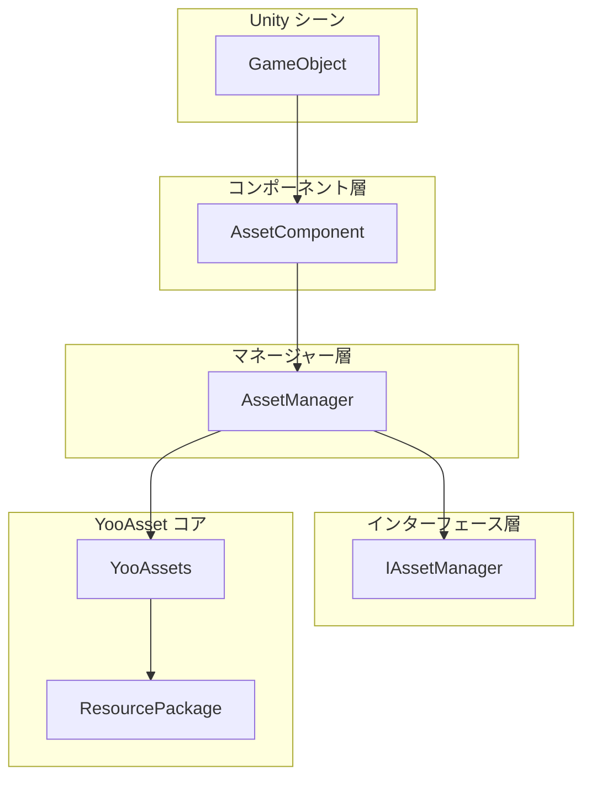
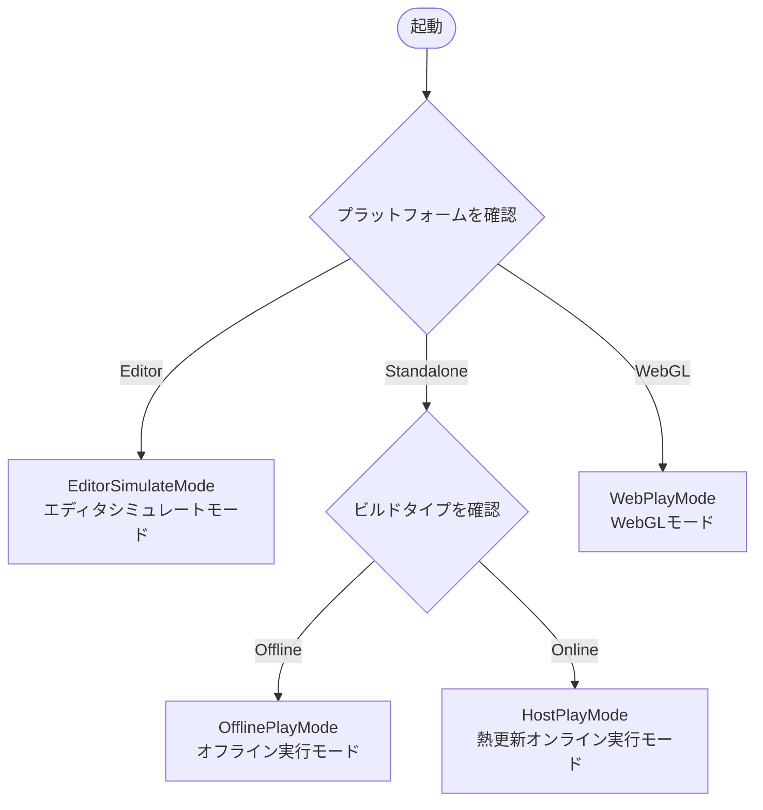

# クイックスタートガイド

このドキュメントは、GameFrameX Asset リソースコンポーネントのクイックスタートを支援し、自分の Unity プロジェクトでこのコンポーネントを統合して使用し、リソース管理を行う方法を説明します。

## 概要

GameFrameX Asset は [YooAsset](https://yooasset.com/) 上に構築された Unity リソース管理システムです。统一されたリソースロードインターフェースを提供し、複数の実行モード（エディタシミュレートモード、オフライン実行モード、熱更新オンライン実行モード、WebGL モード）をサポートします。このコンポーネントは GameFrameX ゲームフレームワークのコアモジュールの1つであり、ゲームリソースのロード、アンロードおよび熱更新フローを专门的に処理します。

Asset コンポーネントの主要な設計目標は、リソース管理の複雑さを簡素化し、開発者が非同期ロード、同期ロード、シーン切り替えおよび熱更新機能をよりシンプルな方法で実現できるようにすることです。YooAsset の底層 API を封裝することで、Asset コンポーネントはより直感的で使いやすいインターフェースを提供的同时、YooAsset の強力なリソース管理能力を維持しています。

## システムアーキテクチャ

Asset コンポーネントはレイヤー化アーキテクチャ設計を採用し、コアは3つの主要部分で構成されています: Unity コンポーネント層、マネージャー層およびインターフェース層。このレイヤー化設計により、コードの保守性と拡張性が確保され、灵活なリソース管理能力も提供します。



**各レイヤーの职责:**

**コンポーネント層（AssetComponent）** は Unity の MonoBehaviour コンポーネントであり、シーン内の GameObject にアタッチする必要があります。ゲーム起動時にリソース管理系统を初期化し、目標プラットフォームに応じて適切な実行モードを自動的に選択します。WebGL プラットフォームでは、コンポーネントは自動的に WebPlayMode に切り替え、リソースがリモートサーバーから正しくロードされることを確保します。

**マネージャー層（AssetManager）** はリソース管理のコア実装クラスであり、GameFrameworkModule から継承します。すべてのリソース操作を封裝し、リソースのロード、アンロード、パケット管理および清理を含みます。AssetManager は同期と非同期両方のロードインターフェースを提供し、異なるシーンのニーズを満たします。

**インターフェース層（IAssetManager）** はリソース管理の標準インターフェースを定義し、マネージャー実装の標準化を確保します。インターフェース抽象化により、ユニットテストとモジュール置換が容易になります。

## コアコンセプト

### 実行モード（PlayMode）

Asset コンポーネントは4種類の実行モードをサポートしており、各モード是不同的开发和展開シーンに適しています:



**EditorSimulateMode（エディタシミュレートモード）** は主に開発フェーズに使用されます。このモードでは、リソースは Unity エディタのリソースファイルから直接ロードされ、リソースパッケージングの必要はありません。このモードは開発反復サイクルを大幅に短縮し、開発者がリソースロード機能を快速にテストできるようにします。值得注意的是、非エディタ環境で実行される場合、このモードに設定されていると、システムは自動的に HostPlayMode に切り替わります。

**OfflinePlayMode（オフライン実行モード）** は、热更新が必要ない单机ゲームまたは内部テストフェーズに適しています。このモードでは、すべてのリソースはビルドインリソースパッケージ（Buildin）からロードされ、リモートリソースのダウンロードはありません。リソースはパッケージング後にビルドインされ、プレイヤーはインターネット接続なしでゲームをプレイできます。

**HostPlayMode（熱更新オンライン実行モード）** は、最も一般的に使用される本番モードであり、継続的な更新が必要なネットワークゲームに適しています。リソースはビルドインリソースとリモートリソースの2つの部分に分かれます: ビルドインリソースはアプリケーションパケットと一緒に配信され、リモートリソースは熱更新サーバーから需要的時にダウンロードされます。このモードはリソースの動的更新をサポートし、ゲームを再リリースせずにゲームコンテンツを更新できます。

**WebPlayMode（WebGL モード）** は WebGL プラットフォーム専用に最適化されています。ブラウザのセキュリティ制限とロードパフォーマンスを考慮し、WebGL プラットフォームでは特殊的かリソースロード方式を使用する必要があります。Asset コンポーネントは WebGL プラットフォームを自動的に検出し、このモードに切り替わると同時に、Byte ミニゲーム、微信ミニゲーム、快手ミニゲームなどのプラットフォームをサポートします。

### リソースパッケージ（ResourcePackage）

リソースパッケージはリソースを組織和管理する基本ユニットです。各リソースパッケージには独立した名前があり、異なるリソースサーバーアドレスを設定できます。システムは複数のリソースパッケージの作成をサポートし、異なるタイプの навчальнихリソースを分離するために使用できます、例えば主リソースパッケージ、DLC リソースパッケージまたは言語リソースパッケージなど。デフォルトのリソースパッケージ名は "DefaultPackage" であり、システムは自動的に作成してデフォルトパッケージとして設定します。

### リソースハンドル（AssetHandle）

リソースハンドルはロードされたリソースの戻り値封裝クラスです。ハンドルオブジェクトを通じてロードされたリソースにアクセスでき、不要になったら Release メソッドを呼び出してリソースを解放します。システムは複数のタイプのハンドルを 提供します: AssetHandle は通常リソース用、SubAssetsHandle はサブリソース用、AllAssetsHandle はすべてのリソースのロード用、SceneHandle はシーンロード用、RawFileHandle は生ファイル用です。

## クイックスタートフロー

プロジェクトで Asset コンポーネントを使用するには、次の重要なステップを完了する必要があります:

### ステップ1: コンポーネントのインストール

まず Asset コンポーネントを Unity プロジェクトにインストールする必要があります。インストール方法については、[インストール方式](./2-installation.index) ドキュメントを参照してください。インストール完了後、プロジェクトに GameFrameX コアフレームワークとその他の必要な依存関係が含まれていることを確認します。

### ステップ2: コンポーネントをシーンに追加

Unity エディタで、新しい GameObject を作成するか（または既存のゲームオブジェクトを使用）、メニュー "Component" -> "GameFrameX" -> "Asset" を介して AssetComponent コンポーネントを追加します。コンポーネントを追加した後、Inspector パネルで実行モードとその他のパラメータを設定できます。

```csharp
// コンポーネント追加後の Unity シーン階層構造の例
// GameObject (Root)
// └── Asset (AssetComponent コンポーネントを追加済み)
```

> Source: [AssetComponent.cs](https://github.com/GameFrameX/com.gameframex.unity.asset/blob/main/Runtime/Asset/AssetComponent.cs#L18-L35)

### ステップ3: 実行モードの設定

Inspector パネルで、開発フェーズとリリース目標に応じて適切な実行モードを選びます:

- **開発フェーズ**: EditorSimulateMode を選択し、デザイナーから直接リソースをロードできます
- **单机テスト**: OfflinePlayMode を選択し、オフライン環境をシミュレートします
- **熱更新テスト**: HostPlayMode を選択し、完全な熱更新フローをテストします
- **WebGL リリース**: WebGL プラットフォームでは自動的に WebPlayMode に切り替わります

```csharp
// コードで実行モードを動的に設定することもできます
var assetComponent = gameObject.GetComponent<AssetComponent>();
assetComponent.GamePlayMode = EPlayMode.HostPlayMode;
```

> Source: [AssetComponent.cs](https://github.com/GameFrameX/com.gameframex.unity.asset/blob/main/Runtime/Asset/AssetComponent.cs#L20-L31)

### ステップ4: リソースパッケージの初期化

熱更新を必要とするシーンでは、リソースパッケージを初期化し、リモートサーバーアドレスを設定する必要があります。このステップは通常、ゲーム起動時またはリソース更新フローで実行されます。

```csharp
// デフォルトリソースパッケージを初期化
var assetComponent = gameObject.GetComponent<AssetComponent>();
bool success = await assetComponent.InitPackageAsync(
    "DefaultPackage",           // リソースパッケージ名
    "https://your-server.com/", // メインサーバーアドレス
    "https://backup-server.com/", // バックアップサーバーアドレス
    true                        // デフォルトパッケージに設定するか
);

if (success)
{
    Debug.Log("リソースパッケージの初期化成功");
}
```

> Source: [AssetComponent.cs](https://github.com/GameFrameX/com.gameframex.unity.asset/blob/main/Runtime/Asset/AssetComponent.cs#L80-L95)

### ステップ5: リソースのロード

初期化完了後、コンポーネントが提供するインターフェースを使用してリソースをロードできます。システムは同期と非同期両方のロード方式を同時にサポートします:

```csharp
// 非同期でリソースをロードする例
var assetComponent = gameObject.GetComponent<AssetComponent>();
var handle = await assetComponent.LoadAssetAsync<Sprite>("UI/Icons/PlayerIcon");
var sprite = handle.AssetObject as Sprite;

// 使用完了後にリソースを解放
handle.Release();
```

> Source: [AssetComponent.cs](https://github.com/GameFrameX/com.gameframex.unity.asset/blob/main/Runtime/Asset/AssetComponent.cs#L258-L261)

## リソースロード方式の詳細

Asset コンポーネントは、丰富なリソースロードインターフェースを提供し、さまざまなロードニーズを満たすことができます。

### 非同期ロード

非同期ロードは推奨される主要なロード方式であり、大量のリソースをロードする必要があるシーンに特に適しています。非同期ロードはメースレッドをブロックせず、ゲームの流畅な動作を維持できます。すべての非同期メソッドは Task オブジェクトを返し、await 構文をサポートします:

```csharp
// 非同期で通常リソースをロード
var handle = await assetComponent.LoadAssetAsync<GameObject>("Prefabs/Player");

// 型指定してリソースを非同期ロード
var handle = await assetComponent.LoadAssetAsync<Sprite>("UI/Background");

// 複数のリソースを非同期ロード
var allAssetsHandle = await assetComponent.LoadAllAssetsAsync<GameObject>("Prefabs/Enemies");

// シーンを非同期ロード
var sceneHandle = await assetComponent.LoadSceneAsync("Scenes/GameLevel", LoadSceneMode.Single);
```

> Source: [AssetManager.cs](https://github.com/GameFrameX/com.gameframex.unity.asset/blob/main/Runtime/Asset/AssetManager.cs#L469-L481)

### 同期ロード

同期ロードは、ロード時間に严格的要求がなく、すぐにリソースを取得する必要があるシーンに適しています。同期ロードはメースレッドをブロックするため、大规模なリソースをロード的时候会卡顿，建议仅在必要时使用:

```csharp
// 同期でリソースをロード
var handle = assetComponent.LoadAssetSync<GameObject>("Prefabs/Player");
var player = handle.AssetObject as GameObject;
```

> Source: [AssetManager.cs](https://github.com/GameFrameX/com.gameframex.unity.asset/blob/main/Runtime/Asset/AssetManager.cs#L603-L606)

### サブリソースのロード

サブリソースのロードは、1つのリソースファイルに複数のサブリソースが含まれている情况的処理に使用されます、例えば Sprite Atlas またはモデルファイル内の複数のサブオブジェクト:

```csharp
// Sprite Atlas 内のすべてのサブスプライトをロード
var handle = await assetComponent.LoadSubAssetsAsync<Sprite>("Atlas/UIAtlas");
foreach (var sprite in handle.AssetObject)
{
    Debug.Log($"Sprite 名称: {sprite.name}");
}
handle.Release();
```

> Source: [AssetManager.cs](https://github.com/GameFrameX/com.gameframex.unity.asset/blob/main/Runtime/Asset/AssetManager.cs#L244-L250)

### 生ファイルのロード

Unity リソースタイプではないファイル（例如設定ファイル、テキストファイルなど）をロードする必要がある場合、生ファイルロードインターフェースを使用できます:

```csharp
// 生ファイルを非同期ロード
var rawHandle = await assetComponent.LoadRawFileAsync("Config/GameConfig.json");
byte[] data = rawHandle.ReadRawFile();
rawHandle.Release();
```

> Source: [AssetManager.cs](https://github.com/GameFrameX/com.gameframex.unity.asset/blob/main/Runtime/Asset/AssetManager.cs#L314-L320)

## リソース管理のベストプラクティス

### タイムリーなリソース解放

使用しなくなったリソースはタイムリーに解放し、メモリスペースを解放する必要があります。リソースハンドルの Release メソッドを使用して解放できます:

```csharp
// リソースをロードして使用
var handle = await assetComponent.LoadAssetAsync<GameObject>("Prefabs/Player");
var player = Instantiate(handle.AssetObject as GameObject);

// 使用完了後にハンドルを解放（注：リソースインスタンスは破棄されません）
handle.Release();

// 完全な清理が必要な場合
Destroy(player);
```

> Source: [AssetComponent.cs](https://github.com/GameFrameX/com.gameframex.unity.asset/blob/main/Runtime/Asset/AssetComponent.cs#L622-L628)

### 未使用リソースの一括アンロード

ゲームが長時間実行されると、多くの使用されなくなったリソースが蓄積される場合があります。清理機能を使用してこれらのリソースを解放できます:

```csharp
// 参照されていないリソースをアンロード
assetComponent.UnloadUnusedAssetsAsync();

// 未使用のリソースパッケージファイルを清理（ストレージスペースを解放できます）
assetComponent.ClearUnusedBundleFilesAsync();
```

> Source: [AssetComponent.cs](https://github.com/GameFrameX/com.gameframex.unity.asset/blob/main/Runtime/Asset/AssetComponent.cs#L635-L658)

### リソースパッケージを使用したリソース分離

大規模プロジェクトでは、複数のリソースパッケージを使用して不同なタイプの resource を組織することをお勧めします。これにより、リソースの需要的ロードと更新を実現できます:

```csharp
// 追加のリソースパッケージを作成
var dlcPackage = assetComponent.CreateAssetsPackage("DLC_Package");

// 既存のリソースパッケージを取得
var package = assetComponent.TryGetAssetsPackage("DefaultPackage");

// デフォルトリソースパッケージを設定
assetComponent.SetDefaultAssetsPackage(package);
```

> Source: [AssetComponent.cs](https://github.com/GameFrameX/com.gameframex.unity.asset/blob/main/Runtime/Asset/AssetComponent.cs#L471-L507)

## 次のステップ

これで Asset コンポーネントの基本的な使用方法を理解了しました。次の内容を選択して深度的に学習できます:

- **[首个示例](./3-getting-started.first-steps)**: 完全なコード例を通じてリソースロードの具体的な実装を深度的に学習します
- **[アーキテクチャ設計](./4-core-concepts.architecture)**: コンポーネントの詳細なアーキテクチャ設計とモジュール分割について理解します
- **[リソースロード API](./5-api-reference.loading-api)**: 完全な API インターフェース 文書を閲覧します
- **[実行モード](./6-configuration.play-modes)**: 各种実行モードの設定と使用シーンについて詳しく理解します

## 関連リンク

- [Asset リソースコンポーネント紹介](./1-overview.introduction)
- [機能特性](./1-overview.features)
- [サポートされる Unity バージョン](./1-overview.supported-versions)
- [インストール方式](./2-installation.index)
- [依存要件](./2-installation.dependencies)
- [首个示例](./3-getting-started.first-steps)
- [アーキテクチャ設計](./4-core-concepts.architecture)
- [リソースコンポーネント](./4-core-concepts.asset-component)
- [リソースマネージャー](./4-core-concepts.asset-manager)
