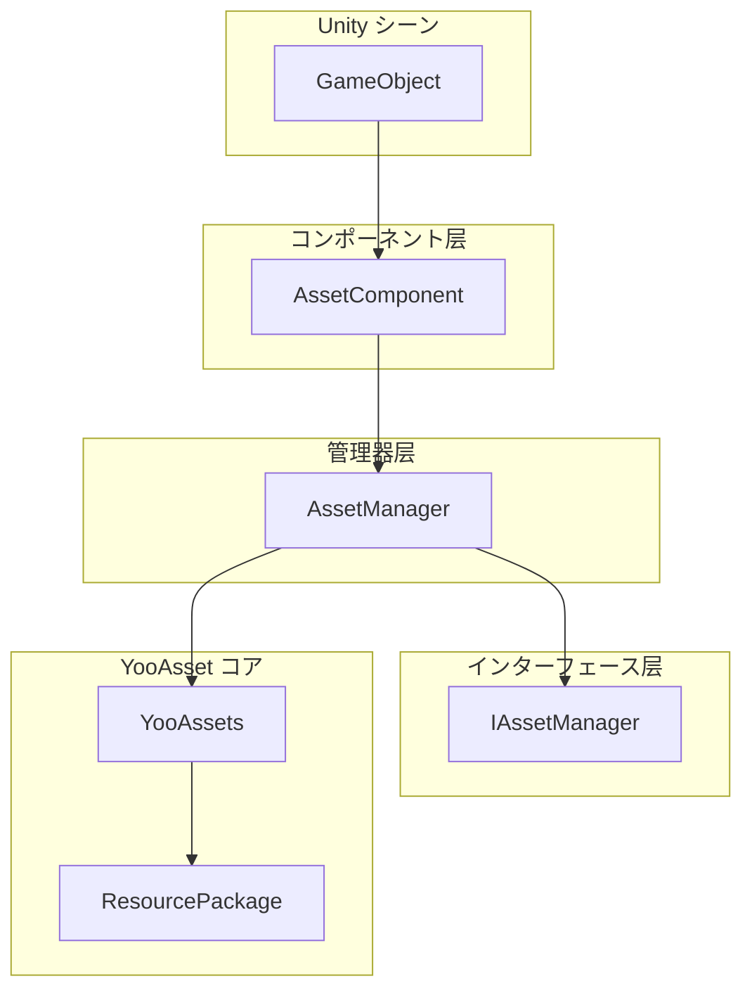
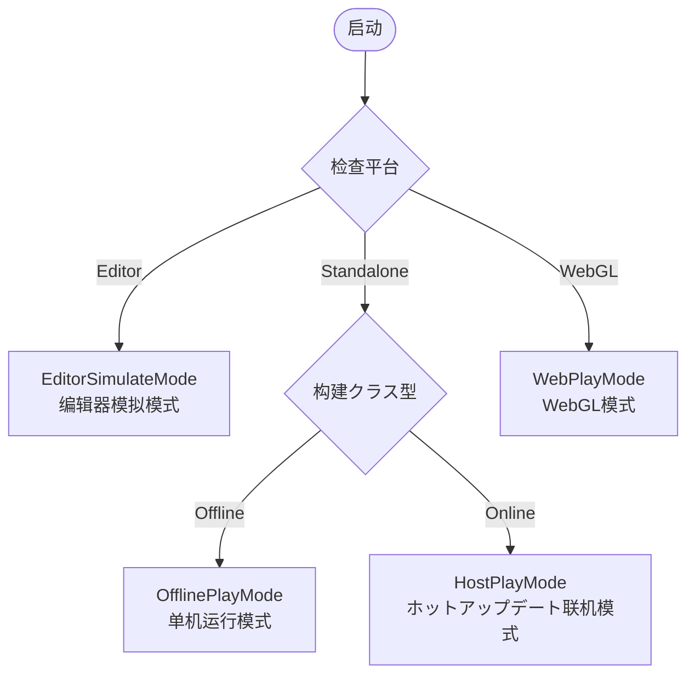

# 快速入门指南

本文档将帮助您快速上手 GameFrameX Asset リソースコンポーネント，了解如何在自己的 Unity プロジェクト中集成和使用该コンポーネント进行リソース管理。

## 概要

GameFrameX Asset 是基づく [YooAsset](https://yooasset.com/) 构建的 Unity リソース管理系统。它提供します统一的リソース加载インターフェース，サポート多种运行模式，包括编辑器模拟模式、单机运行模式、ホットアップデート联机模式和 WebGL 模式。该コンポーネント是 GameFrameX ゲームフレームワーク的コア模块之一，专门负责处理ゲームリソース的加载、卸载和ホットアップデートフロー。

 Asset コンポーネント的主要设计目标是简化リソース管理的复杂性，让開発者能够以更简洁的方法実装リソース的异步加载、同步加载、シーン切换以及ホットアップデート機能。を通じて封装 YooAsset 的底层 API，Asset コンポーネント提供します一套更加直观易用的インターフェース，同时保持了 YooAsset 强大的リソース管理能力。

## 系统架构

Asset コンポーネント采用分层アーキテクチャ設計，コア由三个主要部分组成：Unity コンポーネント层、管理器层和インターフェース层。这种分层设计确保了代码的可维护性和扩展性，同时提供します灵活的リソース管理能力。



**各层职责説明：**

**コンポーネント层（AssetComponent）** 是 Unity 的 MonoBehaviour コンポーネント，必要挂载到シーン中的 GameObject 上。它负责在ゲーム启动时初期化リソース管理系统，并に基づいて目标平台自动选择合适的运行模式。在 WebGL 平台上，コンポーネント会自动切换到 WebPlayMode，确保リソース能够正确从远程服务器加载。

**管理器层（AssetManager）** 是リソース管理的コア実装クラス，を継承 GameFrameworkModule。它封装了所有リソース操作，包括リソース的加载、卸载、パッケージ管理和清理等。AssetManager 提供します同步和异步两套加载インターフェース，满足不同シーン的需求。

**インターフェース层（IAssetManager）** 定义了リソース管理的标准インターフェース，确保了管理器実装的规范性。を通じてインターフェース抽象，可能方便地进行单元测试和模块替换。

## コアコンセプト

### 运行模式（PlayMode）

Asset コンポーネントサポート四种运行模式，每种模式适に使用不同的开发和部署シーン：



**EditorSimulateMode（编辑器模拟模式）** 主要に使用开发阶段。在这种模式下，リソース直接从 Unity 编辑器的リソースファイル夹中加载，无需进行リソース打包。这种模式可能大幅缩短开发迭代周期，让開発者能够快速测试リソース加载機能。必要注意的是，在非编辑器环境下运行时，如果設定为此模式，系统会自动切换到 HostPlayMode。

**OfflinePlayMode（单机运行模式）** 适に使用不必要ホットアップデート的单机ゲーム或内测阶段。在这种模式下，所有リソース都从内置リソース包（Buildin）中加载，不涉及远程リソースダウンロード。リソース打包后内置到安装包中，玩家无需联网即可运行ゲーム。

**HostPlayMode（ホットアップデート联机模式）** 是最常用的生产模式，适に使用必要持续更新的网络ゲーム。リソース分为内置リソース和远程リソース两部分：内置リソース随应用包一起分发，远程リソース从ホットアップデート服务器按需ダウンロード。这种模式サポートリソース的动态更新，无需重新发布应用即可更新ゲーム内容。

**WebPlayMode（WebGL 模式）** 专门针对 WebGL 平台优化。由于浏览器安全限制和加载性能考虑，WebGL 平台必要使用特殊的リソース加载方法。Asset コンポーネント会自动检测 WebGL 平台并切换到此模式，同时サポート字节小ゲーム、微信小ゲーム和快手小ゲーム等平台。

### リソース包（ResourcePackage）

リソース包是组织和管理リソース的基本单元。每个リソース包都有独立的名称，可能配置不同的リソース服务器地址。系统サポート作成多个リソース包，に使用分离不同クラス型的リソース，例如主リソース包、DLC リソース包或语言リソース包等。默认リソース包名称为 "DefaultPackage"，系统会自动作成并設定为默认包。

### リソース句柄（AssetHandle）

リソース句柄是加载リソース的返回值封装クラス。を通じて句柄对象可能访问加载的リソース，并且在不再必要时呼び出し Release メソッド释放リソース。系统提供多种クラス型的句柄：AssetHandle に使用普通リソース、SubAssetsHandle に使用子リソース、AllAssetsHandle に使用加载所有リソース、SceneHandle に使用シーン加载、RawFileHandle に使用原生ファイル。

## 快速开始フロー

要在プロジェクト中使用 Asset コンポーネント，必要完成以下几个关键手順：

### 第一步：安装コンポーネント

首先必要将 Asset コンポーネント安装到您的 Unity プロジェクト中。安装方法お願いします参阅 [安装方法](./2-installation.index) 文档。インストール完了後，确保プロジェクト中已经包含 GameFrameX コアフレームワーク和其他必要的依赖。

### 第二步：添加コンポーネント到シーン

在 Unity 编辑器中，作成一个新的 GameObject（或者使用现有的ゲーム对象），然后を通じて菜单 "Component" -> "GameFrameX" -> "Asset" 添加 AssetComponent コンポーネント。添加コンポーネント后，在 Inspector 面板中可能配置运行模式和其他参数。

```csharp
// コンポーネント添加后的 Unity シーン层级结构示例
// GameObject (Root)
// └── Asset (添加了 AssetComponent コンポーネント)
```

> Source: [AssetComponent.cs](https://github.com/GameFrameX/com.gameframex.unity.asset/blob/main/Runtime/Asset/AssetComponent.cs#L18-L35)

### 第三步：配置运行模式

在 Inspector 面板中，に基づいて您的开发阶段和发布目标选择合适的运行模式：

- **开发阶段**：选择 EditorSimulateMode，可能直接从编辑器加载リソース
- **单机测试**：选择 OfflinePlayMode，模拟单机环境
- **ホットアップデート测试**：选择 HostPlayMode，测试完整的ホットアップデートフロー
- **WebGL 发布**：在 WebGL 平台下会自动切换到 WebPlayMode

```csharp
// 在代码中也可能动态設定运行模式
var assetComponent = gameObject.GetComponent<AssetComponent>();
assetComponent.GamePlayMode = EPlayMode.HostPlayMode;
```

> Source: [AssetComponent.cs](https://github.com/GameFrameX/com.gameframex.unity.asset/blob/main/Runtime/Asset/AssetComponent.cs#L20-L31)

### 第四步：初期化リソース包

对于必要ホットアップデート的シーン，必要初期化リソース包并配置远程服务器地址。这一步通常在ゲーム启动时或リソース更新フロー中执行。

```csharp
// 初期化默认リソース包
var assetComponent = gameObject.GetComponent<AssetComponent>();
bool success = await assetComponent.InitPackageAsync(
    "DefaultPackage",           // リソース包名称
    "https://your-server.com/", // 主服务器地址
    "https://backup-server.com/", // 备用服务器地址
    true                        // 是否设为默认包
);

if (success)
{
    Debug.Log("リソース包初期化成功");
}
```

> Source: [AssetComponent.cs](https://github.com/GameFrameX/com.gameframex.unity.asset/blob/main/Runtime/Asset/AssetComponent.cs#L80-L95)

### 第五步：加载リソース

初期化完成后，就可能使用コンポーネント提供的インターフェース加载リソース了。系统同时サポート同步和异步两种加载方法：

```csharp
// 异步加载リソース示例
var assetComponent = gameObject.GetComponent<AssetComponent>();
var handle = await assetComponent.LoadAssetAsync<Sprite>("UI/Icons/PlayerIcon");
var sprite = handle.AssetObject as Sprite;

// 使用完毕后释放リソース
handle.Release();
```

> Source: [AssetComponent.cs](https://github.com/GameFrameX/com.gameframex.unity.asset/blob/main/Runtime/Asset/AssetComponent.cs#L258-L261)

## リソース加载方法详解

Asset コンポーネント提供します丰富的リソース加载インターフェース，可能满足各种不同的加载需求。

### 异步加载

异步加载是推荐的主要加载方法，特别适に使用必要加载大量リソース的シーン。异步加载不会阻塞主线程，能够保持ゲーム流畅运行。所有异步メソッド都返回 Task 对象，サポート await 语法：

```csharp
// 异步加载普通リソース
var handle = await assetComponent.LoadAssetAsync<GameObject>("Prefabs/Player");

// 异步加载带クラス型的リソース
var handle = await assetComponent.LoadAssetAsync<Sprite>("UI/Background");

// 异步加载多个リソース
var allAssetsHandle = await assetComponent.LoadAllAssetsAsync<GameObject>("Prefabs/Enemies");

// 异步加载シーン
var sceneHandle = await assetComponent.LoadSceneAsync("Scenes/GameLevel", LoadSceneMode.Single);
```

> Source: [AssetManager.cs](https://github.com/GameFrameX/com.gameframex.unity.asset/blob/main/Runtime/Asset/AssetManager.cs#L469-L481)

### 同步加载

同步加载适に使用对加载时间要求不高、但必要立即取得リソース的シーン。由于同步加载会阻塞主线程，在加载大型リソース时可能会造成卡顿，建议仅在必要时使用：

```csharp
// 同步加载リソース
var handle = assetComponent.LoadAssetSync<GameObject>("Prefabs/Player");
var player = handle.AssetObject as GameObject;
```

> Source: [AssetManager.cs](https://github.com/GameFrameX/com.gameframex.unity.asset/blob/main/Runtime/Asset/AssetManager.cs#L603-L606)

### 子リソース加载

子リソース加载に使用处理一个リソースファイル包含多个子リソース的情况，例如 Sprite Atlas 或模型ファイル内の多个子对象：

```csharp
// 加载 Sprite Atlas 中的所有子图
var handle = await assetComponent.LoadSubAssetsAsync<Sprite>("Atlas/UIAtlas");
foreach (var sprite in handle.AssetObject)
{
    Debug.Log($"Sprite 名称: {sprite.name}");
}
handle.Release();
```

> Source: [AssetManager.cs](https://github.com/GameFrameX/com.gameframex.unity.asset/blob/main/Runtime/Asset/AssetManager.cs#L244-L250)

### 原生ファイル加载

如果必要加载非 Unity リソースクラス型的ファイル（如配置ファイル、文本ファイル等），可能使用原生ファイル加载インターフェース：

```csharp
// 异步加载原生ファイル
var rawHandle = await assetComponent.LoadRawFileAsync("Config/GameConfig.json");
byte[] data = rawHandle.ReadRawFile();
rawHandle.Release();
```

> Source: [AssetManager.cs](https://github.com/GameFrameX/com.gameframex.unity.asset/blob/main/Runtime/Asset/AssetManager.cs#L314-L320)

## リソース管理最佳实践

### 及时释放リソース

不再使用的リソース应当及时释放，以释放内存空间。可能使用リソース句柄的 Release メソッド进行释放：

```csharp
// 加载并使用リソース
var handle = await assetComponent.LoadAssetAsync<GameObject>("Prefabs/Player");
var player = Instantiate(handle.AssetObject as GameObject);

// 使用完毕后释放句柄（注意：リソースインスタンス不会被销毁）
handle.Release();

// 如果必要完全清理，包括リソースインスタンス
Destroy(player);
```

> Source: [AssetComponent.cs](https://github.com/GameFrameX/com.gameframex.unity.asset/blob/main/Runtime/Asset/AssetComponent.cs#L622-L628)

### 批量卸载无用リソース

ゲーム运行一段时间后，可能会积累大量不再使用的リソース。可能使用清理機能释放这些リソース：

```csharp
// 卸载未被引用的リソース
assetComponent.UnloadUnusedAssetsAsync();

// 清理未使用的リソース包ファイル（可释放存储空间）
assetComponent.ClearUnusedBundleFilesAsync();
```

> Source: [AssetComponent.cs](https://github.com/GameFrameX/com.gameframex.unity.asset/blob/main/Runtime/Asset/AssetComponent.cs#L635-L658)

### 使用リソース包进行リソース隔离

对于大型プロジェクト，建议使用多个リソース包来组织不同クラス型的リソース。这样可能実装リソース的按需加载和更新：

```csharp
// 作成额外的リソース包
var dlcPackage = assetComponent.CreateAssetsPackage("DLC_Package");

// 取得已存在的リソース包
var package = assetComponent.TryGetAssetsPackage("DefaultPackage");

// 設定默认リソース包
assetComponent.SetDefaultAssetsPackage(package);
```

> Source: [AssetComponent.cs](https://github.com/GameFrameX/com.gameframex.unity.asset/blob/main/Runtime/Asset/AssetComponent.cs#L471-L507)

## 下一步

现在您已经了解了 Asset コンポーネント的基本使用メソッド，可能继续深入学习以下の内容：

- **[首个示例](./3-getting-started.first-steps)**：を通じて完整的代码示例深入学习リソース加载的具体実装
- **[アーキテクチャ設計](./4-core-concepts.architecture)**：了解コンポーネント的详细アーキテクチャ設計和模块划分
- **[リソース加载インターフェース](./5-api-reference.loading-api)**：查阅完整的 API インターフェース文档
- **[运行模式](./6-configuration.play-modes)**：详细了解各种运行模式的配置和使用シーン

## 関連リンク

- [Asset リソースコンポーネント介绍](./1-overview.introduction)
- [機能特性](./1-overview.features)
- [サポート的 Unity 版本](./1-overview.supported-versions)
- [安装方法](./2-installation.index)
- [依赖要求](./2-installation.dependencies)
- [首个示例](./3-getting-started.first-steps)
- [アーキテクチャ設計](./4-core-concepts.architecture)
- [リソースコンポーネント](./4-core-concepts.asset-component)
- [リソース管理器](./4-core-concepts.asset-manager)
