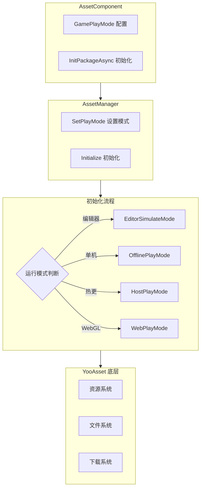

# 機能特性

Asset リソースコンポーネント是 GameFrameX フレームワーク的コアモジュール之一，基于 YooAsset カプセル化ビルド，提供統一された的リソースロード、管理和アップデート能力。该コンポーネント将複雑的リソース管理操作簡素化为直观的 API インターフェース，使開発者能够効率的地进行リソースロード、シーン切换和リソースパッケージ管理。

## 概要

Asset リソースコンポーネント旨在解决 Unity プロジェクト中的リソース管理痛点，含みますリソースロード方法不一致、リソースアップデート困难、多プラットフォーム适配複雑等問題。通过提供統一された的インターフェース抽象和多种运行モードサポート，開発者〜できます在不同的开发和デプロイシーン下柔軟使用同一套コード。コンポーネントサポート从シンプル的オフラインゲーム到複雑的ホットアップデート游戏的各种需求，无论是エディタ下的快速迭代还是本番環境的ホットアップデートデプロイ，都能提供完善的解決策。

该コンポーネント的コア价值在于将底层リソース管理フレームワーク（YooAsset）的複雑機能进行カプセル化，同時に保留其強力的能力。開発者无需理解する底层実装细节，只需通过シンプル的 API 呼び出しつまり可完成リソースロード、シーン切换等操作。此外，コンポーネント还提供します完全な的イベント系统，使開発者能够实时监控リソース下载進捗、ステータス变化等关键情報，从而実装更好的ユーザー体验。

## コア機能特性

### マルチモード動作サポート

Asset コンポーネントサポート四种不同的运行モード，每种モード针对特定的使用シーン进行最適化。这种設計使得同一套コード〜できます在不同的开发和デプロイ環境中无缝切换，无需変更业务逻辑コード。

**エディタ模拟モード（EditorSimulateMode）** 適しています开发フェーズ的快速迭代。在此モード下，リソース直接从 Unity エディタ的工程ディレクトリ中ロード，无需进行任何打パッケージ操作。这极大地加快了开发速度，因为開発者〜できます在変更リソース后立つまり看到效果，无需等待リソース打パッケージ完成。该モード仅在 Unity エディタ環境下有效，打パッケージリリース时会自动切换到其他モード。

**离线运行モード（OfflinePlayMode）** 適していますオフラインゲーム或不〜する必要がありますホットアップデート的シーン。在此モード下，所有リソース都从内置リソースパッケージ（Buildin）中ロード，不涉及任何网络请求。リソース随应用一起分发，无需额外的下载ステップ。这种モード最适合独立游戏开发或〜する必要があります严格控制リソース分发方法的シーン。

**联机运行モード（HostPlayMode）** 適しています〜する必要がありますホットアップデート機能的游戏。在此モード下，リソース分为两部分：内置リソースパッケージ用于存储初始リソース，远程服务器用于存储ホットアップデートリソース。コンポーネント会自动检测并下载〜する必要がありますアップデート的リソース，サポート断点续传和バージョン管理。这种モード是现代手游的标配，允许開発者在游戏リリース后继续アップデート内容。

**WebGL 运行モード（WebPlayMode）** 专门针对 WebGL プラットフォーム最適化。该モード针对浏览器環境的特殊性进行了适配，サポート各种 Web ミニゲームプラットフォーム（如WeChatミニゲーム、DouYinミニゲーム、KuaiShouミニゲーム等）。コンポーネント会自动检测目标プラットフォーム并选择合适的ファイル系统パラメータ，確認してくださいリソース能够正确ロード。



### 統一されたリソースロードインターフェース

Asset コンポーネント提供します丰富的リソースロードインターフェース，涵盖各种使用シーン。所有ロードインターフェース都サポートジェネリックバージョン，能够自动推断リソースタイプ，减少タイプ转换的麻烦。

**非同期ロード** 是推奨的主なロード方法，特别适合〜する必要がありますロード多个リソース或リソース较大的シーン。非同期ロード不会阻塞主线程，能够保持界面的流畅响应。コンポーネント将 YooAsset 的コールバック式 API 转换为 Task 式的异步インターフェース，使コード更加シンプル易读，サポート async/await 语法糖。

```csharp
// 异步加载资源
var handle = await assetComponent.LoadAssetAsync<Texture2D>("Textures/Background");
var texture = handle.AssetObject as Texture2D;

// 异步加载所有资源
var allHandle = await assetComponent.LoadAllAssetsAsync<GameObject>("Prefabs/Enemies");
foreach (var obj in allHandle.AllAssetObjects)
{
    // 处理每个资源
}

// 异步加载场景
await assetComponent.LoadSceneAsync("Scenes/GameLevel", LoadSceneMode.Single);
```

> Source: [AssetComponent.cs](https://github.com/GameFrameX/com.gameframex.unity.asset/blob/main/Runtime/Asset/AssetComponent.cs#L258-L261)

**同期ロード** 適しています对ロード时间有严格要求的シーン，如〜する必要があります立つまり显示的リソース。同期ロード会阻塞呼び出し线程，〜の可能性があります导致界面卡顿，因此お勧め仅在必要时使用，かつ避免在主线程中ロード大型リソース。

```csharp
// 同步加载资源
var handle = assetComponent.LoadAssetSync<AudioClip>("Audio/BGM");
var audio = handle.AssetObject as AudioClip;
```

> Source: [AssetComponent.cs](https://github.com/GameFrameX/com.gameframex.unity.asset/blob/main/Runtime/Asset/AssetComponent.cs#L426-L429)

**子リソースロード** 用于処理带有サブリソース的リソース，如 SpriteAtlas（パッケージ含多个 Sprite）。这使得開発者〜できます一次性ロード整个图集，次に按需取得其中的单个精灵。

```csharp
// 加载子资源
var handle = await assetComponent.LoadSubAssetsAsync<Sprite>("UI/Atlas/MainUI");
foreach (var sprite in handle.SubAssetObjects)
{
    // 处理每个子资源
}
```

> Source: [AssetComponent.cs](https://github.com/GameFrameX/com.gameframex.unity.asset/blob/main/Runtime/Asset/AssetComponent.cs#L128-L131)

**ネイティブファイルロード** 用于ロード非 Unity リソースフォーマット的ファイル，如設定ファイル、文本ファイル、二进制数据等。ロード后的数据以字节数组形式返す，開発者〜できます自行解析。

```csharp
// 加载原生文件
var handle = await assetComponent.LoadRawFileAsync("Config/GameConfig.json");
var data = handle.RawFileData;
var json = System.Text.Encoding.UTF8.GetString(data);
```

> Source: [AssetComponent.cs](https://github.com/GameFrameX/com.gameframex.unity.asset/blob/main/Runtime/Asset/AssetComponent.cs#L192-L195)

### リソースパッケージ管理

リソースパッケージ（ResourcePackage）是组织和管理リソース的基本单元。Asset コンポーネントサポート作成多个独立的リソースパッケージ，使開発者能够按機能モジュール或ロード策略划分リソース。

**作成リソースパッケージ** 允许開発者作成新的リソースパッケージ来管理特定类别的リソース。每个リソースパッケージ有独立的初期化パラメータ和リソース集合，適しています〜する必要があります按需ロード不同リソース集的シーン。

```csharp
// 创建资源包
var package = assetComponent.CreateAssetsPackage("DLC_Package");
```

> Source: [AssetComponent.cs](https://github.com/GameFrameX/com.gameframex.unity.asset/blob/main/Runtime/Asset/AssetComponent.cs#L471-L474)

**取得和確認リソースパッケージ** 提供します多种方法来查询已存在的リソースパッケージ。〜できます根据名称取得リソースパッケージインスタンス，也〜できます確認某个名称的リソースパッケージ是否存在。

```csharp
// 检查资源包是否存在
if (assetComponent.HasAssetsPackage("DLC_Package"))
{
    var package = assetComponent.GetAssetsPackage("DLC_Package");
}
```

> Source: [AssetComponent.cs](https://github.com/GameFrameX/com.gameframex.unity.asset/blob/main/Runtime/Asset/AssetComponent.cs#L493-L506)

**設定デフォルトリソースパッケージ** 〜できます指定デフォルト的リソースパッケージ，后续的リソースロード操作将デフォルト使用该リソースパッケージ。这簡素化了リソースロード的コード，无需每次都指定リソースパッケージ名称。

```csharp
// 设置默认资源包
assetComponent.SetDefaultAssetsPackage(package);
```

> Source: [AssetComponent.cs](https://github.com/GameFrameX/com.gameframex.unity.asset/blob/main/Runtime/Asset/AssetComponent.cs#L581-L584)

### リソース照会と検証

コンポーネント提供します完善的リソース查询機能，帮助開発者在ロードリソース前理解するリソース的相关情報。

**取得リソース情報** 〜できます根据リソース的标签或路径取得リソース的元数据。这些情報含みますリソース的依赖关系、所在リソースパッケージ、ロード方法等，对于実装更複雑的リソース管理策略非常有用。

```csharp
// 根据标签获取资源信息
var infos = assetComponent.GetAssetInfos("UI");
// 根据路径获取单个资源信息
var info = assetComponent.GetAssetInfo("Prefabs/Player");
```

> Source: [AssetComponent.cs](https://github.com/GameFrameX/com.gameframex.unity.asset/blob/main/Runtime/Asset/AssetComponent.cs#L550-L562)

**確認リソースパス** 検証指定的リソースパス是否有效，避免ロード不存在的リソース导致エラー。

```csharp
// 检查资源路径是否存在
if (assetComponent.HasAssetPath("Prefabs/Enemy"))
{
    // 资源存在，可以安全加载
}
```

> Source: [AssetComponent.cs](https://github.com/GameFrameX/com.gameframex.unity.asset/blob/main/Runtime/Asset/AssetComponent.cs#L570-L573)

**確認是否〜する必要があります下载** 在联机运行モード下，〜できます確認某个リソース是否〜する必要があります从远程服务器下载。这对于実装预下载機能或显示下载進捗非常有帮助。

```csharp
// 检查是否需要下载
if (assetComponent.IsNeedDownload("Textures/HighRes/Detail"))
{
    // 该资源需要从远程下载
}
```

> Source: [AssetComponent.cs](https://github.com/GameFrameX/com.gameframex.unity.asset/blob/main/Runtime/Asset/AssetComponent.cs#L528-L531)

### リソースのアンロード与清理

合理的リソース管理不仅含みますロード，还含みます及时的アンロード和清理，以解放内存并最適化性能。

**アンロード指定リソース** 解放特定リソース的内存占用。当某个リソース不再〜する必要があります时，应当及时アンロード以解放内存。

```csharp
// 卸载指定资源
assetComponent.UnloadAsset("Prefabs/Enemy");
// 指定资源包卸载
assetComponent.UnloadAsset("DLC_Package", "Prefabs/Boss");
```

> Source: [AssetComponent.cs](https://github.com/GameFrameX/com.gameframex.unity.asset/blob/main/Runtime/Asset/AssetComponent.cs#L612-L615)

**アンロード未使用リソース** 扫描并アンロード所有未被参照的リソース。这通常在切换シーン或进入新的游戏フェーズ时呼び出し，以清理不再〜する必要があります的リソース。

```csharp
// 卸载未使用资源
assetComponent.UnloadUnusedAssetsAsync();
```

> Source: [AssetComponent.cs](https://github.com/GameFrameX/com.gameframex.unity.asset/blob/main/Runtime/Asset/AssetComponent.cs#L635-L638)

**清理リソースファイル** 不仅解放内存，还削除缓存的下载ファイル。这在〜する必要があります解放磁盘空间或重置リソース缓存时使用。

```csharp
// 清理无用资源文件
assetComponent.ClearUnusedBundleFilesAsync();
// 清理所有资源文件
assetComponent.ClearAllBundleFilesAsync();
```

> Source: [AssetComponent.cs](https://github.com/GameFrameX/com.gameframex.unity.asset/blob/main/Runtime/Asset/AssetComponent.cs#L645-L658)

### アップデートイベント系统

Asset コンポーネント実装了完全な的イベント系统，使開発者能够实时监控リソース管理的各个フェーズ。这对于実装ロード界面、アップデートヒント等機能至关重要な。

**下载進捗アップデートイベント** 在リソース下载过程中持续トリガー，提供当前的下载進捗情報。イベントパラメータパッケージ含总ファイル数、已下载ファイル数、总大小和已下载大小，開発者〜できます据此计算百分比并显示進捗条。

```csharp
// 订阅下载进度更新事件
EventComponent.Subscribe<AssetDownloadProgressUpdateEventArgs>(OnDownloadProgress);

private void OnDownloadProgress(object sender, AssetDownloadProgressUpdateEventArgs e)
{
    var progress = (float)e.CurrentDownloadSizeBytes / e.TotalDownloadSizeBytes;
    Debug.Log($"下载进度: {progress * 100}%");
}
```

> Source: [AssetDownloadProgressUpdateEventArgs.cs](https://github.com/GameFrameX/com.gameframex.unity.asset/blob/main/Runtime/Update/EventArgs/AssetDownloadProgressUpdateEventArgs.cs#L66-L68)

**发现アップデートファイルイベント** 在检测到〜する必要がありますアップデート的リソースファイル时トリガー。此时〜できます向ユーザー显示アップデート内容摘要，并询问是否开始下载。

**リソースパッケージステータス变更イベント** 在リソース初期化フロー的各个フェーズトリガー，含みます准备フェーズ、バージョン检测フェーズ、清单アップデートフェーズ、リソース探测フェーズ和完成フェーズ。

```csharp
// 订阅状态变更事件
EventComponent.Subscribe<AssetPatchStatesChangeEventArgs>(OnPatchStatesChange);

private void OnPatchStatesChange(object sender, AssetPatchStatesChangeEventArgs e)
{
    Debug.Log($"当前状态: {e.CurrentStates}");
}
```

> Source: [AssetPatchStatesChangeEventArgs.cs](https://github.com/GameFrameX/com.gameframex.unity.asset/blob/main/Runtime/Update/EventArgs/AssetPatchStatesChangeEventArgs.cs#L41-L42)

**エラー処理イベント** 含みます补丁清单アップデート失敗、静态バージョンアップデート失敗、网络ファイル下载失敗等イベント，使開発者能够针对不同タイプ的エラー进行相应的処理。

```csharp
// 订阅下载失败事件
EventComponent.Subscribe<AssetWebFileDownloadFailedEventArgs>(OnDownloadFailed);

private void OnDownloadFailed(object sender, AssetWebFileDownloadFailedEventArgs e)
{
    Debug.LogError($"文件下载失败: {e.FileName}, 错误: {e.Error}");
}
```

> Source: [AssetWebFileDownloadFailedEventArgs.cs](https://github.com/GameFrameX/com.gameframex.unity.asset/blob/main/Runtime/Update/EventArgs/AssetWebFileDownloadFailedEventArgs.cs#L51-L53)

## プラットフォームサポート

Asset コンポーネント针对不同的目标プラットフォーム提供します专门的最適化サポート，確認してください在各种環境下都能正常工作。

**Unity エディタ** 提供完全な的开发サポート，含みます模拟运行モード、リソース预览和デバッグ機能。開発者〜できます在エディタ中快速テスト和迭代リソース管理逻辑。

**PC プラットフォーム**（Windows、Mac、Linux）サポート所有运行モード，含みます联机モード的ホットアップデート機能。由于磁盘和网络条件通常较好，リソースロード体验流畅。

**モバイルプラットフォーム**（iOS、Android）是コンポーネント的主な目标プラットフォーム，サポート完全な的ホットアップデート能力。コンポーネント针对移动网络的不稳定性进行了最適化，サポート断点续传和失敗重试。

**WebGL プラットフォーム** 具有专门的运行モード，针对浏览器環境进行了最適化。コンポーネントサポート主流的 Web ミニゲームプラットフォーム，含みますWeChatミニゲーム、DouYinミニゲーム和KuaiShouミニゲーム。

```mermaid
flowchart LR
    subgraph Platforms["支持的平台"]
        P1[Unity 编辑器]
        P2[PC (Win/Mac/Linux)]
        P3[移动端 (iOS/Android)]
        P4[WebGL]
        P5[小游戏平台]
    end
    
    subgraph Modes["支持的运行模式"]
        M1[EditorSimulateMode]
        M2[OfflinePlayMode]
        M3[HostPlayMode]
        M4[WebPlayMode]
    end
    
    P1 -->|EditorSimulateMode| M1
    P2 -->|OfflinePlayMode| M2
    P2 -->|HostPlayMode| M3
    P3 -->|OfflinePlayMode| M2
    P3 -->|HostPlayMode| M3
    P4 -->|WebPlayMode| M4
    P5 -->|WebPlayMode| M4
```

## 設定オプション

Asset コンポーネント提供多种設定オプション，允许開発者根据プロジェクト需求调整行为。

| 設定项 | タイプ | デフォルト值 | 説明 |
|--------|------|--------|------|
| GamePlayMode | EPlayMode | EditorSimulateMode | リソース运行モード |
| DownloadingMaxNum | int | 10 | 同時に下载的最大ファイル数 |
| FailedTryAgain | int | 3 | 下载失敗后的重试次数 |
| VerifyLevel | EFileVerifyLevel | Normal | 下载ファイル校验等级 |
| Milliseconds | long | 30 | 异步系统每帧执行的最大时间切片（毫秒） |
| ReadOnlyPath | string | - | リソース只读区路径 |
| ReadWritePath | string | - | リソース读写区路径 |

> Source: [IAssetManager.cs](https://github.com/GameFrameX/com.gameframex.unity.asset/blob/main/Runtime/Asset/IAssetManager.cs#L18-L75)

## 関連リンク

- [Asset リソースコンポーネント介绍](./1-overview.introduction)
- [アーキテクチャ設計](./4-core-concepts.architecture)
- [リソースコンポーネント](./4-core-concepts.asset-component)
- [リソースマネージャー](./4-core-concepts.asset-manager)
- [运行モード](./6-configuration.play-modes)
- [リソースロードインターフェース](./5-api-reference.loading-api)
- [リソースパッケージ管理](./5-api-reference.package-management)
- [アップデートイベント](./5-api-reference.update-events)
