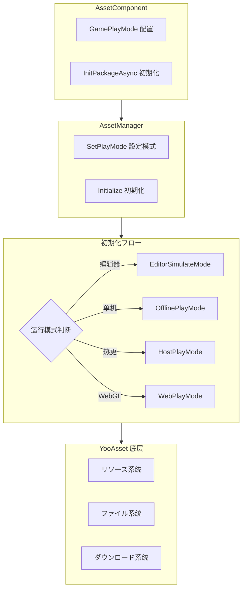

# 機能特性

Asset リソースコンポーネント是 GameFrameX フレームワーク的コア模块之一，基づく YooAsset 封装构建，提供统一的リソース加载、管理和更新能力。该コンポーネント将复杂的リソース管理操作简化为直观的 API インターフェース，使開発者能够高效地进行リソース加载、シーン切换和リソースパッケージ管理。

## 概要

Asset リソースコンポーネント旨在解决 Unity プロジェクト中的リソース管理痛点，包括リソース加载方法不一致、リソース更新困难、多平台适配复杂等问题。を通じて提供统一的インターフェース抽象和多种运行模式サポート，開発者可能在不同的开发和部署シーン下灵活使用同一套代码。コンポーネントサポート从简单的单机ゲーム到复杂的ホットアップデートゲーム的各种需求，无论是编辑器下的快速迭代还是生产环境的ホットアップデート部署，都能提供完善的解決策。

该コンポーネント的コア价值在于将底层リソース管理フレームワーク（YooAsset）的复杂機能进行封装，同时保留其强大的能力。開発者无需了解底层実装细节，只需を通じて简单的 API 呼び出し即可完成リソース加载、シーン切换等操作。此外，コンポーネント还提供します完整的イベント系统，使開発者能够实时监控リソースダウンロード进度、ステータス变化等关键信息，从而実装更好的用户体验。

## コア機能特性

### 多模式运行サポート

Asset コンポーネントサポート四种不同的运行模式，每种模式针对特定的使用シーン进行优化。这种设计使得同一套代码可能在不同的开发和部署环境中无缝切换，无需修改业务逻辑代码。

**编辑器模拟模式（EditorSimulateMode）** 适に使用开发阶段的快速迭代。在此模式下，リソース直接从 Unity 编辑器的工程ディレクトリ中加载，无需进行任何打包操作。这极大地加快了开发速度，因为開発者可能在修改リソース后立即看到效果，无需等待リソース打包完成。该模式仅在 Unity 编辑器环境下有效，打包发布时会自动切换到其他模式。

**离线运行模式（OfflinePlayMode）** 适に使用单机ゲーム或不必要ホットアップデート的シーン。在此模式下，所有リソース都从内置リソース包（Buildin）中加载，不涉及任何网络お願いします求。リソース随应用一起分发，无需额外的ダウンロード手順。这种模式最适合独立ゲーム开发或必要严格控制リソース分发方法的シーン。

**联机运行模式（HostPlayMode）** 适に使用必要ホットアップデート機能的ゲーム。在此模式下，リソース分为两部分：内置リソース包に使用存储初始リソース，远程服务器に使用存储ホットアップデートリソース。コンポーネント会自动检测并ダウンロード必要更新的リソース，サポート断点续传和版本管理。这种模式是现代手游的标配，允许開発者在ゲーム发布后继续更新内容。

**WebGL 运行模式（WebPlayMode）** 专门针对 WebGL 平台优化。该模式针对浏览器环境的特殊性进行了适配，サポート各种 Web 小ゲーム平台（如微信小ゲーム、抖音小ゲーム、快手小ゲーム等）。コンポーネント会自动检测目标平台并选择合适的ファイル系统参数，确保リソース能够正确加载。



### 统一的リソース加载インターフェース

Asset コンポーネント提供します丰富的リソース加载インターフェース，涵盖各种使用シーン。所有加载インターフェース都サポート泛型版本，能够自动推断リソースクラス型，减少クラス型转换的麻烦。

**异步加载** 是推荐的主要加载方法，特别适合必要加载多个リソース或リソース较大的シーン。异步加载不会阻塞主线程，能够保持界面的流畅响应。コンポーネント将 YooAsset 的回调式 API 转换为 Task 式的异步インターフェース，使代码更加简洁易读，サポート async/await 语法糖。

```csharp
// 异步加载リソース
var handle = await assetComponent.LoadAssetAsync<Texture2D>("Textures/Background");
var texture = handle.AssetObject as Texture2D;

// 异步加载所有リソース
var allHandle = await assetComponent.LoadAllAssetsAsync<GameObject>("Prefabs/Enemies");
foreach (var obj in allHandle.AllAssetObjects)
{
    // 处理每个リソース
}

// 异步加载シーン
await assetComponent.LoadSceneAsync("Scenes/GameLevel", LoadSceneMode.Single);
```

> Source: [AssetComponent.cs](https://github.com/GameFrameX/com.gameframex.unity.asset/blob/main/Runtime/Asset/AssetComponent.cs#L258-L261)

**同步加载** 适に使用对加载时间有严格要求的シーン，如必要立即显示的リソース。同步加载会阻塞呼び出し线程，可能导致界面卡顿，因此建议仅在必要时使用，并且避免在主线程中加载大型リソース。

```csharp
// 同步加载リソース
var handle = assetComponent.LoadAssetSync<AudioClip>("Audio/BGM");
var audio = handle.AssetObject as AudioClip;
```

> Source: [AssetComponent.cs](https://github.com/GameFrameX/com.gameframex.unity.asset/blob/main/Runtime/Asset/AssetComponent.cs#L426-L429)

**子リソース加载** に使用处理带有子リソース的リソース，如 SpriteAtlas（包含多个 Sprite）。这使得開発者可能一次性加载整个图集，然后按需取得其中的单个精灵。

```csharp
// 加载子リソース
var handle = await assetComponent.LoadSubAssetsAsync<Sprite>("UI/Atlas/MainUI");
foreach (var sprite in handle.SubAssetObjects)
{
    // 处理每个子リソース
}
```

> Source: [AssetComponent.cs](https://github.com/GameFrameX/com.gameframex.unity.asset/blob/main/Runtime/Asset/AssetComponent.cs#L128-L131)

**原生ファイル加载** に使用加载非 Unity リソース格式的ファイル，如配置ファイル、文本ファイル、二进制数据等。加载后的数据以字节数组形式返回，開発者可能自行解析。

```csharp
// 加载原生ファイル
var handle = await assetComponent.LoadRawFileAsync("Config/GameConfig.json");
var data = handle.RawFileData;
var json = System.Text.Encoding.UTF8.GetString(data);
```

> Source: [AssetComponent.cs](https://github.com/GameFrameX/com.gameframex.unity.asset/blob/main/Runtime/Asset/AssetComponent.cs#L192-L195)

### リソースパッケージ管理

リソース包（ResourcePackage）是组织和管理リソース的基本单元。Asset コンポーネントサポート作成多个独立的リソース包，使開発者能够按機能模块或加载策略划分リソース。

**作成リソース包** 允许開発者作成新的リソース包来管理特定クラス别的リソース。每个リソース包有独立的初期化参数和リソース集合，适に使用必要按需加载不同リソース集的シーン。

```csharp
// 作成リソース包
var package = assetComponent.CreateAssetsPackage("DLC_Package");
```

> Source: [AssetComponent.cs](https://github.com/GameFrameX/com.gameframex.unity.asset/blob/main/Runtime/Asset/AssetComponent.cs#L471-L474)

**取得和检查リソース包** 提供します多种方法来查询已存在的リソース包。可能に基づいて名称取得リソース包インスタンス，也可能检查某个名称的リソース包是否存在。

```csharp
// 检查リソース包是否存在
if (assetComponent.HasAssetsPackage("DLC_Package"))
{
    var package = assetComponent.GetAssetsPackage("DLC_Package");
}
```

> Source: [AssetComponent.cs](https://github.com/GameFrameX/com.gameframex.unity.asset/blob/main/Runtime/Asset/AssetComponent.cs#L493-L506)

**設定默认リソース包** 可能指定默认的リソース包，后续的リソース加载操作将默认使用该リソース包。这简化了リソース加载的代码，无需每次都指定リソース包名称。

```csharp
// 設定默认リソース包
assetComponent.SetDefaultAssetsPackage(package);
```

> Source: [AssetComponent.cs](https://github.com/GameFrameX/com.gameframex.unity.asset/blob/main/Runtime/Asset/AssetComponent.cs#L581-L584)

### リソース查询与验证

コンポーネント提供します完善的リソース查询機能，帮助開発者在加载リソース前了解リソース的関連信息。

**取得リソース信息** 可能に基づいてリソース的标签或路径取得リソース的元数据。这些信息包括リソース的依赖关系、所在リソース包、加载方法等，对于実装更复杂的リソース管理策略非常有用。

```csharp
// に基づいて标签取得リソース信息
var infos = assetComponent.GetAssetInfos("UI");
// に基づいて路径取得单个リソース信息
var info = assetComponent.GetAssetInfo("Prefabs/Player");
```

> Source: [AssetComponent.cs](https://github.com/GameFrameX/com.gameframex.unity.asset/blob/main/Runtime/Asset/AssetComponent.cs#L550-L562)

**检查リソース路径** 验证指定的リソース路径是否有效，避免加载不存在的リソース导致错误。

```csharp
// 检查リソース路径是否存在
if (assetComponent.HasAssetPath("Prefabs/Enemy"))
{
    // リソース存在，可能安全加载
}
```

> Source: [AssetComponent.cs](https://github.com/GameFrameX/com.gameframex.unity.asset/blob/main/Runtime/Asset/AssetComponent.cs#L570-L573)

**检查是否必要ダウンロード** 在联机运行模式下，可能检查某个リソース是否必要从远程服务器ダウンロード。这对于実装预ダウンロード機能或显示ダウンロード进度非常有帮助。

```csharp
// 检查是否必要ダウンロード
if (assetComponent.IsNeedDownload("Textures/HighRes/Detail"))
{
    // 该リソース必要从远程ダウンロード
}
```

> Source: [AssetComponent.cs](https://github.com/GameFrameX/com.gameframex.unity.asset/blob/main/Runtime/Asset/AssetComponent.cs#L528-L531)

### リソース卸载与清理

合理的リソース管理不仅包括加载，还包括及时的卸载和清理，以释放内存并优化性能。

**卸载指定リソース** 释放特定リソース的内存占用。当某个リソース不再必要时，应当及时卸载以释放内存。

```csharp
// 卸载指定リソース
assetComponent.UnloadAsset("Prefabs/Enemy");
// 指定リソース包卸载
assetComponent.UnloadAsset("DLC_Package", "Prefabs/Boss");
```

> Source: [AssetComponent.cs](https://github.com/GameFrameX/com.gameframex.unity.asset/blob/main/Runtime/Asset/AssetComponent.cs#L612-L615)

**卸载未使用リソース** 扫描并卸载所有未被引用的リソース。这通常在切换シーン或进入新的ゲーム阶段时呼び出し，以清理不再必要的リソース。

```csharp
// 卸载未使用リソース
assetComponent.UnloadUnusedAssetsAsync();
```

> Source: [AssetComponent.cs](https://github.com/GameFrameX/com.gameframex.unity.asset/blob/main/Runtime/Asset/AssetComponent.cs#L635-L638)

**清理リソースファイル** 不仅释放内存，还删除缓存的ダウンロードファイル。这在必要释放磁盘空间或重置リソース缓存时使用。

```csharp
// 清理无用リソースファイル
assetComponent.ClearUnusedBundleFilesAsync();
// 清理所有リソースファイル
assetComponent.ClearAllBundleFilesAsync();
```

> Source: [AssetComponent.cs](https://github.com/GameFrameX/com.gameframex.unity.asset/blob/main/Runtime/Asset/AssetComponent.cs#L645-L658)

### 更新イベント系统

Asset コンポーネント実装了完整的イベント系统，使開発者能够实时监控リソース管理的各个阶段。这对于実装加载界面、更新ヒント等機能至关重要。

**ダウンロード进度更新イベント** 在リソースダウンロード过程中持续触发，提供当前的ダウンロード进度信息。イベント参数包含总ファイル数、已ダウンロードファイル数、总大小和已ダウンロード大小，開発者可能据此计算百分比并显示进度条。

```csharp
// 订阅ダウンロード进度更新イベント
EventComponent.Subscribe<AssetDownloadProgressUpdateEventArgs>(OnDownloadProgress);

private void OnDownloadProgress(object sender, AssetDownloadProgressUpdateEventArgs e)
{
    var progress = (float)e.CurrentDownloadSizeBytes / e.TotalDownloadSizeBytes;
    Debug.Log($"ダウンロード进度: {progress * 100}%");
}
```

> Source: [AssetDownloadProgressUpdateEventArgs.cs](https://github.com/GameFrameX/com.gameframex.unity.asset/blob/main/Runtime/Update/EventArgs/AssetDownloadProgressUpdateEventArgs.cs#L66-L68)

**发现更新ファイルイベント** 在检测到必要更新的リソースファイル时触发。此时可能向用户显示更新内容摘要，并询问是否开始ダウンロード。

**リソース包ステータス变更イベント** 在リソース初期化フロー的各个阶段触发，包括准备阶段、版本检测阶段、清单更新阶段、リソース探测阶段和完成阶段。

```csharp
// 订阅ステータス变更イベント
EventComponent.Subscribe<AssetPatchStatesChangeEventArgs>(OnPatchStatesChange);

private void OnPatchStatesChange(object sender, AssetPatchStatesChangeEventArgs e)
{
    Debug.Log($"当前ステータス: {e.CurrentStates}");
}
```

> Source: [AssetPatchStatesChangeEventArgs.cs](https://github.com/GameFrameX/com.gameframex.unity.asset/blob/main/Runtime/Update/EventArgs/AssetPatchStatesChangeEventArgs.cs#L41-L42)

**错误处理イベント** 包括补丁清单更新失败、静态版本更新失败、网络ファイルダウンロード失败等イベント，使開発者能够针对不同クラス型的错误进行相应的处理。

```csharp
// 订阅ダウンロード失败イベント
EventComponent.Subscribe<AssetWebFileDownloadFailedEventArgs>(OnDownloadFailed);

private void OnDownloadFailed(object sender, AssetWebFileDownloadFailedEventArgs e)
{
    Debug.LogError($"ファイルダウンロード失败: {e.FileName}, 错误: {e.Error}");
}
```

> Source: [AssetWebFileDownloadFailedEventArgs.cs](https://github.com/GameFrameX/com.gameframex.unity.asset/blob/main/Runtime/Update/EventArgs/AssetWebFileDownloadFailedEventArgs.cs#L51-L53)

## プラットフォーム対応

Asset コンポーネント针对不同的目标平台提供します专门的优化サポート，确保在各种环境下都能正常工作。

**Unity 编辑器** 提供完整的开发サポート，包括模拟运行模式、リソース预览和调试機能。開発者可能在编辑器中快速测试和迭代リソース管理逻辑。

**PC 平台**（Windows、Mac、Linux）サポート所有运行模式，包括联机模式的ホットアップデート機能。由于磁盘和网络条件通常较好，リソース加载体验流畅。

**移动平台**（iOS、Android）是コンポーネント的主要目标平台，サポート完整的ホットアップデート能力。コンポーネント针对移动网络的不稳定性进行了优化，サポート断点续传和失败重试。

**WebGL 平台** 具有专门的运行模式，针对浏览器环境进行了优化。コンポーネントサポート主流的 Web 小ゲーム平台，包括微信小ゲーム、抖音小ゲーム和快手小ゲーム。

```mermaid
flowchart LR
    subgraph Platforms["サポート的平台"]
        P1[Unity 编辑器]
        P2[PC (Win/Mac/Linux)]
        P3[移动端 (iOS/Android)]
        P4[WebGL]
        P5[小ゲーム平台]
    end
    
    subgraph Modes["サポート的运行模式"]
        M1[EditorSimulateMode]
        M2[OfflinePlayMode]
        M3[HostPlayMode]
        M4[WebPlayMode]
    end
    
    P1 -->|EditorSimulateMode| M1
    P2 -->|OfflinePlayMode| M2
    P2 -->|HostPlayMode| M3
    P3 -->|OfflinePlayMode| M2
    P3 -->|HostPlayMode| M3
    P4 -->|WebPlayMode| M4
    P5 -->|WebPlayMode| M4
```

## 設定选项

Asset コンポーネント提供多种配置选项，允许開発者に基づいてプロジェクト需求调整行为。

| 配置项 | クラス型 | 默认值 | 説明 |
|--------|------|--------|------|
| GamePlayMode | EPlayMode | EditorSimulateMode | リソース运行模式 |
| DownloadingMaxNum | int | 10 | 同时ダウンロード的最大ファイル数 |
| FailedTryAgain | int | 3 | ダウンロード失败后的重试次数 |
| VerifyLevel | EFileVerifyLevel | Normal | ダウンロードファイル校验等级 |
| Milliseconds | long | 30 | 异步系统每帧执行的最大时间切片（毫秒） |
| ReadOnlyPath | string | - | リソース只读区路径 |
| ReadWritePath | string | - | リソース读写区路径 |

> Source: [IAssetManager.cs](https://github.com/GameFrameX/com.gameframex.unity.asset/blob/main/Runtime/Asset/IAssetManager.cs#L18-L75)

## 関連リンク

- [Asset リソースコンポーネント介绍](./1-overview.introduction)
- [アーキテクチャ設計](./4-core-concepts.architecture)
- [リソースコンポーネント](./4-core-concepts.asset-component)
- [リソース管理器](./4-core-concepts.asset-manager)
- [运行模式](./6-configuration.play-modes)
- [リソース加载インターフェース](./5-api-reference.loading-api)
- [リソースパッケージ管理](./5-api-reference.package-management)
- [更新イベント](./5-api-reference.update-events)
