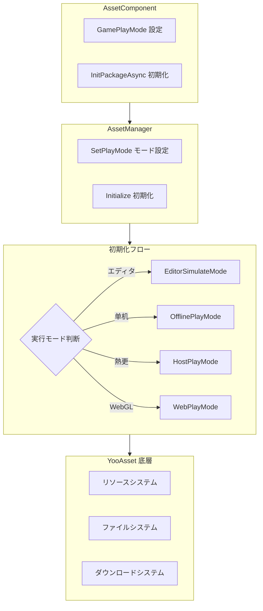

# 機能特性

Asset リソースコンポーネントは GameFrameX フレームワークのコアモジュールの一つであり、YooAsset に基づいて封裝構築され、统一されたリソースロード、管理と更新能力を提供します。このコンポーネントは複雑なリソース管理操作を直感的な API インターフェースに簡素化し、開発者が効率的にリソースロード、シーン切り替えとリソースパッケージ管理を行えるようにします。

## 概要

Asset リソースコンポーネントは Unity プロジェクトにおけるリソース管理のの問題を解決することを目的としており、リソースロード方法が不一致、リソース更新が困難、複数のプラットフォーム adaptationが複雑などの問題を含みます。统一的インターフェース抽象化と複数の実行モードサポートを提供することで、開発者は異なる开发和展開シーン下で同じコードセットを灵活に使用できます。コンポーネントはシンプルな单机ゲームから複雑なホットアップデートゲームまでの各种需求をサポートし、エディタでの快速反復でも本番環境のホットアップデート展開でも、完善的解決策を提供できます。

このコンポーネントのコア価値は、底層リソース管理フレームワーク（YooAsset）の複雑な機能を封裝的同时、その強力な能力を維持することです。開発者は底層実装の詳細を理解する必要がなく、シンプルな API 呼び出しだけでリソースロード、シーン切り替えなどの操作を完了できます。さらに、コンポーネントは完全なイベントシステムを提供し、開発者がリソースダウンロード進捗、ステータス变化などの重要な情報をリアルタイムで监控できるようにし、より良いユーザー体験を実現できます。

## コア機能特性

### マルチモード実行サポート

Asset コンポーネントは4種類の異なる実行モードをサポートし、各モードは特定の使用シーンに最適化されています。この設計により、同じコードセットが異なる开发和展開環境で无缝に切り替わり、業務ロジックコードを変更する必要がありません。

**エディタシミュレートモード（EditorSimulateMode）** は開発フェーズの快速反復に適しています。このモードでは、リソースは Unity エディタのプロジェクトディレクトリから直接ロードされ、任意のパッケージング操作を行う必要がありません。これは開発速度を大幅に加快し、開発者がリソースを変更した後すぐに効果を見ることができます。リソースパッケージングが完了するのを待つ必要がありません。このモードは Unity エディタ環境でのみ有効であり、パッケージ化してリリース的时候会自動的に他のモードに切り替わります。

**オフライン実行モード（OfflinePlayMode）** は、ホットアップデートが必要ない单机ゲームまたはシーンに適しています。このモードでは、すべてのリソースはビルドインリソースパッケージ（Buildin）からロードされ、任意的网络リクエストを含みません。リソースはアプリと一緒に配信され、追加のダウンロードステップを必要としません。このモードは獨立ゲーム開発またはリソース配信方式を厳密に制御する必要があるシーンに最も適しています。

**オンライン実行モード（HostPlayMode）** は、ホットアップデート機能が必要なゲームに適しています。このモードでは、リソースは2つの部分に分かれます：ビルドインリソースパッケージは初期リソースの保存に使用され、リモートサーバーはホットアップデートのリソースの保存に使用されます。コンポーネントは自動的に更新が必要なリソースを検出してダウンロードし、断点續傳とバージョン管理をサポートします。このモードはモダン手游の標準装備であり、ゲームリリース後に開発者がゲームの内容を更新し続けることを可能にします。

**WebGL 実行モード（WebPlayMode）** は WebGL プラットフォーム专用に最適化されています。このモードはブラウザ環境の特殊性を adapter化し、各种 Web ミニゲームプラットフォーム（微信ミニゲーム、抖音ミニゲーム、快手ミニゲームなど）をサポートしています。コンポーネントは自動的に目標プラットフォームを検出し、適切なファイルシステムパラメータを選択 し、リソースが正しくロードされることを確保します。



### 統一されたリソースロードインターフェース

Asset コンポーネントは、丰富なリソースロードインターフェースを提供し、各种使用シーンをカバーしています。すべてのロードインターフェースはジェネリックバージョンをサポートし、自動的にリソースタイプを推断し、タイプ変換の手間を省きます。

**非同期ロード** は推奨される主要なロード方式であり、複数のリソースまたは较大なリソースをロードする必要があるシーンに特に適しています。非同期ロードはメースレッドをブロックせず、界の流畅な応答を維持できます。コンポーネントは YooAsset のコールバック式 API を Task 式非同期インターフェースに変換し、コードをよりシンプルで読みやすくし、async/await 糖衣構文をサポートします。

```csharp
// 非同期でリソースをロード
var handle = await assetComponent.LoadAssetAsync<Texture2D>("Textures/Background");
var texture = handle.AssetObject as Texture2D;

// すべてのリソースを非同期ロード
var allHandle = await assetComponent.LoadAllAssetsAsync<GameObject>("Prefabs/Enemies");
foreach (var obj in allHandle.AllAssetObjects)
{
    // 各リソースを処理
}

// シーンを非同期ロード
await assetComponent.LoadSceneAsync("Scenes/GameLevel", LoadSceneMode.Single);
```

> Source: [AssetComponent.cs](https://github.com/GameFrameX/com.gameframex.unity.asset/blob/main/Runtime/Asset/AssetComponent.cs#L258-L261)

**同期ロード** は、ロード時間に厳格な要求があるシーンに適しています，例如即座に表示する必要があるリソース。同期ロードは呼び出しスレッドをブロックし、界面の卡顿を引き起こす可能性があるため、必要がある場合のみ使用し、主スレッドで大規模リソースをロードすることを避けてください。

```csharp
// 同期でリソースをロード
var handle = assetComponent.LoadAssetSync<AudioClip>("Audio/BGM");
var audio = handle.AssetObject as AudioClip;
```

> Source: [AssetComponent.cs](https://github.com/GameFrameX/com.gameframex.unity.asset/blob/main/Runtime/Asset/AssetComponent.cs#L426-L429)

**サブリソースロード** は、サブリソースを持つリソースの処理に使用されます，例如 SpriteAtlas（含多个 Sprite）。これにより、開発者は Atlas全体を一度にロードし、必要に応じてその中の单个精灵を取得できます。

```csharp
// サブリソースをロード
var handle = await assetComponent.LoadSubAssetsAsync<Sprite>("UI/Atlas/MainUI");
foreach (var sprite in handle.SubAssetObjects)
{
    // 各サブリソースを処理
}
```

> Source: [AssetComponent.cs](https://github.com/GameFrameX/com.gameframex.unity.asset/blob/main/Runtime/Asset/AssetComponent.cs#L128-L131)

**生ファイルロード** は、Unity リソース形式ではないファイルのロードに使用されます，例如設定ファイル、テキストファイル、バイナリデータなど。ロード後のデータはバイト配列形式で返され、開発者が自分で解析できます。

```csharp
// 生ファイルをロード
var handle = await assetComponent.LoadRawFileAsync("Config/GameConfig.json");
var data = handle.RawFileData;
var json = System.Text.Encoding.UTF8.GetString(data);
```

> Source: [AssetComponent.cs](https://github.com/GameFrameX/com.gameframex.unity.asset/blob/main/Runtime/Asset/AssetComponent.cs#L192-L195)

### リソースパッケージ管理

リソースパッケージ（ResourcePackage）はリソースを組織和管理する基本ユニットです。Asset コンポーネントは、複数の独立したリソースパッケージの作成をサポートし、開発者が機能モジュールまたはロード戦略に応じてリソースを分割できます。

**リソースパッケージの作成** により、開発者は特定カテゴリのリソースを管理する新しいリソースパッケージを作成できます。各リソースパッケージには独立した初期化パラメータとリソースセットがあり、必要に応じて異なるリソースセットをロードする必要があるシーンに適しています。

```csharp
// リソースパッケージを作成
var package = assetComponent.CreateAssetsPackage("DLC_Package");
```

> Source: [AssetComponent.cs](https://github.com/GameFrameX/com.gameframex.unity.asset/blob/main/Runtime/Asset/AssetComponent.cs#L471-L474)

**リソースパッケージの取得と確認** は、既存のリソースパッケージをクエリする複数の方法を提供します。名前でリソースパッケージインスタンスを取得하거나、特定の名前のリソースパッケージが存在するか確認できます。

```csharp
// リソースパッケージ是否存在か確認
if (assetComponent.HasAssetsPackage("DLC_Package"))
{
    var package = assetComponent.GetAssetsPackage("DLC_Package");
}
```

> Source: [AssetComponent.cs](https://github.com/GameFrameX/com.gameframex.unity.asset/blob/main/Runtime/Asset/AssetComponent.cs#L493-L506)

**デフォルトリソースパッケージの設定** により、デフォルトのリソースパッケージを指定でき、後続のリソースロード操作はデフォルトでこのリソースパッケージを使用します。これにより、リソースロードのコードが簡素化され、常にリソースパッケージ名を指定する必要がありません。

```csharp
// デフォルトリソースパッケージを設定
assetComponent.SetDefaultAssetsPackage(package);
```

> Source: [AssetComponent.cs](https://github.com/GameFrameX/com.gameframex.unity.asset/blob/main/Runtime/Asset/AssetComponent.cs#L581-L584)

### リソースクエリと検証

コンポーネントは、完全なリソースクエリ機能を提供し、開発者がリソースをロードする前にリソースの関連情報を把握できるようにします。

**リソース情報の取得** により、リソースのタグまたはパスに基づいてリソースのメタデータを取得できます。この情報にはリソースの依存関係、所在リソースパッケージ、ロード方式などが含まれ、より複雑なリソース管理戦略の実装に非常に便利です。

```csharp
// タグに基づいてリソース情報を取得
var infos = assetComponent.GetAssetInfos("UI");
// パスに基づいて单个リソース情報を取得
var info = assetComponent.GetAssetInfo("Prefabs/Player");
```

> Source: [AssetComponent.cs](https://github.com/GameFrameX/com.gameframex.unity.asset/blob/main/Runtime/Asset/AssetComponent.cs#L550-L562)

**リソースパスの確認** は、指定されたリソースパスが有効かどうか検証し、存在しないリソースをロードしてエラーを引き起こすことを避けます。

```csharp
// リソースパスが存在するか確認
if (assetComponent.HasAssetPath("Prefabs/Enemy"))
{
    // リソースが存在し、安全にロード可能
}
```

> Source: [AssetComponent.cs](https://github.com/GameFrameX/com.gameframex.unity.asset/blob/main/Runtime/Asset/AssetComponent.cs#L570-L573)

**ダウンロードが必要かどうかの確認** は、オンライン実行モードで、特定のリソースがリモートサーバーからダウンロード必要があるかどうかを確認できます。これはプリダウンロード機能の実装またはダウンロード進捗の表示に非常に便利です。

```csharp
// ダウンロードが必要かどうか確認
if (assetComponent.IsNeedDownload("Textures/HighRes/Detail"))
{
    // このリソースはリモートからダウンロード必要
}
```

> Source: [AssetComponent.cs](https://github.com/GameFrameX/com.gameframex.unity.asset/blob/main/Runtime/Asset/AssetComponent.cs#L528-L531)

### リソースアンロードと清理

合理的なリソース管理には、ロードだけでなく适時のアンロードと清理も含みます。メモリを解放しパフォーマンスを最適化するためです。

**特定リソースのアンロード** は、特定リソースのメモリ占有を解放します。あるリソースが不要再になったら、适時にアンロードしてメモリを解放する必要があります。

```csharp
// 特定リソースをアンロード
assetComponent.UnloadAsset("Prefabs/Enemy");
// 特定リソースパッケージをアンロード
assetComponent.UnloadAsset("DLC_Package", "Prefabs/Boss");
```

> Source: [AssetComponent.cs](https://github.com/GameFrameX/com.gameframex.unity.asset/blob/main/Runtime/Asset/AssetComponent.cs#L612-L615)

**未使用リソースのアンロード** は、すべての未被参照のリソースをスキャンしてアンロードします。これは通常、シーンの切り替えまたは新しいゲーム段階に入ったときに呼び出され、もはや不要になったリソースを清理します。

```csharp
// 未使用リソースをアンロード
assetComponent.UnloadUnusedAssetsAsync();
```

> Source: [AssetComponent.cs](https://github.com/GameFrameX/com.gameframex.unity.asset/blob/main/Runtime/Asset/AssetComponent.cs#L635-L638)

**リソースファイルの清理** は、メモリを解放するだけでなく、キャッシュされたダウンロードファイルを削除します。これはディスクスペースを解放する必要がある場合またはリソースキャッシュをリセットする場合に使用されます。

```csharp
// 無用リソースファイルを清理
assetComponent.ClearUnusedBundleFilesAsync();
// すべてのリソースファイルを清理
assetComponent.ClearAllBundleFilesAsync();
```

> Source: [AssetComponent.cs](https://github.com/GameFrameX/com.gameframex.unity.asset/blob/main/Runtime/Asset/AssetComponent.cs#L645-L658)

### 更新イベントシステム

Asset コンポーネントは完全なイベントシステムを実装し、開発者がリソース管理の各段階をリアルタイムで监控できるようにします。これはロード画面、更新ヒントなどの機能を実装するために至关重要です。

**ダウンロード進捗更新イベント** は、リソースダウンロードプロセス中に 지속적으로トリガーされ、現在のダウンロード進捗情報を提供します。イベントパラメータには総ファイル数、ダウンロード済みファイル数、总大小、ダウンロード済み大小が含まれ、開発者はこれに基づいてパーセンテージを計算し、プログレスバーを表示できます。

```csharp
// ダウンロード進捗更新イベントを購読
EventComponent.Subscribe<AssetDownloadProgressUpdateEventArgs>(OnDownloadProgress);

private void OnDownloadProgress(object sender, AssetDownloadProgressUpdateEventArgs e)
{
    var progress = (float)e.CurrentDownloadSizeBytes / e.TotalDownloadSizeBytes;
    Debug.Log($"ダウンロード進捗: {progress * 100}%");
}
```

> Source: [AssetDownloadProgressUpdateEventArgs.cs](https://github.com/GameFrameX/com.gameframex.unity.asset/blob/main/Runtime/Update/EventArgs/AssetDownloadProgressUpdateEventArgs.cs#L66-L68)

**更新ファイル発見イベント** は、更新が必要なリソースファイルが検出されたときにトリガーされます。このとき、ユーザーに更新内容の概要を表示し、ダウンロードを開始するかどうかを询问できます。

**リソースパッケージステータス変更イベント** は、リソース初期化フローの各段階でトリガーされ、準備段階、バージョン検出段階、マニフェスト更新段階、リソース検出段階、完了段階を含みます。

```csharp
// ステータス変更イベントを購読
EventComponent.Subscribe<AssetPatchStatesChangeEventArgs>(OnPatchStatesChange);

private void OnPatchStatesChange(object sender, AssetPatchStatesChangeEventArgs e)
{
    Debug.Log($"現在のステータス: {e.CurrentStates}");
}
```

> Source: [AssetPatchStatesChangeEventArgs.cs](https://github.com/GameFrameX/com.gameframex.unity.asset/blob/main/Runtime/Update/EventArgs/AssetPatchStatesChangeEventArgs.cs#L41-L42)

**エラー処理イベント** は、パッチマニフェスト更新失敗、静的バージョン更新失敗、ネットワークファイルダウンロード失敗などのイベントを含み、開発者が異なるタイプのエラーに応じて適切な処理を行えるようにします。

```csharp
// ダウンロード失敗イベントを購読
EventComponent.Subscribe<AssetWebFileDownloadFailedEventArgs>(OnDownloadFailed);

private void OnDownloadFailed(object sender, AssetWebFileDownloadFailedEventArgs e)
{
    Debug.LogError($"ファイルダウンロード失敗: {e.FileName}, エラー: {e.Error}");
}
```

> Source: [AssetWebFileDownloadFailedEventArgs.cs](https://github.com/GameFrameX/com.gameframex.unity.asset/blob/main/Runtime/Update/EventArgs/AssetWebFileDownloadFailedEventArgs.cs#L51-L53)

## プラットフォーム対応

Asset コンポーネントは、異なる目標プラットフォームに対して专门的最適化サポートを提供し、各种環境下で正常に動作することを確保します。

**Unity エディタ** は、完全な開発サポートを提供し、シミュレート実行モード、リソースプレビュー、デバッグ機能を含みます。開発者はエディタ内でリソース管理ロジックを快速テストと反復できます。

**PC プラットフォーム**（Windows、Mac、Linux）は、すべての実行モードをサポートし、オンラインModeのホットアップデート機能を含みます。ディスクとネットワーク条件が通常良好であるため、リソースロード体验は流畅です。

**モバイルプラットフォーム**（iOS、Android）は、コンポーネントの主要目標プラットフォームであり、完全なホットアップデート能力をサポートします。コンポーネントはモバイルネットワークの不安定性に最適化され、断点續傳と失敗時の再試行をサポートします。

**WebGL プラットフォーム** は、专门的実行モードを持ち、ブラウザ環境用に最適化されています。コンポーネントは主要な Web ミニゲームプラットフォームをサポートし、微信ミニゲーム、抖音ミニゲーム、快手ミニゲームを含みます。

```mermaid
flowchart LR
    subgraph Platforms["サポートプラットフォーム"]
        P1[Unity エディタ]
        P2[PC (Win/Mac/Linux)]
        P3[モバイル (iOS/Android)]
        P4[WebGL]
        P5[ミニゲームプラットフォーム]
    end
    
    subgraph Modes["サポート実行モード"]
        M1[EditorSimulateMode]
        M2[OfflinePlayMode]
        M3[HostPlayMode]
        M4[WebPlayMode]
    end
    
    P1 -->|EditorSimulateMode| M1
    P2 -->|OfflinePlayMode| M2
    P2 -->|HostPlayMode| M3
    P3 -->|OfflinePlayMode| M2
    P3 -->|HostPlayMode| M3
    P4 -->|WebPlayMode| M4
    P5 -->|WebPlayMode| M4
```

## 設定オプション

Asset コンポーネントは多种設定オプションを提供し、開発者がプロジェクト需求に基づいて动作を調整できます。

| 設定項目 | タイプ | デフォルト値 | 説明 |
|--------|------|--------|------|
| GamePlayMode | EPlayMode | EditorSimulateMode | リソース実行モード |
| DownloadingMaxNum | int | 10 | 同時ダウンロードの最大ファイル数 |
| FailedTryAgain | int | 3 | ダウンロード失敗後の再試行回数 |
| VerifyLevel | EFileVerifyLevel | Normal | ダウンロードファイル検証レベル |
| Milliseconds | long | 30 | 非同期システム每フレーム実行の最大時間切片（ミリ秒） |
| ReadOnlyPath | string | - | リソース読み取り専用エリアパス |
| ReadWritePath | string | - | リソース読み書きエリアパス |

> Source: [IAssetManager.cs](https://github.com/GameFrameX/com.gameframex.unity.asset/blob/main/Runtime/Asset/IAssetManager.cs#L18-L75)

## 関連リンク

- [Asset リソースコンポーネント紹介](./1-overview.introduction)
- [アーキテクチャ設計](./4-core-concepts.architecture)
- [リソースコンポーネント](./4-core-concepts.asset-component)
- [リソース管理器](./4-core-concepts.asset-manager)
- [実行モード](./6-configuration.play-modes)
- [リソースロードインターフェース](./5-api-reference.loading-api)
- [リソースパッケージ管理](./5-api-reference.package-management)
- [更新イベント](./5-api-reference.update-events)
