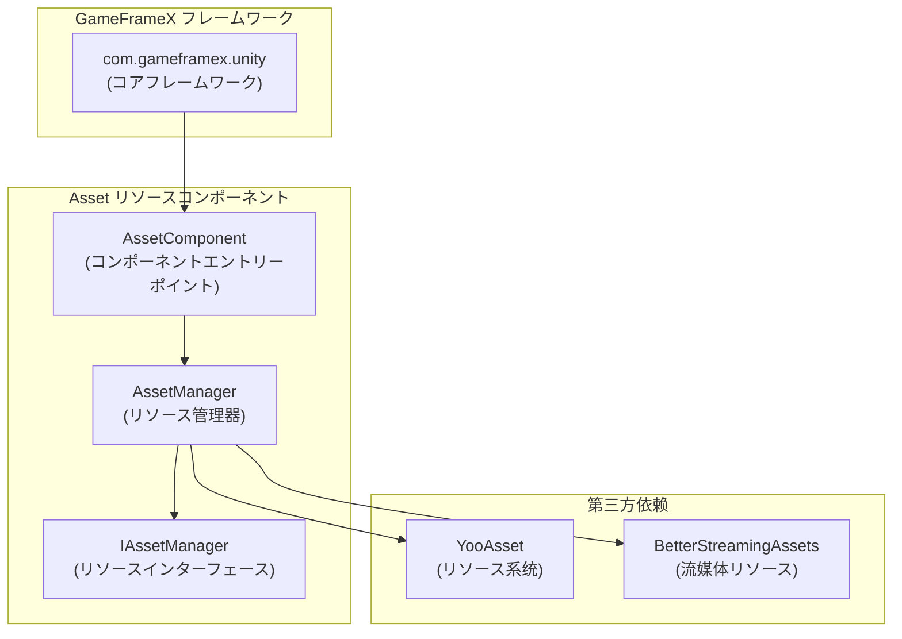

# 依赖要求

本文档詳細説明 GameFrameX Asset リソースコンポーネント的依赖要求，包括 Unity 版本要求、フレームワーク依存以及第三方依赖。

## 概要

GameFrameX Asset リソースコンポーネント是 GameFrameX フレームワーク的コア模块之一，负责提供统一的リソース管理機能。在使用该コンポーネント之前，必要确保开发环境和プロジェクト满足以下依赖要求。

## Unity 版本要求

| プロジェクト | 要求 |
|------|------|
| 最低 Unity 版本 | **2019.4** |
| 推荐 Unity 版本 | 2020.3 LTS 或更高 |

> Source: [package.json](https://github.com/GameFrameX/com.gameframex.unity.asset/blob/main/package.json#L7)

## フレームワーク依存

### コア依赖

Asset リソースコンポーネント依赖于 GameFrameX コアフレームワーク包，这是使用该コンポーネント的**必要前提**。

| 依赖包 | 版本 | 説明 |
|--------|------|------|
| `com.gameframex.unity` | **1.1.1** | GameFrameX コアフレームワーク，提供基础架构和模块系统 |

```json
{
  "dependencies": {
    "com.gameframex.unity.asset": "2.4.0",
    "com.gameframex.unity": "1.1.1"
  }
}
```

> Source: [package.json](https://github.com/GameFrameX/com.gameframex.unity.asset/blob/main/package.json#L21-L23)

### フレームワーク架构

Asset コンポーネント在 GameFrameX フレームワーク中的位置如下：



**设计説明：**
- `AssetComponent` を継承 `GameFrameworkComponent`，是コンポーネント的エントリーポイント点
- `AssetManager` 実装 `IAssetManager` インターフェース，提供リソース管理的具体実装
- 底层使用 YooAsset 作为リソース管理系统，BetterStreamingAssets 作为流媒体リソースサポート

## 第三方依赖

### YooAsset

YooAsset 是 Asset コンポーネント的コアリソース管理系统，负责：
- リソース的异步/同步加载
- リソースパッケージ管理
- リソース版本管理
- リソースホットアップデートサポート

```csharp
// AssetManager.cs 中使用 YooAsset
using YooAsset;

public partial class AssetManager : GameFrameworkModule, IAssetManager
{
    public void Initialize()
    {
        BetterStreamingAssets.Initialize();
        YooAssets.Initialize();
        YooAssets.SetOperationSystemMaxTimeSlice(30);
    }
}
```

> Source: [Runtime/Asset/AssetManager.cs](https://github.com/GameFrameX/com.gameframex.unity.asset/blob/main/Runtime/Asset/AssetManager.cs#L46-L56)

### BetterStreamingAssets

に使用サポート流媒体リソース的高效访问，是 YooAsset 的依赖コンポーネント。

## 名前空間依赖

Asset コンポーネント使用以下名前空間：

| 名前空間 | 説明 |
|----------|------|
| `GameFrameX.Runtime` | コアフレームワーク运行时名前空間 |
| `GameFrameX.Asset.Runtime` | Asset コンポーネント自身名前空間 |
| `YooAsset` | リソース管理系统 |
| `UnityEngine` | Unity 引擎コア |
| `UnityEngine.SceneManagement` | シーン管理 |

```csharp
using GameFrameX.Runtime;
using GameFrameX.Asset.Runtime;
using YooAsset;
using UnityEngine;
using UnityEngine.SceneManagement;
using Object = UnityEngine.Object;
```

> Source: [Runtime/Asset/AssetComponent.cs](https://github.com/GameFrameX/com.gameframex.unity.asset/blob/main/Runtime/Asset/AssetComponent.cs#L1-L8)

## 安装依赖

### 自动安装（推荐）

在 Unity プロジェクト的 `Packages/manifest.json` ファイル中添加依赖：

```json
{
  "dependencies": {
    "com.gameframex.unity.asset": "https://github.com/GameFrameX/com.gameframex.unity.asset.git",
    "com.gameframex.unity": "1.1.1"
  }
}
```

> 更多信息お願いします参考 [安装方法](./2-installation.index)

### Git URL 安装

在 Unity Package Manager 中使用 Git URL 添加：
- Asset コンポーネント：`https://github.com/GameFrameX/com.gameframex.unity.asset.git`
- コアフレームワーク：`https://github.com/GameFrameX/com.gameframex.unity.git`

### 本地安装

直接将仓库克隆到 Unity プロジェクト的 `Packages` ディレクトリ下：

```bash
git clone https://github.com/GameFrameX/com.gameframex.unity.asset.git Packages/com.gameframex.unity.asset
git clone https://github.com/GameFrameX/com.gameframex.unity.git Packages/com.gameframex.unity
```

## 版本兼容性

| Asset コンポーネント版本 | Unity 版本 | フレームワーク版本 | 説明 |
|----------------|------------|----------|------|
| 2.4.0 | 2019.4+ | 1.1.1 | 当前最新版本 |
| 2.3.0 | 2019.4+ | 1.1.1 | サポート抖音小ゲーム |
| 2.2.x | 2019.4+ | 1.1.0 | 基础機能稳定版 |

## よくある質問

### Q: 没有安装コアフレームワーク会怎样？

A: Asset コンポーネント依赖 `GameFrameworkComponent` 基クラス，如果未安装コアフレームワーク，将导致编译错误。必ず先安装 `com.gameframex.unity` 包。

### Q: YooAsset 必要单独安装吗？

A: 不必要。YooAsset 作为 YooAsset 包的依赖，会在安装 Asset コンポーネント时自动作为子依赖安装。

### Q: サポート哪些 Unity 平台？

A: Asset コンポーネントサポート以下平台：
- Windows/Mac/Linux 桌面平台
- iOS/Android 移动平台
- WebGL 平台
- 微信小ゲーム
- 抖音小ゲーム
- 快手小ゲーム

> 更多信息お願いします参考 [平台サポート概要](./7-platforms.index)

## 関連リンク

- [安装方法](./2-installation.index)
- [Asset リソースコンポーネント介绍](./1-overview.introduction)
- [機能特性](./1-overview.features)
- [コア概念](./4-core-concepts.architecture)
- [API 参考](./5-api-reference.loading-api)
