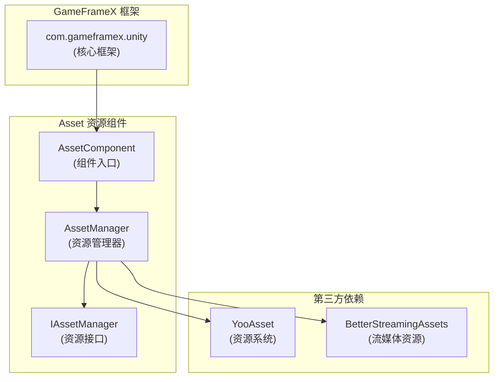

# 依存要件

このドキュメント詳細説明 GameFrameX Asset リソースコンポーネント的依赖要求，含みます Unity バージョン要求、フレームワーク依赖および第3方依赖。

## 概要

GameFrameX Asset リソースコンポーネント是 GameFrameX フレームワーク的コアモジュール之一，负责提供統一された的リソース管理機能。在使用该コンポーネント之前，〜する必要があります確認してください开发環境和プロジェクト满足以下依赖要求。

## Unity バージョン要求

| プロジェクト | 要求 |
|------|------|
| 最低 Unity バージョン | **2019.4** |
| 推奨 Unity バージョン | 2020.3 LTS 或更高 |

> Source: [package.json](https://github.com/GameFrameX/com.gameframex.unity.asset/blob/main/package.json#L7)

## フレームワーク依赖

### コア依赖

Asset リソースコンポーネント依赖于 GameFrameX コアフレームワークパッケージ，这是使用该コンポーネント的**必要前提**。

| 依赖パッケージ | バージョン | 説明 |
|--------|------|------|
| `com.gameframex.unity` | **1.1.1** | GameFrameX コアフレームワーク，提供基本アーキテクチャ和モジュール系统 |

```json
{
  "dependencies": {
    "com.gameframex.unity.asset": "2.4.0",
    "com.gameframex.unity": "1.1.1"
  }
}
```

> Source: [package.json](https://github.com/GameFrameX/com.gameframex.unity.asset/blob/main/package.json#L21-L23)

### フレームワークアーキテクチャ

Asset コンポーネント在 GameFrameX フレームワーク中的位置如下：



**設計説明：**
- `AssetComponent` 継承自 `GameFrameworkComponent`，是コンポーネント的入口点
- `AssetManager` 実装 `IAssetManager` インターフェース，提供リソース管理的具体実装
- 底层使用 YooAsset 作为リソース管理系统，BetterStreamingAssets 作为流媒体リソースサポート

## 第3方依赖

### YooAsset

YooAsset 是 Asset コンポーネント的コアリソース管理系统，负责：
- リソース的异步/同期ロード
- リソースパッケージ管理
- リソースバージョン管理
- リソースホットアップデートサポート

```csharp
// AssetManager.cs 中使用 YooAsset
using YooAsset;

public partial class AssetManager : GameFrameworkModule, IAssetManager
{
    public void Initialize()
    {
        BetterStreamingAssets.Initialize();
        YooAssets.Initialize();
        YooAssets.SetOperationSystemMaxTimeSlice(30);
    }
}
```

> Source: [Runtime/Asset/AssetManager.cs](https://github.com/GameFrameX/com.gameframex.unity.asset/blob/main/Runtime/Asset/AssetManager.cs#L46-L56)

### BetterStreamingAssets

用于サポート流媒体リソース的効率的访问，是 YooAsset 的依赖コンポーネント。

## 名前空間の依存

Asset コンポーネント使用以下名前空間：

| 名前空間 | 説明 |
|----------|------|
| `GameFrameX.Runtime` | コアフレームワークランタイム名前空間 |
| `GameFrameX.Asset.Runtime` | Asset コンポーネント自身名前空間 |
| `YooAsset` | リソース管理系统 |
| `UnityEngine` | Unity 引擎コア |
| `UnityEngine.SceneManagement` | シーン管理 |

```csharp
using GameFrameX.Runtime;
using GameFrameX.Asset.Runtime;
using YooAsset;
using UnityEngine;
using UnityEngine.SceneManagement;
using Object = UnityEngine.Object;
```

> Source: [Runtime/Asset/AssetComponent.cs](https://github.com/GameFrameX/com.gameframex.unity.asset/blob/main/Runtime/Asset/AssetComponent.cs#L1-L8)

## 依存関係のインストール

### 自動インストール（推奨）

在 Unity プロジェクト的 `Packages/manifest.json` ファイル中追加依赖：

```json
{
  "dependencies": {
    "com.gameframex.unity.asset": "https://github.com/GameFrameX/com.gameframex.unity.asset.git",
    "com.gameframex.unity": "1.1.1"
  }
}
```

> 更多情報请リファレンス [インストール方法](./2-installation.index)

### Git URL インストール

在 Unity Package Manager 中使用 Git URL 追加：
- Asset コンポーネント：`https://github.com/GameFrameX/com.gameframex.unity.asset.git`
- コアフレームワーク：`https://github.com/GameFrameX/com.gameframex.unity.git`

### ローカルインストール

直接将リポジトリ克隆到 Unity プロジェクト的 `Packages` ディレクトリ下：

```bash
git clone https://github.com/GameFrameX/com.gameframex.unity.asset.git Packages/com.gameframex.unity.asset
git clone https://github.com/GameFrameX/com.gameframex.unity.git Packages/com.gameframex.unity
```

## バージョン互換性

| Asset コンポーネントバージョン | Unity バージョン | フレームワークバージョン | 説明 |
|----------------|------------|----------|------|
| 2.4.0 | 2019.4+ | 1.1.1 | 当前最新バージョン |
| 2.3.0 | 2019.4+ | 1.1.1 | サポートDouYinミニゲーム |
| 2.2.x | 2019.4+ | 1.1.0 | 基本機能稳定版 |

## よくある問題

### Q: 没有インストールコアフレームワーク会怎样？

A: Asset コンポーネント依赖 `GameFrameworkComponent` 基底クラス，もし未インストールコアフレームワーク，将导致コンパイルエラー。请確認してください先インストール `com.gameframex.unity` パッケージ。

### Q: YooAsset 〜する必要があります单独インストール吗？

A: 不〜する必要があります。YooAsset 作为 YooAsset パッケージ的依赖，会在インストール Asset コンポーネント时自动作为子依赖インストール。

### Q: サポート哪些 Unity プラットフォーム？

A: Asset コンポーネントサポート以下プラットフォーム：
- Windows/Mac/Linux デスクトッププラットフォーム
- iOS/Android モバイルプラットフォーム
- WebGL プラットフォーム
- WeChatミニゲーム
- DouYinミニゲーム
- KuaiShouミニゲーム

> 更多情報请リファレンス [プラットフォームサポート概览](./7-platforms.index)

## 関連リンク

- [インストール方法](./2-installation.index)
- [Asset リソースコンポーネント介绍](./1-overview.introduction)
- [機能特性](./1-overview.features)
- [コアコンセプト](./4-core-concepts.architecture)
- [API リファレンス](./5-api-reference.loading-api)
