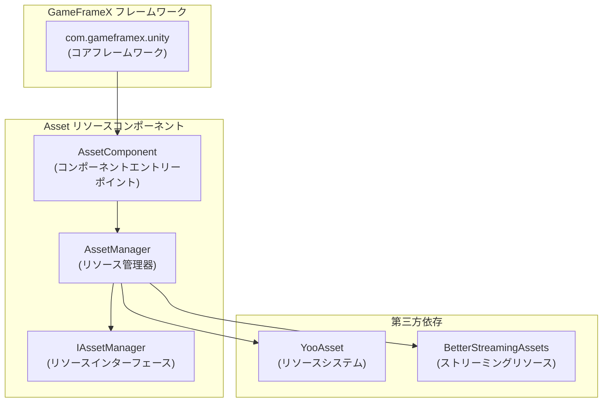

# 依存要件

このドキュメントは、GameFrameX Asset リソースコンポーネントの依存要件について詳述説明します。Unity バージョン要件、フレームワーク依存、第三方依存を含みます。

## 概要

GameFrameX Asset リソースコンポーネントは GameFrameX フレームワークのコアモジュールの一つであり、统一されたリソース管理機能を提供することを目的としています。このコンポーネントを使用する前に、開発環境とプロジェクトが以下の依存要件を満たしていることを確認する必要があります。

## Unity バージョン要件

| 項目 | 要件 |
|------|------|
| 最低 Unity バージョン | **2019.4** |
| 推奨 Unity バージョン | 2020.3 LTS またはそれ以上 |

> Source: [package.json](https://github.com/GameFrameX/com.gameframex.unity.asset/blob/main/package.json#L7)

## フレームワーク依存

### コア依存

Asset リソースコンポーネントは GameFrameX コアフレームワークパッケージに依存しており、これはこのコンポーネントを使用する**必要がある前提条件**です。

| 依存パッケージ | バージョン | 説明 |
|--------|------|------|
| `com.gameframex.unity` | **1.1.1** | GameFrameX コアフレームワーク、基盤アーキテクチャとモジュールシステムを提供 |

```json
{
  "dependencies": {
    "com.gameframex.unity.asset": "2.4.0",
    "com.gameframex.unity": "1.1.1"
  }
}
```

> Source: [package.json](https://github.com/GameFrameX/com.gameframex.unity.asset/blob/main/package.json#L21-L23)

### フレームワークアーキテクチャ

Asset コンポーネントの GameFrameX フレームワークにおける位置は次のとおりです:



**設計説明:**
- `AssetComponent` は `GameFrameworkComponent` を継承し、コンポーネントのエントリーポイントです
- `AssetManager` は `IAssetManager` インターフェースを実装し、リソース管理の具体的な実装を提供します
- 底層では YooAsset をリソース管理システムとして使用し、BetterStreamingAssets をストリーミングリソースサポートとして使用します

## 第三方依存

### YooAsset

YooAsset は Asset コンポーネントのコアリソース管理系统であり、以下の责務を果たします:
- リソースの非同期/同期ロード
- リソースパッケージ管理
- リソースバージョン管理
- リソースホットアップデートサポート

```csharp
// AssetManager.cs での YooAsset 使用
using YooAsset;

public partial class AssetManager : GameFrameworkModule, IAssetManager
{
    public void Initialize()
    {
        BetterStreamingAssets.Initialize();
        YooAssets.Initialize();
        YooAssets.SetOperationSystemMaxTimeSlice(30);
    }
}
```

> Source: [Runtime/Asset/AssetManager.cs](https://github.com/GameFrameX/com.gameframex.unity.asset/blob/main/Runtime/Asset/AssetManager.cs#L46-L56)

### BetterStreamingAssets

ストリーミングリソースの高效なアクセスをサポートするために使用され、YooAsset の依存コンポーネントです。

## 名前空間依存

Asset コンポーネントは次の名前空間を使用します:

| 名前空間 | 説明 |
|----------|------|
| `GameFrameX.Runtime` | コアフレームワークランタイム名前空間 |
| `GameFrameX.Asset.Runtime` | Asset コンポーネント自有の名前空間 |
| `YooAsset` | リソース管理系统 |
| `UnityEngine` | Unity エンジンコア |
| `UnityEngine.SceneManagement` | シーン管理 |

```csharp
using GameFrameX.Runtime;
using GameFrameX.Asset.Runtime;
using YooAsset;
using UnityEngine;
using UnityEngine.SceneManagement;
using Object = UnityEngine.Object;
```

> Source: [Runtime/Asset/AssetComponent.cs](https://github.com/GameFrameX/com.gameframex.unity.asset/blob/main/Runtime/Asset/AssetComponent.cs#L1-L8)

## 依存のインストール

### 自動インストール（推奨）

Unity プロジェクトの `Packages/manifest.json` ファイルに依存を追加します:

```json
{
  "dependencies": {
    "com.gameframex.unity.asset": "https://github.com/GameFrameX/com.gameframex.unity.asset.git",
    "com.gameframex.unity": "1.1.1"
  }
}
```

> 详细信息については [インストール方式](./2-installation.index) を参照してください

### Git URL インストール

Unity Package Manager で Git URL を使用して追加:
- Asset コンポーネント: `https://github.com/GameFrameX/com.gameframex.unity.asset.git`
- コアフレームワーク: `https://github.com/GameFrameX/com.gameframex.unity.git`

### ローカルインストール

リポジトリを Unity プロジェクトの `Packages` ディレクトリに直接クローンします:

```bash
git clone https://github.com/GameFrameX/com.gameframex.unity.asset.git Packages/com.gameframex.unity.asset
git clone https://github.com/GameFrameX/com.gameframex.unity.git Packages/com.gameframex.unity
```

## バージョン互換性

| Asset コンポーネントバージョン | Unity バージョン | フレームワークバージョン | 説明 |
|----------------|------------|----------|------|
| 2.4.0 | 2019.4+ | 1.1.1 | 現在の最新バージョン |
| 2.3.0 | 2019.4+ | 1.1.1 | 抖音ミニゲームサポート |
| 2.2.x | 2019.4+ | 1.1.0 | 基盤機能安定バージョン |

## よくある質問

### Q: コアフレームワークがインストールされていない場合、どうなりますか？

A: Asset コンポーネントは `GameFrameworkComponent` 基底クラスに依存しており、コアフレームワークがインストールされていない場合、コンパイルエラーが発生します。必ず先に `com.gameframex.unity` パッケージをインストールしてください。

### Q: YooAsset は別途インストールが必要ですか？

A: 必要ありません。YooAsset は YooAsset パッケージの依存として、Asset コンポーネントのインストール時に自動的にサブ依存としてインストールされます。

### Q: どの Unity プラットフォームをサポートしていますか？

A: Asset コンポーネントは以下のプラットフォームをサポートしています:
- Windows/Mac/Linux デスクトッププラットフォーム
- iOS/Android モバイルプラットフォーム
- WebGL プラットフォーム
- 微信ミニゲーム
- 抖音ミニゲーム
- 快手ミニゲーム

> 详细信息については [プラットフォームサポート概要](./7-platforms.index) を参照してください

## 関連リンク

- [インストール方式](./2-installation.index)
- [Asset リソースコンポーネント紹介](./1-overview.introduction)
- [機能特性](./1-overview.features)
- [コア概念](./4-core-concepts.architecture)
- [API リファレンス](./5-api-reference.loading-api)
