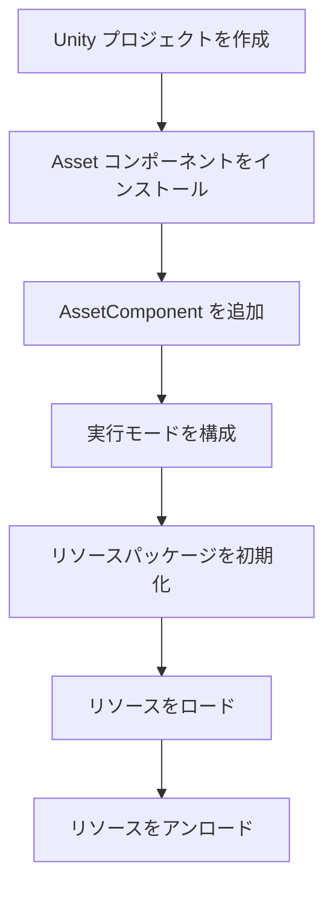

# 最初の一歩

このドキュメントでは、GameFrameX Asset リソースコンポーネントの初めての使用をガイドし、完全な例を通じてリソースシステムのコア機能を手早く身につける方法を説明します。

## 概要

Asset リソースコンポーネントは YooAssets 上に構築された Unity リソース管理システムであり、统一されたリソースロード、アンロードおよびホットアップデート機能を提供します。この例では、Unity プロジェクトでこのコンポーネントを構成して使用し、基本的なリソースロード操作を完了する方法を説明します。

## クイックスタートフロー

以下は Asset リソースコンポーネントを使用する標準的なフローです：



## 使用手順

### 手順 1: AssetComponent を追加

Unity シーンで空の GameObject を作成し、`AssetComponent` コンポーネントを追加します。このコンポーネントは自動的にリソース管理の的各项機能を公开します。

```csharp
// Unity エディタで
// 1. シーンで空の GameObject を作成
// 2. Add Component をクリック
// 3. "GameFrameX/Asset" を検索して追加
// 4. コンポーネントは自動的に AssetComponent をアタッチ
```

> Source: [AssetComponent.cs](https://github.com/GameFrameX/com.gameframex.unity.asset/blob/main/Runtime/Asset/AssetComponent.cs#L16-L18)

AssetComponent は `GameFrameworkComponent` を継承し、`[AddComponentMenu("GameFrameX/Asset")]` 属性を通じてエディタで容易に追加できます。

### 手順 2: 実行モードを構成

AssetComponent は `GamePlayMode` プロパティを提供し、リソースの実行モードを設定するために使用されます：

```csharp
// AssetComponent.cs でのプロパティ定義
public EPlayMode GamePlayMode { get; set; }
```

サポートされる実行モードは次のとおりです：
- **EditorSimulateMode**: エディタシミュレートモード、開発時のみ使用
- **HostPlayMode**: リモートホットアップデートモード
- **WebPlayMode**: WebGL プラットフォーム専用モード

> 詳細な実行モードの説明は [実行モード](./6-configuration.play-modes) ドキュメントを参照してください。

```csharp
// 実行時モード設定の例（AssetComponent.Awake 内）
_assetManager.SetPlayMode(GamePlayMode);
```

> Source: [AssetComponent.cs](https://github.com/GameFrameX/com.gameframex.unity.asset/blob/main/Runtime/Asset/AssetComponent.cs#L63)

### 手順 3: リソースパッケージを初期化

リソースシステムを使用する前に、まずリソースパッケージを初期化する必要があります：

```csharp
// AssetComponent.Start で自動的に初期化が呼び出される
private void Start()
{
    _assetManager.Initialize();
}
```

> Source: [AssetComponent.cs](https://github.com/GameFrameX/com.gameframex.unity.asset/blob/main/Runtime/Asset/AssetComponent.cs#L66-L70)

特定のリソースパッケージを手動で初期化することもできます：

```csharp
// リソースパッケージを初期化の例
public async Task<bool> InitPackageAsync(string packageName, string host, string fallbackHostServer, bool isDefaultPackage = false)
{
    return await _assetManager.InitPackageAsync(packageName, host, fallbackHostServer, isDefaultPackage);
}
```

> Source: [AssetComponent.cs](https://github.com/GameFrameX/com.gameframex.unity.asset/blob/main/Runtime/Asset/AssetComponent.cs#L80-L95)

## リソースロードの例

Asset コンポーネントは多种のリソースロード方法を提供し、以下では非同期ロードと同期ロードのの使用例を 分别説明します。

### 非同期でリソースをロード

非同期ロードは推奨される主要な方法であり、メースレッドをブロックしません：

```csharp
using UnityEngine;
using GameFrameX.Asset.Runtime;
using YooAsset;
using System.Threading.Tasks;

// 非同期で Prefab をロードする例
public async void LoadAssetExample(AssetComponent assetComponent)
{
    // 方法1: ジェネリックを使用して非同期ロード
    var handle = await assetComponent.LoadAssetAsync<GameObject>("Assets/Prefabs/Player.prefab");
    var prefab = handle.AssetObject as GameObject;
    
    // オブジェクトをインスタンス化
    if (prefab != null)
    {
        Instantiate(prefab);
    }
    
    // ロード完了後にハンドルを解放
    handle.Release();
}
```

> Source: [AssetComponent.cs](https://github.com/GameFrameX/com.gameframex.unity.asset/blob/main/Runtime/Asset/AssetComponent.cs#L257-L261)

```csharp
// 方法2: パスとタイプを使用してロード
public async Task LoadAssetWithType(AssetComponent assetComponent)
{
    var handle = await assetComponent.LoadAssetAsync("Assets/Textures/Background.png", typeof(Texture2D));
    var texture = handle.AssetObject as Texture2D;
    
    // テクスチャを使用...
    handle.Release();
}
```

> Source: [AssetComponent.cs](https://github.com/GameFrameX/com.gameframex.unity.asset/blob/main/Runtime/Asset/AssetComponent.cs#L245-L249)

### 同期でリソースをロード

同期ロードは現在のフレームでリソースを取得する必要があるシーンに使用します：

```csharp
// 同期で Prefab をロードする例
public void LoadAssetSyncExample(AssetComponent assetComponent)
{
    var handle = assetComponent.LoadAssetSync<GameObject>("Assets/Prefabs/Enemy.prefab");
    var enemy = handle.AssetObject as GameObject;
    
    if (enemy != null)
    {
        Instantiate(enemy);
    }
    
    // 同期でも手動で解放が必要
    handle.Release();
}
```

> Source: [AssetComponent.cs](https://github.com/GameFrameX/com.gameframex.unity.asset/blob/main/Runtime/Asset/AssetComponent.cs#L425-L429)

### シーンをロード

```csharp
// 非同期でシーンをロードする例
public async Task LoadSceneExample(AssetComponent assetComponent)
{
    var sceneHandle = await assetComponent.LoadSceneAsync(
        "Assets/Scenes/GameScene.unity", 
        UnityEngine.SceneManagement.LoadSceneMode.Single, 
        true
    );
    
    Debug.Log($"シーンのロード完了: {sceneHandle.Scene.name}");
}
```

> Source: [AssetComponent.cs](https://github.com/GameFrameX/com.gameframex.unity.asset/blob/main/Runtime/Asset/AssetComponent.cs#L442-L446)

### 複数のリソースをロード

```csharp
// 指定されたパス下のすべてのリソースをロード
public async Task LoadAllAssetsExample(AssetComponent assetComponent)
{
    var allAssetsHandle = await assetComponent.LoadAllAssetsAsync<GameObject>("Assets/Prefabs/");
    
    foreach (var asset in allAssetsHandle.AllAssetObjects)
    {
        Debug.Log($"リソースをロード: {asset.name}");
    }
    
    // すべて使用完了後に解放
    allAssetsHandle.Release();
}
```

> Source: [AssetComponent.cs](https://github.com/GameFrameX/com.gameframex.unity.asset/blob/main/Runtime/Asset/AssetComponent.cs#L269-L273)

## リソースアンロードの例

リソースライフサイクルを正しく管理することは、メモリリークを避けるために至关重要です：

```csharp
public class ResourceManager
{
    private AssetComponent _assetComponent;
    
    // 特定のリソースをアンロード
    public void UnloadSingleAsset(string assetPath)
    {
        _assetComponent.UnloadAsset(assetPath);
    }
    
    // 未使用のリソースをアンロード（定期的な呼び出しをお勧めします）
    public void UnloadUnusedAssets()
    {
        _assetComponent.UnloadUnusedAssetsAsync();
    }
    
    // 無用なリソースパッケージファイルを清理
    public void ClearUnusedBundles()
    {
        _assetComponent.ClearUnusedBundleFilesAsync();
    }
    
    // すべてのリソースを強制アンロード（慎重に使用）
    public void UnloadAllAssets()
    {
        _assetComponent.UnloadAllAssetsAsync(null);
    }
}
```

> Source: [AssetComponent.cs](https://github.com/GameFrameX/com.gameframex.unity.asset/blob/main/Runtime/Asset/AssetComponent.cs#L590-L658)

## 完全な使用例

以下は MonoBehaviour スクリプトの完全な例であり、初期化からロード、アンロードまでの完全なフローを展示します：

```csharp
using UnityEngine;
using GameFrameX.Asset.Runtime;
using YooAsset;
using System.Threading.Tasks;
using UnityEngine.SceneManagement;

public class GameEntry : MonoBehaviour
{
    private AssetComponent _assetComponent;
    
    private void Start()
    {
        // AssetComponent コンポーネントを取得
        _assetComponent = GetComponent<AssetComponent>();
        
        // リソースパッケージを初期化
        InitializePackage();
    }
    
    private async void InitializePackage()
    {
        // デフォルトリソースパッケージを初期化
        bool success = await _assetComponent.InitPackageAsync(
            "DefaultPackage",           // パッケージ名
            "http://localhost:8080/",   // メインサーバーアドレス
            "http://backup:8080/",     // バックアップサーバーアドレス
            true                        // デフォルトパッケージに設定するか
        );
        
        if (success)
        {
            Debug.Log("リソースパッケージの初期化成功！");
            // ゲームコンテンツのロードを開始
            LoadGameContent();
        }
        else
        {
            Debug.LogError("リソースパッケージの初期化失敗！");
        }
    }
    
    private async void LoadGameContent()
    {
        // プレイヤープレハブをロード
        var playerHandle = await _assetComponent.LoadAssetAsync<GameObject>("Assets/Prefabs/Player.prefab");
        var playerPrefab = playerHandle.AssetObject as GameObject;
        
        if (playerPrefab != null)
        {
            Instantiate(playerPrefab);
        }
        
        // BGM をロード
        var audioHandle = await _assetComponent.LoadAssetAsync<AudioClip>("Assets/Audio/BGM.mp3");
        var bgm = audioHandle.AssetObject as AudioClip;
        
        // メインシーンをロード
        await _assetComponent.LoadSceneAsync(
            "Assets/Scenes/Main.unity",
            LoadSceneMode.Single,
            true
        );
        
        // 注意: 実際のプロジェクトでは需求に応じてリソースハンドルを解放するタイミングを決定する必要があります
    }
}
```

> Source: [AssetManager.cs](https://github.com/GameFrameX/com.gameframex.unity.asset/blob/main/Runtime/Asset/AssetManager.cs#L46-L56)

## リソースパッケージ管理

Asset コンポーネントは多个リソースパッケージ管理をサポートし、不同的リソースパッケージを作成して切り替えることができます：

```csharp
public class PackageManagerExample
{
    private AssetComponent _assetComponent;
    
    // 新しいリソースパッケージを作成
    public void CreatePackage(string packageName)
    {
        var package = _assetComponent.CreateAssetsPackage(packageName);
        
        if (package != null)
        {
            Debug.Log($"リソースパッケージの作成成功: {packageName}");
        }
    }
    
    // リソースパッケージを取得
    public void GetPackage(string packageName)
    {
        var package = _assetComponent.GetAssetsPackage(packageName);
        
        if (package != null)
        {
            Debug.Log($"リソースパッケージを取得: {package.Name}");
        }
    }
    
    // リソースパッケージが存在するか確認
    public bool CheckPackageExists(string packageName)
    {
        return _assetComponent.HasAssetsPackage(packageName);
    }
    
    // デフォルトリソースパッケージを設定
    public void SetDefaultPackage(string packageName)
    {
        var package = _assetComponent.GetAssetsPackage(packageName);
        if (package != null)
        {
            _assetComponent.SetDefaultAssetsPackage(package);
        }
    }
}
```

> Source: [AssetComponent.cs](https://github.com/GameFrameX/com.gameframex.unity.asset/blob/main/Runtime/Asset/AssetComponent.cs#L470-L507)

## ベストプラクティス

### 1. 非同期ロードを使用

```csharp
// ✅ お勧め: 非同期ロード
public async Task<GameObject> LoadPlayerAsync()
{
    var handle = await _assetComponent.LoadAssetAsync<GameObject>("Assets/Prefabs/Player.prefab");
    return handle.AssetObject as GameObject;
}
```

### 2. タイムリーにリソースハンドルを解放

```csharp
// ✅ お勧め: 使用完了後に解放
var handle = await _assetComponent.LoadAssetAsync<GameObject>("Assets/Prefabs/Player.prefab");
var player = handle.AssetObject as GameObject;
Instantiate(player);
handle.Release();  // すぐにハンドルを解放

// ❌ お勧めしない: ハンドルを保持して解放しない
var handle = await _assetComponent.LoadAssetAsync<GameObject>("Assets/Prefabs/Player.prefab");
// ... 長時間保持して解放しない
```

### 3. リソースタグを使用して批量查询

```csharp
// タグに基づいて批量でリソース情報を取得
public void LoadByTag()
{
    var assets = _assetComponent.GetAssetInfos("UI");
    foreach (var asset in assets)
    {
        Debug.Log($"UI リソースを発見: {asset.AssetPath}");
    }
}
```

> Source: [AssetComponent.cs](https://github.com/GameFrameX/com.gameframex.unity.asset/blob/main/Runtime/Asset/AssetComponent.cs#L549-L553)

## 関連リンク

- [クイックスタート](./3-getting-started.index) - クイックスタート概要に戻る
- [アーキテクチャ設計](./4-core-concepts.architecture) - システムアーキテクチャを理解する
- [リソースコンポーネント](./4-core-concepts.asset-component) - AssetComponent を詳しく理解する
- [リソースマネージャー](./4-core-concepts.asset-manager) - AssetManager を詳しく理解する
- [リソースロード API](./5-api-reference.loading-api) - 完全な API リファレンス
- [実行モード](./6-configuration.play-modes) - 異なる実行モードを設定する
- [コンポーネント設定](./6-configuration.component-settings) - コンポーネント設定の詳細
