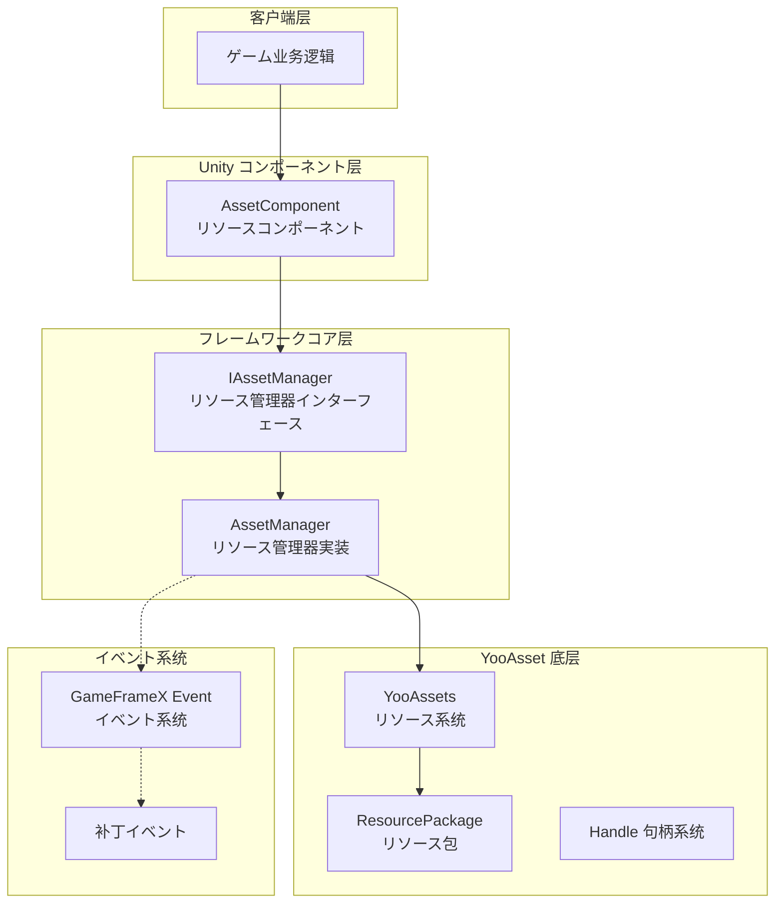
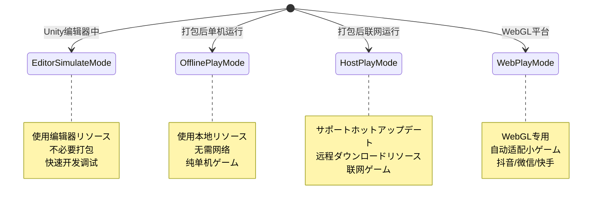
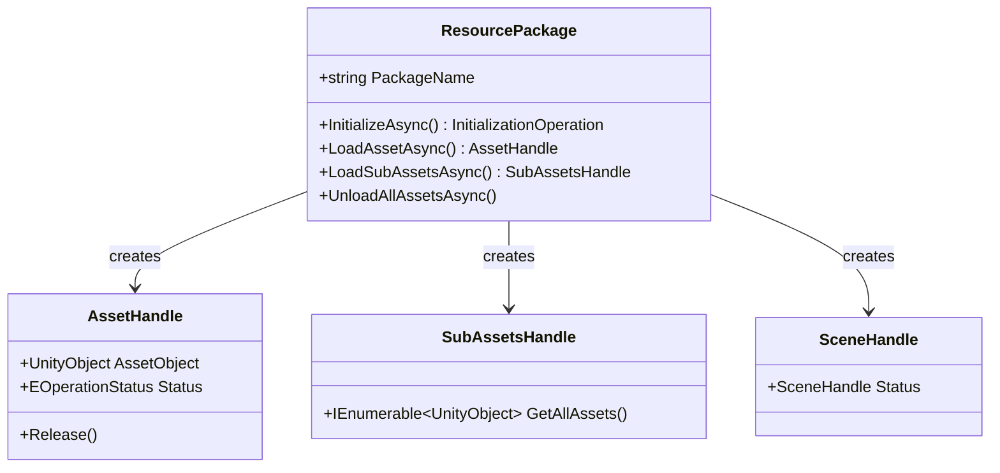
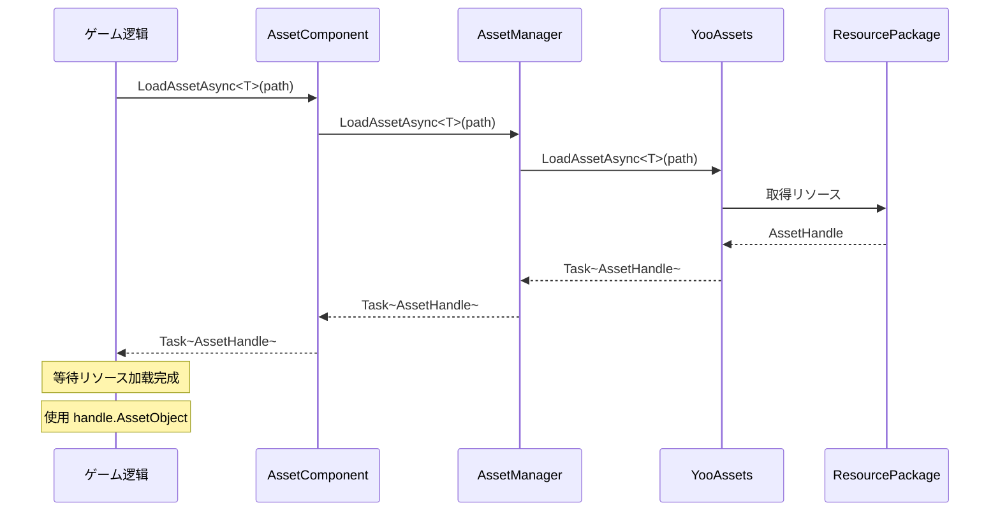

# アーキテクチャ設計

本文档详细介绍 GameFrameX Asset リソースコンポーネント的整体アーキテクチャ設計，包括コアコンポーネント、模块职责、交互关系以及设计决策。

## 概要

GameFrameX Asset リソースコンポーネント是 GameFrameX フレームワーク的コア模块之一，基づく业界成熟的 **YooAsset** リソース管理系统构建。该コンポーネントを通じて封装 YooAsset 的底层 API，为 Unity ゲーム应用提供します一套**统一、简洁、易用**的リソース管理解決策。

**设计目标：**
- 简化リソース加载和卸载的复杂度
- 提供跨平台一致的 API インターフェース
- サポート多种运行模式（编辑器模拟、离线、ホットアップデート、WebGL）
- 集成 GameFrameX イベント系统，実装ステータス通知
- サポート多リソースパッケージ管理

## 架构总览



### 各层职责説明

| 层级 | コンポーネント | 职责 |
|------|------|------|
| 客户端层 | ゲーム业务逻辑 | 呼び出しリソースコンポーネント提供的 API 进行リソース加载 |
| Unity コンポーネント层 | AssetComponent | 作为 Unity シーン中的コンポーネント，提供面向用户的 API エントリーポイント |
| フレームワークコア层 | AssetManager | 実装リソース管理的コア业务逻辑 |
| YooAsset 底层 | YooAssets | 底层リソース系统，处理实际的ファイル系统、ダウンロード、缓存等 |
| イベント系统 | EventSystem | 提供补丁フローステータス通知、ダウンロード进度等イベント |

## コアコンポーネント

### 1. AssetComponent（リソースコンポーネント）

`AssetComponent` 是 Unity ゲームシーン中的コアコンポーネント，を継承 `GameFrameworkComponent`。它作为リソース系统的统一エントリーポイント，为ゲーム逻辑层提供リソース访问インターフェース。

**主要职责：**
- 作为 Unity コンポーネント挂载在シーン中
- 配置运行模式（PlayMode）
- 管理リソース包的初期化
- 代理转发リソース加载お願いします求到 AssetManager
- 处理平台差异（WebGL 自动切换模式）

> Source: [AssetComponent.cs](https://github.com/GameFrameX/com.gameframex.unity.asset/blob/main/Runtime/Asset/AssetComponent.cs#L18-L70)

```csharp
[DisallowMultipleComponent]
[AddComponentMenu("GameFrameX/Asset")]
public sealed class AssetComponent : GameFrameworkComponent
{
    [Tooltip("当目标平台为Web平台时，将会强制設定为WebPlayMode")]
    [SerializeField]
    private EPlayMode m_GamePlayMode;
    
    private IAssetManager _assetManager;
    
    protected override void Awake()
    {
        // 非编辑器环境下，自动调整运行模式
#if !UNITY_EDITOR
        if (GamePlayMode == EPlayMode.EditorSimulateMode)
        {
            GamePlayMode = EPlayMode.HostPlayMode;
        }
#if UNITY_WEBGL
        GamePlayMode = EPlayMode.WebPlayMode;
#endif
#endif
        base.Awake();
        _assetManager = GameFrameworkEntry.GetModule<IAssetManager>();
        _assetManager.SetPlayMode(GamePlayMode);
    }
}
```

**设计意图：**
- 使用 `[DisallowMultipleComponent]` 限制シーン中只能有一个 AssetComponent，保证リソース管理的唯一性
- 在 `Awake` 中处理平台差异，确保在非编辑器环境下使用正确的运行模式
- を通じて依赖注入取得 IAssetManager インスタンス，実装解耦

### 2. IAssetManager（リソース管理器インターフェース）

`IAssetManager` インターフェース定义了リソース管理的所有操作契约，确保実装的灵活性和可测试性。

> Source: [IAssetManager.cs](https://github.com/GameFrameX/com.gameframex.unity.asset/blob/main/Runtime/Asset/IAssetManager.cs#L1-L519)

**インターフェース分クラス：**

| 機能分クラス | メソッド示例 |
|----------|----------|
| 初期化 | `Initialize()`, `InitPackageAsync()` |
| 异步加载 | `LoadAssetAsync<T>()`, `LoadSceneAsync()` |
| 同步加载 | `LoadAssetSync<T>()`, `LoadSubAssetSync()` |
| リソースパッケージ管理 | `CreateAssetsPackage()`, `GetAssetsPackage()` |
| リソース卸载 | `UnloadAsset()`, `UnloadUnusedAssetsAsync()` |
| リソース查询 | `GetAssetInfo()`, `HasAssetPath()`, `IsNeedDownload()` |

### 3. AssetManager（リソース管理器実装）

`AssetManager` 是リソース管理的コア実装クラス，を継承 `GameFrameworkModule` 并実装 `IAssetManager` インターフェース。它封装了对 YooAssets 的呼び出し，并适配了 GameFrameX 的模块系统。

**主要职责：**
- 管理 YooAssets 初期化
- 处理不同运行模式的配置
- 封装リソース加载/卸载操作
- 管理リソース包（Package）

> Source: [AssetManager.cs](https://github.com/GameFrameX/com.gameframex.unity.asset/blob/main/Runtime/Asset/AssetManager.cs#L14-L60)

```csharp
[UnityEngine.Scripting.Preserve]
public partial class AssetManager : GameFrameworkModule, IAssetManager
{
    public string DefaultPackageName { get; set; } = ConstDefaultPackageName;
    public int DownloadingMaxNum { get; set; }
    public int FailedTryAgain { get; set; }
    public EFileVerifyLevel VerifyLevel { get; set; }
    public EPlayMode PlayMode { get; private set; }
    
    public void Initialize()
    {
        BetterStreamingAssets.Initialize();
        Log.Info($"リソース系统运行模式：{PlayMode}");
        YooAssets.Initialize();
        YooAssets.SetOperationSystemMaxTimeSlice(30);
    }
}
```

## 运行模式

Asset コンポーネントサポート四种运行模式，を通じて `EPlayMode` 枚举定义：



### 模式选择逻辑

> Source: [AssetManager.Initialization.cs](https://github.com/GameFrameX/com.gameframex.unity.asset/blob/main/Runtime/Asset/AssetManager.Initialization.cs#L18-L47)

```csharp
private InitializationOperation CreateInitializationOperationHandler(ResourcePackage resourcePackage, string hostServerURL, string fallbackHostServerURL)
{
    switch (PlayMode)
    {
        case EPlayMode.EditorSimulateMode:
            return InitializeYooAssetEditorSimulateMode(resourcePackage);
        case EPlayMode.OfflinePlayMode:
            return InitializeYooAssetOfflinePlayMode(resourcePackage);
        case EPlayMode.HostPlayMode:
            return InitializeYooAssetHostPlayMode(resourcePackage, hostServerURL, fallbackHostServerURL);
        case EPlayMode.WebPlayMode:
            return InitializeYooAssetWebPlayMode(resourcePackage, hostServerURL, fallbackHostServerURL);
        default:
            return null;
    }
}
```

### 模式初期化详情

| 模式 | 初期化メソッド | 适用シーン |
|------|------------|----------|
| EditorSimulateMode | `InitializeYooAssetEditorSimulateMode()` | 编辑器开发调试，不打包 |
| OfflinePlayMode | `InitializeYooAssetOfflinePlayMode()` | 单机ゲーム，无需ホットアップデート |
| HostPlayMode | `InitializeYooAssetHostPlayMode()` | 必要ホットアップデート的联网ゲーム |
| WebPlayMode | `InitializeYooAssetWebPlayMode()` | WebGL/小ゲーム平台 |

## リソース包系统

Asset コンポーネント采用**リソース包（ResourcePackage）**机制管理不同クラス型的リソース。



### リソース包操作

```csharp
// 作成リソース包
ResourcePackage package = assetComponent.CreateAssetsPackage("MyPackage");

// 取得リソース包
ResourcePackage pkg = assetComponent.TryGetAssetsPackage("MyPackage");

// 設定默认リソース包
assetComponent.SetDefaultAssetsPackage(pkg);

// 检查リソース包是否存在
if (assetComponent.HasAssetsPackage("MyPackage"))
{
    // 使用リソース包
}
```

> Source: [AssetManager.cs](https://github.com/GameFrameX/com.gameframex.unity.asset/blob/main/Runtime/Asset/AssetManager.cs#L646-L692)

## イベント系统

Asset コンポーネント集成了 GameFrameX 的イベント系统，に使用通知リソース加载进度和ステータス变更。

### 补丁ステータス变更

> Source: [EPatchStates.cs](https://github.com/GameFrameX/com.gameframex.unity.asset/blob/main/Runtime/Update/EPatchStates.cs#L1-L33)

```csharp
public enum EPatchStates
{
    /// <summary>更新静态的リソース版本</summary>
    UpdateStaticVersion,
    /// <summary>更新补丁清单</summary>
    UpdateManifest,
    /// <summary>作成ダウンロード器</summary>
    CreateDownloader,
    /// <summary>ダウンロード远端ファイル</summary>
    DownloadWebFiles,
    /// <summary>补丁フロー完毕</summary>
    PatchDone,
}
```

### イベントクラス型

| イベントクラス | 用途 |
|--------|------|
| AssetPatchStatesChangeEventArgs | 补丁フローステータス变更 |
| AssetDownloadProgressUpdateEventArgs | ダウンロード进度更新 |
| AssetFoundUpdateFilesEventArgs | 发现必要更新的ファイル |
| AssetPatchManifestUpdateFailedEventArgs | 补丁清单更新失败 |
| AssetWebFileDownloadFailedEventArgs | リソースファイルダウンロード失败 |

> Source: [AssetPatchStatesChangeEventArgs.cs](https://github.com/GameFrameX/com.gameframex.unity.asset/blob/main/Runtime/Update/EventArgs/AssetPatchStatesChangeEventArgs.cs#L1-L49)

## リソース加载フロー

### 异步リソース加载



### リソース卸载フロー

```mermaid
flowchart LR
    A[呼び出し UnloadAsset] --> B{指定リソース包?}
    B -->|是| C[UnloadAsset(packageName, assetPath)]
    B -->|否| D[UnloadAsset(assetPath)]
    C --> E[取得目标リソース包]
    D --> E
    E --> F[呼び出し Package.TryUnloadUnusedAsset]
    F --> G[YooAsset 释放リソース]
    
    G --> H{呼び出し UnloadUnusedAssetsAsync?}
    H -->|是| I[释放未使用リソース]
    H -->|否| J[结束]
```

## 設定选项

Asset コンポーネント提供以下可配置项：

| 配置项 | クラス型 | 默认值 | 説明 |
|--------|------|--------|------|
| GamePlayMode | EPlayMode | EditorSimulateMode | リソース运行模式 |
| DefaultPackageName | string | "DefaultPackage" | 默认リソース包名称 |
| DownloadingMaxNum | int | - | 最大并发ダウンロード数量 |
| FailedTryAgain | int | - | ダウンロード失败重试次数 |
| VerifyLevel | EFileVerifyLevel | - | ファイル验证等级 |
| Milliseconds | long | - | 异步系统每帧最大执行时间(毫秒) |

> Source: [AssetComponent.cs](https://github.com/GameFrameX/com.gameframex.unity.asset/blob/main/Runtime/Asset/AssetComponent.cs#L20-L36)

## 设计决策説明

### 1. 为什么使用 YooAsset？

选择 YooAsset 作为底层リソース系统的原因：
- **機能完善**：サポートリソース打包、依赖分析、ホットアップデート、缓存管理等完整機能
- **性能优化**：提供句柄机制、引用计数、リソース释放优化
- **跨平台**：サポート Unity 所有主流平台
- **社区活跃**：持续维护更新

### 2. 为什么采用インターフェース分离？

を通じて `IAssetManager` インターフェース定义清晰的操作契约：
- 便于单元测试（可能 mock 実装）
- 提供扩展点，允许替换底层実装
- API 文档更清晰

### 3. 为什么区分同步/异步加载？

- **异步加载**：适合大规模リソース加载，避免阻塞主线程
- **同步加载**：适合小リソース或特定性能敏感シーン
- 用户可能に基づいてシーン需求选择合适的加载方法

### 4. 为什么必要リソース包？

多リソース包设计サポート：
- 按機能模块划分リソース（UI、DLC、配置）
- 动态加载/卸载特定模块
- リソース按需ダウンロード，节省带宽

## 関連リンク

- [リソースコンポーネント](./4-core-concepts.asset-component) - AssetComponent 详细 API
- [リソース管理器](./4-core-concepts.asset-manager) - AssetManager 実装细节
- [リソース加载インターフェース](./5-api-reference.loading-api) - 完整加载 API 参考
- [リソースパッケージ管理](./5-api-reference.package-management) - リソース包操作 API
- [运行模式](./6-configuration.play-modes) - 各种运行模式配置
- [コンポーネント配置](./6-configuration.component-settings) - コンポーネント配置选项
